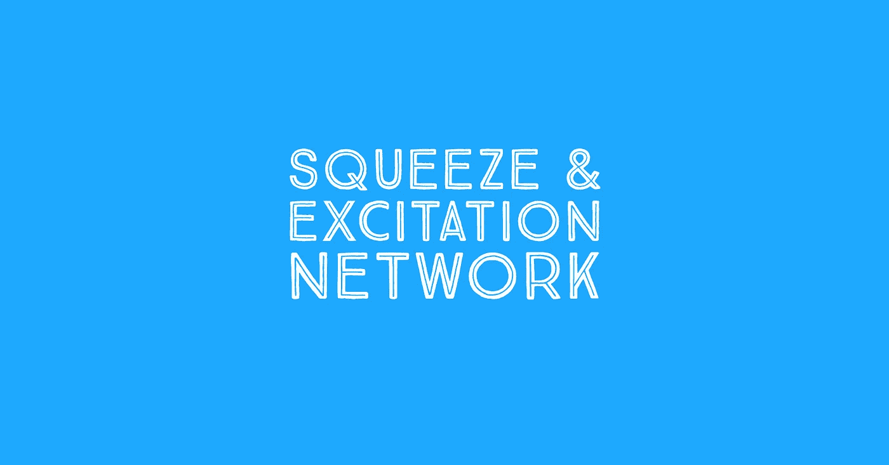
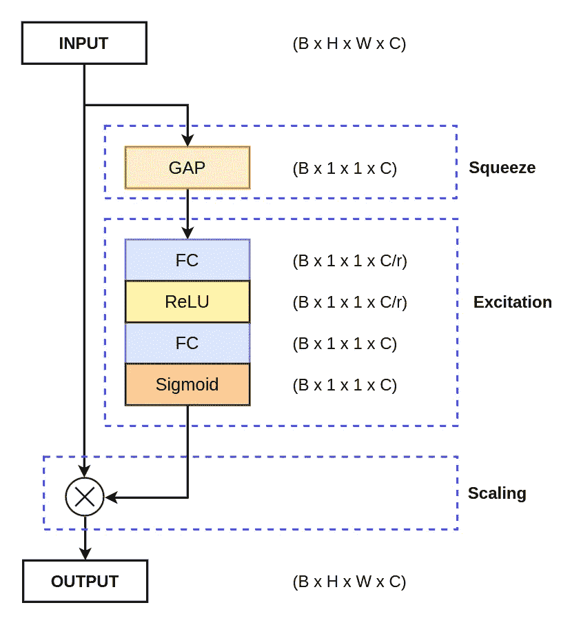

# TensorFlow 和 PyTorch 中压缩和激发的实现

> 原文：<https://medium.com/analytics-vidhya/squeeze-and-excitation-implementation-in-tensorflow-and-pytorch-idiot-developer-7d169ea2917c?source=collection_archive---------2----------------------->



挤压和激励网络是一种基于通道的注意力机制，用于提高网络的整体性能。在今天的文章中，我们将在 TensorFlow 和 PyTorch 中实现挤压和激发模块。

# 什么是挤压和激励网络？

挤压和激发注意机制是由胡等人在 2018 年 2018 年的论文“[挤压和激发网络](https://arxiv.org/abs/1709.01507)”中引入的，该论文在 TPAMI 中有期刊版本。这是注意力机制领域最具优势的论文之一，被引用超过 8000 次。

挤压和激励网络基本上为 CNN(卷积神经网络)引入了一种新颖的通道式注意机制，以改善它们的通道相关性。网络添加一个参数，该参数相应地重新加权每个通道，使得它对重要特征变得更加敏感，同时忽略不相关的特征。

挤压和激励网络是一种基于通道的注意力机制，它通过增强重要特征来相应地重新校准每个通道，从而创建更强大的表示。

**阅读更多:** [挤压和激励网络](https://idiotdeveloper.com/squeeze-and-excitation-networks/)



挤压和激励网络的框图。

# TensorFlow 中压缩和激发的实现

```
from tensorflow.keras.layers import GlobalAveragePooling2D, Reshape, Dense, Input def SqueezeAndExcitation(inputs, ratio=8): 
    b, _, _, c = inputs.shape 
    x = GlobalAveragePooling2D()(inputs) 
    x = Dense(c//ratio, activation="relu", use_bias=False)(x) 
    x = Dense(c, activation="sigmoid", use_bias=False)(x) 
    x = inputs * x 
    return x if __name__ == "__main__": 
    inputs = Input(shape=(128, 128, 32)) 
    y = SqueezeAndExcitation(inputs) 
    print(y.shape)
```

# PyTorch 中压缩和激发的实现

```
import torch 
import torch.nn as nn class SqueezeAndExcitation(nn.Module): 
    def __init__(self, channel, ratio=8): 
        super().__init__()         self.avg_pool = nn.AdaptiveAvgPool2d(1) 
        self.network = nn.Sequential(
            nn.Linear(channel, channel//ratio, bias=False),
            nn.ReLU(inplace=True), 
            nn.Linear(channel//ratio, channel, bias=False),
            nn.Sigmoid()
        ) def forward(self, inputs): 
        b, c, _, _ = inputs.shape 
        x = self.avg_pool(inputs) 
        x = x.view(b, c) 
        x = self.network(x) 
        x = x.view(b, c, 1, 1) 
        x = inputs * x 
        return x if __name__ == "__main__": 
    inputs = torch.randn((8, 32, 128, 128)) 
    se = SqueezeAndExcitation(32, ratio=8) 
    y = se(inputs) 
    print(y.shape)
```

# 结论

在本编码教程中，您已经了解了最广泛使用的通道式注意力机制之一，称为“挤压和激励网络”。

仍然，有一些问题或疑问？就在下面评论吧。更多更新。跟我来。

*   [YouTube](https://www.youtube.com/idiotdeveloper)
*   [脸书](https://facebook.com/idiotdeveloper)
*   [推特](https://twitter.com/nikhilroxtomar)
*   [Instagram](https://www.instagram.com/nikhilroxtomar)

*原载于 2021 年 12 月 1 日 https://idiotdeveloper.com*[](http://idiotdeveloper.com/squeeze-and-excitation-implementation-in-tensorflow-and-pytorch/)**。**