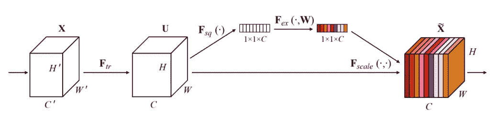
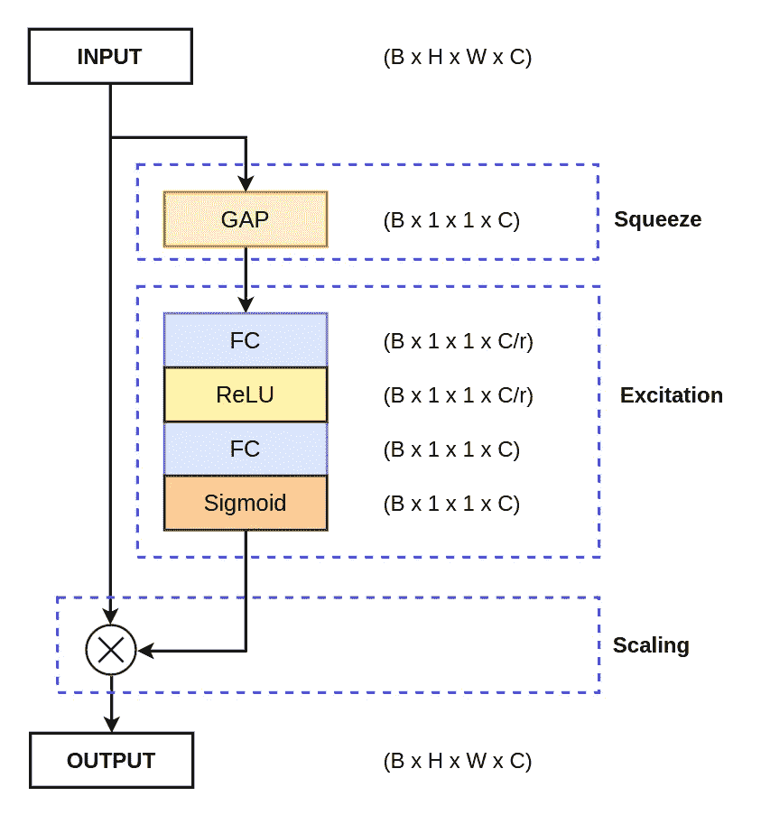
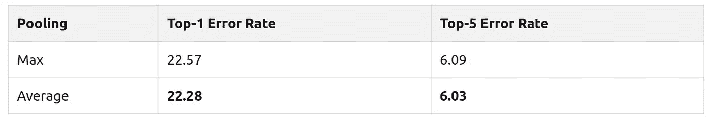
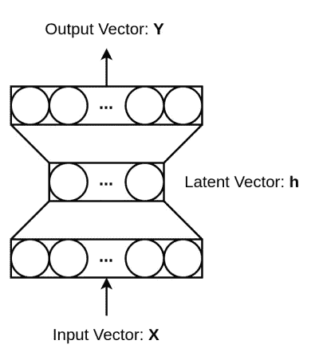
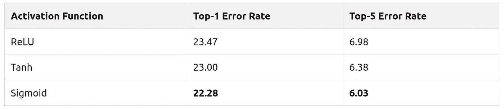

# 挤压和激励网络——白痴开发者

> 原文：<https://medium.com/analytics-vidhya/squeeze-and-excitation-networks-idiot-developer-17de2fd02596?source=collection_archive---------1----------------------->

卷积神经网络(CNN)在计算机视觉和视觉感知领域得到了最广泛的应用，以解决多项任务，如[图像分类](https://idiotdeveloper.com/dog-breed-classification-using-transfer-learning-in-tensorflow/)、[语义分割](https://idiotdeveloper.com/polyp-segmentation-using-unet-in-tensorflow-2/)等等。然而，需要能够进一步提高其性能的方法。一种这样的方法是给已经存在的 CNN 体系结构添加一些注意机制，以便进一步改进。挤压和激励网络(SENet)就是这样一种注意力机制，它被最广泛地用于性能改进。

来源:原始论文。挤压和激励网络的框图。

在本文中，我们将了解更多关于挤压和激励网络的知识，它们是如何工作的，以及它们如何帮助提高性能。

**目录:**

1.  什么是挤压和激励网络？
2.  压缩-激发网络背后的直觉。
3.  压缩和激励网络的结构。
4.  挤压和激励网络如何帮助？
5.  摘要
6.  阅读更多

# 什么是挤压和激励网络？

2018 年，胡等人在 2018 年的论文“[挤压和激励网络](https://arxiv.org/abs/1709.01507)”中介绍了挤压和激励注意机制，并在 TPAMI 中发表了期刊版本。这是注意力机制领域最具优势的论文之一，被引用超过 8000 次。

# queeze 和 Excitation Network 是一种基于通道的注意力机制，它可以通过增强重要特征来相应地重新校准每个通道，从而创建更强大的表示。

挤压和激励网络基本上为 CNN(卷积神经网络)引入了一种新颖的通道式注意机制，以改善它们的通道相关性。网络添加一个参数，该参数相应地重新加权每个通道，使得它对重要特征变得更加敏感，同时忽略不相关的特征。

在 ILSVRC 2017 分类提交中使用了挤压和激励网络，并获得了第一名，并将前 5 名误差降至 2.251%，超过了 2016 年的获奖条目，相对提高了 25%。

# 挤压和激发网络背后的直觉

卷积神经网络(CNN)使用卷积算子从图像中提取层次信息。下层检测线条、边缘等。，而上层检测完整的对象，如人脸、猫或狗。所有这些都是通过融合每一层的空间和信道信息来实现的。

卷积运算符使用不同数量的通道生成一个特征图，其中它平等地对待所有通道。这意味着每一个渠道都同样重要，这可能不是最好的方式。挤压和激发注意机制为每个通道添加了一个参数，可以独立地重新调整它们的大小。

# 挤压和激励基本上充当内容感知机制，自适应地对每个通道重新加权。

# 压缩和激励网络的结构

作者提出了一种简单易用的模块，称为挤压和激励模块，也称为 se 模块。SE 块由三个操作组成:

具有适当尺寸和不同操作的挤压和激励网络的详细图。

# 挤压

挤压操作主要用于从特征图的每个通道中提取全局信息。特征图基本上是卷积层的输出，卷积层是大小为 B x H x W x C 的 4D 张量。这里:

*   **B:** 指批量。
*   **H:** 是指每个特征图的高度。
*   **W:** 指每张特征图的宽度。
*   **C:** 指特征图中的通道数。

我们知道，卷积是一种局部运算，因为它只能看到完整输入图像的一小部分。因此，有必要对特征地图有一个全面的了解。

因为我们处理的是 4D 张量，它包含很多参数。这实质上意味着，随着现代卷积神经网络中通道数量的急剧增加，我们需要处理大量的参数。因此，我们需要一种方法来将每个特征通道分解成单个数值。这种分解将减少参数的数量，从而降低计算复杂度。

在现代卷积神经网络中，池操作用于降低特征图的空间维度。两种广泛使用的池操作是:

1.  **Max Pooling:** 操作用于从定义的窗口中获取最大像素值。
2.  **平均池:**操作用于计算定义窗口的平均像素值。

作者进行了一组实验来研究每个池操作的性能，它们是全局最大池(GMP)和全局平均池(GAP)。

从上表可以清楚地看出，全局平均汇集(GAP)比全局最大汇集(GMP)表现得更好。因此，在**挤压**操作中，全局平均池(GAP)用于将 B x H x W x C 特征图减少到 B x 1 x 1 x C。

# 激发，兴奋

特征图现在被减少到一个更小的维度(B×1×1×C)，基本上对于大小为 H×W 的每个通道被减少到一个奇异向量。对于激励操作，使用具有瓶颈结构的全连接多层感知器(MLP)。MLP 用于生成权重，以自适应地缩放特征图的每个通道。

具有瓶颈结构的多层感知器(MLP)。

MLP 由三层组成，其中隐藏层用于通过缩减因子 **r** 来减少要素的数量。图层中要素地图的尺寸为:

1.  输入的形状是(B×1×1×C)，它被简化为 B×C。因此输入层有 C 个神经元。
2.  隐藏层以 **r** 的因子减少神经元的数量。因此，隐藏层有一个 **C/r** 数量的神经元。
3.  最后，在输出层，神经元数量增加回 **C** 。

总的来说，MLP 以 B x 1 x 1 x C 作为输入，以同样的维度作为输出。

# 缩放比例

激发操作传递形状为 B x 1 x 1 x C 的“激发”张量，然后该张量通过一个 sigmoid 激活函数。sigmoid 激活函数转换 0 和 1 范围内的张量值。然后，我们在 sigmoid 激活函数的输出和输入特征图之间执行逐元素乘法。

如果该值接近 0，则意味着该频道不太重要，因此，该特征频道的值将会减小，如果该值接近 1，则意味着该频道是重要的。

为了进一步研究缩放操作，作者通过用其他非线性激活函数代替 sigmoid 进行了消融研究。

从上表中，我们可以说 sigmoid 是最好的非线性激活函数。

# 挤压和激励网络如何帮助？

至此，你已经了解了压缩和激励网络的结构。在缩放操作期间，我们在初始特征图和 sigmoid 激活函数的输出之间执行逐元素乘法。

sigmoid 激活函数输出一个介于 0 和 1 之间的值，每个通道乘以该值。

现在想象一下，一个通道乘以一个接近 0 的值。这将减少该特征图的像素值，因为根据 se 块，这些像素值不太相关。

如果与上面的情况相比，当通道乘以接近 1 的值时，它不会减少那么多像素值。

现在我们可以看到，压缩和激励网络基本上缩放了每个通道的信息。它减少了非相关信道信息，相关信道不受太大影响。所以，在整个操作之后，特征图只包含相关信息，这增加了整个网络的表示能力。

# 摘要

在本文中，你已经了解了一种最广泛使用的通道式注意力机制，称为“挤压和激发网络”。

你已经了解了以下关于它的事情。

1.  什么是挤压和激励网络？
2.  SENet 背后的直觉是什么？
3.  SENet 的建筑结构。
4.  有什么帮助？

仍然，有一些问题或疑问？就在下面评论吧。更多更新。跟我来。

# 阅读更多

1.  [用 PyTorch 实现解释挤压和激励网络](https://amaarora.github.io/2020/07/24/SeNet.html)
2.  [通道注意力和挤压-激发网络(SENet)](https://blog.paperspace.com/channel-attention-squeeze-and-excitation-networks/)
3.  [压缩和激励网络](https://towardsdatascience.com/squeeze-and-excitation-networks-9ef5e71eacd7)

*原载于 2021 年 10 月 5 日 https://idiotdeveloper.com**[*。*](http://www.idiotdeveloper.com/squeeze-and-excitation-networks/)*