# SRCNN 论文摘要和实施

> 原文：<https://medium.com/analytics-vidhya/srcnn-paper-summary-implementation-ad5cea22a90e?source=collection_archive---------7----------------------->

# 摘要

论文:[arxiv.org/abs/1501.00092](https://arxiv.org/abs/1501.00092)

SRCNN[1]提出了用于图像超分辨率的 3 层 CNN。这是第一篇将深度神经网络应用于图像超分辨率的论文。SRCNN 结构由三部分组成:特征提取器、非线性映射、重构。该模型被训练以最小化重建图像和地面真实图像之间的像素级 MSE。本文测试了各种模型体系结构和超参数，并对性能和速度进行了权衡。

# 模型架构

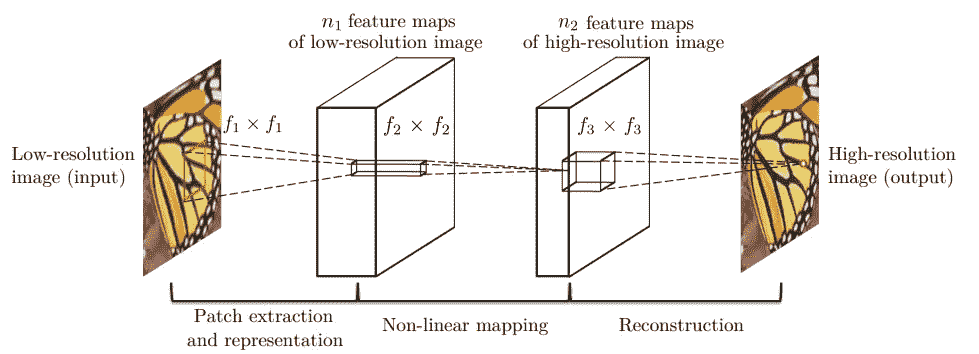

所提出的架构在概念上包括 3 个组件:特征提取器、非线性映射、重建。每一个都负责提取低分辨率特征，映射到高分辨率特征，重建。低分辨率图像被双三次插值到 Y 中，与高分辨率图像 x 具有相同的大小。该模型旨在学习映射 F: Y->X。

最后，每个组件都被表示为一个卷积层，从而形成一个 3 层卷积神经网络，其核大小为 9–1–5。根据下图，每一层的中间输出似乎包含了期望它们计算的必要信息。

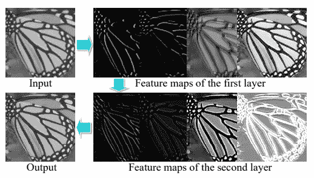

# 失败

损失函数被定义为重建图像 F(Y)和地面真实图像 x 之间的像素 MSE(均方误差)。这将导致训练最大化 PSNR 测量。

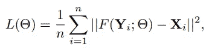

# 实验

本文试验了各种超参数设置以提高性能。下图显示了尺寸为 9–1-5 的网络通道如何优于其他设置，以及根据本文的 3 阶段方法增加非线性映射能力的更深网络是不必要的。虽然所提出的模型的概念具有一些已知的缺陷，这些缺陷通过深度学习的进一步研究被证明是错误的，但是实验显示了所提出的用于 SR 的 3 阶段方法的高性能。

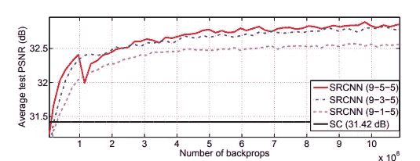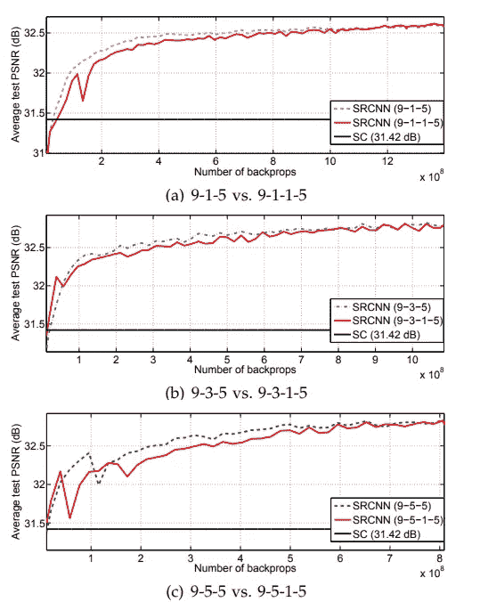

# 履行

```
import tensorflow as tf
import numpy as np
import matplotlib.pyplot as plt
import requests
import tensorflow_datasets as tfds
from tqdm import tqdm
import os
import shutildata=tfds.load('tf_flowers')
```

导入必要的库。我们将使用由 3600 幅花的图像组成的`tf_flowers`数据集作为训练的小玩具数据集。

```
train_data=data['train'].skip(600)
test_data=data['train'].take(600)@tf.function
def build_data(data):
  cropped=tf.dtypes.cast(tf.image.random_crop(data['image'] / 255,(128,128,3)),tf.float32)

  lr=tf.image.resize(cropped,(64,64))
  lr=tf.image.resize(lr,(128,128), method = tf.image.ResizeMethod.BICUBIC)
  return (lr,cropped)def downsample_image(image,scale):
  lr=tf.image.resize(image / 255,(image.shape[0]//scale, image.shape[1]//scale))
  lr=tf.image.resize(lr,(image.shape[0], image.shape[1]), method = tf.image.ResizeMethod.BICUBIC)
  return lr
```

我们将测试数据拆分为数据集中的前 600 个图像，并定义一个函数 build_data 以(128，128)的大小随机裁剪给定的图像，并返回图像的低分辨率和高分辨率副本。低分辨率拷贝是通过双三次插值生成的。

```
for x in train_data.take(1):
  plt.imshow(x['image'])
  plt.show()
```

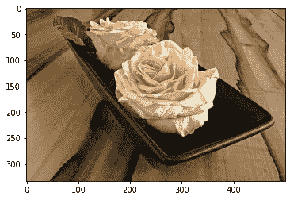

```
train_dataset_mapped = train_data.map(build_data, num_parallel_calls = tf.data.AUTOTUNE)
for x in train_dataset_mapped.take(1):
  plt.imshow(x[0].numpy())
  plt.show()
  plt.imshow(x[1].numpy())
  plt.show()
```

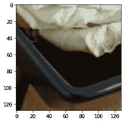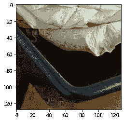

```
SRCNN_915=tf.keras.models.Sequential([
    tf.keras.layers.Conv2D(64,9,padding='same',activation='relu'),
    tf.keras.layers.Conv2D(64,1,padding='same',activation='relu'),
    tf.keras.layers.Conv2D(3,5,padding='same',activation='relu')
])def pixel_mse_loss(y_true,y_pred):
  return tf.reduce_mean( (y_true - y_pred) ** 2 )def PSNR(y_true,y_pred):
  mse=tf.reduce_mean( (y_true - y_pred) ** 2 )
  return 20 * log10(1 / (mse ** 0.5))

def log10(x):
  numerator = tf.log(x)
  denominator = tf.log(tf.constant(10, dtype=numerator.dtype))
  return numerator / denominatorSRCNN_915.compile(optimizer=tf.keras.optimizers.Adam(0.001),loss=pixel_mse_loss)
```

我们定义了训练损失:pixel_mse_loss，也定义了一个 PSNR 函数来评估模型的 PSNR 损失。模型架构是一个 3 层 CNN，内核大小为 9–1–5。

```
for x in range(50):
  train_dataset_mapped = train_data.map(build_data, num_parallel_calls = tf.data.AUTOTUNE).batch(128)
  val_dataset_mapped = test_data.map(build_data, num_parallel_calls = tf.data.AUTOTUNE).batch(128)

  SRCNN_915.fit(train_dataset_mapped,epochs=1,validation_data=val_dataset_mapped)
```

24/24[= = = = = = = = = = = = = = = = = = = = = = = = = =]—6s 215 ms/步—损耗:0.0413 — val_loss: 0.0138

24/24[= = = = = = = = = = = = = = = = = = = = = = = = = =]—5s 209 ms/步—损耗:0.0116 — val_loss: 0.0094

24/24[= = = = = = = = = = = = = = = = = = = = = = = = = =]—5s 210 ms/步—损耗:0.0084 — val_loss: 0.0073

…

每个时期，图像被重新裁剪以生成图像的新样本。该模型可以训练更多的迭代以提高性能，但损失通常不会低于 0.0032。

```
train_dataset_mapped = train_data.map(build_data,num_parallel_calls=tf.data.AUTOTUNE)
for x in train_data.take(10):
  fig=plt.figure(figsize=(12,4))

  plt.subplot(1,3,1)
  plt.imshow(x['image'].numpy())
  plt.axis('off')
  plt.subplot(1,3,2)
  lr=downsample_image(x['image'].numpy(),4)
  plt.imshow(lr.numpy())  
  plt.axis('off')
  plt.subplot(1,3,3)
  pred=SRCNN_915(np.array([lr]))
  plt.imshow(pred[0].numpy())
  plt.axis('off')
  plt.show()
```

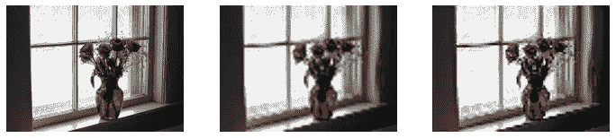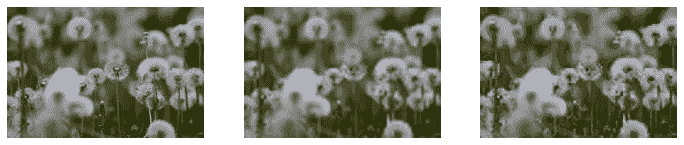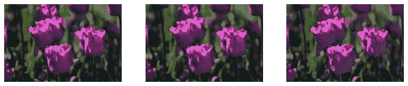

…

第一幅图像是原始 HR 图像，第二幅图像是双三次插值图像，最后一幅图像是超分辨率图像。因为网络中唯一的权重是不依赖于图像大小的卷积滤波器，所以网络可以输入与被裁剪为(128，128)用于批量训练的训练数据大小不同的图像。

与双三次插值图像相比，训练的 SRCNN 在图像分辨率上没有表现出明显的提高。我计划在 SR 的最新高级论文中进行指导。我们最终将中间层的输出可视化。

```
layers=SRCNN_915.layers
train_dataset_mapped = train_data.map(build_data,num_parallel_calls=tf.data.AUTOTUNE)
for x in train_dataset_mapped.take(1):
  image=x[0].numpy().reshape(1,128,128,3)input_image_layer=layers[0].input
for idx,l in enumerate(layers):
  print("Output of layer",idx)
  intermediate_model=tf.keras.models.Model(input_image_layer,l.output)
  out=intermediate_model(image)
  fig = plt.figure(figsize=(20,4))
  for i in range( min(out.shape[-1], 20) ):
      plt.subplot(2, 10, i+1)
      plt.imshow(out[0, :, :, i] * 127.5 + 127.5, cmap='gray')
      plt.axis('off')
  plt.show()
```

第 0 层的输出

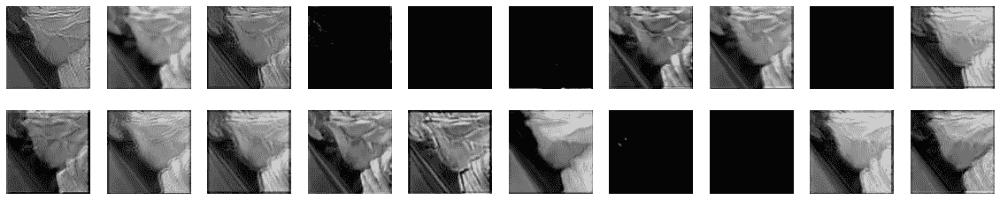

第 1 层的输出

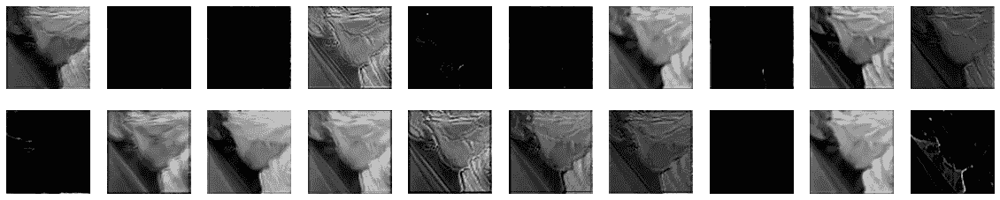

第二层的输出

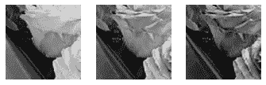

# 我的看法

*   我认为所提出的 CNN 的 9–1–5 结构不是 SR 的最佳模型架构，尽管作者对各种超参数设置进行了多次实验。
*   像素方式的 MSE 也不是捕捉感知距离的最佳损失函数，如提出更多感知损失的进一步研究中所讨论的，例如 GAN 损失和 VGG 损失[2]。
*   尽管这是将神经网络用于 SR 的第一批论文之一，但它并不包括许多最近的提高一般 DL 性能的进展(批处理规范化、将内核大小设置为 3、优化器…)。

[1]董，晁，等.利用深度卷积网络实现图像超分辨率." *IEEE 模式分析与机器智能汇刊*38.2(2015):295–307。

[2] Ledig，Christian 等，“使用生成式对抗网络的照片级单幅图像超分辨率”*IEEE 计算机视觉和模式识别会议论文集*。2017.