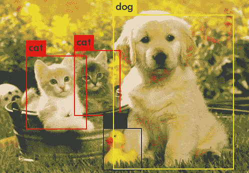

# SSD:单次多盒探测器

> 原文：<https://medium.com/analytics-vidhya/ssd-single-shot-multibox-detector-86e891113896?source=collection_archive---------8----------------------->

# 介绍

SSD 是一种最先进的对象检测算法，其精度与更快的 R-CNN 相似甚至更高，但它没有区域提议网络，因此运行速度更快。

SSD 算法的工作原理如下:

1.  将输入图像划分为网格，并在每个网格上绘制默认的边界框
2.  使用截断的基础网络创建**特征地图**
3.  在默认边界框上应用特征地图，得到第一个**特征层**
4.  在要素图层上运行本地化和分类模型，以获取每个默认边界框的边界框偏移和分类分数
5.  对基础网络的输出应用卷积，绘制格网和默认边界框以获得新的要素图层，并运行新的定位和分类模型。重复这个步骤几次，得到不同大小的边界框
6.  应用非最大值抑制以减少建议的边界框数量并移除重复项

现在，让我们详细谈谈其中的一些概念。

# 基础网络

在最初的 [SSD 论文](https://arxiv.org/abs/1512.02325)中，VGG-16 网络被用作基础网络。基本网络在分类层之前被截断，以便提供从输入图像映射到特征向量的特征地图。其他网络如 ResNet、Inception、MobileNet 和 DenseNet 通常用于 SSD 的后续研究和行业应用。

# 网格和默认边界框

SSD 将输入图像划分为预定义的单元网格，并在每个单元上使用相同的默认边界框集，其中默认边界框具有不同的大小和纵横比。对于尺寸为 *m* 乘 *n* 且每个像元具有 *k* 个边界框的格网，一个要素图层将生成 *kmn* 个默认边界框。

在应用每个卷积层之后，提出另一组默认边界框，每个边界框覆盖原始输入图像中的更大区域。

这种方法允许提出不同纵横比和大小的边界框。

# 本地化和分类模型

这个模型的目标是改进默认的边界框，以便更紧密地捕捉其中的对象，并能够判断该对象是什么。它返回默认边界框的四条边的偏移值以及分类分数。总共有 *c* +4 个输出，其中 *c* 是对象类的数量。在训练该模型时，我们使用了定位损失和多类置信度损失的加权损失函数。

# 非最大抑制

SSD 使用非最大抑制来移除相同对象的重复边界框提议。所有预测结果基于分类置信度从最有把握到最无把握排序，并且取前 *N* 个结果，这些结果没有任何 IoU 分数高于先前包括的结果的特定阈值。

# 结论

SSD 不使用区域提议网络，相反，它直接从特征地图单次预测边界框。它能够实现与更快的 R-CNN 相当的最先进的准确性，但它能够更快地做到这一点，通常用于实时对象检测。