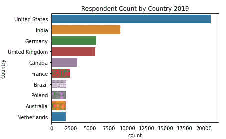
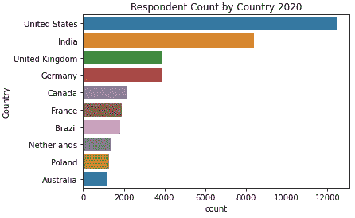
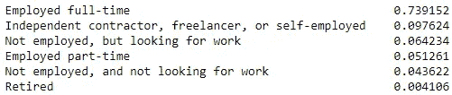
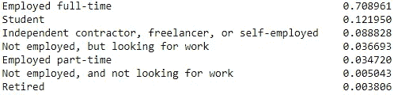
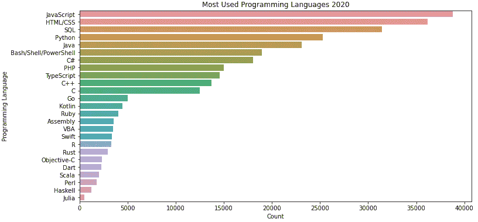
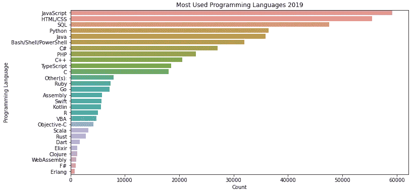
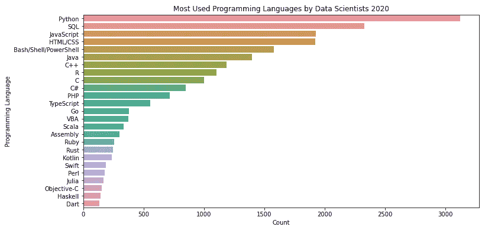
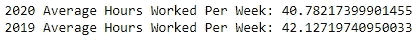
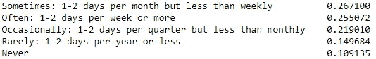
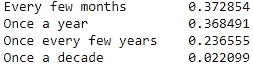

# 从 2019 年和 2020 年栈溢出年度开发者调查中获得洞察力的数据驱动方法

> 原文：<https://medium.com/analytics-vidhya/stack-overflow-analysis-e1eaa099f397?source=collection_archive---------15----------------------->

来源:[https://149351115 . v2 . pressable cdn . com/WP-content/uploads/2020/05/dev survey 2020-blog-hero-1200 x630 . png](https://stackoverflow.blog/2020/05/27/2020-stack-overflow-developer-survey-results/)

## 堆栈溢出分析

最新的 Stack Overflow 年度开发者调查标志着 Stack Overflow 开始进行这项调查已经十年了。年度调查结果可以在[这里](https://insights.stackoverflow.com/survey)找到。

2020 年的调查数据涵盖了 6.5 万条评论，相比 2019 年(9 万条评论)减少了约 27%。

根据调查结果，某人如何打入编程或数据科学领域。

我们先来看看受访者最多的前 10 个国家:

做出回应的前 10 个国家的条形图(左:2019，右:2020)

这两年都显示，美国和印度的受访者人数最多。如果我们也看看以前的调查，我们可以推断，美国和印度也将有最多的受访者。

现在我们来看看受访者的就业状况:

2019 年就业状况比例

2020 年就业状况的比例

2019 年和 2020 年的一个主要区别是受访者宣称自己是学生(约 12%)。这两年的数据都显示，至少有 90%的人从事兼职工作。

**2020 年使用最多的编程语言？2019 年有什么变化吗？**

不出所料，2019 年和 2020 年的顶级编程语言都是一样的。JavaScript 和 HTML/CSS 用于 web 开发，这是一项需求量很大的技能。SQL 用于关系数据库，是处理数据时需要掌握的一门基本语言。对于非常依赖于理解用户行为以及用户如何与其服务交互的公司来说，SQL 是必不可少的。Python 用于网页和游戏开发。大数据和人工智能正在经历巨大的繁荣，Python 的主要用途之一是用于机器学习和人工智能。此外，Python 非常容易学习。

**数据科学家最常用的编程语言？**

对于数据科学家来说，Python 和 SQL 是顶级语言。JavaScript 能够在 web 浏览器上实现机器学习模型。

SQL 主要用于检索和处理数据，可用于数据分析或建立机器学习模型。

Python 在机器学习方面非常流行，因为它有大量的库和内置函数，可以简化构建和部署模型的必要步骤。

对于一个数据科学家来说，学习 HTML/CSS 不如学习 Python 和 SQL 那么重要。然而，在某些项目或工作中，懂这门语言是有利的。例如，如果你被要求抓取一个网站，你必须能够找到你需要的信息。信息将被嵌入到 HTML 代码中。

**每周平均工作时间**

从受访者看来，与去年相比，今年每周平均工作时间似乎有所减少。当然，如果按国家分析，这个平均值会有所不同。

**加班？**

超时工作

这个问题是 2020 年调查中的新问题，将统计数据与前几年进行比较，特别是与疫情进行比较，会很有意思。

大多数受访者必须加班。这可以暗示作为程序员加班是很正常的。

**学习技术的重要性**

受访者学习新技术的频率比例

约 70%的受访者每隔几个月或一年学习一次技术。这说明身处这个领域，为了跟随技术的不断进化，不断学习是非常重要的。

# 结论

如果你想进入编程或数据科学领域:

*   受访者大多位于美国和印度，但这不能代表整个社区。
*   弄清楚首先学习哪种编程语言可能具有挑战性。首先问自己这样的问题，“我学编程是为了什么？是开发一个移动应用还是 web 应用？我是否想与利益相关者交流见解？我要建立机器学习模型吗？”一旦你确定了你想通过编程实现什么，那么确定从什么开始就容易多了。
*   对于数据科学家来说，最好学习 Python 和 SQL。对于开发者来说，JavaScript。
*   如上所述，很大一部分受访者至少从事兼职工作。这可能是一个额外的好处，以便在这一领域开始。
*   在进入这个领域之前，你需要做好不断学习新语言或新技术的准备。如果你不这样做，那么几年后你的技能就会落后。
*   全球范围内，受访者平均每周工作 40 小时。从这个领域开始，期望偶尔加班。

我期待堆栈溢出年度开发者调查 2021。对于疫情，观察 2019 年和 2020 年的统计数据有何不同将是一件有趣的事情。