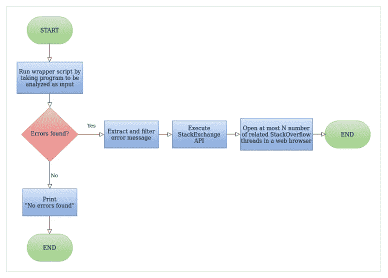

# 堆栈溢出自动化工具:在 10 分钟内构建这个超级有用的应用程序

> 原文：<https://medium.com/analytics-vidhya/stack-overflow-auto-search-tool-automate-your-search-for-errors-f95548790d77?source=collection_archive---------11----------------------->

## 停止复制粘贴，开始自动化！

## 为什么要自动搜索错误？

你是一个初学编码的人吗？你是否花了很多时间从浏览器的代码中复制粘贴你的错误？你觉得有必要自动化多余的拷贝粘贴工作，并在浏览器中直接打开相关窗口吗？我也是！直到直到我开始通过运行一个脚本来自动化我的搜索。

## 什么是堆栈溢出？

Stack Overflow 是所有编程调试、技术爱好者的一站式目的地，也是一个不断发展的共享编程知识、学习和支持他人的社区。“被错误卡住了？您检查堆栈溢出了吗？”会是显而易见的回答。所以你现在明白了。您在编码时面临的大多数查询可能已经有了关于堆栈溢出的答案。

## 掌握基本知识！

让我们弄清楚一些基础知识，以便真正了解项目的要点！我们将学习堆栈交换 API。如果您已经了解这些概念，请随意跳到下一部分。

在 Python 中，运行此脚本并查看错误。由于字符串 s 的长度为 2，s[6]将导致**索引超出范围错误。**

我们只需要错误字符串的最后一行(对于 Python 代码调试)给出错误类型和错误消息。

访问 api.stackexchange.com 的[后，点击**所有文档**，进入**搜索功能**。](https://api.stackexchange.com/)

使用 Try It 部分调用 REST API。在**标记的**部分填写您的源代码(在我的例子中为 error.py)所用的语言(在我的例子中为 Python ),在**标题**部分填写您的错误消息。点击运行！

您将发现一个包含项目列表的 JSON 响应。我们只需要条目列表中 is_answered 设置为 true 的那些对象。我们从这些对象中获取链接来打开各自的堆栈溢出线程。

## 如何自动搜索？

您选择的任何编程语言都可以实现自动化。我做过 Python，C，C++错误调试。它可以很好地扩展到其他编程语言，如 Java。所以让我们开始吧！

来源: [Crio 项目](https://www.crio.do/projects/python-stackoveflow-auto-search/)

我们首先创建一个包装器脚本，它将您希望运行的代码文件作为输入。如果没有发现错误:哇哦！代码中没有错误。拍一下你的肩膀。否则，我们提取错误消息，并使用堆栈交换 API 在 web 浏览器中打开 3 个(任意数量)最相关的线程。

为了简单起见，我们将整个代码分成 3 个步骤。我强烈建议你们先坐下来，从片段中理解代码。我还在最后附上了可以直接使用的完整代码。

## 1.从您希望运行的脚本中提取错误消息

我们调用 extracterror()方法，将源文件的名称作为输入。目前我只接受 python 文件作为输入。所以我传入了“error.py”作为输入。

从 main 调用 extracterror 函数

提取错误的代码

我们使用子流程模块来运行源文件。子进程模块允许您创建新的进程，连接到它们的输入/输出/错误管道，并获取它们的返回代码。这有助于您在 app.py/wrapper 脚本中将 error.py 作为子流程运行。您可以通过连接到它们的管道来提供输入、获取输出和错误。

stderr 变量将包含所有错误。但它是二进制形式。你需要把它解码成 UTF 8 号。这将提供字符串形式的数据。我们从字符串中去掉任何新行字符，并删除不必要的细节，如文件名、行号等。通过使用 splitlines()方法，我们只保留包含错误类型和错误消息的最后一行。

我们将错误字符串作为输入发送给 sendreq 方法以生成请求。

提取的错误输出

## **2。使用堆栈交换 API 的搜索功能生成请求**

进行 REST API 调用的代码

sendreq 方法将提取的错误字符串作为输入，并将其拆分到**错误:**上，以获得 errortype &错误消息。

如上所述，我们可以使用堆栈交换搜索 API 调用 REST API 来发送 GET 请求。我们使用 python 模块 requests 来发出请求。

我们提出三个要求:

1.  使用错误类型和错误消息。
2.  仅使用错误类型。
3.  仅使用错误消息。

因为响应是 JSON 格式的，所以我们使用。json()方法来获取对象(即响应中的项目列表)。请注意，尽管该方法被命名为 json()，但结果是**而不是 JSON** ，而是将 JSON 作为输入并解析它以产生一个对象的结果。

现在我们调用 getlinks()方法来获取相关线程的链接。

## 3.使用网络浏览器模块在网络浏览器中打开提取的链接。

最初，我们创建一个 url_list 来存储相关线程的链接。我们遍历列表并检查 is_answered 对于该对象是否为真。如果是真的，我们把链接附加到 url_list。

我们不希望我们的浏览器显示成千上万的结果。那太疯狂了！所以我们可以将链接的数量限制为一个值。另一种可能是，我们已经穷尽了没有答案/链接的对象列表。是时候发布一个关于堆栈溢出的新问题了！在这些情况下，我们会打破循环。

最后，我们使用 python 中的 webbrowser 模块，它的 open 方法在您的浏览器中打开 url。你可以自定义它打开在新的窗口或新标签按照你的意愿。

将一切结合在一起！

整个包装脚本

## C，C++代码呢？

当我尝试使用 python 中的包装器脚本编译和运行 C、C++代码时；我在 Windows 操作系统中运行代码时遇到了困难。如果您是 Linux 用户，您可以尝试以下步骤来运行 C /C++代码并生成错误消息。其余的步骤都是一样的。唯一的变化是:我们首先需要使用 gcc 编译器(g++用于 C++)编译 C 代码。编译时本身可能会产生错误。我使用了子进程模块的调用函数，该函数在编译/运行成功时返回 0。

如果不是，那么将生成一个可执行(汇编输出)文件 a.out。可能会出现运行时错误，如内存不足或被零除错误。也可以提取和搜索这些错误。

error.cpp

提取错误

这可以很好地扩展到 Java 和您选择的其他语言。抓住你的编码鞋！开始吧:)

我真的很感谢 Crio 项目在他们的项目中心有这个美妙的项目想法。此外，我参加了 Pranav Dar 举办的 Analytics Vidya 速成课程，该课程内容丰富，令人大开眼界，见解深刻，对我帮助很大。感谢你的努力。

完整的代码可以访问:[https://github.com/kamatvedita99/Python-Mini-Projects](https://github.com/kamatvedita99/Python-Mini-Projects)

对于任何疑问/澄清，你可以留下评论或写信给我在 kamatvedita99@gmail.com。