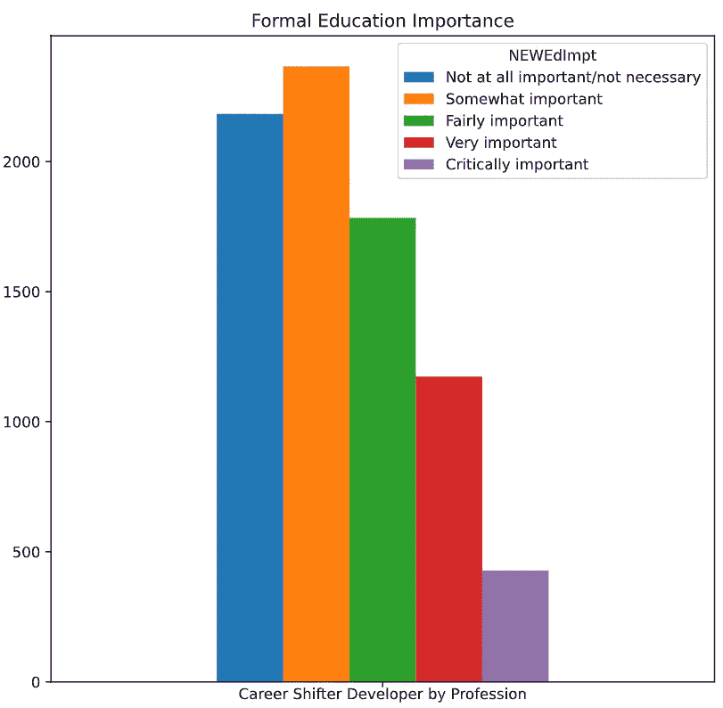

# StackOverflow 开发者调查 2020 数据分析

> 原文：<https://medium.com/analytics-vidhya/stackoverflow-developer-survey-2020-data-analysis-7c8c3448ad27?source=collection_archive---------24----------------------->

科技行业发展迅速。随着它的成长，有很多关于技术的讨论和文章发表。我感兴趣的有 3 个主题:

1.  女性开发者
2.  加班
3.  职业转变

我将通过就每个话题提出每个问题来讨论这些话题。回答这样的问题，我主要用 StackOverflow 调查 2020 的数据。来自世界各地的大约 60，000 名开发人员参与了此次调查。它包含与软件开发人员的多个主题相关的问题，如教育、职业、技术文化等。

卢卡·布拉沃在 [Unsplash](https://unsplash.com?utm_source=medium&utm_medium=referral) 上的照片

# **女性开发者**

多样性在科技公司很重要，因为它让每个人在创造产品时都考虑到了多样性。然而，性别差异仍然是一个问题。莎拉·k·怀特(Sarah K. White)的这篇文章描述了女性在科技职业中寻求平等地位所面临的挑战。

利用调查数据，我们将了解女性开发人员相对于男性的比例。由此，我们可以看到过去 3 年中参与调查的开发人员之间的差异。

过去 3 年中开发人员的性别构成

从图中我们可以看到**的成分在每年**都没有太大的变化。男女开发人员的比例约为 9:1。然而，我们可以看到女性开发人员的比例每年都在上升。这是一个好迹象，表明女性开发人员的存在逐年变得越来越重要。

# 加班

加班是指工作时间超过约定的办公时间。加班的动机有很多，比如糟糕的时间管理，不切实际的客户期望，有毒的公司文化，甚至是为了获得更多的报酬。Stack Overflow 2020 开发者调查包括了加班问题，所以讨论开发者如何加班是很有趣的。

我们将从一个问题开始。

> **谁加班最多？**

每月至少加班 1-2 天但少于每周的开发人员的百分比。

从表中我们可以看到经常(每周 1-2 天或更多)和有时(每月 1-2 天，但少于每周)加班的开发人员占所有调查参与者的百分比。高管/副总加班最多，其次是工程经理和产品经理。我们一眼就能看出那些管理工作占主导地位的人倾向于加班。

我们进入加班话题的下一个问题。

> W **加班工人的平均工作时间是多少？**

每种加班状态的平均工作时间。

加班的开发人员平均每周工作 45.14 小时。如果我们假设正常工作时间是每周 40 小时(这也适用于我国的劳动规则)，那么那些经常加班的人**平均一周比正常工作时间多工作 5.14 小时**。

那么我们就到了这个话题的最后一个问题。

> 加班与工作满意度有什么关系？

加班对工作满意度的影响。

有时和偶尔加班的受访者的工作满意度高于平均水平，而那些很少、经常和从不加班的人的工作满意度低于平均水平。这很有意思，因为我们可以看到那些以足够的频率加班的人比不加班、加班少或加班频率高的人有更多的工作满意度。

# 职业转移者

将职业转向科技是有益的，因为它能提供更多的钱。根据美国消费者新闻与商业频道的这篇文章，89%的人转行进入科技行业是为了追求更多的钱。为了了解职业转换者如何看待正规教育和他们的行为，我提出这个话题来讨论。在开始看到结果之前，我需要告诉你，我使用的职业转换者的定义是没有 4 个技术相关专业的正规教育背景的人，即计算机科学、信息系统、数学或统计以及 Web 开发。

第一个问题如下。

> 职业转换者如何看待正规教育对职业生涯的重要性？

图表显示大多数转行者认为正规教育有些重要，甚至根本不重要。这可能是因为他们在获得开发人员工作之前加入了开发人员训练营或进行了自学。所以对于没有正规教育背景的你来说，机会是敞开的！

下一个问题是关于职业转移者的行为。

> 当你被困住了，你会怎么做？

**大多数职业转换者在遇到困难时会访问堆栈溢出**。这是有意义的，因为我们可以简单地输入我们的错误，通常有人在堆栈溢出时和我们有同样的错误。我也在卡住的时候打开栈溢出。做其他工作或稍后回来也是大多数职业转移者的一个选择。

> 他们多久学习一次新语言？

我们可以看到**大多数职业转移者每年学习一次新语言**。他们中的许多人也每隔几个月学习一门新语言。看频率，可以看到大部分都是不断的频繁学习来越多的拓宽知识面！

我希望这些关于职业转移者如何思考和行为的发现能够激励那些想成为职业转移者的人在科技领域找到他们的第一份工作。他们可以在没有技术相关专业的正式学位的情况下在技术领域找到工作，所以我相信你可以！

# **结论**

总结本文解释的发现，以下是分析的要点:

1.  在过去的 3 年里，男女开发人员的构成有些相似，但是女性开发人员的百分比呈现上升趋势。
2.  主要从事管理工作的开发人员倾向于加班。加班的人每周平均比正常时间多花 5.14 小时。但是不知何故，足够的加班时间让开发人员对他们的工作感到满意。
3.  职业转移者认为正规教育在他们的职业生涯中有些重要，甚至根本不重要。他们中的大多数人通常**在被卡住的时候访问堆栈溢出**并且**每年至少学习一次新的编程语言**。

在我的 [Github repo](https://github.com/eka-pramudita/stackoverflow-survey-2020) 中查看分析的完整代码。我希望这份分析能让你对科技领域感兴趣的话题有所了解。在评论区分享你对相关话题的想法，我很乐意在那里进行富有成效的讨论。

# 参考

 [## 科技统计中的女性:艰苦战斗的残酷事实

### 多样性在科技领域至关重要，因为它使公司能够创造更好、更安全的产品，让每个人都进入…

www.cio.com](https://www.cio.com/article/3516012/women-in-tech-statistics-the-hard-truths-of-an-uphill-battle.html)  [## 90%的转行到科技行业的员工说他们想要更多的钱——这是他们想要的钱…

### 在科技行业工作可能会有利可图。对技术工人日益增长的需求导致了全国性的人才短缺，这…

www.cnbc.com](https://www.cnbc.com/2019/12/10/nine-out-of-10-workers-who-change-careers-into-tech-wanted-more-money.html)