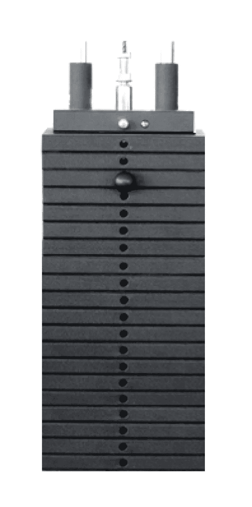
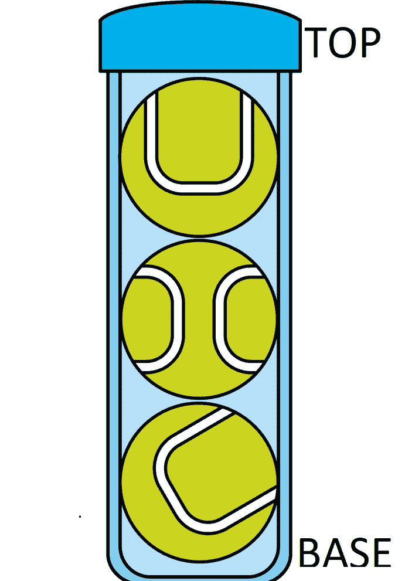
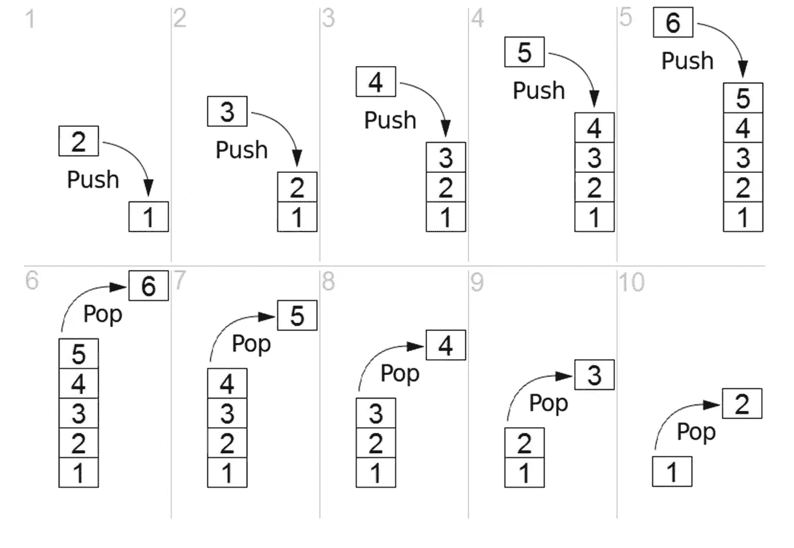

# 堆栈数据结构概述及其在 python 中的实现

> 原文：<https://medium.com/analytics-vidhya/stacks-data-structure-overview-and-its-implementation-in-python-ab635fd7b6d4?source=collection_archive---------23----------------------->

一叠健身板

堆栈是常用的数据结构，它允许我们以一种方式动态地存储和检索数据项。我们可以在各种情况下使用堆栈，但是选择取决于我们试图解决的问题。让我们来看看这些原则，这样我们就可以了解它们的用途可能适用于何处。

堆栈是有序的项目集合，其中新项目的添加和现有项目的移除发生在同一端。这种结局通常被称为**顶。顶部的另一端被称为 T2 底部。**

网球容器

如上图所示，我们只能从称为**顶部的容器开口端插入和取出球。**

与顶部的球相比，底部的球代表它在容器中停留的时间更长。排序原则有时被称为后进先出。

如上图所示，堆栈的值为 1，然后我们从顶部开始添加值 2，然后 3，4，5，6，如果我们想删除这个数字，我们不能从堆栈的末端或中间删除它，我们只能从顶部删除它，所以我们需要首先删除顶部的元素，这称为 LIFO，后进先出，所以我们需要删除 6，然后 5，4，3，2，等等，直到堆栈为空。

堆栈非常重要，因为它们可以用来颠倒一个项目的顺序。插入顺序与拆卸顺序相反。

在许多情况下，堆栈都是有用的，可以在以下位置找到它的一些应用:

*   **浏览器后退按钮—** 每个网络浏览器都有一个后退按钮。当你从一个网页浏览到另一个网页时，这些网页被存储在堆栈中(实际上是它们存储在堆栈中的 URL ),当前的网页在堆栈的顶部，你看到的第一个网页在堆栈的底部。
*   **回溯功能** —这可能是文本编辑应用程序中的撤销功能，或者是游戏中的前一个选择点。堆栈只允许我们从数据结构中弹出前一项。
*   **递归算法** —递归时，我们有时需要将临时数据压入堆栈，在我们回溯算法的各个阶段时弹出数据。

# Python 中栈的实现

# 堆栈属性和方法

在我们实现自己的 Stack 类之前，让我们回顾一下 Stack 的属性和方法。

堆栈抽象数据类型由以下结构和操作定义。如上所述，堆栈被结构化为有序的项目集合，其中项目被添加到称为“顶部”的末端并从该末端移除堆栈按后进先出法排序。下面给出了堆栈操作。

*   Stack()创建一个新的空堆栈。它不需要参数，返回一个空堆栈。
*   push(item)将新项目添加到堆栈顶部。它需要该项目，但不返回任何内容。
*   pop()从堆栈中移除顶部的项目。它不需要参数并返回项目。栈被修改。
*   peek()从堆栈中返回顶部的项，但不移除它。它不需要参数。堆栈不会被修改。
*   isEmpty()测试堆栈是否为空。它不需要参数，返回一个布尔值。
*   size()返回堆栈中的项数。它不需要参数，返回一个整数。

# 堆栈实现

将使用上述代码片段创建堆栈类。现在让我们检查一下我们实现的 stack 类。

在下一篇博客中，我们将看到队列及其在 python 中的实现。

如果你有任何反馈或批评，请随时与我分享。如果本演练对您有所帮助，请喜欢👏文章。干杯！🍻