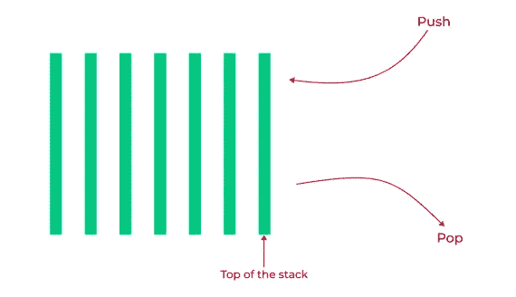

# Python 中的堆栈

> 原文：<https://medium.com/analytics-vidhya/stacks-in-python-bbacc60510a?source=collection_archive---------10----------------------->

一篇介绍性文章，帮助 Python 爱好者开始使用栈数据结构


Unsplash.com[@ Brooke lark](https://unsplash.com/@brookelark)各色陶瓷碗

# 什么是栈数据结构？

在计算机科学和编程中，数据结构就是一组特定的数据值是如何排列、存储和管理的。

接下来，我希望大家从字面上理解单词“ *stack* ”。想到了什么？一堆排列整齐的书？没错。一堆盘子？也对。

栈由数据项组成，允许在栈顶插入或删除数据项。堆栈数据结构中的插入操作被称为`push`，而删除操作被称为`pop`



堆栈操作只发生在堆栈的顶部，也就是要添加的最后一个元素

# 欢迎学习后进先出概念！

后进先出， *LIFO* 用于描述堆栈操作的执行顺序。要添加的最后一个数据元素是要检索的第一个元素。此外，一个新的数据元素被添加到堆栈的顶部。

# 堆栈是用来做什么的？

1.  堆栈数据结构应用于字处理和图形编辑软件中的撤消和重做操作
2.  编程中的递归函数使用堆栈数据结构。当一个函数被调用时，这个函数会被放到堆栈的顶部。

# 了解堆栈操作

1.  **Push** :将一个新项目推到堆栈顶部
2.  **弹出**:移除并返回顶部项目
3.  **Peek** :仅返回最上面的项目，不移除

# 如何用 Python 写一个堆栈类

要理解下面的代码片段，你需要对面向对象编程概念中的类有一个基本的了解。在这篇文章《Python 中的面向对象编程(OOP)》中，您可能会看到 Python 3 中的面向对象编程[。](https://realpython.com/python3-object-oriented-programming/)

我们将使用一个类来表示一个堆栈。

```
class Stack:
    pass
```

在上面的代码片段中，我们声明了一个名为`Stack`的类，并在空类中使用了关键字`pass`，以防止在运行程序时出错。

在我们继续之前，让我们添加我们的`__init__()`构造函数，它允许我们使用`Stack`类的对象及其属性。然后，我们将删除关键字`pass`,因为我们的类不再是空的，因为我们现在有了一个方法。

```
class Stack:
    def __init__(self):
        self.items = []
```

在上面的代码片段中，我们不仅声明了`__init__()`构造函数，还将`items`初始化为一个保存数据项的列表。

> 注意:方法也叫做函数

# 推

`push`使我们能够向 append()列表方法添加一个条目。让我们为推送操作添加一个方法。

```
class Stack:
    def __init__(self):
        self.items = [] def push(self, item):
        self.items.append(item)
```

# 流行音乐

pop() list 方法有助于从堆栈顶部移除一个项目。

```
class Stack:
    def __init__(self):
        self.items = [] def push(self, item):
        self.items.append(item) def pop(self):
        return self.items.pop()
```

# 偷看

Peek 使我们能够返回栈顶的元素，而不用从栈中移除返回的元素。

```
class Stack:
    def __init__(self):
        self.items = [] def push(self, item):
        self.items.append(item)

    def pop(self):
        return self.items.pop() def peek(self):
        return self.items[-1]
```

当然，我们希望看到我们在上面的操作中声明的方法的输出。因此，我们将使用`__str__()`方法，这将使得在我们的`Stack`类上使用 print 语句成为可能。

```
class Stack:
    def __init__(self):
        self.items = [] def push(self, item):
        self.items.append(item) def pop(self):
        return self.items.pop() def peek(self):
        return self.items[-1] def __str__(self):
        return str(self.items)
```

现在，让我们将打印语句添加到代码中:

```
class Stack:
    def __init__(self):
        self.items = [] def push(self, item):
        self.items.append(item) def pop(self):
        return self.items.pop() def peek(self):
        return self.items[-1] def __str__(self):
        return str(self.items)if __name__ == “__main__”:
    s = Stack()
    print(s) s.push(1)
    print(s) s.push(3)
    s.push(5)
    s.push(7)
    print(s) print(s.pop())
    print(s) print(s.peek())
```

在上面添加的代码中，我们使用了一个`if`语句来声明如果`__name__`是`__main__`，即如果当前文件是主文件，则应该使用打印语句。这允许我们导入我们的`Stack`类及其方法，以便在其他 Python 文件中导入和使用，而不会影响包含`Stack`类的初始文件。

运行代码应该会为各个`print`语句提供以下输出行:

```
[][1][1, 3, 5, 7]7[1, 3, 5]5
```

# 结论

堆栈数据结构是 Python 中使用的数据结构之一，在表示一列数据值时会很方便。本文旨在向您介绍堆栈数据结构和可以用它执行的基本操作。

感谢您抽出时间阅读我的文章。如果你有问题或想法想和我分享，你可以通过 Twitter 联系我 [@JKayLight](https://twitter.com/JKaylight)

