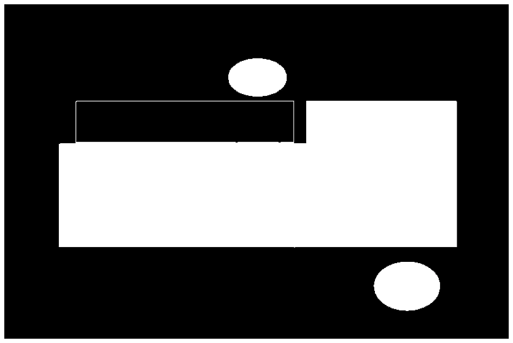

# 基于计算机视觉和 Python 的邮票检测

> 原文：<https://medium.com/analytics-vidhya/stamp-detection-using-computer-vision-and-python-6038a0243429?source=collection_archive---------2----------------------->

## 我们将使用 OpenCV 来识别一张图片中的邮票数量。

在 [Unsplash](https://unsplash.com/s/photos/computer-vision?utm_source=unsplash&utm_medium=referral&utm_content=creditCopyText) 上由 [Garvit Jagga](https://unsplash.com/@photophilic_spook?utm_source=unsplash&utm_medium=referral&utm_content=creditCopyText) 拍摄的照片

# 背景

我的一个朋友问我是否可以写一个程序来检测一个图像中的[橡皮图章](https://en.wikipedia.org/wiki/Rubber_stamp)的数量。显然，这些发票收据将根据上面的邮票数量进行分类。最初，我想到了建立一个深度学习细分模型，但很快我意识到这是不值得努力的。

这些图像是在受控环境中生成的，因此很少有计算机视觉算法能做到这一点。为了说明用于检测邮票的计算机视觉算法，我将使用从谷歌下载的样本图像，因为原始图像是公司财产。目标是识别样本图像中的两个邮票。

印记检测

# 解决办法

高级解决方案步骤包括:

1.阅读图像。
2。模糊&检测边缘。
3。找出所有轮廓，并删除较小的轮廓。
4。填充轮廓内的区域&关闭斑点。
5。过滤邮票。

在开始之前，让我们导入必要的包。

## 1.阅读图像

使用 [*imread*](https://docs.opencv.org/master/d4/da8/group__imgcodecs.html#ga288b8b3da0892bd651fce07b3bbd3a56) 功能读取彩色图像。为了显示图像，我们将使用 Matplotlib。Matplotlib 期望彩色图像通道的顺序为 RGB，但是 OpenCV 将图像读取为 BGR，因此我们将为转换编写一个帮助函数。

输入图像

## 2.模糊和检测边缘

首先，我们需要使用 [cvtColor](https://docs.opencv.org/3.4/d8/d01/group__imgproc__color__conversions.html#ga397ae87e1288a81d2363b61574eb8cab) 函数将图像转换成灰度。然后，我们将使用[双边滤波器](https://docs.opencv.org/master/d4/d86/group__imgproc__filter.html#ga9d7064d478c95d60003cf839430737ed)来降低图像中的噪声。双边滤波器优于高斯滤波器，因为它能更好地保留边缘。最后，我们将使用 [canny](https://opencv-python-tutroals.readthedocs.io/en/latest/py_tutorials/py_imgproc/py_canny/py_canny.html) 边缘检测器对图像进行阈值分割和边缘检测。正常的 canny 边缘检测器需要两个难以调整的阈值参数，因此我们将使用来自[零参数的一个，通过 Python 和 OpenCV](https://www.pyimagesearch.com/2015/04/06/zero-parameter-automatic-canny-edge-detection-with-python-and-opencv) 实现自动 Canny 边缘检测

边缘图像

## 3.找出所有轮廓，并删除较小的轮廓

[findContours](https://docs.opencv.org/3.4/d3/dc0/group__imgproc__shape.html#ga17ed9f5d79ae97bd4c7cf18403e1689a) 功能可以找到图像中的所有轮廓。最外面的轮廓对我们的用例来说已经足够好了，所以我们将使用检索模式**RETR _ 外部**。 **CHAIN_APPROX_NONE** 模式是首选模式，因为我们不想因近似而丢失轮廓上的任何点。要移除不需要的较小轮廓，我们可以按区域过滤轮廓。

> 找到的等高线总数:408

## 4.填充轮廓内部的区域并关闭斑点

我们将在黑色背景的图像上绘制顶部轮廓，并以此为基础，而不是在原始的二值图像上工作。当使用[绘制轮廓](https://docs.opencv.org/3.4/d6/d6e/group__imgproc__draw.html#ga746c0625f1781f1ffc9056259103edbc)功能填充轮廓内部区域时，轮廓中的任何断开点更容易识别。

填充轮廓

正如所怀疑的，最上面的邮票有一条细细的黑线穿过。我们需要关闭这个斑点，这样顶部的图章被认为是一个轮廓，而不是两个不同的轮廓。[形态闭合](https://docs.opencv.org/master/d4/d86/group__imgproc__filter.html#ga67493776e3ad1a3df63883829375201f)操作非常适合实现这一点。

闭合斑点

## 5.过滤邮票

为了分离印章轮廓，我们可以从最新的二进制图像中识别所有轮廓，并过滤超过 5 个点的轮廓(使用 [approxPolyDP](https://docs.opencv.org/3.4/d3/dc0/group__imgproc__shape.html#ga0012a5fdaea70b8a9970165d98722b4c) ),因为印章是椭圆。

邮票识别图像

# 奖励—突出显示已识别的图章

对于这个程序的演示来说，如果我们可以只突出显示图像的图章区域，那不是很酷吗？既然我们都认为这确实很酷，那就让我们看看如何实现这一点。

涉及的步骤有:

1.复制原始图像并模糊整个图像。
2。遍历模糊图像中的所有点，对于图章轮廓上或内部的点(使用 [pointPolygonTest](https://docs.opencv.org/3.4/d3/dc0/group__imgproc__shape.html#ga1a539e8db2135af2566103705d7a5722) 进行检查)，我们用输出图像的像素值替换它。我们使用输出图像中的像素值，因为我们需要在邮票上绘制蓝线。

# 结论

是的，这就是这篇文章的内容。您可以从[这里](https://github.com/6aravind/tidbits/blob/main/cv/Stamp%20detection%20using%20computer%20vision%20and%20python.ipynb)访问该笔记本。