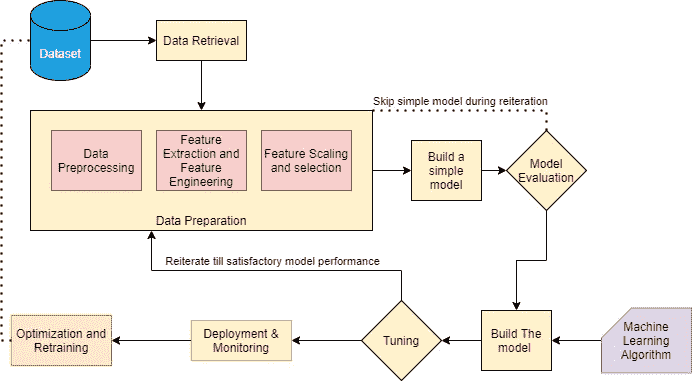

# 标准机器学习管道

> 原文：<https://medium.com/analytics-vidhya/standard-machine-learning-pipeline-20db06702e9b?source=collection_archive---------2----------------------->

## 从数据集到优化

这个博客将提供一个标准机器学习管道的高级流程。这篇博客将从数据集到优化，但不会详细讨论每个步骤。

作者图片

1.  **数据集:**我们先从数据集入手，了解变量，建立业务理解。
2.  **数据检索**:通常情况下，数据存储在 CSV 文件或数据库中。在您的系统中检索这些数据。
3.  **数据准备:**广义来说，这一步包含若干子步骤，分别是数据预处理、特征提取和特征工程、特征缩放和选择。
4.  **建立简单模型**:发布数据准备，开发简单模型。有时候简单的模型更可靠，也更经济。
5.  **模型评估**:提出一个模型评估指标。该指标还应该与您试图解决的业务问题相关。
6.  **建立模型**:现在，一旦你决定了度量标准和一个简单的基础模型，应用其他机器学习算法并评估你从简单模型中观察到的差异。在构建这个模型时，还要记住的一点是应用程序的空间和时间复杂性。
7.  **调整**:这是您进行超参数调整的步骤，如果模型性能不令人满意，重复从特征选择和特征工程开始的过程。
8.  **部署与监控**:现在正是你的模型走向世界，大放异彩的时候！确保给它一个 API，把它放在 docker 中，并定期监控进程。再次观察运行时的空间和时间复杂度。
9.  **优化和再培训**:当你的模型启动并运行良好时，你会遇到一项新技术或获得一些新数据。现在是时候稍微改变一下，重新开始这个过程了。您将比较新模型和旧模型的性能指标，而不是基本模型。

我希望这能让我们对典型的机器学习流程有一个清晰的、高层次的了解，最重要的是，这是我们为什么要做我们正在做的事情的领域知识和业务理解。