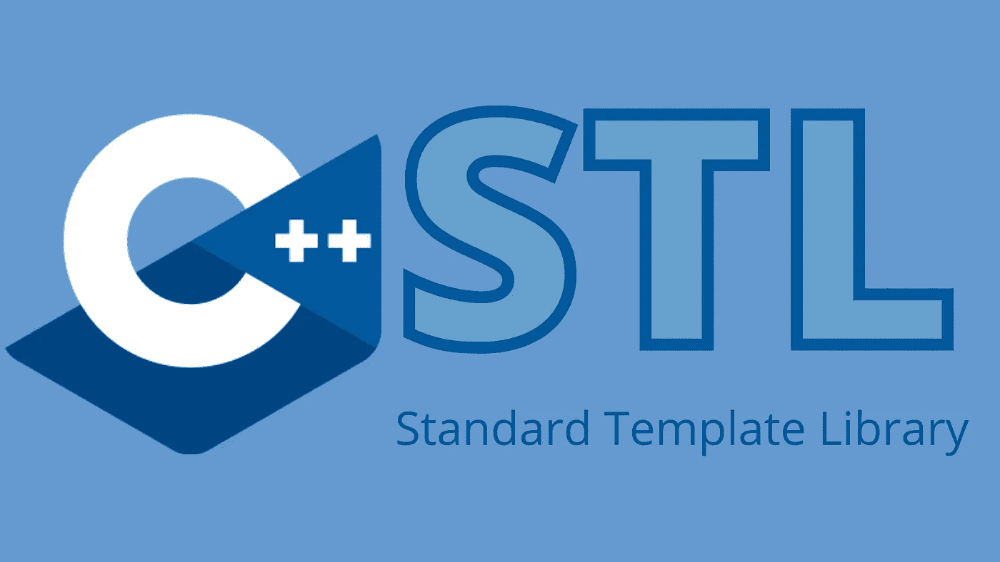
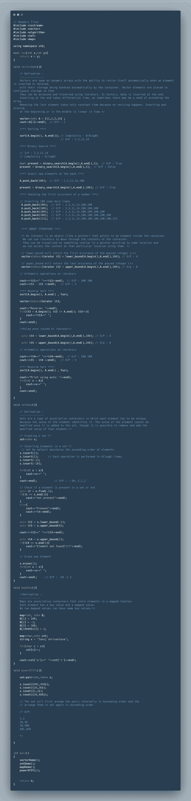

# C++中的标准模板库

> 原文：<https://medium.com/analytics-vidhya/standard-template-library-in-c-49425f9121a8?source=collection_archive---------19----------------------->

# STL 的需要？

当我们开发一些应用程序时，我们必须处理数据。数据是值的集合，为了存储值的集合，我们需要数据结构。CPP 为所有这些数据结构提供了内置的类库，这个类库集合被称为 STL(标准模板库)。

## STL 包括

1.  算法
2.  容器
3.  迭代器

*   ***算法是用来对容器*** 执行操作的函数
*   ***例如:***

> 排序()
> 
> 反向()
> 
> 计数()
> 
> 查找()
> 
> 二进制搜索()
> 
> 下限()
> 
> 上限()
> 
> 下一个置换()
> 
> 前一个置换()
> 
> 距离()

*   ***容器是存放其他对象集合的 holder 对象。它们是作为类模板实现的，这使得作为元素支持的类型具有很大的灵活性。***
*   容器管理其元素的存储空间，并提供成员函数来直接或通过迭代器访问它们。
*   ***很多容器有几个共同的功能，共享功能。决定使用哪种类型的容器来满足特定需求通常不仅取决于容器提供的功能，还取决于其某些成员的效率***
*   ***例如:***

> 矢量
> 
> 目录
> 
> 转发列表
> 
> 双端队列
> 
> 优先级队列
> 
> 堆
> 
> 设置
> 
> 多重集
> 
> 地图
> 
> 多地图

*   ***迭代器是指指向某个元素范围内的某个元素(如一个数组或一个*** [***容器***](https://www.cplusplus.com/stl) ***)的任何对象，它能够使用一组运算符(至少使用增量(*** `***++***` ***)和解引用(*** `*******` ***)来迭代该范围内的元素。***
*   ***迭代器最明显的形式是指针:指针可以指向数组中的元素，并可以使用增量运算符(*** `***++***` ***)遍历它们。但是其他类型的迭代器也是可能的。例如，每个*** [***容器***](https://www.cplusplus.com/stl) ***类型(例如一个*** [***列表***](https://www.cplusplus.com/list) ***)都有一个特定的迭代器类型，用于遍历其元素。***
*   ***例如:***

> 迭代程序
> 
> 迭代器 _ 特征
> 
> 反向迭代器
> 
> move_iterator
> 
> 后退 _ 插入 _ 迭代器
> 
> 前端插入迭代器
> 
> 插入迭代器
> 
> istream _ 迭代器
> 
> ostream _ 迭代器
> 
> 输入迭代器标签

# 带有每个容器定义的示例代码:

**参考文献:**

*   [https://www.cplusplus.com/](https://www.cplusplus.com/)