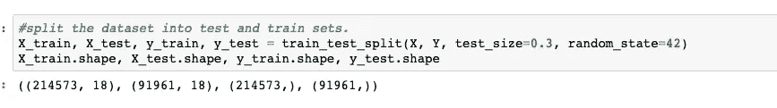

# 星巴克奖励计划分析

> 原文：<https://medium.com/analytics-vidhya/starbucks-reward-program-analysis-323b017f0c3e?source=collection_archive---------13----------------------->

# 介绍

每隔几天，星巴克就会向手机应用程序的用户发出一次报价。优惠可以仅仅是饮料的广告，也可以是实际的优惠，如折扣或 BOGO(买一送一)。该项目代表了星巴克为期一个月的试验，以测试市场，看看什么样的优惠真正让不同的人群兴奋。

这个项目的 Github 链接可以在这里找到:[https://github.com/pato0301/starbucks_capstone_udacity](https://github.com/pato0301/starbucks_capstone_udacity)

# 商业背景

*   这里的解决方案旨在分析人们如何做出购买决策，以及这些决策如何受到促销活动的影响。
*   数据集中的每个人都有一些隐藏的属性，这些属性会影响他们的购买模式，并与他们可识别的特征相关。个人产生不同的事件，包括接受报价、开仓报价和买入。
*   有三种类型的优惠可以发送:买一送一(BOGO)，折扣和信息。在 BOGO 优惠中，用户需要花费一定的金额来获得与该阈值金额相等的奖励。在折扣中，用户获得的奖励相当于消费金额的一小部分。在信息提供中，没有奖励，但也没有要求用户花费的金额。优惠可以通过多种渠道提供。

# 项目动机

该项目的目的是确定哪些人口统计群体对哪些优惠类型反应最好，以帮助星巴克在向目标客户发送优惠时做出更好的决策，从而增加销售额并可能节省资金。

通过向正确的客户发送报价:

*   星巴克可以提高品牌认知度、顾客忠诚度、增加销售活动、推广新产品等。

没有向正确的客户发送报价:

*   星巴克可以在促销活动中为那些在没有优惠的情况下购物的顾客节省成本
*   星巴克可以通过不发送要约来防止顾客对要约做出负面反应

# 项目目标

在这个项目中，我们将尝试对用户进行分类，看看是否有任何类型的推广更适合每个用户，从而使他们使用它。

# 数据集和输入

对于这个项目，我们将利用星巴克/Udacity 慷慨提供给我们的数据。这是以三个 JSON 文件的形式给我们的。在深入研究这些单个文件之前，让我们首先了解星巴克可能向其客户提供的三种类型的优惠:

*   **买一送一(BOGO)** :在这个特别的优惠活动中，顾客得到一份奖励，使他们能够免费获得一份额外的同等产品。客户必须花费一定的阈值才能获得该奖励。
*   **折扣**:通过这种优惠，客户可以获得一定比例的奖励，即他们选择购买的产品的原价，但有一定的限制。
*   **信息**:在这个最终报价中，不一定是奖励，而是给顾客一个机会，在给定必要金额的情况下购买某样东西。(这可能类似于让顾客知道南瓜香料拿铁将在初秋再次上市。)

了解了这一点之后，现在让我们来看看提供的三个 JSON 文件及其各自的元素:

*   portfolio.json 文件描述了每项优惠的特征，包括其持续时间和客户需要花费的金额(难度)。
*   profile.json —该文件包含客户的人口统计数据，包括他们的年龄、性别、收入以及他们在 Starbucks rewards 移动应用程序上创建帐户的时间。
*   transcript.json 文件描述了客户的购买情况，以及他们何时收到、查看和完成报价。只有当顾客在报价有效期内看到报价并满足或超过其难度时，报价才是成功的。

以下是文件中每个变量的模式和解释:

**portfolio.json**

*   id(字符串)—优惠 id
*   offer_type (string) —优惠的类型，如 BOGO、折扣、信息
*   难度(int)——完成一项提议所需的最低花费
*   奖励(int) —奖励是为完成一项提议而给予的
*   duration(int)-要约开放的时间，以天为单位
*   频道(字符串列表)

**profile.json**

*   年龄(整数)—客户的年龄
*   成为会员日期(int)-客户创建应用程序帐户的日期
*   性别(str) —客户的性别(请注意，有些条目包含“O”代表其他，而不是 M 或 F)
*   id (str) —客户 id
*   收入(浮动)—客户的收入

**抄本. json**

*   事件(str) —记录描述(即交易、收到的报价、查看的报价等。)
*   人员(字符串)—客户 id
*   time (int) —测试开始后的时间，以小时为单位。数据开始于时间 t=0
*   value —(字符串字典)—报价 id 或交易金额，具体取决于记录

# 数据探索

为了在接下来的部分中更好地分析这个问题，我们首先需要探索数据集，包括检查缺失值、可视化数据分布等。通过这种方式，我们可以更好地了解数据集的外观，以及我们如何对数据进行特征化，以便为建模做好准备。

如上所示，投资组合数据集中没有缺失值。通道列需要进行一键编码。我们需要将 id 列名重命名为 offer_id。

通过查看数据集的前几行，它显然显示了年龄中缺失的值。

似乎脚本文件没有丢失的值。

# 数据清理

# 1.投资组合数据集

文件夹的清理和预处理执行如下:

*   将 id 列名重命名为 offer_id。
*   放下频道栏。
*   offer_type 列需要一次性编码。

# 2.个人资料数据集

轮廓的清理和预处理执行如下:

*   将 id 列名重命名为 customer_id。
*   在“成为成员”列中创建可读的日期格式
*   用没有性别、收入、年龄数据的最常见行估算。
*   将性别列值转换为虚拟值。

# 3.抄本数据集

转录物的清洗和预处理如下进行:

*   将人员列名重命名为 customer_id。
*   删除列值。
*   用“-”替换事件中的空值，然后转换为 dummy。
*   四舍五入等于两位小数。

# 探索性数据分析

## 概况总体分布—年龄、收入、成员

年龄分布图描绘了客户的中值年龄是 60 岁，并且大多数客户属于 40 到 70 岁之间的年龄范围。

收入分布图显示，平均工资低于 70K 的客户数量高于将 70K 视为收入分布中位数的另一方。

# 收入分配是性别的函数

下图得出的结论是，男性和女性的最低和最高收入大致相同，但低收入水平的男性顾客数量略高于女性顾客

# 性别分布

剧情显示，每年都有更多的男性客户加入该计划。

# 组合数据

产品组合、客户资料和交易数据被组合起来形成单一数据集和训练模型。在合并的数据集中，每一行都将描述优惠的属性、客户人口统计数据、优惠是否成功以及通过哪些渠道宣传了优惠。只有当要约在给定的期限内被查看和完成时，要约才被认为是成功的。

干净的组合数据的输出看起来像这样—

# 建筑模型

建立了四个不同的精确模型来预测客户是否会对报价做出反应。在建立模型之前，我们的数据集应该分为训练数据集和测试数据集，这样模型就不会过度拟合数据，并且测试数据集也用于评估我们的模型的执行情况。

此外，在构建我们的模型之前，让我们缩放数据并构建一个管道。我们需要先分割数据，这是我们已经做过的，所以不会有数据泄漏。

现在我们可以建立我们的管道:

# 逻辑回归模型

逻辑回归的实例是用 liblinear 分类器创建的，将作为我们的基础模型。

建立的模型如下

物流收益的衡量标准如下

**精度**

*   逻辑回归:0.699

**F1-得分**

*   逻辑回归:0.63

# 随机森林分类器模型

创建随机森林分类器的实例，并使用 RandomizedSearchCV 调整参数，如 n_estimators、max_features、max_depth、min_samples_split、min_samples_leaf，以适应训练数据。

建立的模型如下

RandomForestClassifer 的指标如下

结果表明，随机森林模型的准确性和 f1 值优于原始预测值

**精度**

*   基础预测值:0.699
*   随机森林:0.700

**F1-得分**

*   基础预测值:0.63
*   随机森林:0.61

# KNN 模型

K 近邻模型。

建立的模型如下

KNN 的指标如下

**精度**

*   基础预测值:0.699
*   随机森林:0.67

**F1-得分**

*   基础预测值:0.63
*   随机森林:0.66

# 人工神经网络模型

Keras ANN 模型的输入层有 6 个节点和 2 个隐藏层，所有节点和隐藏层都具有 ReLU 激活函数。最后是输出层，有四个节点和一个 softmax 激活函数。

建立的模型如下

KNN 的指标如下

**精度**

*   基础预测值:0.699
*   安:0.736

**F1-得分**

*   基础预测值:0.63
*   随机森林:0.68

# 结论

我们选择解决的问题是建立一个模型来预测客户会更好地响应哪个提议。

我解决这个问题的策略主要有两步:

*   首先，我们将产品组合、客户资料和交易数据结合起来。
*   其次，我们评估了基本模型的准确性和 F1 值，然后比较了随机森林模型、KNN 模型和人工神经网络模型的性能。

该分析表明，ANN 模型具有最好的训练数据准确性和 F1 值，分别为 0.736 和 0.68。

因此，总之，我们可以说对客户进行分类的最佳模型是人工神经网络模型。

# 丰富

通过分析影响报价成功率的特征，作为报价难度、持续时间和报酬的函数，人工神经网络的性能还可以得到改善。这些额外的特性应该为模型提供构建更好的决策边界来对用户进行聚类的机会。

此外，最初，我们似乎有很多数据要处理，但是一旦删除了 NaN 值和重复的列，并将数据合并到一个单独的数据集中，就好像模型可能会从更多的数据中受益。随着更多的数据，分类模型可能已经能够产生更好的准确性和 F1 分数结果。

此外，如果有更多的客户指标，可能会推断出更好的预测。对于这一分析，我觉得我们对客户的了解非常有限，只有年龄、性别和收入。为了找到最佳的客户统计数据，最好能有更多的客户特征。这些附加特征可能有助于提供更好的分类模型结果。