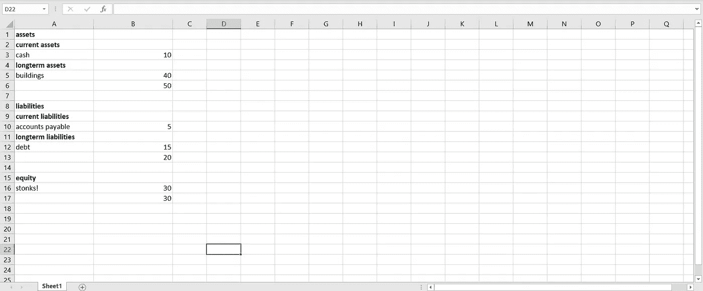

# 开始用 Python 记账

> 原文：<https://medium.com/analytics-vidhya/start-accounting-in-python-433324e5eb34?source=collection_archive---------5----------------------->

## 一个伟大的领域，一种伟大的编程语言


Claudio Schwarz | @purzlbaum 在 [Unsplash](https://unsplash.com?utm_source=medium&utm_medium=referral) 上的照片

> 注意:这篇文章已经过时了，因为 fibooks 的新版本已经发布。请到我在 fibooks 上的[新文章](https://levelup.gitconnected.com/replace-excel-with-python-for-financial-statement-analysis-855f6cc7305a)获取最新版本的教程。

## 介绍

Python 在金融方面很大。如今，最初的荷兰语编程语言是许多重要任务的首选工具，如；算法交易、数据分析和加密。Python 如此成功的最大原因之一是因为这种语言提供了大量的库。因此，似乎金融领域的每一项重要任务都有一个 Python 库可用。

然而，对于会计(以及一般的财务报表分析)来说，Python 从未取得突破。这就是为什么大多数会计师仍然使用 excel 或其他类似的程序来做他们的簿记工作。不用说，这些程序不像编程语言那样具有可扩展性和通用性。

这就是为什么在本文中，我们将探索一个新的 Python 库来填补这个空白，这个库叫做“fibooks”。这个库目前有 4 个主要财务报表中的 3 个*和*提供了一个大的内置计算集，可以帮助任何人更深入地了解公司的财务表现。

## 入门指南

Fibooks 可以通过 *Python 包安装程序、*也称为“pip”安装在终端中。如果您使用 PyCharm(或任何其他 IDE ),请查看该环境的安装指南。请记住，无论您的环境如何，这个包都是针对 Python 3 优化的。

```
pip install fibooks
```

下载完成后，您可以使用下面的代码片段检查安装是否成功。如果下面的代码输出了当前的版本号(现在是 1.0.3 ),那么就可以开始了！

```
>>> from fibooks import info
>>> info.get_version()
```

## 加载数据

财务报表分析的第一步是将实际报告载入报表。在本例中，我们将使用资产负债表来完成这项工作。要从资产负债表中导入功能，您可以使用以下命令。

```
>>> from fibooks import balance_sheet
```

导入资产负债表后，您可以声明它并将数据读入其中。Fibooks 提供了许多创建和导入数据的方法，但是在这个例子中，我们将导入一个 json 文件。如果你想在读完这篇文章后继续试验这个文件，那么你可以在这里找到它。

```
>>> my_company = balance_sheet(**'my company in 2020'**)
>>> my_company.import_json(**'balance_sheet.json'**)
>>> my_company.make()
```

需要注意的非常重要的一点是，为了真正加载数据，您需要调用函数“make”。如果忽略这一步，fibooks 将不会加载任何数据，即使它已经通过另一个函数导入。

## 探索数据

既然数据已经成功加载，我们就可以研究它了。在 fibooks 中，有很多方法可以做到这一点。第一种(也是最简单的)方法是将资产负债表打印到标准输出中。为此，调用函数“打印”。

```
>>> my_company.print()
The balance sheet of:  my company in 2020assets
        current assets
                 cash                            10
        long-term assets
                 buildings                       40
                                                 ___+
        total assets                             50liabilities
        current liabilities
                 accounts payable                5
        long-term liabilities
                 debt                            15
                                                 ___+
        total liabilities                        20equity
        stonks!                                  30
                                                 ___+
        total equity                             30
```

此外，还可以将资产负债表导出到文件中。如果你想保存你的资产负债表，你可以将其导出为 json 格式，如果你想查看你的资产负债表，你可以将其导出为文本或 excel 格式。最后一个确实需要在你的计算机上安装 excel，如果这个要求得到满足，只需调用“export_excel”函数和文件名。这将产生以下电子表格。



制作的 excel 文件 fibooks 的截图

当查看这种 excel 格式的资产负债表时，很容易看出资产负债表的同一性(资产=负债+权益)得到了维护。在这张电子表格中还可以看到，似乎没有那么多现金。为了判断这种怀疑是否合理，我们可以使用 compute 类。

## 进行计算

为了用 fibooks 进行计算，需要导入 compute 类。这门课不一定要上。

```
>>> from fibooks import compute
```

一个检查公司是否有足够库存现金的好比率是“流动比率”。这个比率用流动资产除以流动负债，它显示了公司可以用短期资产偿还多少短期债务。在 fibooks 中，这是非常容易做到的，因为比率已经内置在类中，它只需要一个资产负债表作为输入。

```
>>> current_ratio = compute.current_ratio(my_company)
>>> print(current_ratio)
2.0
```

根据我们刚才的计算，电流比等于 2。这意味着我们的怀疑被证明是错误的，该公司在银行的现金绰绰有余。

## 最后

本文希望展示的是 Python 如何用于财务报表分析，以及它有多简单，因为通过使用像 fibooks 这样的库，人们不需要太多的编程经验，也不需要昂贵的软件就可以开始进入会计领域。