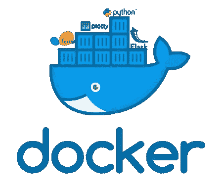

# 从 Docker for Data Science 开始

> 原文：<https://medium.com/analytics-vidhya/start-with-docker-for-data-science-aca380adc7eb?source=collection_archive---------21----------------------->

Docker 容器，Python，Flask 机器学习

读完这篇文章后，你将能够在 Docker 上构建你的整个项目。Docker 是一个开源平台，用于开发应用程序，将您的应用程序从基础设施中分离出来。
这样做的目的是快速交付软件。

因此，将项目 Docker 化的第一步是从安装 Docker 开始。