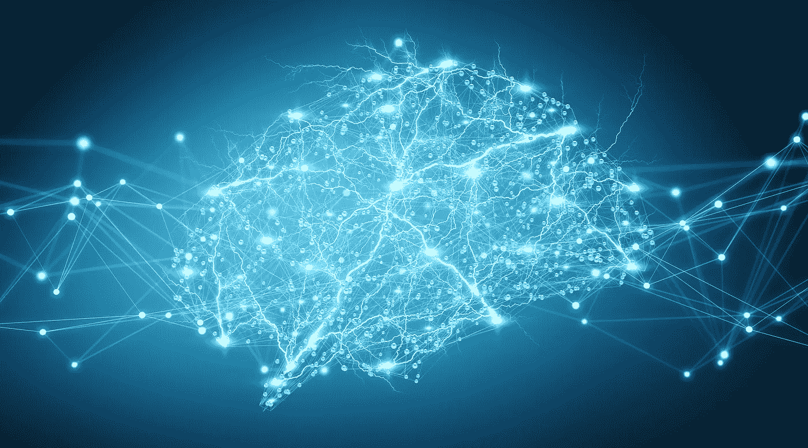

# 从深度学习开始？了解重要的资源

> 原文：<https://medium.com/analytics-vidhya/starting-with-deep-learning-know-the-important-resources-4187b42cdd77?source=collection_archive---------12----------------------->

对于初学者来说，深度学习可能是一个复杂而令人生畏的领域。然而，如果你试图理解深度学习的概念，你会遇到像隐藏层，卷积神经网络和反向传播这样的术语。

这并不容易——尤其是如果你采取临时的学习方法，不先复习基础知识的话。你会像一个没带地图的游客一样在一个陌生的城市迷路！

如果我今天开始学习深度学习，我会这样开始。

# 深度学习专业化

令人惊讶的是，在我看来，吴恩达的[深度学习专业](https://www.coursera.org/specializations/deep-learning)是最好的起点。
吴恩达有教学的天赋，他在使用深度学习从基础到图像和文本处理的进展方面做得非常出色。因此，本专业包括以下课程:

*   神经网络和深度学习
*   改进深度神经网络
*   构建机器学习项目
*   卷积神经网络
*   序列模型

最重要的是，我钦佩他如何教你在进入更复杂的架构之前如何提炼和组织你的项目。在我看来，这种自下而上的方法对于初学者来说确实是平易近人的。本课程还向你介绍了网络聚焦的原理，这是现代建筑的一个重要概念。

在我看来，这门课的一个缺点是它是用张量流来教授的。TensorFlow 已经改变，所以这不是一个主要的缺点，但我更喜欢 PyTorch。我在 PyTorch 中完成了所有的作业，我建议你也这样做。这不仅会让你接触 TensorFlow 和 PyTorch 代码，还会确保你掌握概念，因为你不能依赖任何给定的代码。

# 面向编码人员的实用深度学习

杰瑞米·霍华德和雷切尔·托马斯为深度学习的普及做出了重大贡献。

他们采取自上而下的方法，这意味着他们从最高级别开始，一步步往下。如果你以前没有深度学习的经验，我觉得这种方法有点令人费解。因此，我建议你从吴恩达的课程开始。你可能会认为，既然这只是一门介绍性的[课程](https://course.fast.ai/index.html)，除了吴恩达的课程之外就不值得上了，但是我发现教学风格和主题非常不同。

尽管毫无疑问你会收到 Andrew 课程的回顾，但我相信以新的视角看待某些主题是非常有益的。这门课程还将涵盖实际意义上的深度学习，重点关注他们在将深度学习应用于不需要谷歌级计算的现实世界问题时发现有用的主题。

该课程结合了 PyTorch 和 fastai，fastai 是一个构建在 PyTorch 之上的库。Fastai 是一个高级的库，只需几行代码就可以使用行业最佳实践和前沿模型。虽然这很好，但我仍然更喜欢直接编写 PyTorch 代码，因为它可以让您更好地理解表面之下发生的事情，并且通常不会太难。

如果你喜欢这门课，你可以考虑继续学习更高级的第二部分。该课程本质上指导您完成创建 fastai 库的过程，这需要更深入地研究代码和基础知识。

# 完成一篇论文

你现在应该对深度学习的基础有了坚定的理解。你们已经被世界上最好的两位老师以两种不同的方式训练过了。

我相信大多数人被深度学习绊倒是因为他们没有花足够的时间学习基础知识。我不是真的在谈论算法的数学。我指的是基本的想法、组件和问题。如果你不认为你完全理解了前两门课的概念，那就回去重温一下。

如果你心情好，那就去实施一篇论文吧。

这看起来很可怕，但几乎肯定没有你想象的那么可怕。我如此喜欢 PyTorch 的原因之一是，我几乎可以从一个文档中复制架构，并用 PyTorch 将其输入 Python，并且它可以工作。

GoogLeNet 是我推荐的一份报纸。这篇论文比较老一点，不会用什么不熟悉的积木，但是写的很好，我觉得没有哪门课讲的很详细。

坐下来，拿着你选择的论文，简单地阅读它，直到你理解它，然后将其转换成代码，并在标准数据集上测试它，以确保你的实现成功。这不仅有助于你理解这份文件，还会给你勇气，让你无所畏惧地接受其他文件。

# 选择你自己的冒险

这个过程的最后一步是不断寻找新的论文并付诸实践。深度学习是一个发展如此迅速的领域，以至于要跟上最先进的架构，就需要你能够舒适地阅读和实现文章。

不要害怕坐下来，用你从实施第一条中获得的勇气来消化一篇文章。在我看来，这是保持学习的最好方法。其他人可能已经写了非常有用的博客文章来帮助你剖析最有影响力的文章。充分利用它们！

如果你找不到一个，一旦你想通了就做一个！

然后，随着时间的推移，在别人把你视为专家并对你的知识广度留下深刻印象之前，你会逐渐建立起基本的深度学习技能。