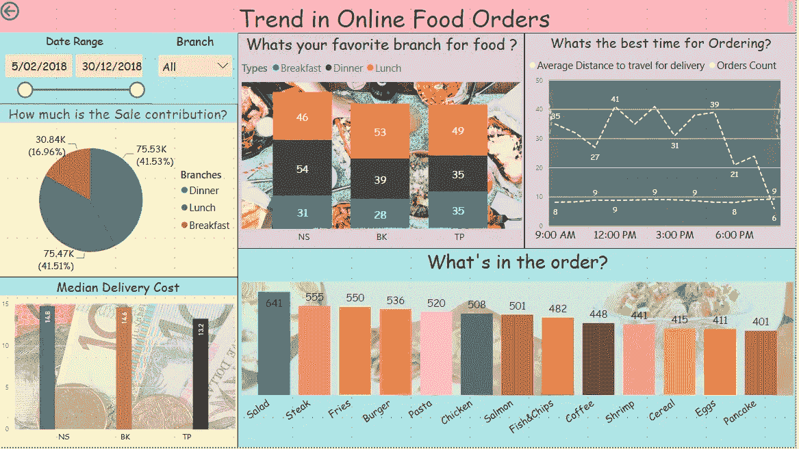

# 从 Power BI 开始:一个简短的试验

> 原文：<https://medium.com/analytics-vidhya/starting-with-power-bi-a-short-trial-97298a11e3a5?source=collection_archive---------13----------------------->

在分析和数据科学领域，90%的工作是由数据决定的，无论是数据的行为、相关性，还是数据对洞察的影响。因此，数据可视化起着关键作用。拥有能够以你的视角和你对世界的看法来表示你的数据的工具的知识是一个重要的因素。

因此，我开始尝试用另一种工具来探索它。Power BI 是当前的热门产品。它不仅提供了可视化，而且具有快速洞察的特性，可以推导出数据之间的各种关系。这种提取是商业智能的突出特征。

**概述**:

首先，我们需要一个数据集。我选择分析一个数据集，该数据集包含墨尔本三个不同分支机构的在线食品订单数据。这是从卡格尔遗址拍的。假设根据数据集，分支被命名为“NS”、“TP”和“BK”。

**采取的步骤:**

a)框定问题，分析你能从数据中得到什么答案:

*三家分店的销售趋势如何？

*在哪个餐厅，哪种类型的订单(早餐、午餐、晚餐)更受欢迎？

*订单的主要食物菜单是什么？

*每个分店或所有分店哪个时间段的订单数量最多？

*送货需要行驶的平均距离是多少？

并由此提出了以上几个问题。

b)使用在 Power BI 的高级查询编辑器中写入的 M-query 检查数据是否有缺失数据并进行清理。路径可以是编辑查询> >高级查询编辑器。DAX 是内置功能，用于隔离数据并对数据执行操作。对数据进行适当的数据类型、数据集的衍生变量处理，以获得分析结果。

我们可以在[https://www.youtube.com/watch?v=cJ6mshqCIho](https://www.youtube.com/watch?v=cJ6mshqCIho)看到报告的行为。如果我们选择“2018 年 2 月 5 日”和“2018 年 12 月 30 日”作为日期范围，会更清楚。对于分支“BK ”,与早餐和晚餐订单相比，午餐订单的销售收入最高。这表明“BK”更适合午餐订单，如果我们考虑三家分店的总销售额，晚餐订单销售额最高。同样，与分店相比最受欢迎的食品、订单的时间以及订单的距离也可以决定需求销售的趋势、分店的受欢迎程度。至于午餐，我们可以发现人们更倾向于沙拉、牛排、薯条、汉堡或鸡肉，但沙拉的数量最多，这可以导致理解人们经常点沙拉是为了选择健康的食物或开胃菜或清洁剂，如一些医学专家所说。这有助于在沙拉中引入更多的变化，从而提高销量。

希望你喜欢阅读我的解释我的方式通过权力毕！！。我有 power BI Desktop，而不是 pro 版本，因此只制作了上面链接中共享的视频演示。

干杯！！