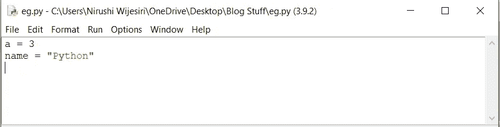
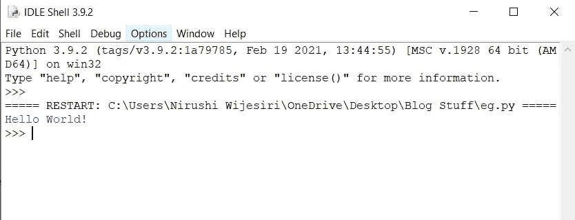

# Python 中的语句和注释

> 原文：<https://medium.com/analytics-vidhya/statements-and-comments-in-python-27af8cefa52?source=collection_archive---------6----------------------->


当你用 python 写程序时，特定的代码是一行一行写的。这意味着在你的代码中有一些句子。根据将这些句子添加到代码中的原因，这些句子可以分为两大类。

为了方便起见，我将它们命名为 **Python 语句**和 **Python 注释**。

# Python 语句

您在代码中编写的并且一个 **Python 解释器**可以执行的指令被称为语句。

等等什么！Python 解释器？那是什么？


让我跟你说清楚。

Python 解释器只不过是一个将 Python 语言转换成机器语言的转换器。你电脑的硬件显然看不懂 Python。因此，必须有某种东西让计算机明白你想用你的 Python 代码做什么。这基本上是由 Python 解释器完成的。小菜一碟！

仍然不知道什么是真正的 Python 语句？

放心吧！救援马上就到！

我们举个例子。



在上面的例子中，我写了两条语句。第一个是 a = 3。第二个是 name = "Python "。

我怎么发现 a = 3 和 name = "Python "是两个不同的语句？为什么它们不能是一个完整的声明？答案如下。

> "在 Python 中，语句的结尾由换行符标记."

我就是这样知道有两种不同的说法。

但是，如果我想用多行写一个语句呢？


没问题！您只需使用行继续符(\)。我给你看一个例子。

```
a = 1 + 3 + 5\
    + 7 + 9 + 11\
    + 13 + 15
```

现在，当解释器读取你的代码时，它得到的不是三个不同的语句，而是一个完整的语句。此外，它忽略行继续符(\)，并将其视为“a = 1 + 3 + 5 + 7 + 9 + 11 + 13 + 15”。

您也可以使用括号( )、方括号[ ]和大括号{ }来做完全相同的事情。

```
a = (1 + 3 + 5
    + 7 + 9 + 11
    + 13 + 15)

       ora = [1 + 3 + 5
    + 7 + 9 + 11
    + 13 + 15] ora = {1 + 3 + 5
    + 7 + 9 + 11
    + 13 + 15}
```

一行多语句怎么样！


轻松点。就用分号；将语句分隔如下。

```
x = 1; y = 2; z = 3;
```

关于 Python 语句已经说得够多了，让我们来了解一下 Python 注释。

# Python 注释

注释不过是 python 解释器忽略的句子。

如果 Python 解释器忽略了它们，它们就不是用来执行程序的，对吗？如果不用它们来执行程序，我可以不用它们来使用代码，对吗？那么使用评论有什么意义呢？浪费时间？呸！


是时候理解为什么代码中必须有注释了。

注释在你的代码中占了很大一部分。python 解释器确实会忽略注释。那又怎样！我们用 python 代码写的所有东西不一定是解释器能理解的。你可以在代码中添加一些信息、定义或解释，以便其他人理解你在代码中做了什么。相信我，有时候你自己也不会理解你几周前自己写的代码！

所以你看，评论很重要。

现在让我们看看如何在 python 代码中添加注释。

在 Python 中，我们使用散列( **#** )符号开始编写注释。它一直延伸到换行符。让我展示给你看。

```
#this is a comment 
print("Hello World!")
```

当您运行这段代码时，输出如下。



如你所见，评论部分被忽略了。此外，在您开始新的一行之后，哈希也不会应用于其余的代码。

同样，如果我想添加一个多行的注释呢？


放心吧！实际上有三种不同的方法可以做到这一点！

首先，您可以在将被视为注释的每一行前面添加散列(#)。

```
#I start my comment from this line...
#still the comment...
#still the comment...
#okay finished :)
print("Hello World!")
```

第二，可以在单引号(' ')中使用三重引号。

```
'''I start my comment from this line...
still the comment...
still the comment...
okay finished :)'''
print("Hello World!")
```

第三，可以用双引号(" ")加三引号。

```
"""I start my comment from this line...
still the comment...
still the comment...
okay finished :)"""
print("Hello World!")
```

使用上面提到的任何一种方法，你都可以使你的代码清晰明了。

**别忘了！评论很重要！**

这里我们已经到了这篇文章的结尾。记住，Python 已经成为世界上最流行的编程语言之一，也是最容易学习的。它需要的只是你的决心和关注。继续工作，永不放弃。你能行的！祝你好运！

