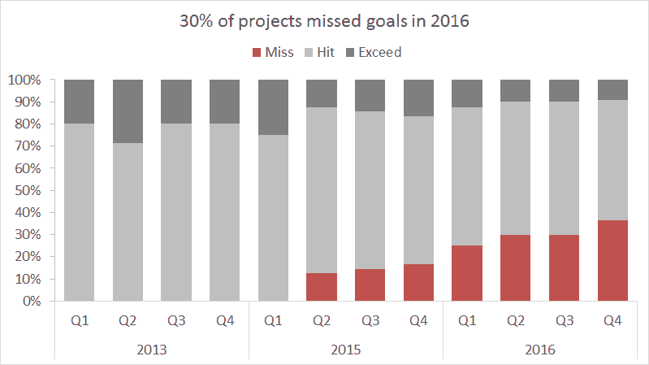
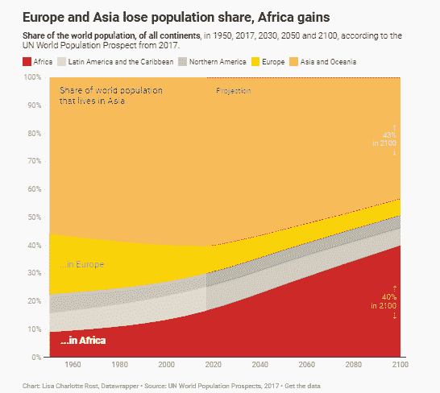

# 统计图以及在哪里制作统计图

> 原文：<https://medium.com/analytics-vidhya/statistical-graphs-and-where-to-make-them-3e66e27edab4?source=collection_archive---------5----------------------->

安东尼·什克拉巴摄于 [pexels](https://www.pexels.com/photo/person-holding-black-remote-control-5816298/)

## *“卓越的图形是在最短的时间内，用最少的笔墨，在最小的空间里，向观众传达最多的思想。”* —爱德华·塔夫特

*写于 2021 年 3 月*

真正的数据展示者和搜索者都面临着挑战，因为在无意识滚动的时代，短格式的内容更受欢迎。这就是理解图表变得神奇的地方。如果使用和理解得当，图表可以轻松地传递复杂的故事，因为它们系统地强调了数据中值得注意的部分。在疫情，当我们通过偶尔出现在屏幕上的铺天盖地的统计数据来思考健康危机的程度时，这最终是一项需要及时学习的技能。

此外，一项研究表明，我们的大脑处理图像的速度通常比处理表格或文本快 6 万倍。同一项研究发现，在接触数据 3 天后，他们的受试者保留了 65%的视觉信息，相比之下，书面或口头形式的视觉信息仅保留了 10%至 20%。因此，如果你想在本世纪传达一个信息，或者只是作为一个普通的媒体消费者，熟悉统计图表以及何时适合使用特定类型是必须的。因此，准备好你的笔记系统，因为这本书将带你到图表的逻辑，主要图表格式的基础，以及给非程序员学生的数据可视化工具建议(除了 Excel 和 SPSS)以及它们的最佳使用和缺点。

> "总有一天，统计思维会像读写能力一样成为高效公民的必要条件."—赫伯特·乔治·威尔斯

# **你如何知道自己是否选择了正确的产品？**

幸运的是，有了图表，就有了“正确的那个”这样的东西在了解图表格式的本质之前，必须首先了解细分为测量类型的 **2 种数据，因为**它们将决定哪种图表适合于所描述的数据**。它们是:**

## **一、量化数据**

*从词根本身来看，这些是使用数值阐明结果或趋势的数据。它被分解成以下几个部分:*

a.**离散** —包含整数(0，1，2，3…) *的数据，例如*传播研究系的学生人数。

b.**连续** —可以在一个区间内得出数值的数据，例如，长度，如回答一个考试所用的时间(23-51 分钟)。

> **定量测量用于数据关系，如查看相关性、偏差、时间序列和分布。**

# **二世。定性数据**

*这与质量数据相反，是基于非数字特征的，可以:*

a.**分类**——只对对象进行分类而不遵循固定顺序的数据，*如*性别。

b.**序数** —从单词本身来看，数据遵循逻辑顺序或次序*，例如*社会经济地位(高、中、低)。

> 定性测量用于排名、名义比较、部分和全部关系(特定类别的百分比)

## 因为不同的数据可视化服务于不同的目的，所以有必要从那里开始。现在，这里有 8 种可以将数据转化为信息的常见格式，它们的种类和优点，以及适用的数据关系:

# **统计图表**

## 1.**条形图**

此图最适合于显示与 y 轴上代表的值一致的分类数据的高点和低点。它经常与直方图混淆(稍后会详细介绍这种类型)，因为它们都使用矩形条。然而，除了条形图是为**分类和离散数据**而设计的，另一个区别是**条形图要求类别之间的空间大约为条形宽度的四分之一**。最好是**让观众一目了然的看到对比，突出数据集**的量级(*用长方形的长度表示)*。它也有**众多类型和自己的强项。**

**类型**:简单、分组、细分、100%细分、水平、净偏差、连接柱形图。

**分组条形图—** 如果分类变量之外还有分组变量，效果最佳。

**来源:**疾病预防控制中心。(2020).2019 年冠状病毒疾病患者的严重后果(新冠肺炎)-美国，2020 年 2 月 12 日至 3 月 16 日。[https://www.cdc.gov/mmwr/volumes/69/wr/mm6912e2.htm](https://www.cdc.gov/mmwr/volumes/69/wr/mm6912e2.htm)

**细分或成分条形图—** 适用于显示类别总量中每一种类的贡献

**来源:**[https://www . internet geography . net/divided-bar-charts-in-geography/](https://www.internetgeography.net/divided-bar-charts-in-geography/)

**100%堆积或细分条形图** —与之前的细分条形图类似，但**显示的是合计为 100%的类别的相对百分比**。它就像一个饼状图(*稍后详述)*但也可以显示数据的比例如何随时间变化:

来源:[https://exceljet.net/chart/project-goal-attainment](https://exceljet.net/chart/project-goal-attainment)

**水平条形图** —类似于简单条形图，但适用于**或类别标签太长而无法在 x 轴上显示的情况**。

**来源**:[https://www.mekkographics.com/covid-19-cases-by-country/](https://www.mekkographics.com/covid-19-cases-by-country/)

****象形图**与条形图具有相同的概念，但使用图片、符号或图标代替条形图来最好地表达概念或想法:

来源:联合国。(2020).联合国:紧急时期的紧急解决方案。[视频文件]。访问:[https://www.youtube.com/watch?v=xVWHuJOmaEk&t = 723s](https://www.youtube.com/watch?v=xVWHuJOmaEk&t=723s)

## **2。饼状图**

正如您所熟悉的，饼图由一个圆圈组成，该圆圈被分成不同的类别，类别的大小以百分比分布的形式表示总数的一部分。统计学家和数据科学家坚持认为，饼状图不能被细分成五到六个以上的数据组，以避免拥挤和误导可视化。应根据比例最大的震级**从 12 点开始绘制。**

**分解饼图—** 表示**突出显示**某个特定部门。

2007 年 IPCC 报告温室气体排放饼状图:2007:使用 Python 的气候变化。访问此处:[https://scipython . com/book/chapter-7-matplotlib/examples/a-pie-chart-of-green-gas-emissions/](https://scipython.com/book/chapter-7-matplotlib/examples/a-pie-chart-of-greenhouse-gas-emissions/)

**圆环图—** 该变体用于**在中间**显示附加数据。

**来源:**做数据。如何在 Tableau 中创建一个圆环图？访问:[https://www . doing data . org/blog/how-to-create-a-donut-chart-in-tableau](https://www.doingdata.org/blog/how-to-create-a-donut-chart-in-tableau)

**PIE OF PIE —** 这种变化通过**另一个附加到其上的饼图来扩展一组值，以表示更多类别，而不会使图形拥塞**。如果您有 6 个以上的类别，这是您的最佳选择。

资料来源:Formplus (2020 年)。饼状图:类型、题例+【Excel 指南】。访问:【https://www.formpl.us/resources/graph-chart/pie/ 

帕累托图 —这个图很好地展现了条形图和饼图的优点。它通过条形显示频率分布，并使用与右侧指定的百分比值成比例的线条显示百分比。

Lark Gabrielle Rogan 在 MS Excel 中制作的帕累托图

**4。直方图**

直方图与条形图的主要区别在于它能够呈现连续的变量。此外，每个条形的底部与它所代表的区间宽度成比例，因为不仅计算 x 轴指示的标签内的数据(*例如*“100”、“95”、“90”…)，还计算条形表面下的整个数据点簇(*例如*104.99–100、99.99–95、94.99–90)。因此，它不要求条形之间有空格，也不适用于分类变量。直方图提供了基于所研究特征的样本或总体分布概况。

**Marvin Talan 在 DataWrapper 中制作的直方图。**

**5。折线图**

通过**绘制 tim** e 上的一系列数据点，折线图**代表数量**随时间的变化。它们尤其有利于识别数据的关系、加速和易变。

访问:[https://www.nature.com/articles/d41586-020-01136-8](https://www.nature.com/articles/d41586-020-01136-8)

**面积图** —面积图是折线图的延伸，比折线图更强大，面积图不仅表示时间序列的关系，而且**说明并强调数据量**。这是通过填充线下的区域来完成的。它可以是常规、堆积和百分比堆积面积图，就像条形图一样。它们唯一的区别是条形图是用来比较数值的，而面积图是用来显示数值如何随时间变化的。

阅读更多:[https://blog . data wrapper . de/Area-charts/#:~:text = Area % 20 charts % 20 have % 20 axes % 20 with，% 3B % 20 column % 20 charts % 20 don t。&text = Also % 2C % 20 读者% 20 将% 20 识别% 20 更快，分享% 20 而不是% 20 的% 20 绝对% 20 价值。](https://blog.datawrapper.de/area-charts/#:~:text=Area%20Charts%20have%20axes%20with,%3B%20column%20charts%20don't.&text=Also%2C%20readers%20will%20recognize%20faster,shares%20instead%20of%20absolute%20values.)

**6。散点图或 X-Y 图**

散点图使用点绘制一对数值数据，每个变量位于两个轴上。这是**最能说明关系或缺乏关系的**。散点图的一个最大优势是**它们可以指出离群值**或违反整个数据集逻辑的数据点。

**我们的数据世界。(2020).测试的规模与爆发的规模相比。访问:**[**https://ourworldindata.org/coronavirus/country/philippines**](https://ourworldindata.org/coronavirus/country/philippines)

**7。气泡图**

气泡图**通过强调图表中分散的数据扩展了散点图的功能，因为它允许点的大小根据数据的大小而变化**。如果适用的话，气泡可以简单地被标绘或合并到气泡图中。

**已故的汉斯·罗斯林爵士热情地展示他的全球人口增长泡沫图。资料来源:**特德(2010 年)。汉斯·罗斯林:全球人口增长，一个接一个。[视频文件]。如果你想要数据作为治疗，请访问这里:[https://www.youtube.com/watch?v=fTznEIZRkLg](https://www.youtube.com/watch?v=fTznEIZRkLg)

8。CHOROPLETH 地图

地图是众所周知的专题地图，或者是在选定的地理区域内被研究的变量如何变化的简单可视化。它需要连续的数据，并使用颜色和阴影来表示震级，阴影越暗，震级越高。

资料来源:世界银行。(2019).人均国内生产总值(现值美元)。访问:[https://data.worldbank.org/indicator/NY.GDP.PCAP.CD？视图=地图](https://data.worldbank.org/indicator/NY.GDP.PCAP.CD?view=map)

其他图表包括**盒须图**(最适用于显示数据集的分散性和检测偏斜度)**漏斗图**(最适用于显示过程中每个阶段的进度)**茎叶图**(几乎类似于条形图，最适用于组织离散和连续数据)**树形图**(适用于以层次或基于树的方式对数据进行分组)**甘特图**(便于计划和安排项目)、 **瀑布图**(依次查看变量的正值和负值的累积效应)**热图、时间序列、雷达图**，不胜枚举！

**在哪里制作:**

作为一名传播学研究者，我大部分工作只用过 Excel 和 SPSS。然而，最近当我发现**有数百个应用程序和脚本可以处理大型数据集并使用它们创建交互式可视化时，这让我着迷**！数据可视化的初学者通常从静态可视化*开始，这在社交媒体信息图中很常见，或者作为讲义打印出来，用户无法超出它所呈现的视图。鉴于 ***交互式可视化*** 要求应用程序或现代数据分析软件允许用户探索特定数据点，并根据他们喜欢的可视化故事操纵图表。*

***交互可视化示例**:*

**

*来源:约翰·霍普斯金冠状病毒资源中心新冠肺炎全球地图仪表板。访问这里:[https://coronavirus.jhu.edu/map.html](https://coronavirus.jhu.edu/map.html)*

*因此，如果你和我一样，在这个疫情期间正在寻找一些在家探索，这里有一些**学生友好的(和非程序员)数据可视化工具**你可以免费**访问和探索***:**

**1. **TABLEAU PUBLIC****

**Tableau Public 是 Tableau Desktop 的**免费版本，对于任何开始喜欢数据交互的人来说都是一个不错的选择。它可以连接到 Excel、Google sheets、SAS、SPSS 和 R 等，但无法连接到 MySQL、Amazon Redshift、Google BigQuery 等主要数据库。它的开放接口最初提供(但不限于)创建文本表、热图、高亮表、符号图、饼图、树状图、不同的条形图类型、圆形视图、不同的线形图、面积图、直方图、盒须图、散点图、子弹图、甘特图和打包气泡，用户可以根据颜色、大小、文本和选择的细节来控制它们。****

****最适合**交互式数据可视化实践**

****CONS**少校:如果你正在处理敏感或个人信息，你应该**而不是**使用 Tableau Public，因为顾名思义，你的工作必须与社区共享。因此，您无法在本地保存，而当您想要在没有互联网连接的情况下访问您的工作时，本地保存是很方便的。此外，您的仪表板将可以通过互联网访问。**

****下载这里**:[https://public.tableau.com/en-us/s/](https://public.tableau.com/en-us/s/)**

****他们的入门教程**:[https://www.youtube.com/watch?v=iT1iHLGawIM](https://www.youtube.com/watch?v=iT1iHLGawIM)**

****预览其干净易用的界面**:**

****

****样本数据可视化**:**

****

**资料来源:新泽西州亚当斯(2020 年)。英国医院因精神健康状况而接收的年轻人。Tableau 公共。访问这里:[https://public . tableau . com/en-us/gallery/uk-hospital-youth-admissions-mental-health-conditions？今日热点](https://public.tableau.com/en-us/gallery/uk-hospital-youth-admissions-mental-health-conditions?tab=viz-of-the-day&type=viz-of-the-day)**

****

**有史以来票房最高的演员的交互式可视化。资料来源:Chapman，C. Toptal。访问:[https://www . top tal . com/designers/data-visualization/data-visualization-tools](https://www.toptal.com/designers/data-visualization/data-visualization-tools)**

**2.坎瓦**

**这个网站实际上是艺术学院学生最好的朋友。Canva 不仅能满足您的审美 Instagram 故事或富有想象力的演示，还能通过其预制模板满足您的图形制作需求——简单且无需安装！如果您不确定哪种类型最适合您要呈现的数据关系，Canva **甚至可以帮助您选择所需的图表。该网站有平衡记分卡、简单条形图、气泡图、比较图、概念图、循环图、决策树、圆环图、生态图、鱼骨图、流程图、甘特图、线图、思维导图等模板。****

****最适合**小型/简单数据、学校/工作报告，或者如果时间有限但需要艺术感染力。**

****CONS 少校**:有限的图形类型选项及其元素控制。此外，它主要是为表示最少的数据而设计的，因为用户不能将其连接到数据库。Canva 也不能产生交互式可视化。**

****访问这里**:[https://www.canva.com/graphs/](https://www.canva.com/graphs/)**

****简单易用的界面预览**:**

****样本数据可视化:****

****

****3。数据包装器****

**想知道《纽约时报》、《卫报》、《连线》、《Vox》或《财富》杂志是如何创建专业的数据可视化的吗？**这款免费且无需注册的工具为他们的精彩故事增色不少！** Datawrapper 设计用于在新闻网站上直接嵌入交互式图表、地图和表格。其便捷的界面只需要输入数据，点击“继续”即可创建图表他们的 viz 选项包括 19 种图表类型、3 种地图和数据表(条形图、线图、选举圆环图、面积图、choropleth 图、散点图、定位图等)——所有这些都是交互式和响应性的！**

****最适合****免费计划适合小型新闻网站**，例如，不需要代码或设计技能的学校出版物！**

****主要 CONS:** 数据来源有限(主要方法是在站点上复制粘贴数据)。**

****访问这里:**https://www.datawrapper.de/**

****工作流程预览:****

****

****样本数据可视化:****

********

**还有其他数据可视化工具，包括 Google Charts、Polymaps、D3.js、Chart.js、Sigmajs 和 Chartist.js，但它们需要编码和编程方面的知识(有些非常基础)。然而，没有必要了解所有的数据可视化工具，必须考虑哪些工具最有效、最方便，以及哪些工具为特定类型的工作提供了必要的属性。**

**我希望你对数据可视化有很好的欣赏和理解！**

****参考文献**:**

**[1]查普曼，C. (2018)。最佳数据可视化工具的完整概述。检索自:[https://www . top tal . com/designers/data-visualization/data-visualization-tools](https://www.toptal.com/designers/data-visualization/data-visualization-tools)**

**[2]马蒂亚斯，M. (2020 年)。想象一下！数据可视化综合指南。Netquest。**

**[3]埃利森，K. (2019)。*统计图表类型*【讲座】。从菲律宾理工大学检索的统计学应用于传播研究。**