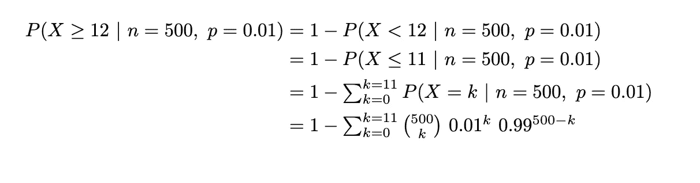

# 贝叶斯和频率主义方法中的统计推断

> 原文：<https://medium.com/analytics-vidhya/statistical-inference-in-bayesian-and-frequentist-approach-530b58ed22f3?source=collection_archive---------16----------------------->

> 我正在阅读一篇关于标签一致性在机器学习系统中的重要性的文章，一个自然的问题进入了我的脑海——我们如何测试数据的一致性？在本文中，我设计了一个简化的场景来讨论在贝叶斯和频率主义方法中使用统计推断的解决方案。

**问题描述** 我有一个数据集，包含 100 个类别的 1，000，000 张图片，但是它们没有标签。我是唯一一个在这个项目上工作的人，所以我决定聘请一家数据标签公司来为我做这项工作。在美国标记这么多图像的合理价格是 25，555 美元(基于[谷歌数据标记服务](https://cloud.google.com/ai-platform/data-labeling/pricing))，我被承诺标记工作的正确率将是 99%。这是一大笔钱，所以在我收到标记的数据后，我想检查它们是否达到 99%的准确性。我该怎么做？

**数据** 为了测试标记工作的准确性，我从数据集中随机抽取了 500 张图片，并手动检查每张图片的标签。我发现有 12 张图片分类错误。我能从这些实验数据中得到什么？

在我们继续讨论之前，有必要提一下我们对实验数据所做的一个假设。与 1，000，000 人口规模相比，500 样本规模非常小，因此我们将假设每个样本是独立的同分布随机变量(i.i.d)。

**一种 Frequentist 方法** 在 Frequentist 框架中，我们可以使用数据进行假设检验，并计算 p 值。p 值是在假设零假设为真的情况下，在替代假设的方向上观察到至少极值的概率。我们将假设如下。

H0(零假设) :标签的准确率是 99%。
H1(替代假设) :标签的准确率低于 99%。

我们将测试的显著性值(alpha 值)设置为 0.05。

现在我们假设标签工作的准确度是 99%，我们需要计算 P 值。但是怎么做呢？假设工作的准确率为 99%，在 500 个随机样本中观察到 12 个错误分类的图像甚至更多的概率是多少？

嗯，我们可以把从人群中抽取一张图片看作伯努利过程。样本空间可以定义为{正确，不正确}，观察到不正确分类图像的概率 P = 0.01。然后，我们可以将 500 个随机样本 X 中错误分类的图像数量视为一个随机变量，它遵循二项式分布。因此，我们有下面的等式。

可以使用下面的代码在 R 中计算这个等式。

我们的 p 值是 0.005208，这意味着如果我们的零假设为真，即标记工作具有 99%的准确性，我们有 0.005208 的概率在大小为 500 的随机样本中观察到 12 个或更多错误分类的图像。这个 p 值明显小于我们的 alpha 值 0.05。因此，我们将拒绝零假设，因为样本测试提供了足够的证据反对零假设。

从 Frequentist 方法得出的结论是，标记工作的准确率低于 99%。

**贝叶斯方法** 在贝叶斯范式中，我们也需要设定假设，但它与频率主义方法略有不同。贝叶斯假设，通常称为先验，是产生实验数据的可能模型。在我们的例子中，先验指的是在我们开始实验之前所有可能的准确性的可能性。然后，在我们有了每个精度的先验之后，我们将计算在每个精度下的实验中观察到这样的数据的可能性。在我们的例子中，它是在每个精度值下，在 500 个随机样本中观察到 12 个错误分类图像的可能性。最后，使用贝叶斯定理，我们可以计算每个精度值的后验分布，这是给定我们观察到 12 个错误分类图像的每个精度的可能性。在给定数据的情况下，具有最高后验概率的精度值将是我们对真实精度的最佳猜测。

在贝叶斯推理中，先验分布是在一些证据被考虑之前，一个人对一些量的信念。在我们的案例中，我们感兴趣的是标签工作的真正准确性。在我们的样本测试之前，我们对工作的准确性了解多少？公司向我们承诺准确率为 99%，但我们并不完全信任它。我们也知道，鉴于该公司的声誉，标签工作的准确率不太可能低于 90%。鉴于我们所拥有的知识，我将设置我们的先验分布如下。我给 99%的准确度 0.5 的先验，因为这是公司的保证，并且我在所有其他可能的准确度值中平均分配另外的 0.5。所有先验的总和应该等于 1。

接下来，我们将计算在每个精度值下观察到此类数据的可能性。同样，这个过程可以被视为伯努利过程。例如，如果精度为 0.1，那么在 500 个随机样本中错误分类的图像数量遵循二项式分布，其中 n = 500，p = 0.9。与频率主义方法的一个重要区别是，在贝叶斯方法中，观察至少极端数据的想法消失了。似然是每个模型下观察到确切实验数据的概率(精度值)。

以下是每种准确性的可能性。

现在我们可以计算证据，P(数据)= sum(先验*似然)。之后，我们可以使用贝叶斯公式计算后验概率的值。结果如下所示。

从结果来看，acc=0.99 的后验概率仅为 0.144，而 acc 的后验概率<0.99 is 0.856\. Hence, we can conclude that it very likely the accuracy of the labelling work is below 99%. This conclusion aligns with our conclusion from the Frequentist approach.

Below is the complete R code for the Bayesian inference.

**结论** 从频率主义方法和贝叶斯方法我们得出结论，标记工作的真实准确度低于 99%，这一点都不令人惊讶。直观来看，如果准确率为 99%，错误分类图像的期望值 n = 500 * 0.01 = 5，但我们观察到的是 12。所以我们知道准确率很可能低于 99%。事实上，如果我们仔细看看后验表，我们可以发现 97%和 98%的准确性具有最高的后验概率。在这些精度下，错误分类图像的预期数量分别为 15 和 10。我们观察到的是 12，介于两者之间，但更接近 10。这就是为什么 98%的准确率有最高的后验概率。

在本文中，我们对贝叶斯推理中的频繁者推理做了简单的比较。然而，有几件事我们现在还不能回答。例如，我们对自己的结论有多少信心？如果我们只是对图像的一个坏的部分进行采样，而实际上这项工作的总体准确率是 99%，会发生什么呢？我将在下一篇文章中解决这些问题。感谢阅读！