# 发展商业策略中数据分析的统计学习工具

> 原文：<https://medium.com/analytics-vidhya/statistical-learning-tools-for-data-analysis-in-developing-business-strategies-69184bf943bc?source=collection_archive---------13----------------------->

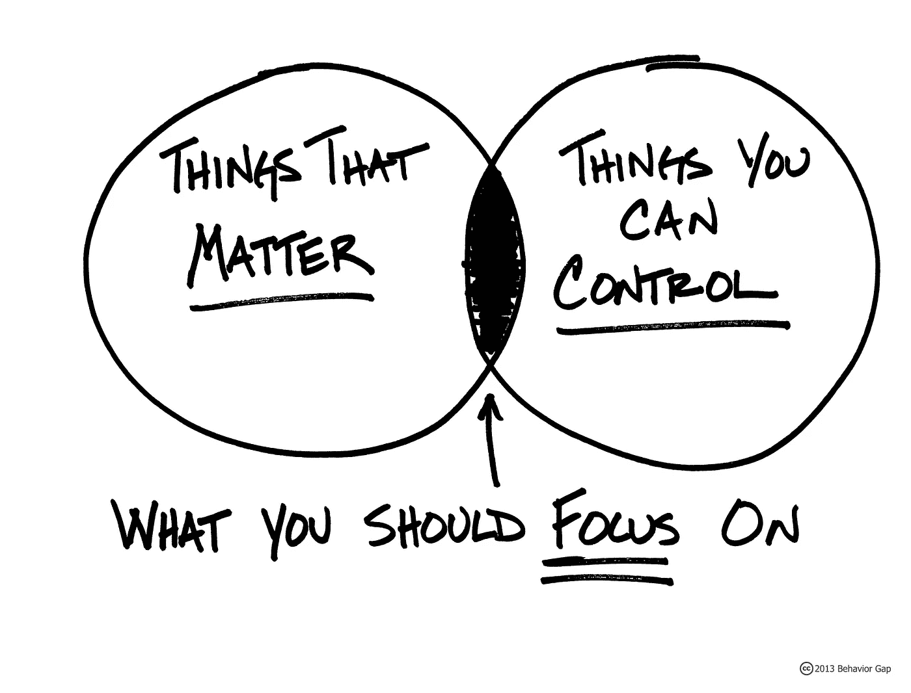

**摘要**

对于任何企业来说，理解价格的变化与预测价格的准确性同等重要。换句话说，企业高管应该知道“重要的事情”，而“你可以控制的事情”应该是先验知识。为了在这一领域取得成功，我们应该尽最大努力在预测因素和因变量之间建立可能的联系，并理解这种关系的本质。有各种各样的统计学习工具来传达这种分析，但最适合高度扭曲的定价数据的工具之一是分位数回归，它允许以与 ols 回归相同的方式进行推断，但没有线性回归所需的所有那些严格的假设。

**简介**

基于南美洲几个国家的房地产(REP)数据集，我想说明分位数回归可能是从这种复杂环境中获得推论的关键工具，在这种复杂环境中，目标是非正态的、高度偏斜的随机变量，要素是混合类型的，来自不同的分布，并且与目标没有线性联系。此外，所描述的价格预测方法可能对真实的国家机构、开发公司、定制房地产代理等有很大的兴趣。

通过分析要回答的第一组问题如下:

*   Q1:“房间数量和房产总面积哪个更有价值？”
*   Q2:“快速‘售出’的房产有什么主要特征？”
*   问题 3:“靠近海岸的位置是否会使销售代表的价格更高？”
*   问题 4:“城市的犯罪指数如何影响代表价格的水平。”
*   问题 5:“城市的污染指数对价格重要吗？”
*   问题 6:“是他们的一组关键词，短语，使价格更高。”

当然，我们需要回答这样一个问题:“根据广告中给出的信息，我们能对特定公寓的价格做出多准确的预测？”对于这种类型的数据，什么算法可以产生最低的预测误差？

**数据**

初始数据集代表来自南美 5 个国家的房地产广告的集合。进行了大量的数据准备和转换:

*   当地货币被转换成美元价格；
*   使用提供的地理数据计算到海岸的距离；
*   增加了 8 个附加功能，如“犯罪指数”、“医疗响应”、“污染指数”；
*   大多数城市的人口数值是从两个网站上获得的。(*参考资料中提供了网站链接。)*

数据清理前的观察总数为 474682。之后:

*   删除重复项(包括可能的相同扁平件但具有不同描述，或者相同描述但不同扁平件特征)；
*   剔除明显的异常值(如 5000 万英镑的公寓，或有 2018 间卧室的公寓，或位于南极洲的公寓)；
*   移除具有不一致的平面特征的观察(例如，当卧室的数量大于房间的数量时)；

我带着 379123 个观察结果离开了。

对相关性的分析表明，价格仅与 surface total 和 surface covered 具有强相关性，这两者都是高度相关的，所以我可以说只有“surface_total”直接影响价格。另一方面，表面总面积与房间、浴室和卧室的数量有很强的相关性——所以很难凭视觉判断什么“更重要”。但显然，他们不是独立的。

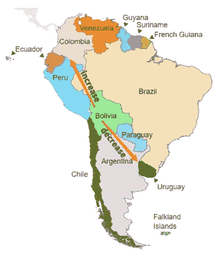

令人惊讶的是，我们可能会发现地理数据和卧室数量之间的相关性-从南美洲西部到东部，每套公寓的卧室数量减少，从南部到北部增加。这可以用不同国家历史上确立的建筑原则的可变性来解释。计算出的 5 个国家每套公寓的平均卧室数量证实了这种相关性:秘鲁、厄瓜多尔和哥伦比亚(西北海岸)每套公寓平均有 2.5-2.7 个房间，而阿根廷和乌拉圭(东南部)相应地为 1.6 和 1.9 个房间。

此外，还发现了以下情况:

*   数据来自 686 个城市；
*   阿根廷和哥伦比亚占所有观测的 84%;
*   20%的广告是针对 5 个首都城市的公寓；
*   几乎 20%的城市(686 个中的 120 个)只有一个广告。

通过对特征的粗略回顾，我总结出三种类型:“平面的”、“城市的”和“文本的”。最后一个是广告的描述和标题。“公寓”特征代表房间、浴室、总面积等的数量，“城市”特征描述该公寓所在的区域:人口、地理数据、污染、犯罪等。这就把我们带到了进一步解释性数据分析(EDA)的第一个任务:城市间的差异和公寓特征的差异可以解释多少可变性。但是在转移到 EDA 之前，有一些关于目标变量和丢失数据的文字。

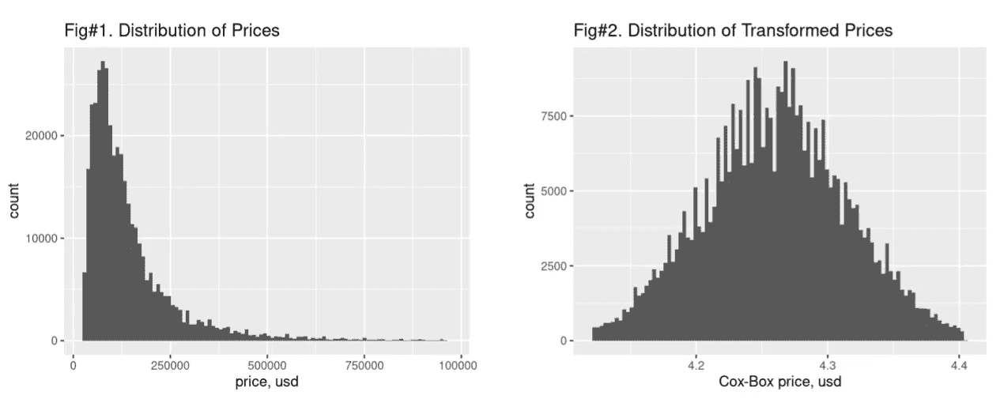

图 1 清楚地表明，价格是非正常的高度偏斜随机变量(RV)。使用 Box-Cox 变换，我们可以获得正态分布的 RV(图 2 ),这对于从线性模型中获得推论是有用的，但是对于预测是无用的，因为误差大于模型在原始值上训练时的误差[1 ],因为对于:

> “标准回归，当应用于转换响应的预测平均值时，逆转换不预测响应的平均值”[6]:

但是对于分析来说，最重要的问题似乎是丢失的数据:在清理之后，留下了 38 万个观察值，但是只有 19 万个观察值的行是满的。此外，5 个国家中的 2 个被删除，686 个城市中只有 14 个城市被留下进行分析(在完整的数据行内)。

**缺失值插补**

一般而言，应小心填写缺失数据(见“盲数据插补”)，因为这种行为会破坏特征的基本分布[2，3]。运行相关表的分析并考虑 NaN 值的百分比，我决定从“rooms”特性开始数据恢复(NaN 的 38%)。由于受到 NaN 值的限制(预测值必须与“房间”具有较低或相似的 NaN 值比率)，我得出了以下一组高精度预测公寓房间数量的特征:浴室、卧室、价格、资本、国家。是的，尽管“房间”应该是价格的预测值，但在估算过程中，价格作为房间数量的预测值非常有用，这是合法的[3]。

由于“房间”功能可以被视为分类变量和整数(数字)变量，最初我使用简单的线性回归(LR ),舍入到整数预测，这种方法在测试集上给出了 0.911 的准确度。但是有可能得到超出数据集中房间范围的预测，因此多类分类更适合这种情况。我使用了“catboost”库提供的梯度提升机器，因为它专注于优化分类变量的决策树[4](“国家”和“首都”在模型中使用)。它显示了与 LR 相同的精度(0.912)，但是，由于它是分类，我得到的类别(房间数)正好在所见数据范围内。

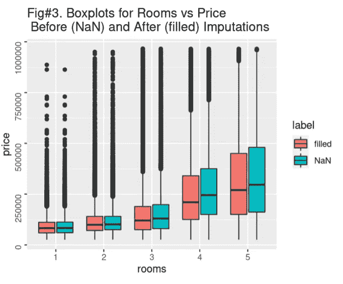

这种插补将“房间”中缺失值的比例从 38%降低到 20.7%，在对数据(包括新值)进行洗牌后，新的训练测试过程显示分类的准确度为 0.923:这可能是插补没有改变数据联合分布的证据。为了进行最终检查，我比较了初始数据和新数据的“房间/价格”对的箱线图:在图 3 中，我们可以发现，只有对于有 4 个房间的公寓，可能在分布上发生了明显的变化，但总的来说，新数据看起来和以前一样。

我恢复丢失值的下一个特征是“surface_total”:由于这个变量的偏态分布，这个任务看起来更加复杂。考虑到这一点，在尝试了不同的方法(OLS、均值聚类、梯度推进回归等)后。)，我选择了具有 8 个特征的“catboost”GBM 回归器作为总表面的预测器:房间、浴室、价格、首都、国家、经度、纬度、到海岸的距离。

这种方法给出了最低的平均绝对百分比误差(MAPE)，更适合于[10]对这种目标的解释。标准均方根误差(RMSE)给出了一些难以理解的误差值:假设我们知道总表面的预测 RMSE 是 30 平方米，但对于 50 平方米的公寓来说，这太大了，而对于 300 平方米的公寓来说又很小。例如，10%的 MAPE 给出了一个更清晰的值，它告诉我们，平均而言，我们错过预测的百分比是多少:相应地是 5m2 和 30 m2。

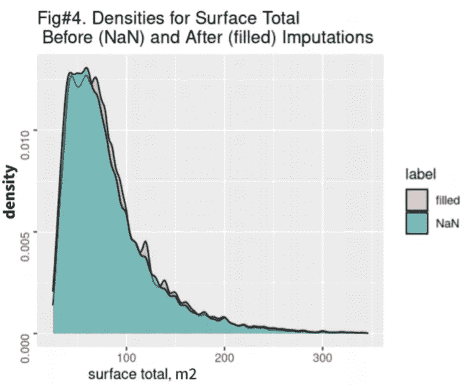

因此，错过值的比例从 53%下降到 23.8%。在图 4 中，我们可以观察到估算数据的分布与初始数据完全相同。

此外，“表面覆盖”和“卧室”的功能被恢复。由于插补过程，使用 123，000 个完整数据观测值成为可能。

**方法。推论。线性混合效应模型**

在数据探索过程中，由于“城市”因素导致价格差异的假设出现了。为了理解这一特征对价格变化的影响程度，我使用了线性混合效应模型。它提出了一组假设[5],其中包括:数据点的独立性以及预测值和响应之间的线性关系。为了满足这些要求，我只选择了“surface_total”作为价格的预测值，因为所有“平面”特征都不是相互独立的。为了使表面和价格之间的关系是线性的，我对两者都应用了 Box-Cox 变换。该模型可以表示如下:

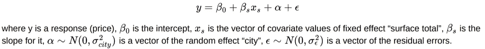

模型的输出表明，随机效应的方差为 0.002519，残差的方差为 0.000895，因此几乎 74%的价格方差可以由城市差异来解释。但是根据“正态 Q-Q 图”,残差不是正态分布的，图“拟合与残差”表明残差的同质性假设不满足，因此我们是否可以依赖线性混合效应模型的结果是一个公开的问题(最近的研究证实了这种模型的稳健性，即使违反了分布假设[5])。无论如何，我在进一步的分析中牢记这一事实，并尽可能使用提供的地理数据检查城市对预测者行为的影响。

当“城市”特征是固定效应而“房间”是随机效应时，执行相反的分析，显示由“房间”解释的方差比例“恰好”是 36.67%，并且在这种情况下残差完全符合 QQ 图中的对角线。这也告诉我们，城市间的差异对公寓的定价非常重要。

**分位数回归模型**

非独立特征、它们与目标之间的非线性关系、价格的偏斜和非正态分布违反了使用线性回归进行推断的可能性:特定预测值在改变价格中有多重要。但是我们可以使用分位数回归，它不对分布做任何假设，可以表示如下:

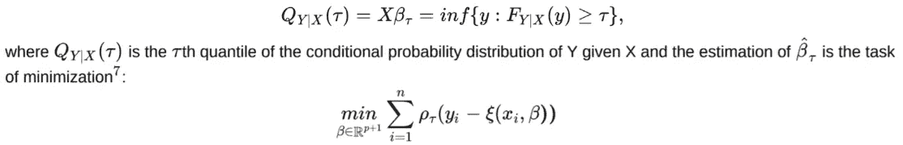

由于分位数回归(QR)仍然建立在概率基础上，这允许我们进行各种统计推断(显著性、置信区间等)。)这是我们通常对 OLS 做的，但跳过了线性回归的严格假设。

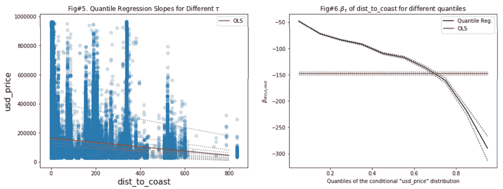

让我们从到海岸的距离作为价格预测因素的重要性这个问题开始。在图 5 中，我们可以观察到用一个预测值(“dist_to_coast”)和截距拟合简单 QR 的结果:为不同价格分位数(黄色表示 0.45 分位数和 0.55 分位数)估计的斜率范围(虚线)。此外，还增加了 OLS 坡度。上面的虚线是 0.95 分位数回归线，它告诉我们，在概率大于或等于 95%的情况下，我们可以预计直接位于海边的公寓价格将低于 400，000 美元(有一些偏差)，另一方面，距离海岸 800 公里的公寓价格将低于 200，000 美元。这种趋势对于所有分位数都是固有的，这是到海岸的距离是一个重要特征的有力证据(除了回归分析表中的低 p 值)。图 6 显示了系数(特定分位数的β)如何根据价格的不同分位数而变化:对于较低的价格，远离海岸 1 公里的“惩罚”仅为 50 美元，而最昂贵的公寓每 1 公里将损失 300 美元。

但是，请记住，价格差异的大部分可能是由于城市的差异，我将公寓的模型地理数据(经度和纬度)添加到模型中，这可以解释为与特征“城市”相同。但是，地理数据具有一些优势，因为它对邻近城市具有概化效果，并且当这些城市仅由一个观测值表示时，如果这是一个巨大的异常值，我们将减少此类观测值产生重大影响的机会。

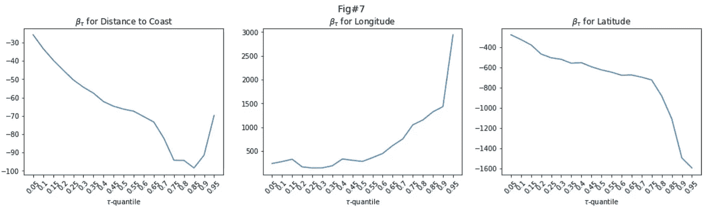

在图 7 中，我们可以观察到，添加地理数据减少了距离海岸特征的不利影响，但它仍然很重要。此外，我们可以注意到地理数据对价格的巨大影响——这证实了混合效应模型得出的结论:如果你愿意购买一套豪华公寓(价格在 0.9 分位数),这将使你向经度(从南美洲东海岸到西海岸:从秘鲁和厄瓜多尔到阿根廷和乌拉圭)每增加一度花费 3000 美元，而向纬度(从南到北:到哥伦比亚)移动将使价格降低 1600 美元。使用相同的原理，获得了引言中所述问题的答案(参见“结论”)。

**TF–IDF 变换和岭回归模型**

为了知道哪些关键词和短语子集对价格有强大的影响，我对广告的描述和标题进行了 TF–IDF(术语频率 x 逆文档频率)转换。结果，我得到了具有 150，000 个特征(由 1、2 或 3 个单词组成的短语)的稀疏矩阵，其中协变量是浮点值，表示术语在给定观察中出现的次数乘以逆文档频率[8]。将这个矩阵代入岭回归，就是下面的优化问题[9]:

我获得了以下翻译成英语的热门单词/短语(alpha 罚值使得测试集上预测的 MAPE 最小化):

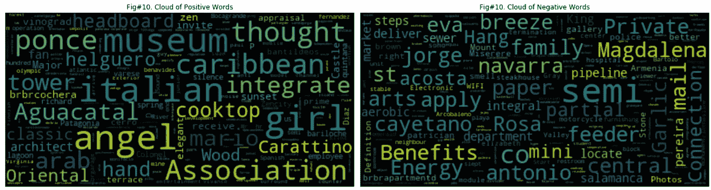

图#10(左侧)表示来自对价格有正面影响的前 10000 个短语的单词云，并且在具有负面影响的单词集中没有发现这些单词。图 10(右侧)——带有文字的云只出现在“负面”部分。快速浏览表明，“积极”云谈论公寓设计(“意大利”、“东方”、“木材”、“建筑师”等)。)、海岸或美丽的景点(“加勒比海”、“大西洋”、“巴塔哥尼亚”等)。)，而“消极”云除了一系列城市(“亚美尼亚”、“普拉亚”、“巴托洛”等)之外，并没有特定的独特主题。)都有提到。

**战法。预测**

正如我从最初的数据分析中得出的结论，特征之间的关系是非线性的、非独立的，并且具有等级结构的迹象，因此使用线性方法进行预测在这里是不合适的(分位数回归的最小化问题也通过线性编程方法解决[7])。无论如何，我包括了这些算法的一些结果，来看看与非线性方法的区别。分析不同的方法，可以在这项任务中使用，并运行一些初步的列车测试性能检查，我得出的结论是，最有效的方法将是梯度助推器。特别是，选择 CatBoost 是因为在最终模型中包含了大量的分类特征。

各种实验的结果如表 1 所示。获得 MAPE 误差的一般框架如下:
*(OLS——普通最小二乘回归，QR——分位数回归，CB——CatBoost，MLP——多层感知器神经网络)*

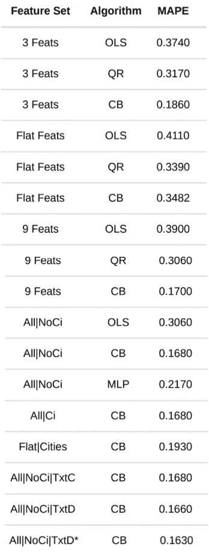

*   最初，基于“usd_price”向量将数据分成训练和测试数据集，以在两个子集中获得相等的分布(所有进一步的分割都使用相同的方法)。
*   然后，基于通过探索部分发现的内容，设置不同的特征子集，基于这些子集对初始训练数据集进行切片，并且在该训练之后，为特定实验创建有效和测试集。对于所有子集，只保留具有完整数据的行。对于分位数回归，使用了大约 10%的数据*。
*   在每个实验中，创建了 100 个不同的训练有效测试集，并应用一种算法来获得误差的分布、它们的平均值和标准偏差。
*   OLS 在训练集上接受训练，在测试集上进行预测；为 10 个不同的分位数训练 QR，对于每个分位数，在验证数据集上获得 MAPE，并基于在验证步骤中实现最低误差的分位数对测试集进行预测；在训练过程中，CatBoost 使用训练集来“增长”模型和验证集，以确定具有评估度量的最佳值的迭代(在我们的情况下为“MAPE”)，因此，使用选项“使用最佳模型”，最佳模型在训练过程中被保存，然后它预测价格；MLP**的运行方式与 CatBoost 类似。

** QR 出现了另一个问题:由于它是一个线性最小化程序，因此需要快速增加计算时间，以便随着数据的增加而收敛。
* *由于 MLP 需要大量的调整时间和巨大的计算能力来处理大数据集，因此只需进行一次设置即可获得结果。为此使用了 Keras 框架。*

**特征子集描述:**

*   “3 个专长”:我开始实验的 3 个特征似乎是分析部分最重要的:表面总量、经度、纬度；
*   “平面技术”:再次检查地理数据和城市特征的重要性，但现在在预测中，使用了以下子集:表面总量、表面覆盖、房间、浴室、卧室；
*   “9 项专长”:为了检查尽可能多的预测值而不丢失大量的观测值(由于数据缺失)，使用了以下特征:表面总量、表面覆盖、房间、浴室、卧室、首都、国家、经度、纬度；
*   “All|NoCi”:使用了所有可用的非文本特征，删除了“city”；
*   “All|Ci”:此处添加了城市的名称，以检查除了已经使用的“城市”功能之外，这些功能是否可以添加新信息；
*   “平坦|城市”:在此阶段，所有“城市”特征(如人口、犯罪指数、到海岸的距离、纬度等)都被删除，仅保留具有“平坦”特征的城市的名称；
*   “All|NoCi|TxtC”:与“All|NoCi”相同，但包括另外 200 个特征:前 100 个正面词和前 100 个负面词的集合(在岭回归中具有最大系数的那些)。它们以如下方式被添加:特定单词/短语在广告中出现的次数被计数，并被添加为该观察的该特征的相应值。正如我们看到的，MAPE 没有增加或减少；
*   “All|NoCi|TxtD”:与“All|NoCi|TxtC”相同，但它们不是表示出现的次数，而是作为虚拟(1/0)变量添加到模型中，这些变量告知特定单词/短语是否存在于广告的标题或描述中(观察)。
*   “All|NoCi|TxtD*”:为岭回归生成的特征总数为 150000，因此将“All|NoCi|TxtD”阶段的文本特征集从 100+100 扩大到 500+500 是合理的。结果很快就出来了:你会发现 MAPE 从 0.166 下降到 0.163。这成为预测“看不见的”测试集价格的最终模型。

从表中可以清楚地看出:

*   线性模型不能降低 MAPE；
*   仅基于“平面”特征(房间数量、表面等)的模型。)比包含“城市”特征的模型表现差。这再次证实了推理分析的结论；
*   如果没有人口、描述城市的各种指数、地理数据等，城市(在模型中以虚拟变量表示的名称)本身更糟。所有这些从不同来源添加的特征在减少误差中起着重要作用；
*   用岭回归定义的对价格影响最大的文本因素，如果作为虚拟变量包括在内，可以改进 CatBoost 模型；
*   最后，在不可见测试集上的 MAPE 是 0.143。这种误差的显著下降可以通过以下事实来解释:使用了更大的训练集(至于最终过程，我只从初始训练分区创建了训练有效集，而测试集是从初始分区创建的，并为最后的预测保留了测试集)，并且 Catboost 训练过程可以获得更多的信息。特征子集如下:' surface_total '，' surface_covered '，' rooms '，'浴室'，' property_type '，' lon '，' lat '，' country '，' capital '，' dist_to_coast '，' CO2Ind '，' population '，' MedResponse '，' believes '，' DrinkWaterPoll '，' PollInd '，' CrimeInd '，' CrimePast3Y '，' HealthCareInd '，加上通过岭回归检测到的 500 个最积极和 500 个最消极的单词/短语。CatBoost 模型中在训练过程中调整的唯一超参数是学习率，所有其他参数都是“开箱即用”的。

**结论**

所进行的分析让我对“简介”中陈述的问题形成以下答案:

**A1** :“房间和总面积都是有价值的。作为单独的预测因素，它们都增加了公寓的价格，但由于都在模型中，房间起到了校正的作用，因为每增加一个房间都会降低价格。

**A2** :“我只知道广告是什么时候添加的，到哪一天为止都是有效的，却不知道具体是什么时候售出的。因此，我不能作出可靠的结论，因为该单位可能在广告结束日期之前出售，该单位可能在广告结束日期之后仍然出售，而且许多广告没有确定的结束日期”。

**A3** :“靠近海岸的位置肯定会让公寓更贵”。

**A4** :“这个问题没有得到明确的答案。这种联系是存在的，但更有可能的是，城市中较高的物价水平是犯罪上升的原因，但反之亦然，这种联系只是这一原因的结果。”

**A5** :“没那么多。分析表明，污染的增加提高了价格，这是不合理的。但是用对待犯罪的同样方式来审视这个问题，我可以说:大城市定义了更高的价格(更多的工作，更高的薪水，对房产更高的需求),因此也定义了更高的污染(更多的汽车，更多的工业，等等)。)

**A6** :“是的。结果发现，描述豪华公寓的单词或短语——“私人电梯”、“更衣室”、“卧室套房”(许多带有单词“套房”的短语位于顶部，因为它意味着“豪华”)，度假城市的名称——谈论更昂贵的公寓价格(图 9)。另一方面，带有“普通”、“工作室”(在“工作室公寓”的意义上)字样的广告描述了廉价公寓(图 8)。

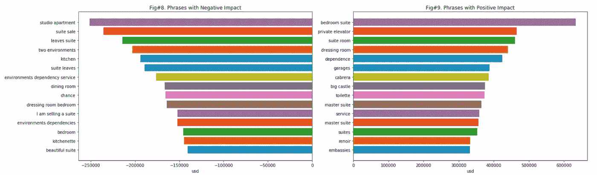

此外，在制定进一步的业务战略时，应考虑额外获得的同样重要的结论:

*   城市间的差异对价格有重要影响；
*   一些特征，例如表面总量、人口、犯罪指数、到海岸的距离等。独立于其他要素，因为向模型中添加其他要素(尤其是地理数据)不会改变该要素对价格的影响方向。

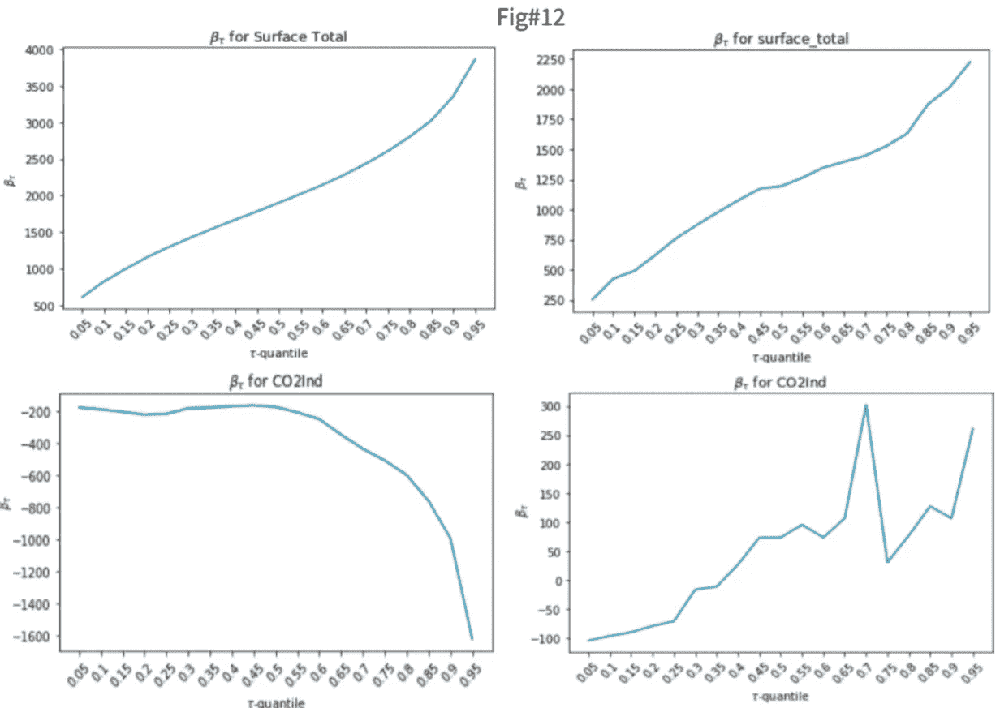

*在图 12 中有一个例子:表面总量保持稳定:无论模型中的其他预测因素是什么，它总是增加公寓的价格，公寓越贵，表面获得的系数越大；二氧化碳指数的表现完全不同，取决于其他预测因素:在“左例”中，它总是降低公寓的价格，公寓越贵，该指数获得的系数越低(对价格的惩罚越大)。在右图中，二氧化碳指数显示了几乎中性的影响(大约为零)，对于昂贵的公寓，它增加了价格；*

*   浴室的数量是预测价格的主要因素之一，而房间的数量并不重要；
*   图 14 显示了 CatBoost 模型的特征的重要性。第一个与那些使用线性模型推断的被定义为显著的完全一致。这可能是我们未来可以依赖的强大模型的标志。但不管怎样，总有改进的地方；

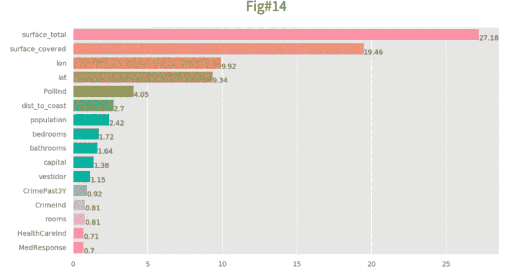

*   任何算法都不能处理预测右尾价格(图 15)中不断上升的误差的原因之一是,“豪华”公寓的定价是由卖方的情绪而不是理性驱动的。

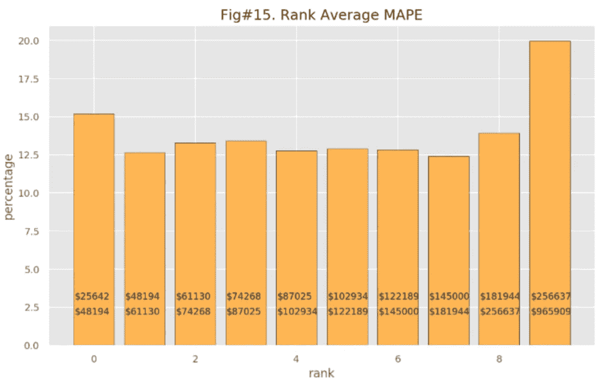

**待办事项列表**

*   使用带有 catboost 回归器和分类器的网格搜索来改进数据插补和价格预测。
*   从文本信息中改进特征选择:更有前景的是使用现代的 DL NLP 方法，如 Bert、Glove 等，但它们需要时间进行调整，更重要的是——运行这种模型的巨大计算能力。
*   尝试 MAPE 的偏差较小的变体，例如，MAPE-R(一种重新标度的准确度测量)[11]。
*   扩大特征集:例如，像到首都的距离这样的特征可以给模型增加额外的有价值的信息。
*   对于预测，运行不同设置的 MLP[12]神经网络，以了解它们是否能产生比 CatBoost 更低的 MAPE 误差，这可能是有希望的。

**盲数据插补**

让算法运行缺失数据填补而不知道它是如何做到的是非常危险的。以下两个图清楚地显示了不正确插补的灾难性，它可能会从根本上改变要素的联合分布。例如，在图 13 中，有相同模型和相同特征集的 MAPE 分布——唯一的区别是，在左侧使用的数据没有 NaN 值(但具有上述所有插补),而在右侧——我们插补后留下的所有缺失数据由 CatBoost 用特征的最小值[15]填充(默认)。我们清楚地看到，这种缺失数据处理是多么有害:在 100 次洗牌训练有效测试数据回归中，采用“巧妙”插补的 MAPE 均值为 0.168，而采用“盲目”插补的均值为 0.301。

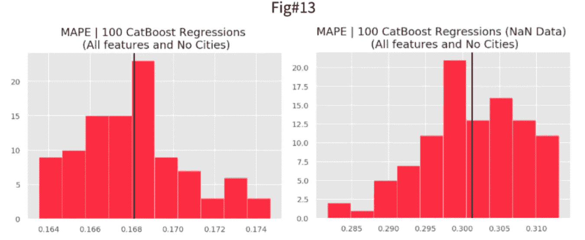

**参考**

1.  [https://mpra ub uni-muenchen . de/32294/1/Forecasting _ box Cox _ pl . pdf](https://mpra.ub.uni-muenchen.de/32294/1/Forecasting_BoxCox_PL.pdf)
2.  [https://www . ESRI . com/about/news room/arcuser/processing-within-missing-data/](https://www.esri.com/about/newsroom/arcuser/dealing-with-missing-data/)
3.  [http://www.stat.columbia.edu/~gelman/arm/missing.pdf](http://www.stat.columbia.edu/~gelman/arm/missing.pdf)
4.  [https://arxiv.org/pdf/1810.11363.pdf](https://arxiv.org/pdf/1810.11363.pdf)
5.  [https://bes journals . online library . Wiley . com/doi/10.1111/2041-210 x . 13434](https://besjournals.onlinelibrary.wiley.com/doi/10.1111/2041-210X.13434)
6.  [https://support . SAS . com/resources/papers/proceedings 17/SAS 0525-2017 . pdf](https://support.sas.com/resources/papers/proceedings17/SAS0525-2017.pdf)
7.  [http://www.econ.uiuc.edu/~roger/research/rq/QRJEP.pdf](http://www.econ.uiuc.edu/~roger/research/rq/QRJEP.pdf)
8.  [https://sci kit-learn . org/stable/modules/feature _ extraction . html](https://scikit-learn.org/stable/modules/feature_extraction.html)
9.  [https://www.jstatsoft.org/article/view/v033i01/v33i01.pdf](https://www.jstatsoft.org/article/view/v033i01/v33i01.pdf)
10.  [https://www . SAS . com/content/dam/SAS/support/en/SAS-global-forum-proceedings/2018/1673-2018 . pdf](https://www.sas.com/content/dam/SAS/support/en/sas-global-forum-proceedings/2018/1673-2018.pdf)
11.  [https://paa2011.princeton.edu/papers/110062](https://paa2011.princeton.edu/papers/110062)
12.  [https://d2l.ai/chapter_multilayer-perceptrons/mlp.html](https://d2l.ai/chapter_multilayer-perceptrons/mlp.html)
13.  [http://theory.stanford.edu/~megiddo/pdf/lplin.pdf](http://theory.stanford.edu/~megiddo/pdf/lplin.pdf)
14.  [https://sci kit-learn . org/stable/modules/generated/sk learn . model _ selection。StratifiedKFold.html](https://scikit-learn.org/stable/modules/generated/sklearn.model_selection.StratifiedKFold.html)
15.  [https://catboost . ai/docs/concepts/algorithm-missing-values-processing . html](https://catboost.ai/docs/concepts/algorithm-missing-values-processing.html)

**数据链接:**

1.  数据集:[https://www . ka ggle . com/msorondo/Argentina-venta-de-propiedades](https://www.kaggle.com/msorondo/argentina-venta-de-propiedades)
2.  人口:[http://data.un.org/](http://data.un.org/)
3.  [https://worldpopulationreview.com/](https://worldpopulationreview.com/)人口
4.  汇率:[https://www.exchangerates.org.uk/](https://www.exchangerates.org.uk/)
5.  城市指数:[http://numbeo.com/](http://numbeo.com/)
6.  海岸线地理数据:[https://www . natural earth data . com/downloads/10m-physical-vectors/10m-海岸线/](https://www.naturalearthdata.com/downloads/10m-physical-vectors/10m-coastline/)