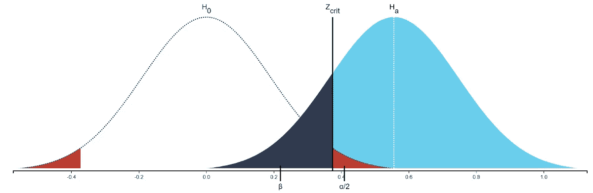
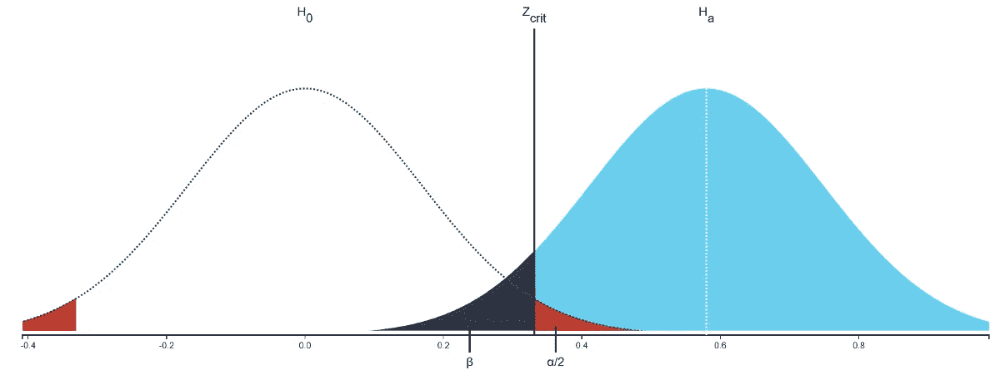

# 统计能力

> 原文：<https://medium.com/analytics-vidhya/statistical-power-c6356b63b75?source=collection_archive---------13----------------------->

## 建立你掌握这个重要概念所需的直觉

统计能力是数据科学家工具箱中的一个基本概念。如果你想把它融入你解决问题的技巧中，你需要为它建立一种直觉。

## **首先要做的事情**

> 统计功效是我们将正确拒绝零假设的概率。
> 
> 假设 *β* 是当零假设实际上为假时，你未能拒绝零假设的概率，那么幂等于*1β*。

下面是如何在 Python 中用[***stats models***](https://www.statsmodels.org/stable/index.html)进行计算:

```
from statsmodels.stats.power import TTestIndPower, TTestPowerpower_analysis = TTestIndPower()# solves for a given variable (n, effect size, alpha, etc)
power_analysis.solve_power(effect_size=.2, nobs1=80, alpha=.05)
```


你，试图理解这应该是“直观的”

我知道！我们离让这个概念变得直观还很远，但是希望当你读完这篇文章的时候，它会变得更加清晰。

# **想通了**

我们想让您直观地理解**功效与您为替代假设测试的采样分布之间的重叠**相关。



注意深蓝色区域。这就是我们将要讨论的重叠

为了达到这个目的，我们需要使用一些我希望你已经熟悉的关键概念，比如假设检验、显著性水平、p 值、抽样分布和中心极限定理。

让我们用一个说明性的例子来这样做:

> 想象一下，我们把一个七年级的班级分成两组:在一周的时间里，A 组每天在每节课前有 30 分钟的冥想指导，B 组照常进行。在周末，两组都进行了一次数学测试，我们发现 A 组的平均分数比 B 组高 5%。

## 虚假设

在我们的小实验中，**零假设** (Ho)是指*在平均测试结果中没有显著差异*。换句话说，他们俩属于 ***同一个抽样分布*** 。


> 如果我们进行统计测试并计算出一个落在灰色区域内的 p 值，我们不会拒绝 Ho。或者，如果 p 值落在红色区域内，那么我们将拒绝 Ho。

## 替代假设

另一方面，我们的**替代假设** (Ha)是测试的平均分数存在差异。换句话说，每组平均分数属于一个*截然不同的抽样分布。*

**

*你很快就会明白为什么这个深蓝色的重叠会出现…*

> *现在，让我们**假设**假设**替代假设为真，**意味着冥想确实有效果，因此 B 组属于不同的分布。*

*在这种情况下，如果我们不能拒绝零假设，我们就犯了一个错误——更具体地说，是一个**第二类错误。但是我们怎么会犯这样的错误呢？***

*如果计算的 p 值落在深蓝色**重叠内，我们就会犯这个错误。***

*这是因为深蓝色重叠在红色剔除区域之外，但也符合双分布假设(h a)。换句话说，当 p 值低于阈值时，我们不会拒绝零假设，即使它在的*备选假设分布中**。****

## ***如何增加功率***

*有三件事会影响权力:*

1.  *效果大小*
2.  *显著性水平*
3.  *样本量*

## ***效果大小***

*在讨论之前，我们必须首先承认，效应大小不在我们的控制之下。在我们七年级的例子中，效应大小是每组平均分数的差异。这种差异只是冥想的一种反映(或者不是，取决于统计测试的结论)。*

*效应大小将影响功效，因为它将影响我们一直谈论的深蓝色重叠:假设有两个分布(Ha)，每个分布中心之间的距离(平均分数)与平均分数的差异直接相关，即效应大小。这将在下面的图表中变得更加明显。*

*这里有两个场景，每一个都有不同的效果大小。看看你是否能发现不同之处:*

**

*这是效果大小为 0.6 时的重叠*

**

*这是效果大小为 0.3 时的重叠*

*效应大小，这里计算为 Cohen's d，可以理解为曲线距离的度量。曲线越靠近，它们就越难区分。换句话说，**曲线越接近，重叠越大***

## ***显著性水平***

*也被称为阿尔法，它影响权力，因为它影响深蓝色重叠。我知道，这有点重复了。*

*显著性水平和深蓝色重叠是互斥的:当 p 值落在红色区域(即拒绝区域)内时，不可能有 II 型错误，因为我们将拒绝零假设。因此，**当** α增加**时，深蓝色重叠部分必然收缩**:*

**

*蓝色重叠不能与红色区域相交。*

**

*因此，如果红色增长，深蓝色重叠缩小。*

*重要的是要记住，以增加权力为目的增加阿尔法不是好的做法。你希望显著性水平反映其他标准，而不是削弱测试的能力。*

## ***样本量***

*它与功率有关，因为它影响深蓝色重叠；-)*

*但你会问，为什么会这样？问得好，我的朋友。这是最难理解的，但也是最重要的，因为这通常是数据科学家为了达到某个功率水平而可以尝试控制的唯一事情。在我们的第七个例子中，如果我们愿意，我们可以增加每组学生的数量，这将增加测试的功效。*

*在我们走这条路之前，让我们绕道而行。让我们考虑样本大小(n)如何影响均值的抽样分布。*

> *假设 U 是一组从 0 到 99 的整数。*

*从这个集合中，我们将抽取 20 个样本，并计算它们的平均值。我们将做 4 次，但每次我们将抽取不同大小的样本。*

*我已经为我们写了一些(非常)简单的 Python 代码来做这件事:*

```
*import pandas as pd
import seaborn as sns
import matplotlib.pyplot as plt
plt.style.use('ggplot')U = pd.Series(range(100))# Sampling Distribution A
samples_a = [U.sample(n=1).values for sample in range(20)]
sampling_distr_a = [sample.mean() for sample in samples_a]# Sampling Distribution B
samples_b = [U.sample(n=2).values for sample in range(20)]
sampling_distr_b = [sample.mean() for sample in samples_b]# Sampling Distribution C
samples_c = [U.sample(n=3).values for sample in range(20)]
sampling_distr_c = [sample.mean() for sample in samples_c]# Sampling Distribution D
samples_d = [U.sample(n=4).values for sample in range(20)]
sampling_distr_d = [sample.mean() for sample in samples_d]# plots all 4 sampling distributions
f, (ax1, ax2, ax3, ax4) = plt.subplots(4, sharex=True, sharey=True, figsize=(12, 15))
f.suptitle('Distributions for 20 sample means'.title(), fontsize=19)sns.distplot(sampling_distr_a, ax=ax1)
ax1.set_title('single point samples (n=1)'.title())sns.distplot(sampling_distr_b, ax=ax2)
ax2.set_title('single point samples (n=2)'.title())sns.distplot(sampling_distr_c, ax=ax3)
ax3.set_title('single point samples (n=3)'.title())sns.distplot(sampling_distr_d, ax=ax4)
ax4.set_title('single point samples (n=4)'.title())plt.show()*
```

*这里要记住的一个关键点是，均值的抽样分布将是正态分布，如中心极限定理所述。即使集合 U 不是正态分布，也是如此。*

*现在，让我们看看每个样本大小(n)的平均值的抽样分布是什么样的:*

**

*请注意，随着 **n** 的增加，分布开始变得更正常、更窄、更高。但是为什么会这样呢？*

*想想 n=1 的分布:在我们抽取的 20 个样本中，我们肯定会有一些像 99 这样的极值，即使它们很少。*

*但是，当 n=2 时，即使极值也会上来，但两者都是极值的情况就更少见了。结果是来自 n=2 的 20 个样本的平均值将更集中在中心周围。*

*如上图所示，如果 n=3，这种影响会更加明显。*

***n** 对抽样分布的影响也适用于我们对功效分析的直觉:当我们增加样本量时，为**替代假设**假设的分布变得更窄，更集中。这反过来会使深蓝色重叠缩小。*

**

*n=30*

**

*n=60*

*顺便说一句，同样的直觉也适用于你过去学过的 t 分布的形状:自由度越高(因此 n 也越高)，曲线就变得越正常。*

## *这都是关于重叠的*

*希望你现在对什么是权力以及如何影响权力有了直观的认识。这一切都可以归结为这样一句话:*

> *β (beta)与深蓝色重叠直接相关。*

*这应该会让你更容易理解我在文章开头提到的内容:*

> *统计功效是我们将正确拒绝零假设的概率。*
> 
> *假设 *β* 是当零假设实际上为假时，你拒绝零假设失败的概率，那么幂等于*1β*。*

> *如果你想尝试不同的效果大小、alpha 和样本大小的组合，请访问这个由 [**克里斯托佛·马格努松**](https://rpsychologist.com/) 创建的[惊人资源](https://rpsychologist.com/d3/nhst/)*