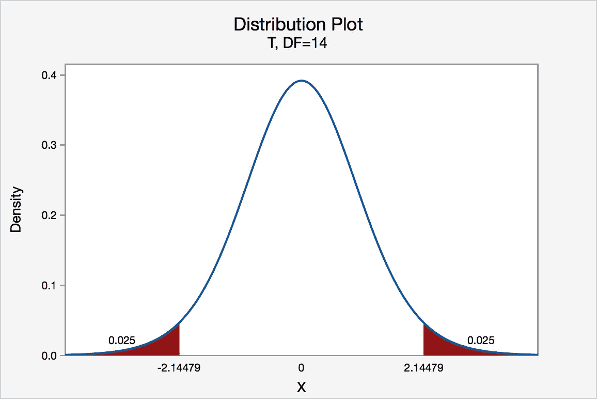
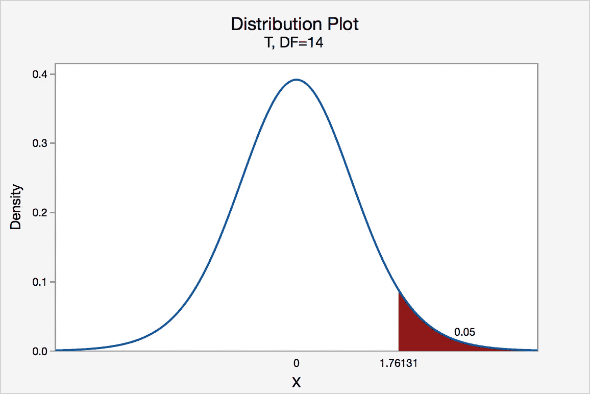
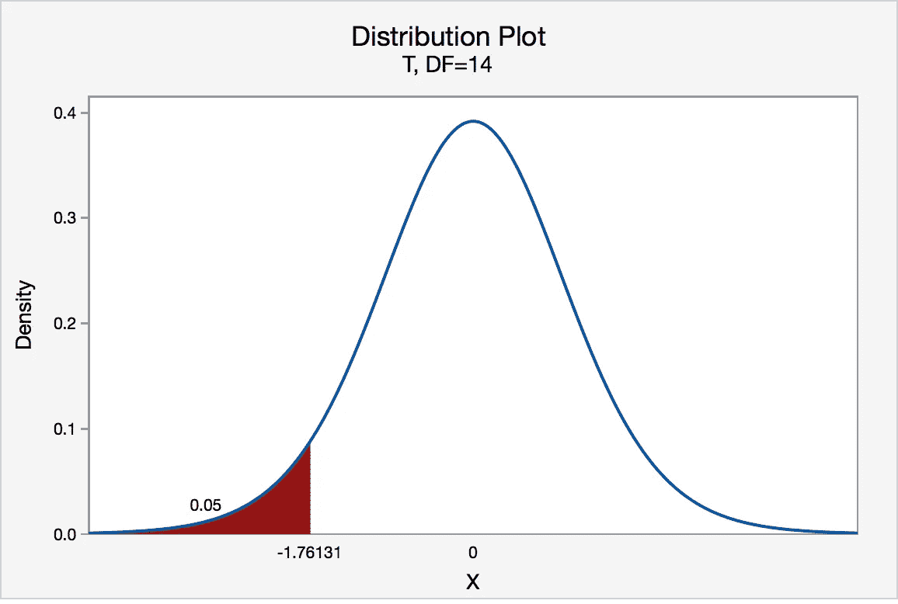
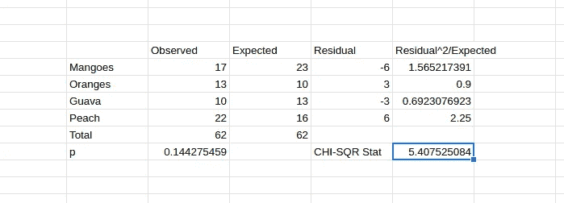
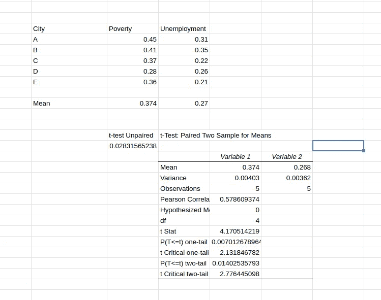
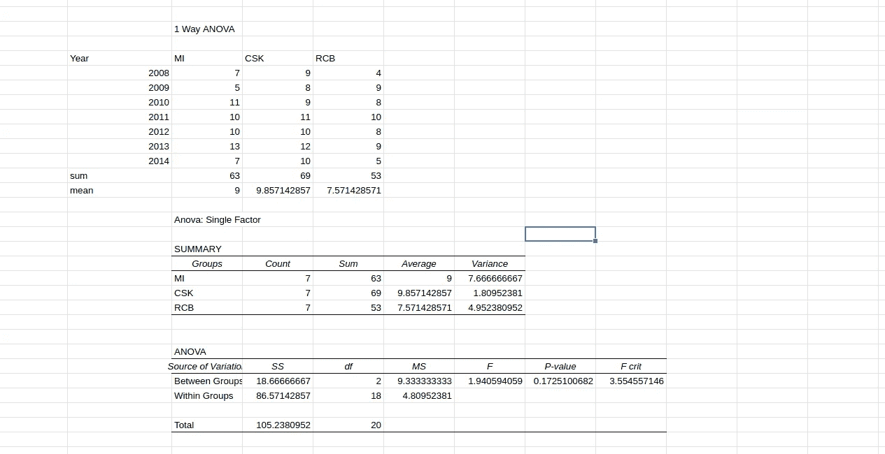

# 统计测试

> 原文：<https://medium.com/analytics-vidhya/statistical-tests-22e91674315b?source=collection_archive---------5----------------------->

统计是非常好和平滑的，直到我们遇到“推断统计”，因为那里发生了太多的事情。我必须说，它名副其实，因为使用它也是“推理”的！

伴随着这一切，当我们制定一个统计假设时，我们进行了几个统计测试！在从事数据科学项目时，这似乎是一个令人厌烦的步骤，但它与它所代表的意义相关，因为它说明了你将如何使用样本来了解整个人口。瞧啊。

在直接进入测试之前，让我们了解一下背后的一些介绍性基础。

# 统计假设

我们都听说过一种假设，就像我们在生活中几次遇到不知道该怎么选择的情况一样。

简而言之，假设是一种陈述，我们可以通过使用一组随机变量，利用对某一过程的观察结果来检验这种陈述。

这个复杂的陈述基本上表明，我们可以比较两个统计数据集，其中一个可以通过采样获得，并与另一个进行比较，这代表了真实的情况。

现在，为了建立这种比较，我们有一个检查:我们的假设是否是真的，基于一个很好的证据，就一个值而言。

所以，有:

1]无效假设:它说，关系不存在！
第二种假设:它说，这种关系是存在的！

在开始如何执行测试之前，

# 这个什么时候用过？

通常，当我们建立机器学习模型并检查它们是否正确时，除了准确性之外，检查模型是否符合统计显著性测试也很重要，否则，当在现实生活数据中出现时，它可能表现得不够好。

# 回到正题

假设检验的大决策有两种方法:
1】**临界值**:这展示了接受区域内的值的边界。它将拒绝区和接受区分开。

*   ***双尾检验*** :如果检验结果太小或太大，就拒绝零假设！

双面测试，[参考](https://online.stat.psu.edu/statprogram/reviews/statistical-concepts/hypothesis-testing/critical-value-approach)

*   **右尾检验:**如果检验结果过高，则拒绝零假设

右尾测试，[参考](https://online.stat.psu.edu/statprogram/reviews/statistical-concepts/hypothesis-testing/critical-value-approach)

*   **左尾测试:**如果测试结果太低，你知道该怎么做！

左尾测试，[参考](https://online.stat.psu.edu/statprogram/reviews/statistical-concepts/hypothesis-testing/critical-value-approach)

2] **P 值**

*   虽然看起来很难，但却很容易解释。
*   我们所做的就是，计算假设零假设为真，另一个假设为真的概率。
*   还有 p 值:值越小，证据越充分！

何时:

1.  p>0.1 →无证据
2.  p=0.01 至 0.05 →中度至强烈证据
3.  p <0.01 → Very Strong Evidence

# **统计测试**

最后，在所有这些混乱之后，我们为什么还要使用这样的统计测试？

要知道一个预测变量是否有一个统计上重要的结果变量，如果它足够强大，足以成为一个“预测器”！

****检验统计量:** 这是一个数字，它可以说明所进行的检验中变量之间的关系与原假设“没有关系”有多大的不同。**

**执行统计测试前的重要假设:
1】**同质数据**:可变性方面没有极端情况。
2】**无自相关:**独立观察，无暗示。
3】**正态性:**数据应该服从正态分布**

1.  ****一个样本的 t 检验****

**该测试用于了解样本的平均值是否与假设值不同。**

**这是一个简单的测试，我们只需评估样本的平均值并进行比较，就可以得出差异。如果在 95%置信区间内，零假设不会被拒绝，否则，它就是替代假设。**

**2.**二项式检验****

**当我们必须检查 2 级分类特征的比例时，它可以用来测试。简单地说，我们检查真实实例与假设比例的比例。**

**例如:假设代表具有两个值的特征:热和冷，以检查冷天的比例是否为 60%。如果我们最终得到的值是 58.7，它在统计学上足够显著，可以宣称是另一个假设。如果是 50 岁，也许是时候对无效假设说再见了。**

****3。卡方检验****

**它用于比较分类变量。**

**卡方检验有两种类型:
1】**拟合优度检验**:确定样本是否与总体匹配
2】**卡方检验两个独立变量**:在列联表中比较它们。**

**示例:**

****

**拟合优度检验**

**上述示例表明，观察到的比例值和预期的比例值之间的差异较小。**

****4。t 检验****

**t 检验用于比较两个样本的平均值。当我们不知道总体参数时，就使用它。**

**t 检验的 3 个变量:**

**1] **独立样本 t 检验**:比较来自不同人群的 2 个样本的均值。
2】**配对样本 t 检验:**比较来自同一总体的样本的平均值。
3】**一个样本 t 检验:**我们一开始看到的那个。**

****配对 t 检验:**当我们有 2 个相关的观察值，并且我们想要检查这 2 个变量的平均值是否彼此不同。**

****

**配对 t 检验**

**从上例中我们可以看出，不成对 t 检验的 p 值大于 0.01，但成对 t 检验证明 p 值为<0.01, providing a strong inference. Thus here, we can say that the Mean of poverty and Unemployment are statistically significantly different.**

****5。z 测试****

**考虑到提供了总体参数，Z 检验仅用于比较样本和总体均值。**

**零假设:样本均值与总体均值相同
替代假设:样本均值与总体均值不同**

**z 统计值=(样本均值-总体均值)/(总体的标准差)**

**如果 z 统计量<critical value="" the="" hypothesis="">否则→拒绝！</critical>**

****6。ANOVA:** 说，“如果你有超过 3 个或者更多的样本呢？记住我。”**

**其含义隐藏在它的名字中:方差分析。**

**2 方差分析的主要类型:
1】**单因素方差分析**:比较单个自变量的 3 个或 3 个以上样本之间的差异。
2】**MANOVA**:允许我们测试一个或多个自变量的效果。**

**此处假设:
空→所有样本对相同，即所有样本均值相等
交替→至少 1 对样本显著不同**

**这里，我们使用 F-statistic =((SSE1-SSE2)/m)/(SSE2/n-k)
其中，SSE =残差平方和
m =限制数
k =独立变量数**

**示例:**

****

**单向方差分析**

**这里，F-critic 值将接受和拒绝区域的分布分开。在这个特定的例子中，我们可以说所有 3 个样本的平均值在更高的 p 值的基础上不相似(或相同)。**

**还有比这多得多的统计测试，这些测试提供了对样本的代表性及其均值的更高级的见解，有趣的是，它们对于特定的案例是独一无二的。**

**希望这篇帖子对你有帮助！**

**参考资料:**

**1][https://online . stat . PSU . edu/stat program/reviews/statistical-concepts](https://online.stat.psu.edu/statprogram/reviews/statistical-concepts)
2】[https://towardsdatascience . com/statistical-tests-when-to-use-which-704557554740](https://towardsdatascience.com/statistical-tests-when-to-use-which-704557554740)**