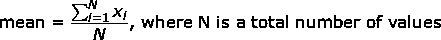
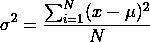
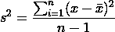

# 统计— 101

> 原文：<https://medium.com/analytics-vidhya/statistics-101-506c2da589f4?source=collection_archive---------6----------------------->

我又想到了另一个故事，这一次，它是我们在任何数据分析问题中需要的基础，统计学。

[赫塞·科林斯](https://unsplash.com/@jtc?utm_source=medium&utm_medium=referral)在 [Unsplash](https://unsplash.com?utm_source=medium&utm_medium=referral) 上拍照

## **什么是统计？**

它是一个方法的集合，用于进行实验以获得数据，然后组织、总结、呈现、分析、解释数据，然后从数据中得出推论。

我们有两种类型的统计:

1.  描述性统计— *数据的收集、组织、汇总和展示。*
2.  推断统计数据— *对数据进行分析、解释和预测。*

我们有一个总体和样本的概念，在进一步研究之前，我们需要理解这个概念。

**群体** —我们感兴趣测量的每一个可能的个体元素。

**样本** —它是我们可以对总体进行分析和推断的总体子集。

> 示例:
> 
> 假设，我们想计算卡纳塔克邦所有人的平均身高。
> 
> 现在，有一种方法可以测量这个州每个人的身高，但这真的可能吗？在我看来，几乎不可能。
> 
> 所以，另一种方法是，我们取人口的子集作为样本，然后计算样本的平均高度，然后指定人口的平均高度。我们只需要确保我们的样本没有偏见，并以各种方式代表人口。

## **描述性统计**

它基本上描述了我们关心的数据。它主要给了我们两件事:

*   集中趋势测量
*   变化的度量

凯利·西克玛在 [Unsplash](https://unsplash.com?utm_source=medium&utm_medium=referral) 拍摄的照片

## 集中趋势测量

这种方法试图用一个值来描述数据。它对数据进行平均，并提供最能描述给定数据的“中间”值。

我们有 3 种测量方法:

*   平均
*   中位数
*   方式

**平均值**是数值的算术平均值。

平均公式

示例:

*注意:* **均值很容易受到数据中异常值的影响。** *考虑一个假设公司员工的工资例子。假设数据中有 3 名员工:看门人、软件开发人员和首席执行官，他们的工资分别为 1000 美元、10K 100 万美元。*现在，如果我们计算这三个值的平均值，它将接近 100 万美元，当然，这不能与其他数据进行比较。我们可以在下面的代码片段中观察到这一点:

为了解决这个问题，我们经常使用中位数。

**中值**是另一种度量，它给出了数据的中心值。

要找到中间值，请按照下列步骤操作:

*   按升序或降序对值进行排序，并
*   然后求中心值。如果值的总数是偶数，我们计算两个中心数的算术平均值来得到中值。

让我们来看看实际情况:

数值计数为奇数时的中值计算

当数值计数为偶数时的中值计算

在我们的异常值案例中，我们得到的中值是$10K，这是数据中的实际中心值。

**模式**是数据中出现频率最高的值。

假设我们随机收集了 5 个人的身高数据，如下:

5、5.5、5.5、5.2、5.6 *(均为英尺。)*

现在，模式等于 5.5 英尺，因为它是数据中最常见的值。

照片由 [Pritesh Sudra](https://unsplash.com/@pritesh557?utm_source=medium&utm_medium=referral) 在 [Unsplash](https://unsplash.com?utm_source=medium&utm_medium=referral) 上拍摄

## 变化的度量

> 单独的**集中趋势**不能提供关于数据集的完整信息。应始终将它与数据集中的**变化**放在一起查看，以获得完整的图片。

集中趋势的度量只为我们提供中心值，而变化的度量为我们提供数据集中的离差量。

我们有以下流行的变异度量类型:

1.  范围
2.  四分位间距
3.  差异
4.  标准偏差

**范围**是数据集中最大值和最小值之差。尽管它是所有变异度量中最简单的，但不建议将其用于较大的样本，这些样本也包括异常值。

范围的 Python 实现

它实际上并没有给出太多关于数据集及其变化的信息。它没有显示数据围绕中心聚集的紧密程度。不仅如此，它还很容易受到数据集中异常值的影响。

**四分位数范围**是数据的第 75 和第 25 个百分位数之间的差值。数据实际上被分成 4 等份(按升序或降序排序后)，称为*四分位数*。四分位数可以如下:

*   四分位数 1 或 **Q1** 位于数据的 0 到 25 个百分点之间，
*   四分位数 2 或 **Q2** 位于数据的第 25 和第 50 百分位之间，
*   四分位数 3 或 **Q3** 位于数据的第 50 和第 75 百分位之间，
*   四分位数 4 或 **Q4** 位于数据的第 75 和第 100 百分位之间。

四分位数范围就是 **Q3 — Q1，**即中间 50%数据的范围。

IQR 的 Python 实现

与范围相比，它不受数据集中异常值的影响。在数据集的偏态分布的情况下，这是一个很好的变化度量。

**方差**总结每个观察值与平均值的差距。与范围和四分位数范围不同，它考虑数据集中的每个数据点。

它可以根据您正在计算的数据集进行计算:

*   总体方差

人口方差(mu =人口平均值，N =人口规模)

*   采样离散

样本方差(x-bar =样本均值，n =样本大小)

*样本通常有低估总体方差的倾向。因此，我们使用 n-1 来校正这种低估。*

方差的 Python 实现

方差的值越高，意味着数据集中的变化越大，反之亦然。但是，由于这是一个平方实体，因此没有直观的方法直接将此方差与特定数据值或平均值进行比较。

**标准差**是方差的平方根。它可以用作更容易解释和与数据集相关的变化的度量。

标准差的 Python 实现

这是第一部分的内容，我会想出另一部分来继续统计，因为它对于任何类型的分析都是一个重要的主题。

[统计-102](https://peeushagarwal.medium.com/statistics-102-9992b3a259d1)——这是“统计”系列的第二部分。这里面包含了各种概率分布，中心极限定理，切比雪夫不等式。