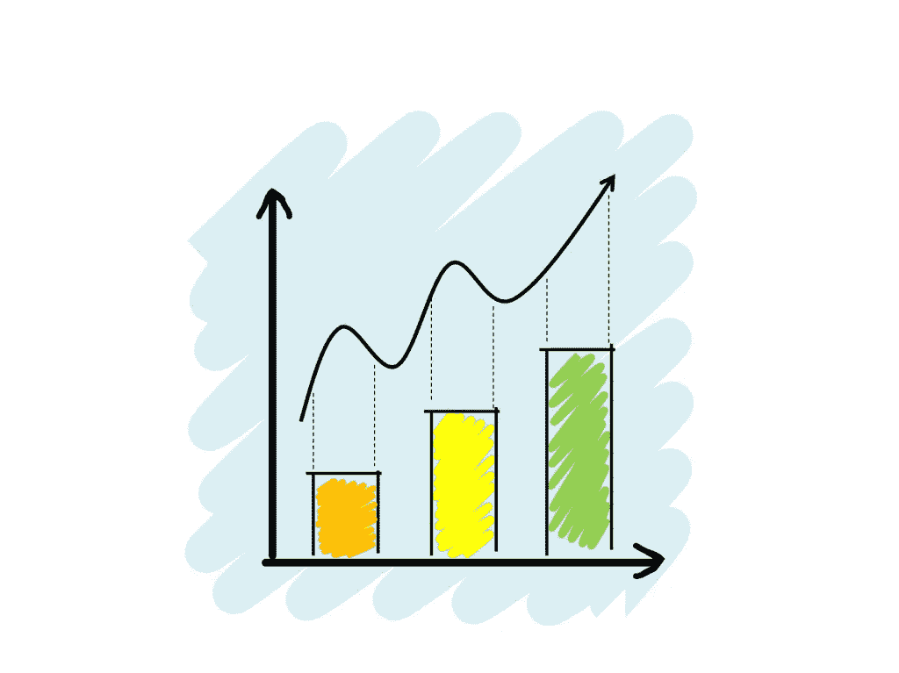
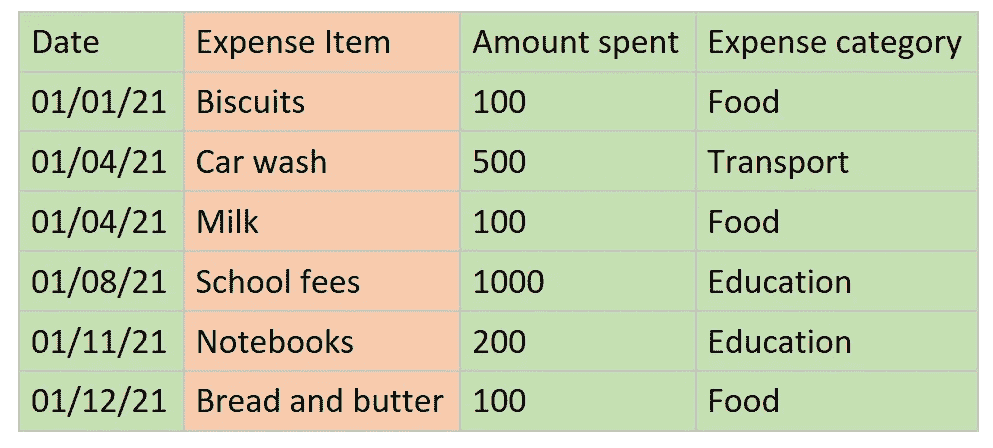
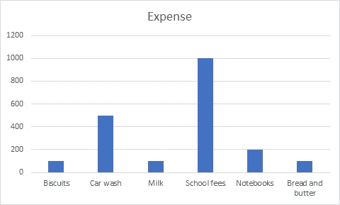

# 数据科学统计学 101:第一部分

> 原文：<https://medium.com/analytics-vidhya/statistics-101-for-data-science-part-1-20-a0d309403f8e?source=collection_archive---------14----------------------->

当我决定进入数据科学时，我开始知道统计学在这个领域中起着不可或缺的作用。我参考了许多网上资源，我用一种简单得多的方式把我所学的所有东西整理成了一系列教程。我希望你们都会觉得它有用并且容易理解。

# 统计学到底是什么？

统计已经存在于我们的日常生活中。这不是一个不为人知的行话，值得害怕。我们每天收集数据，整理数据，分析和解读其中一些有用的信息，以做出更好的决策。

我举个例子证明你已经熟悉统计学了。

你们大多数人都有记录每月开销的习惯。你收集收据，在一些费用管理应用程序或传统笔记本上记下你的支出。这是统计的第一步，**数据收集**。

*然后在一个月或一年的月底，你拿着收集的费用数据，分析你在哪里花了钱，花了多少钱。*这是第二步，**分析**。

根据收集到的信息，你可以为接下来的一个月或一年制定计划。你根据以前的支出来分配预算。这是最后一步，**解读**。

现在让我们进入统计学的学术定义。

**研究如何收集、组织、分析和解释数字信息和数据。它既是不确定性的科学，也是从数据中提取信息的技术。**

# 数据的组成部分是什么？

数据有两个组成部分，个人和变量。

让我们回到每月费用的例子来理解它们。这是我们的费用表样本。

支出清单

这里我们有费用项目，它们是实际的项目，甚至在一开始就已经为它们创建了列表。他们是不同的实体，他们有专门属于他们的信息。这些在统计学上被称为**个体**。

**个人可以是研究中包含的人或物。**

其他列，如日期、花费金额和费用类别，包含费用项目的信息或特征。它们被称为**变量**。顾名思义，他们因人而异。

测量或观察到的个人特征是变量。

# 数据是从哪里收集的？

可以从具有共同主题的整个组或该组的一小部分中收集数据。在我们的费用管理示例中，我们从支出中收集数据。这取决于收集数据的情况和原因。

让我们考虑一下我们的政府，它想找出这个国家的总人口。代表们走访每一个家庭，收集住在那里的每一个成员的信息。然后，它使用收集的数据进行分析。**当从群体**(这里是整个国家)的每个成员收集数据时，被称为**人口。**

**当一群人或物体中的每一个实体都具有一个共同的主题时，那么它就是一个群体。**

让我们考虑一家快速消费品公司，它想了解他们的产品在消费者中的受欢迎程度。与政府不同的是，他们不会将问卷分发给社区的每一个成员。他们选择像大学生这样的特定人群来进行调查。他们选择的一小部分被称为样本。

样本是总体的一小部分。它可以是有代表性的样本，也可以是有偏差的样本。

**总体的统计符号是 N** ，而**样本的统计符号是 n** 。

# 统计类型

**描述性统计包括从样本和人群中组织、描绘和总结信息的方法。**

它只是将收集到的数据以图片(图表或图形)的形式描述出来。我们收集的费用可以用图表表示出来，这叫做描述性统计。

费用列表的描述性统计

当我们推断或发现隐藏在数据中的有用的东西时，这就是所谓的推断统计学。在我们的例子中，我们可以推断教育费用比任何其他费用都多。

**推断统计学涉及使用样本信息得出总体结论的方法。它只能在样本上完成。**

*在接下来的教程中，我们将覆盖***。你可以在这里* *找到教程* [*。*](https://link.medium.com/8hhzy4GCdeb)*