# 统计— 102

> 原文：<https://medium.com/analytics-vidhya/statistics-102-9992b3a259d1?source=collection_archive---------10----------------------->

这是另一个关于统计学的故事，这次是关于概率和几种分布，这对数据分析很有帮助。

如果你想刷新你对集中趋势和变化的测量的记忆，那么读一读我以前的博客。

照片由[纳赛尔·塔米米](https://unsplash.com/@tamiminaser?utm_source=medium&utm_medium=referral)在 [Unsplash](https://unsplash.com?utm_source=medium&utm_medium=referral) 上拍摄

## 随机变量

它是统计实验结果的数字描述。它有两种类型:

1.  *离散随机变量* —它假设有限数量的值。例如:性别信息、交易月份、汽车生产年份、掷骰子等。也可以是多种类型的——标称*、*序数*等。*序号*是指值、示例、交易月份等有一定的顺序。*名义上的*是没有顺序的值，例如，性别信息等。*
2.  *连续随机变量* —它可以假设无限个值。例如:身高、体重、工资等。

当我们绘制随机变量的值时，我们得到了随机变量的分布图。现在，这些发行版可以是不同的类型，但我将在下面讨论:

1.  伯努利分布
2.  二项分布
3.  高斯或正态分布
4.  标准正态分布

## 伯努利分布

如果只有两种可能的结果和一次试验，则称随机变量遵循*伯努利分布*。

在两个玩家之间的战斗中，我们只有两种可能的结果，赢或输。在这种情况下，玩家 1 有可能以“p”的形式获胜，以“1-p”的形式失败。考虑一下，一个随机变量 X，取值 1 表示“赢”，取值 0 表示“输”。

在这种情况下，我们的概率质量函数将是:

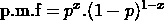

伯努利分布的概率质量函数

或者，可以这样写:

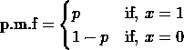

伯努利分布的概率质量函数

X 的平均值或期望值如下:

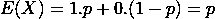

伯努利分布的期望值

X 的变化如下:

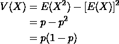

伯努利分布的方差

## 二项分布

一个实验只有两种可能的结果，并且这个实验被重复‘n’次，每个实验都是相互独立的，这个实验被称为*二项分布*。

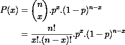

二项分布的概率质量函数

例如:两个人之间的战斗，其中一个人赢的概率是 p，输的概率是 1-p。战斗重复了很多次，比如说 n 次，人 1 的概率没有变化。

在这种情况下，我们的期望值是:

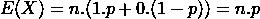

二项式分布的期望值

差异将是

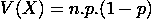

二项式分布的方差

## 高斯或正态分布

大多数随机变量遵循“正态分布”。当一个随机变量符合正态分布时，

1.  均值=中位数=众数
2.  分布曲线呈钟形，关于 x =均值线对称
3.  曲线下的面积等于 1

服从正态分布的随机变量 X 的*概率密度函数*为:

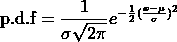

正态分布的概率密度函数

在哪里，

均值= E(X) = μ，且

方差= σ

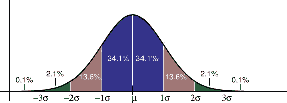

正态分布曲线

有来自曲线的经验值(也如上图所示):

1.  所有值的 **68.2%** 在平均值的 **1 标准差**内，
2.  **所有值的 95.4%** 位于平均值的 **2 个标准偏差**内，并且
3.  **所有值的 99.7%** 位于平均值的 **3 个标准差**内。

A **标准正态分布**是*均值(μ) = 0* 和*标准差(σ) = 1 的正态分布。*

我们还有如此多的其他分布，但从数据科学的角度来看，我们大多认为是“正态分布”。

布雷特·乔丹在 [Unsplash](https://unsplash.com?utm_source=medium&utm_medium=referral) 上的照片

现在，当我们已经完成了主要发行版的知识时，请拍拍你的背。接下来，我们将通过一些定理来帮助我们更好地理解我们的数据，并从中获得洞察力。

# 中心极限定理

*中心极限定理*陈述一个样本均值的*抽样分布*在样本量足够大的情况下近似正态，即使总体分布不正态。

## 样本均值的抽样分布是什么？

如果我们有一个人数为 N 的总体，如果我们取人数为 n (n < N)的样本，计算样本平均值，记下来，然后将样本放回总体中。如果我们对一个有限的计数重复这个过程，然后画出样本平均值，我们将得到样本平均值的抽样分布。

> 假设，我们将卡纳塔克邦所有人的身高视为我们的人口，平均身高为，比如说，5 英尺 4 英寸。现在，如果我们考虑一个 1000 人的样本并计算平均身高，结果可能是 5 英尺 7 英寸。我们再抽取一个 1000 人的样本，重复这个过程 200 次，然后如果我们画出每个样本的平均身高，我们会发现这个图遵循平均身高为 5 英尺 4 英寸的正态分布。

中心极限定理表明，采样分布将遵循以下特性:

*   抽样分布的平均值将等于总体的平均值

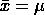

样本平均值=总体平均值

*   抽样分布的方差等于总体分布的方差除以样本大小。

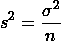

样本方差=总体方差/样本量

# 切比雪夫不等式

当我们知道分布不是高斯或正态分布时，这个就派上用场了。它规定，样本中至少有'*1–1/k '*个数据必须落在平均值的' *k'* 个标准差内(这里' *k'* 是任何大于 1 的正实数)。在分析的上下文中，它也可能被称为“马尔可夫不等式”。

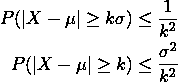

切比雪夫不等式

# 皮尔逊相关系数

它是两组数据之间线性相关性的度量。它是两个变量的协方差与它们的标准差的乘积之比。

*协方差*是两个随机变量的联合可变性的度量。

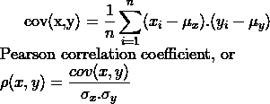

协方差和皮尔逊相关系数公式

协方差给出了线性关系的方向，皮尔逊相关系数给出了线性关系的强度和方向。

了解两个变量之间的相关性有助于数据科学项目，因为它可以帮助我们进行特征选择/消除过程。

皮尔逊相关系数假设数据是线性相关的，否则，它不能提供 2 个变量之间的正确强度。

# 斯皮尔曼相关系数

Spearman 相关系数是等级变量之间的 Pearson 相关系数。它可以计算如下:

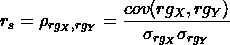

斯皮尔曼相关系数

在哪里，

*   ρ是应用于等级变量的皮尔逊相关系数
*   cov(rgₓ，rgᵧ)是秩变量的协方差
*   σ是等级变量的标准偏差。

只有当所有“n”个秩都是不同的整数时，才可以使用以下公式来计算:

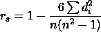

当所有等级都是唯一时的 Spearman 相关系数

其中，' *dᵢ = rg(Xᵢ) — rg(Yᵢ)* '是每个观测值的秩差，' n '是观测值的个数。

这就是这篇博客的第二部分。我会想出另一个博客来延续上面关于统计的内容。

供你参考，

*   [第一部分:统计— 101](https://peeushagarwal.medium.com/statistics-101-506c2da589f4)