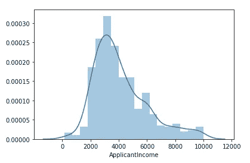
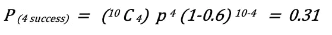

# 数据科学统计学

> 原文：<https://medium.com/analytics-vidhya/statistics-for-data-science-729c2fab1c15?source=collection_archive---------7----------------------->

## 数据科学|统计学|机器学习

## 数据科学家的重要统计概念及其使用方法

数学和统计学是数据科学领域的强大工具。数学和统计学是必不可少的，因为这两个领域构成了所有机器学习算法的基础。为了成为一名成功的数据科学家，你必须了解你的基础知识。

统计是使用数学对数据进行技术分析，以获得有意义的见解。有了统计数据，我们可以以信息驱动和有针对性的方式对数据进行操作。

那么，数据科学和统计学有什么不同呢？虽然从数据科学家和统计学家都旨在从数据中提取知识的意义上来说，这两个领域密切相关，但主要区别在于这两个群体处理事情的方式。数据科学通常被定义为三个领域的融合:计算机科学、数学/统计和特定领域的知识。

乔希·威尔斯曾经说过，

> “数据科学家是一个比任何程序员更擅长统计，比任何统计学家更擅长编程的人。”

在本文中，我们将了解每个数据科学家都应该知道的一些数据科学的基本统计概念，以及如何有效地应用它们。

# 1.解码汇总表

表 1

描述表也称为 5 点汇总，因为它使用最少 5 个点为我们提供信息，我们可以从中汇总数据集。分别是:*最小*、*最大*、 *25%* 、 *50%* 、 *75%* 。它还告诉我们平均值、标准差和计数。50%的值也是变量的**中值**。例如，该数据集中申请人收入的中值为 3622.50 美元

如果均值>中值，则尾部更靠右。即数据在右边有更多的变化，可以被称为右偏。反之亦然。这正是你在绘制分布图时会看到的。对于对称图，均值=中值。

25%是**下四分位数范围**，这意味着 25%的数据位于 150 美元到 2732 美元的范围内。75%为**上四分位数范围**(即 75%的数据位于 150 美元至 5000 美元之间)，50%为四分位数范围。因此，我们知道 50%的人口收入在 2732 美元到 5000 美元之间。所以，如果我们想把 50%的人口作为我们产品的目标，我们知道他们挣多少钱，我们就可以相应地决定我们产品的价格。

# 2.贝叶斯定理

贝叶斯定理描述了一个事件发生的概率，基于可能与该事件相关的条件的先验知识。

我们用一个例子来理解这个。让我们假设我们想要确定一封电子邮件是垃圾邮件的概率，假设在该电子邮件中有单词' *winner* ，或者假设在该电子邮件中有单词' *winner* ，那么该电子邮件是垃圾邮件的概率是多少？

根据上面我们得到的公式，

假设简单数学的值，

p(垃圾邮件)= 30%，

p(非垃圾邮件)将是 100–30 = 70%

从训练数据中我们可以得到，

p(赢家|垃圾邮件)= 75%

P(winner|not spam) = 35%(不要像上面 100–75 那样计算，因为' *winner* '不是唯一表示垃圾邮件的词，也不是每封带有 winner 的邮件都是垃圾邮件)

代入这些值后，我们可以说，当电子邮件中出现单词 winner 时，这是一个骗局的概率是 0.56 或 56%

# 3.二项分布

二项式分布可以被简单地认为是重复了' *n* 次的实验或调查中成功或失败结果的概率。

我们用一个例子来理解这个。让我们假设一家银行想从 10 个样本空间中确定 4 个人按时支付信用卡账单的概率是多少。

假设一个人按时付款的概率是 0.6，我们得到

因此，10 个中有 4 个按时付款的概率是 0.31 或 31%

# 4.过采样和欠采样

过采样和欠采样是用于分类问题的技术。有时，数据集可能会严重失衡。例如，我们可能有 4000 个糖尿病患者的观察值，但只有 400 个非糖尿病患者的观察值。这将抛弃许多机器学习算法，这些模型只有在预测糖尿病患者的输出时才会表现良好。过采样和欠采样可以解决这个问题。

在欠采样时，我们将只从多数类的数据中随机选择记录来匹配少数类的记录。在这种情况下，例如 400 条记录。这种选择保持了类的概率分布。然而，这不是优选的，因为我们最终会丢弃如此多的数据。
另一方面，过采样将创建少数类的副本，以便拥有与多数类相同数量的样本。在这个例子中有 4000 条记录。这可以通过复制少数类记录或使用一种称为合成少数过采样技术(SMOTE)的方法来实现。

# 5.降维

数据集的输入变量或特征的数量称为其维度。3 个特征是 3 维的，5 个特征是 5 维的，等等。降维指的是减少数据集中输入变量数量的技术。

降维的一种方法是通过特征选择技术。其中我们使用评分或统计方法来选择保留哪些特征和丢弃哪些特征。用于降维的最常见的统计技术是主成分分析(PCA ),它本质上创建特征的向量表示，显示它们对输出的重要性，即它们的相关性。虽然主成分分析试图在数据中保持尽可能多的差异，但是使用主成分分析会降低可解释性，并且不可能解释模型输出。

感谢您的阅读。如果您有更多问题，请通过 LinkedIn 联系我们。

 [## Swapnil Kangralkar

### Swapnil Kangralkar。我是一名驻加拿大渥太华的中级数据科学家。

swapnilin.github.io](https://swapnilin.github.io/)