# 数据科学统计学的 20 个步骤-I

> 原文：<https://medium.com/analytics-vidhya/statistics-for-data-science-in-20-steps-i-622faff7ed84?source=collection_archive---------1----------------------->

我提到过，数据科学和统计学是相辅相成的，但即使是唯一的统计学领域也相当广泛。在本文中，我将以一种非常简单易懂的方式来考虑数据科学家路线图中的统计数据。那么我们就潜心研究一下我们的题目吧，这个题目让大部分同学百思不得其解，但是不需要害怕！这是我们的副标题:

1.  统计分析类型
2.  标准偏差和方差
3.  高斯/正态分布
4.  标准正态分布和 Q-Q 图
5.  z 分数和标准化
6.  概率密度函数
7.  核密度估计
8.  中心极限定理
9.  假设检验
10.  错误类型
11.  歪斜
12.  协方差分析
13.  相关分析
14.  切比雪夫不等式
15.  二项分布
16.  对数正态分布
17.  幂定律
18.  博克斯-考克斯变换
19.  泊松分布
20.  非高斯分布

## 1)统计分析类型

统计分析包括为特定目的定义、解释数据、预测未来以及采取行动。

**描述性分析**对数据进行数学运算(如均值、中值、标准差)，并从中得出含义。因此，数据集得到了更好的理解。数据用诸如箱线图和直方图之类的图形可视化。

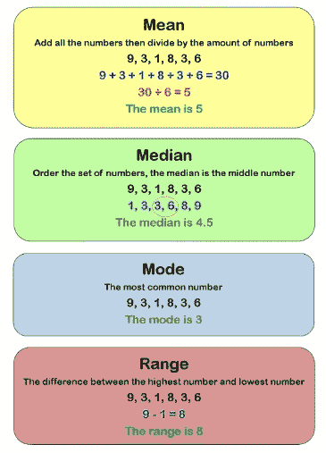

**预测分析**是一个用于确定过去或未来的销售和绩效等指标的概念。时间序列分析、回归、多元统计技术表征预测模型。

**规定分析**是一种规定的高级分析技术。它是采取某些行动的过程。对于过程的连续性，其特征在于图形分析、模拟、神经网络、推荐引擎、启发式和机器学习技术。

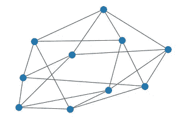

## 2)标准偏差和方差

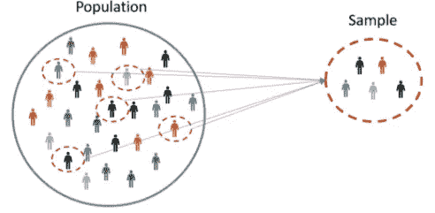

标准差是一种用于概括总体、样本、概率分布或随机变量的数据值分布的度量。

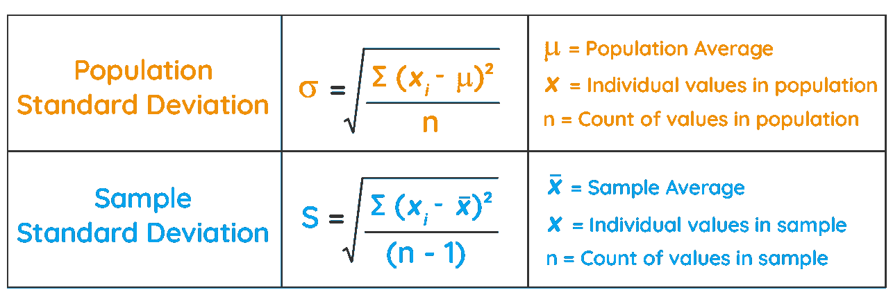

数据离均值越远，标准差越大，分布越广。

**差异**

方差是标准偏差的平方。它给出了关于方差分布程度的信息，并且随着方差的增加而扩散。

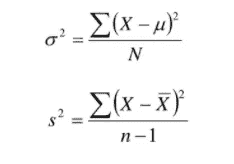

## 3)高斯/正态分布

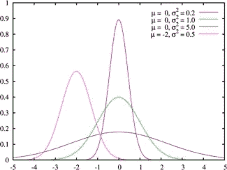

它是一个与平均值等距的对称概率分布。接近平均值的数据比远离平均值的数据出现得更频繁。

## 4) **标准正态分布和 Q-Q 图**

均值为零、标准差为 1 的分布称为标准正态分布。

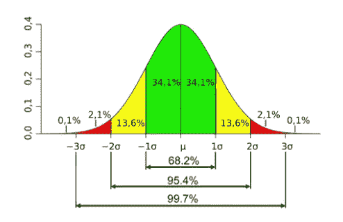

标准正态分布

例如，这可能是一个班级考试成绩的分布。成绩接近平均分的占大多数，而得到低分或高分的学生较少。

**Q-Q 图**

Q-Q 图是一种概率图，用于以图形方式比较两种概率分布。它提供了一个图形视图，显示位置、比例、斜度等属性在两种分布中的相似性或差异性。

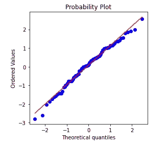

Q-Q 图

## 5) z 分数和标准化

它也被称为标准乐谱。它是原始分值(即观察值或数据点)高于或低于所观察或测量的平均值的标准偏差数。高于平均值的原始分数为正标准分数，低于平均值的原始分数为负标准分数。

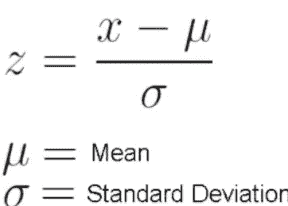

这个将原始分数转换成标准分数的过程叫做**标准化**或**规范化**。

**标准化(z 分数标准化)**

我们想要检查这两个值之间的关系，但是这些数据在数值上是不相关的。例如，如果我们看看年龄和工资之间的关系，工资数据与年龄相比是非常高的。例如，在这里，使用 z 分数归一化，在两个数据之间提供了有意义的关系。

或者我们想把期中和期末成绩联系起来，但是期末平均分挺低的。例如，期中考试得 45 分的学生可能是班上最后一名，而期末考试是最好的。因此，这些值被归一化以关联这两个检查。

它从数据中依次减去平均值，然后除以标准差。我们用 python 编码，比如:

## 6)概率密度函数

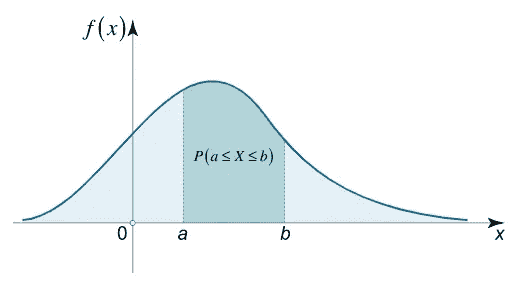

a-b 之间 x 的概率

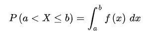

概率密度函数是一种统计表达式，它定义了与连续随机变量相对的离散随机变量(如股票或 ETF)的概率分布(结果的可能性)。

## 7)核密度估计

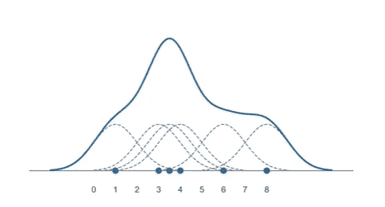

核密度估计(KDE)是一种估计随机变量概率密度函数的非参数方法。KDE 是一个基本的数据平滑问题，根据有限的数据样本对总体进行推断。

例如，让我们将一个数据集定义为患者健康。我们把这些数据显示在数字线上。通过查看这个样本来估计概率密度(f(x))称为密度估计。这里我们期望 f(x)在样本密集的地方更大。

## 8)中心极限定理

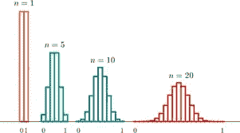

中心极限定理指出，如果你有一个均值为μ、标准差为σ的总体，并从替换总体中抽取足够大的随机样本，那么样本均值的分布将近似为正态分布。

## 9)假设检验

统计学中的假设检验是一种对分析或实验的结果进行检验的方法，以查看是否有有意义的结果。你基本上是通过计算你的结果偶然发生的几率来测试你的结果是否有效。如果你的结果可能是偶然发生的，那么这个实验是不可重复的，因此用处不大。

**假设**

H0(零假设):它基本上定义了变量之间没有确切或实际关系的陈述。

H1 或 Ha(替代假说):它做出一个陈述，暗示或建议一个潜在的结果或一个调查者或研究者可能期望的结果。

**显著性水平**

在假设检验中，显著性水平是用于拒绝零假设的标准。换句话说，我们用来确定样本证据强度的数值度量被称为显著性水平，我们愿意认为样本证据的强度足以拒绝 H0，它用α表示。传统上，实验者使用 0.05 水平(有时称为 5%水平)或 0.01 水平(1%水平)。

**测试统计**

检验统计量是在统计假设检验中使用的统计量(从样本中得出的数量)。一个检验统计量离中间值越远，它就越有可能是真正异常的，或者有足够的证据表明零假设是错误的。

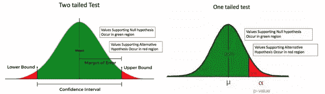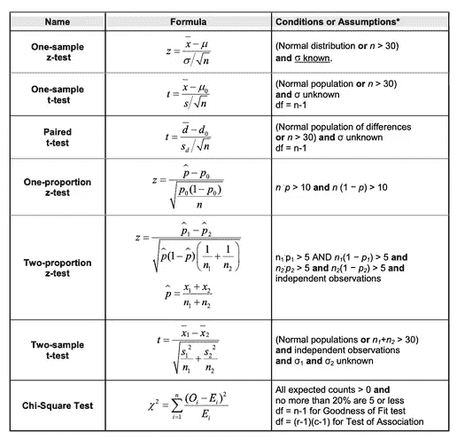

**P 值**

**P 值**是观察样本统计的概率。低 p 值是好的；它们表明你的数据不是偶然出现的。例如，p 值为 0.01 意味着实验结果偶然发生的概率只有 1%。在大多数情况下，p 值为 0.05 (5%)表示数据有效。

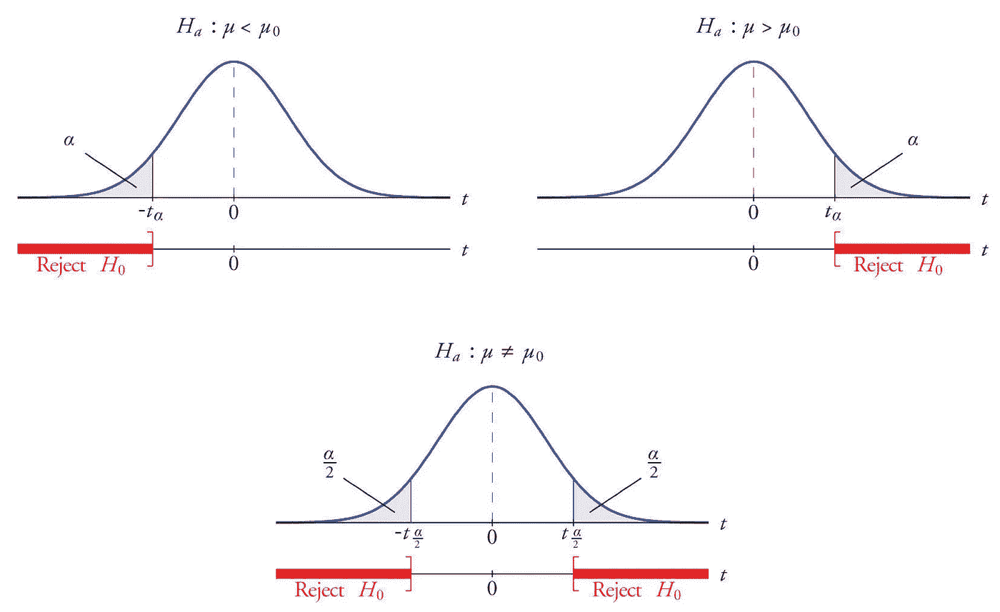

*在问题中，H0 被认为是正确的，并进行检验统计(z 或 t)。*
*临界值与检验统计量进行比较。如果我们找到的 z 或 t 值在待剔除的零件中(如果超出临界值*)，H0 被剔除。**

## 10)错误的类型

两种潜在的统计误差类型是 I 型误差(α，或显著性水平)，当人们错误地拒绝一个为真的零假设时，和 II 型误差(β)，当人们不能拒绝一个为假的零假设时。

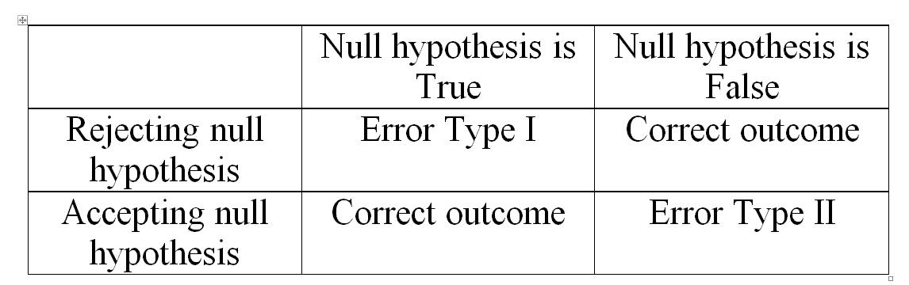

这是我们的前 10 步。为了不使你厌烦，我不想延长这篇文章，请继续关注其他 20 个步骤，我将谈论协方差和相关性分析！