# 机器学习的统计学

> 原文：<https://medium.com/analytics-vidhya/statistics-in-machine-learning-a1eb88b88da2?source=collection_archive---------17----------------------->

使用数字和统计模块

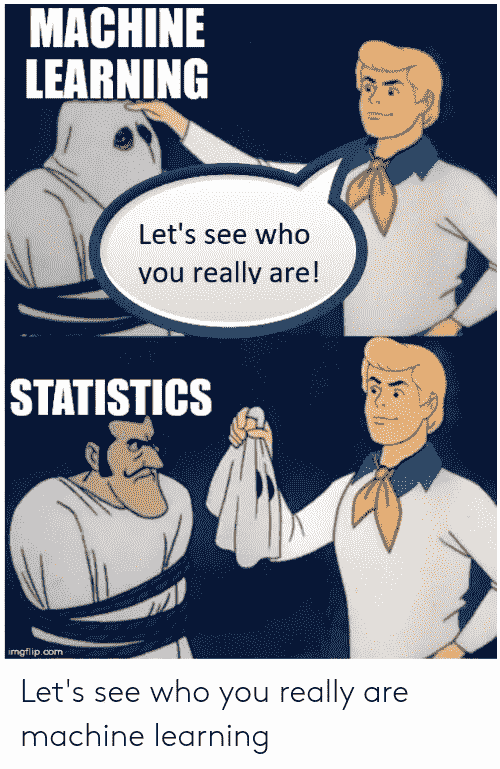

统计是一组工具，您可以使用它们来获得有关数据的重要问题的答案。我们需要统计学来帮助将观察结果转化为信息，并回答有关观察样本的问题。

总结一下→

> 统计学是经过数百年发展起来的工具的集合，用于在给定观察样本的情况下总结数据和量化某个领域的属性。

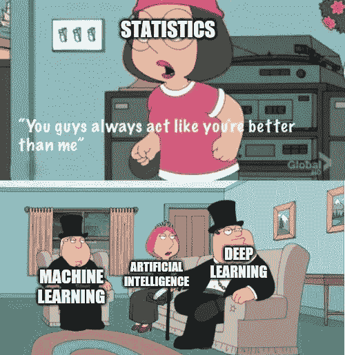

## 安装统计模块

```
pip install statistics
```

## 导入统计数据

```
import statistics as stat
```

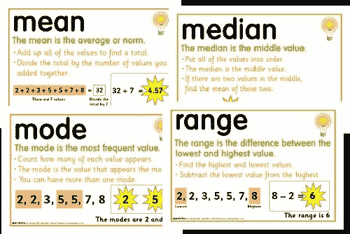

## 计算平均值、众数和中位数

*   **意为**。分布中的中心趋势或最可能值(钟形顶部)
*   **中值**中值是中间的数据值，当有奇数个数据值且数据已按升序排序时。如果是偶数，则中位数是两个中间数据值的平均值。
*   **模式**模式是出现频率最高的数据值

```
stat.mean([1,2,3,4,5])
**OUTPUT** 
3
stat.median([1,2,3,4,5])
**OUTPUT**
3
stat.median_low([1,2,3,4,5,50])
**OUTPUT**
3
stat.median_high([1,2,3,4,5,50])
**OUTPUT**
4
stat.mode([1,2,3,3,3,4,4,4,4,10,10])
**OUTPUT**
4
stat.mode([1,2,3,4,5,50])
**OUTPUT**
1
```

## ***调和的意思是***

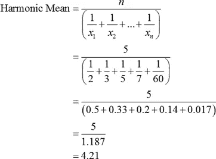

```
 stat.harmonic_mean([1,2,3,4])
**OUTPUT**
1.92
```

## 差异

*   **差异**。观察值与分布中的平均值之间的平均差值(差值)。

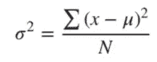

```
stat.variance([1,2,5,500,100])
**OUTPUT** 46524.29999999999
```

## 标准偏差

*   平均值的单位与分布的单位相同，尽管方差的单位是平方，因此更难解释。方差参数的一个常用替代方法是**标准差**，它就是方差的平方根，返回的单位与分布的单位相同。

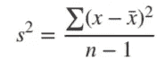

```
stat.stdev([1,2,5,500,100])
**OUTPUT** 215.69492344512884
```

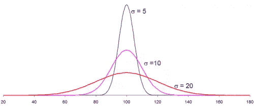

# 使用 Numpy 执行统计

*   由随机数函数生成随机数和修正某些整形函数
*   在整个数组和每个轴上寻找最小的数。
*   使用 numpy 随机模块中的洗牌函数
*   寻找平均值

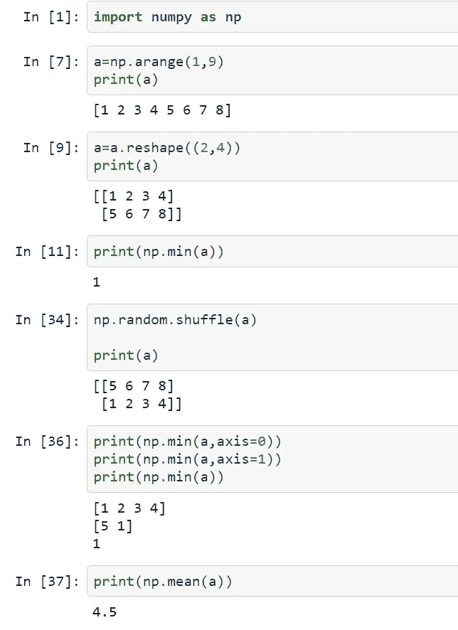

*   沿着每个轴寻找平均值

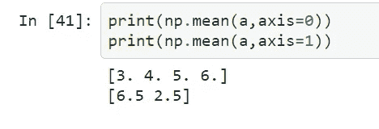

*   寻找中间值

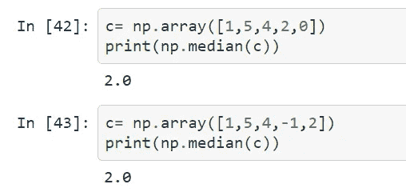

*   标准偏差和方差

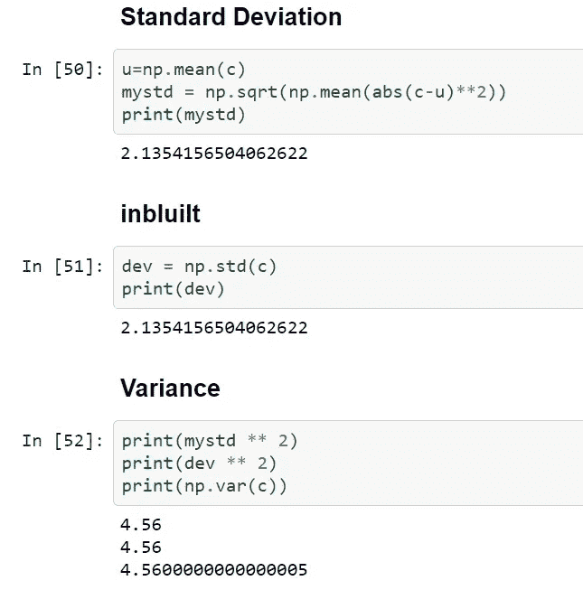

阅读统计和概率

[](https://aditrisriv.medium.com/probability-statistics-bed-rock-of-machine-learning-82dcdadc744e) [## 概率与统计:机器学习的基石

### 机器学习是一个跨学科的领域，使用统计，概率，算法来学习数据和…

aditrisriv.medium.com](https://aditrisriv.medium.com/probability-statistics-bed-rock-of-machine-learning-82dcdadc744e) 

感谢阅读:)