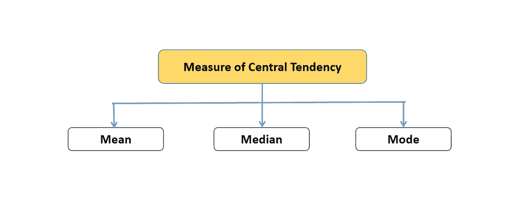
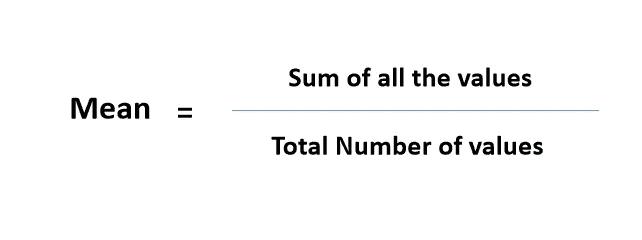
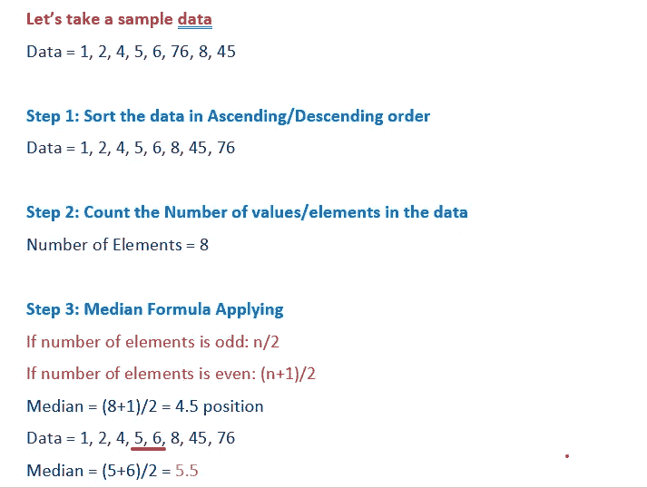

# 统计学:平均值、中位数和众数

> 原文：<https://medium.com/analytics-vidhya/statistics-mean-median-and-mode-16a90c75cbb?source=collection_archive---------12----------------------->

## 集中趋势的测量-统计学中的均值、中值和众数-使用样本数据和 python 程序应用的深入公式

## *集中趋势的测量——平均值、中间值和众数*

# 为什么是这个博客？

每一个博客/教程都在讲述他们自己的统计学和均值、中值和众数概念。一些博客可能会让你崩溃，让你无法理解我的经历带给我的痛苦。

所以，我对写“统计学中清晰的概念解释”产生了兴趣，这也有助于我清楚地回忆这些概念，以备将来使用。


由[卡洛琳·克里斯汀](https://unsplash.com/@carolynchristine?utm_source=medium&utm_medium=referral)在 [Unsplash](https://unsplash.com?utm_source=medium&utm_medium=referral) 上拍摄的照片

# 统计学导论

如果你正在学习任何概念，试着向你提问。。

> 这是什么？
> 
> 为什么它很重要？
> 
> 它是如何工作的？和
> 
> 如何实现这一点？

如果你能回答以上问题。。。你可以用最简单的方式教授任何概念。

在我们进入均值、中值和众数概念之前，我们需要了解一下统计学以及它为什么重要？

什么是统计学:统计学是数学的一个分支，它将你的数据转化为对决策者有用的见解。。。


图片来源:[https://www.pngegg.com/en/png-purmy](https://www.pngegg.com/en/png-purmy)

**为什么统计学对数据科学很重要**？

统计学是最重要的学科之一，它提供工具和方法来发现数据中的结构并提供对数据的更深入的见解，也是分析和量化不确定性的最重要的学科。

它是假设检验、机器学习、深度学习概念等的支柱。。。

# 集中趋势的度量

集中趋势的**度量**是表示数据集中心点的描述性统计量之一(即**通过识别中心位置**以单个值描述数据)

集中趋势的测量分为 3 种类型

1.  **的意思是**
2.  **中位数**
3.  **模式**



作者图片

# 平均

平均值是集中趋势的量度之一，它给出了数据的平均值(即**所有值的总和除以总数值**)



作者图片

让我们取一个样本数据，并使用 numpy、统计软件包和公式得到输出。

***这里是 Python 代码，意思是***

```
# Importing packages
import statistics
import numpy as np
# Sample Data
data = [1,2,4,5,6,76,8,45]
# Using simple mean formula
mean = sum(data)/len(data)

print(mean)
# output of numpy package
print(np.mean(data))
# output of statistics package
print(statistics.mean(data))
```

***表示笔记本片段***

由作者创建

如果你看到，所有的包/公式输出显示相同的结果。。。

# 中位数

Median 给出排序数据的中间值。它主要用于在数据中进行数据预处理时检测/去除异常值和输入缺失值

让我们取一个样本数据，并尝试使用简单的步骤找到中位数



作者创建的图像

***这里是 Python 代码中值***

```
import statistics
import numpy as np

data = [1,2,4,5,6,76,8,45]

# Using Formula without Python Packages
"""
If number of elements = odd - - - -> n/2
If number of elements = even - - → (n+1)/2
We can't use the (n+1)/2 exactly in coding. Because finding the position using float values gets error. So, I am slightly changing the formula for Even.
m1 = (n/2)th position
m2 = ((n/2) - 1) th position
"""
sorted_data_median = sorted(data)
print("Sorted Data:", sorted_data_median)
m1 = int(len(sorted_data_median)/ 2)
m2 = int((m1 - 1))
print(f"Position of the data: {m1} and {m2}")
print(f"Values in the Position: {sorted_data_median[m1]} and {sorted_data_median[m2]}")
median = (sorted_data_median[m1] + sorted_data_median[m2])/2
print("Median:",  median)

# Using numpy package
print(np.median(data))

# Using statistics package
print(statistics.median(data))
```

***中值笔记本片段***

由作者创建

# 方式

众数是数据集中出现次数最多的值。它主要用于删除自然语言处理中出现的最大单词，并在数据集中进行数据预处理时输入缺失值。

```
# Importing packages
import statistics
from scipy import stats
# Sample data
data = [1,2,3,4,4,5,6,7,7,7,7,6,6,4,3,2,1]
# Using Scipy Package
output = stats.mode(data)
print(f"The Number {output[0]} occured {output[1]} times")
# Using Statistics package
print(statistics.mode(data))
```

***模式笔记本片段***

由作者创建

# 结论

终于我们走到了尽头。。。我们已经看到了均值、中值和众数以及它们在分析和数据预处理工作中的用途。利用均值、中位数和众数，我们可以看出分布是否偏态(左偏态和右偏态)。

如果你对这个话题有任何疑问或建议，请在评论区发表你的评论。

不断通知我。。。通过点击喜欢来提高我的写作技巧


*谢谢大家，*

***巴拉穆茹甘 N G***

[](https://www.linkedin.com/in/ngbala6/) [## 数据科学家| LinkedIn

### 查看 Bala Murugan N G 在全球最大的职业社区 LinkedIn 上的个人资料。Bala Murugan 列出了 1 项工作…

www.linkedin.com](https://www.linkedin.com/in/ngbala6/)