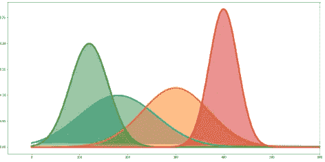
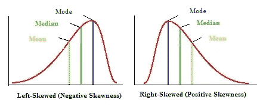
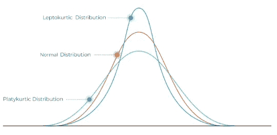
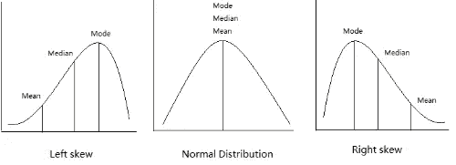
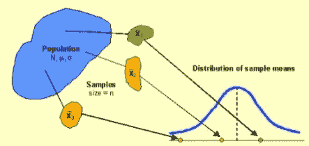
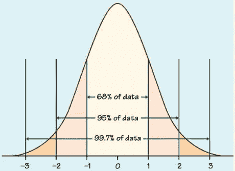
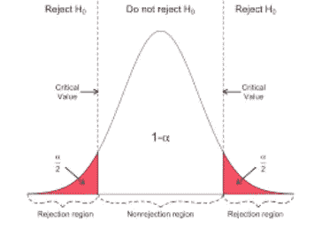
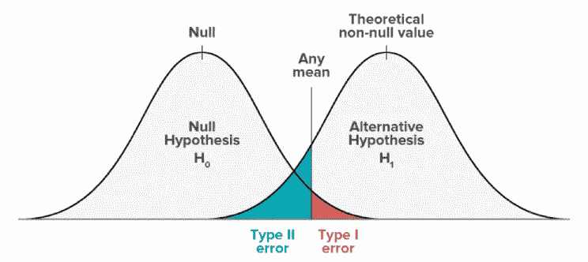

# 统计—快速参考

> 原文：<https://medium.com/analytics-vidhya/statistics-quick-reference-4cad05eebd45?source=collection_archive---------29----------------------->

**随机数**有两种类型

离散随机数

连续随机数

**分布**是一个数学函数，给出统计表达式的输出及其出现概率。

**正态分布**是分布的一种类型

连续随机变量的最重要分布

钟形

也称为**高斯分布**

正态分布由两个参数区分

1.平均

2.标准偏差-

这里平均值和众数都相等

分布的平均值可以是任何数值，-ve，+ve 或 0

曲线的总面积= 1

标准偏差**越小，**分布越高

标准差越大，分布越广

正态分布对称。

**标准差**:衡量我们的数据围绕平均值分布的程度。有两种类型

总体的标准偏差

样本的标准偏差

**偏斜度**:分布的不对称程度，有两种类型

*   右偏分布
*   左偏分布

**峰度**

正值告诉我们，我们有一个沉重的尾巴(即，我们有很多数据在我们的尾巴)。负值意味着我们的尾部没有什么价值。

标准正态分布可以有三个峰度

*   中纬度(正态分布)k = 0
*   Lepokurtic (skinny) k > 0
*   platykurtic(broad)k<0

**Mean**=集中趋势的平均值

**中位数** =取决于数据集中元素的数量是奇数还是偶数。首先将数据集从最小到最大重新排序。奇数时-偶数时最中间-中间两项的平均值，即第(n/2+(n/2+1)项/2

**模态**:出现频率最高的元素。可以有一种以上的模式——双峰、三峰。

**群体**:一个数据集的所有元素，可以是有限的，也可以是无限的。标准差平方指的是总体的方差。

样本是总体的一个子集。寻找**抽样分布**的步骤

1.  求人口平均数。
2.  从人群中随机抽取样本
3.  找出每个样本的平均值
4.  绘制样本均值的集合。

大数定律:如果样本量很大，样本均值会更接近总体均值，也称为平均律。

**中心极限定理:**

告诉我们对给定总体抽取重复样本时均值分布的形状。样本分布与总体分布均值相同。如果样本量较大，则正态分布会更高、更窄。它非常接近样本平均值。

**Z 分数**

z 值告诉我们，一个特定的数据值高于或低于平均值多少个标准差？它允许标准化分数，以便可以在样本或测试之间进行比较。也称为标准化分数。它们是被赋予一个共同标准的分数或数据值。

为什么 Z 分很重要？

它允许我们计算正态分布中出现的数字的概率。它允许我们比较来自不同正态分布的两个分数

**假设检验**

**Z 检验:**可以在标准差已知的情况下使用。样本包含至少 30 个观察值。检查 Z 得分(prob)表中的 p 值。

**T 检验**:在标准差未知的情况下使用。对于未知情况，检验统计量具有 n-1 个自由度的 t 分布。这里我们将在 t 表中找到自由度的值。

**P 值:**根据 Z 得分和 T 得分值，我们得到 P 值，这有助于我们支持或拒绝零假设。**更小的 p 值是你应该拒绝零假设的更有力的证据。**

**临界值**

如果检验统计量大于临界值，我们可以宣布统计显著性并拒绝零假设。

临界值取决于参数的概率分布和置信水平。

统计推断

类型 1 错误—当空值为真时，拒绝空值假设

第二类错误——当备选项为真时，不要拒绝零假设

如果 p 值≤显著性水平，拒绝零假设。置信区间用于给出我们感兴趣参数的内部估计。置信区间的中心是我们的最佳估计->样本均值。误差幅度是对标准误差的估计。总体均值置信区间的假设

随机样本中考虑的数据

有反应的人群正常

[还有一些更进一步的阅读](https://sen-aby.medium.com/some-statistical-notes-25ae5e0361f1)