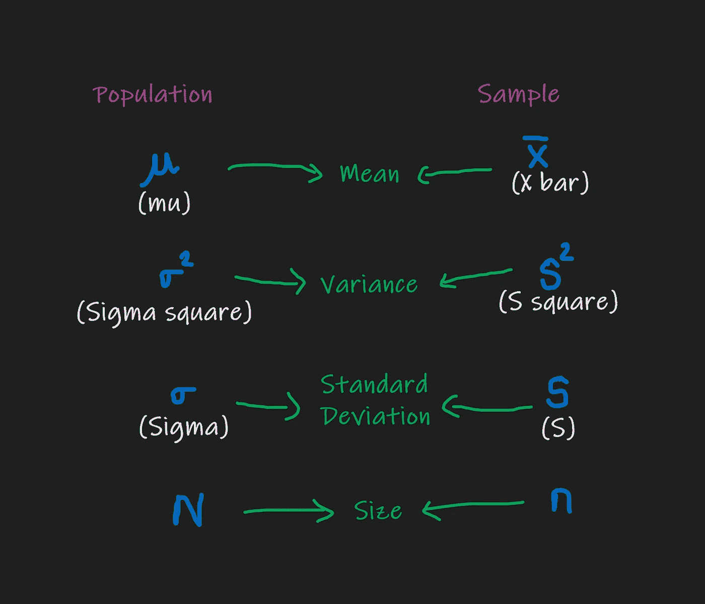
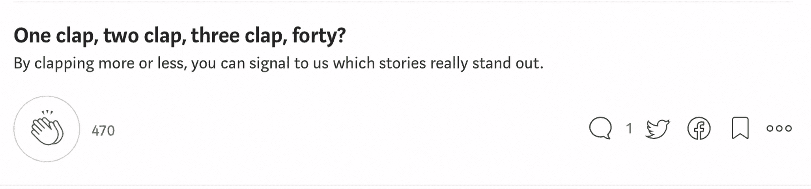

# 统计:范围、方差和标准差

> 原文：<https://medium.com/analytics-vidhya/statistics-range-variance-and-standard-deviation-f26bbfa0bbaa?source=collection_archive---------6----------------------->

## 可变性/分散性的度量:范围、方差和标准差，为什么分母(n-1)和分子在方差中是平方的？？？

# 介绍

在这篇博客中，我们将了解

*   ***人口&样本***
*   ***什么是可变性/分散性的度量？？？***
*   ***范围***
*   ***总体方差&样本***
*   ***为什么方差中分子是平方的？？？***
*   ***为什么样本方差中的分母是(n-1)？？？***
*   ***总体和样本的标准差***

> 让我们开始行动吧。。。。。。。

# 人口和样本

***总体*** :总体是用于分析或预测的整个群体。

***样本*** :样本是总体的子集(即从总体中随机抽取样本)。样本的大小总是小于总体的总大小。


[https://www.omniconvert.com/what-is/sample-size/](https://www.omniconvert.com/what-is/sample-size/)

更好地理解人口和样本，参数和统计，有偏见和无偏的概念，然后阅读这篇博客。。。

[](https://ngbala6.medium.com/population-sample-parameter-statistic-biased-unbiased-ead2021d93d7) [## 统计学:总体和样本参数和统计有偏和无偏

### 我们将涵盖总体和样本、参数和统计、总体均值和样本均值、有偏和无偏

ngbala6.medium.com](https://ngbala6.medium.com/population-sample-parameter-statistic-biased-unbiased-ead2021d93d7) 

人口和样本的符号—作者创建的图像

# 离差/可变性的测量

**可变性测量**是一种描述性统计，表示数据集中的离差量。在**中心趋势测量中**描述了典型值，**可变性测量**定义了数据点偏离中心的距离。

有三种方法可以计算离差。。。

*   范围
*   差异
*   标准偏差


由作者创建

# 范围

*范围是数据集中最大值和最小值之间的差值。这是测量离差/可变性的方法之一。*


图片来源:[https://cdn.corporatefinanceinstitute.com/assets/range1.png](https://cdn.corporatefinanceinstitute.com/assets/range1.png)


图片来源:[https://www.educba.com/range-formula/](https://www.educba.com/range-formula/)

## Python 脚本

```
# Sample data
data = {4, 6, 9, 3, 7}

range = max(data) - min(data)print("Maximum Value : ", max(data))
print("Minimum Value : ", min(data))print("Range : ", range)**"""
Output
>>>>Maximum Value : 9
>>>>Minimum Value : 3
>>>>Range : 6
"""**
```

当值过高或过低时，该范围有时会产生误导。

例如:在 **{8，11，5，9，7，6，2500}** 中:

*   最低值是 5，
*   最高的是 2500，

所以范围是 25005 =**2495**。

所以我们最好使用 ***四分位距*** 或 ***标准差***

# 差异

方差是离差/可变性的度量之一。它给出了数据点如何随集中趋势的度量而变化。

## 总体方差

求总体数据的方差称为 ***总体方差***


作者创建的图像

## 采样离散

求样本数据的方差称为 ***样本方差。***


作者创建的图像

> ***差异:Python 实现***

差异示例

# 为什么分子是方差的平方？？？

因为，如果你不平方这些项，相反符号的(+ve 和-ve)值会相互抵消，因此它趋向于零。为了避免这种情况，我们将这些值平方，因此这些值变成(+ve)。

例子

> 等等。。。等等。。。注意到**样本方差**公式了吗？？？与**人口方差相比，分母右侧略有变化。**。。

# 为什么样本方差中的分母是(n-1)？

有两个角度。。。

1.  **贝塞尔校正**

由于样本(样本均值随着样本大小的增加/减少而改变)和偏差(向数据一侧倾斜)，样本统计低估了总体参数。为了减少估计总体方差的偏差，我们在分母中使用(n-1)。

**2。自由度**

如果我们知道样本平均值，我们就可以用样本平均值来计算其他数据点。就人口而言，每一个数据点都给出了独立且不变的平均值。

自由度表示计算统计所需的最小数据点/样本数。因此，根据这一点(如果我们知道样本均值，我们可以使用样本均值计算另一个数据点)，我们将分母减少到(n-1)

# 标准偏差

标准差表示“数据点如何偏离集中趋势的度量”。方差的平方根是标准差。

## 总体标准差

寻找性病。人口数据的标准差称为 ***人口标准差***


作者创建的图像

## 样品标准偏差

寻找性病。样本数据的标准差称为 ***样本标准差***


作者创建的图像

> **标准差:Python 实现**

# 结论

我希望这篇文章能帮助你了解可变性的度量:范围、方差和标准差”和带有示例 python 脚本的总体和样本。

比如。。如果你喜欢的话。。。



谢谢你，

## 巴拉穆鲁甘

[](https://www.linkedin.com/in/ngbala6/) [## 数据科学家| LinkedIn

### 查看 Bala Murugan N G 在全球最大的职业社区 LinkedIn 上的个人资料。Bala Murugan 列出了 1 项工作…

www.linkedin.com](https://www.linkedin.com/in/ngbala6/) [](https://github.com/ngbala6) [## ngbala6 -概述

### 数据科学家

github.com](https://github.com/ngbala6)