# 统计:使用 Python 可视化数据！

> 原文：<https://medium.com/analytics-vidhya/statistics-visualize-data-using-python-6d23aee7f6d7?source=collection_archive---------8----------------------->


艾萨克·史密斯在 [Unsplash](https://unsplash.com?utm_source=medium&utm_medium=referral) 上拍摄的照片

这是我将撰写的一系列文章中的第二篇，对统计学进行简要介绍。在本文中，我们将介绍如何使用各种图表可视化数据，以及如何阅读它们。我将展示如何使用 Python 创建这些图表，还将包括代码片段。完整版本的代码请访问我的 [GitHub 库](https://github.com/vivekparasharr/Learn-Programming)。

Python 有许多允许创建视觉上吸引人的图表的库。在本文中，我们将使用内置的 tips 数据集，然后使用以下库进行绘图:

```
import seaborn as sns
tips = sns.load_dataset("tips") # tips dataset can be loaded from seaborn
sns.get_dataset_names() # to get a list of other available datasetsimport plotly.express as px
tips = px.data.tips() # tips dataset can be loaded from plotly
# data_canada = px.data.gapminder().query("country == 'Canada'")import pandas as pd
tips.to_csv('/Users/vivekparashar/Downloads/tips.csv') # we can save the dataset into a csv and then load it into SAS or R for plottingimport altair as altimport statsmodels.api as sm
```

让我们快速了解一下 tips 数据集的结构:

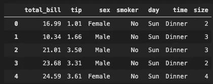

我们将在本文中介绍以下图表:

*   *点状图*显示两个(或多个)时间点之间或两个(或多个)条件之间的变化。

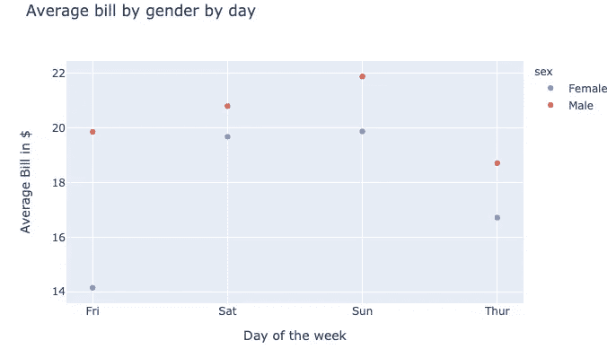

```
# Using plotly library
t = tips.groupby(['day','sex']).mean()[['total_bill']].reset_index()
px.scatter(t, x='day', y='total_bill', color='sex', 
        title='Average bill by gender by day', 
        labels={'day':'Day of the week', 'total_bill':'Average Bill in $'})
```

*   *条形(水平和垂直)图*用于显示数据点的分布，或比较不同数据子组的度量值。

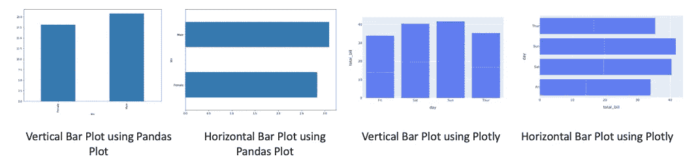

```
# Using pandas plot
tips.groupby('sex').mean()['total_bill'].plot(kind='bar') 
tips.groupby('sex').mean()['tip'].plot(kind='barh')# Using plotly
t = tips.groupby(['day','sex']).mean()[['total_bill']].reset_index()
px.bar(t, x='day', y='total_bill') # Using plotly
px.bar(t, x='total_bill', y="day", orientation='h')
```

*   *堆叠条形图*在您希望每个条形图显示多个分类变量时非常有用

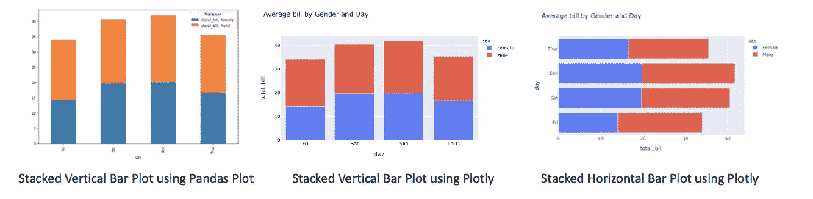

```
# using pandas plot; kind='barh' for horizontal plot 
# need to unstack one of the levels and fill na values
tips.groupby(['day','sex']).mean()[['total_bill']]\
        .unstack('sex').fillna(0)\
        .plot(kind='bar', stacked=True) # Using plotly
t = tips.groupby(['day','sex']).mean()[['total_bill']].reset_index()
px.bar(t, x="day", y="total_bill", color="sex", title="Average bill by Gender and Day") # vertical 
px.bar(t, x="total_bill", y="day", color="sex", title="Average bill by Gender and Day", orientation='h') # horizontal
```

*   *箱线图(水平和垂直)*在箱线图中，数值数据被分成四分位数，在第一个和第三个四分位数之间画一个方框，沿着第二个四分位数再画一条线来标记中位数。在一些箱线图中，第一个和第三个四分位数之外的最小值和最大值用线来描绘，这些线通常被称为胡须。

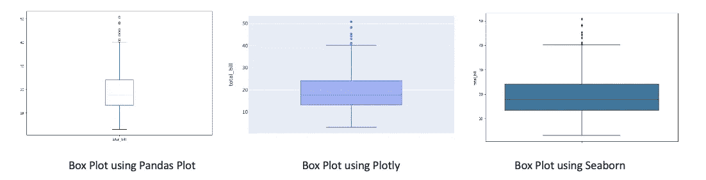

```
# using pandas plot
# we specify y=variable for vertical and x=variable for horizontal for horizontal box plot respectively
tips[['total_bill']].plot(kind='box') # using plotly
px.box(tips, y='total_bill') # using seaborn
sns.boxplot(y=tips["total_bill"])
```

*   *小提琴剧情*是盒子剧情的变种

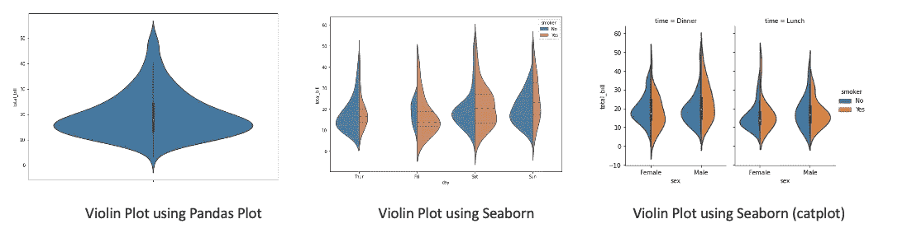

```
# Using seaborn
sns.violinplot(y=tips.total_bill)
sns.violinplot(data=tips, x='day', y='total_bill', 
        hue='smoker', 
        palette='muted', split=True,
        scale='count', inner='quartile',
        order=['Thur','Fri','Sat','Sun'])sns.catplot(x='sex', y='total_bill',
        hue='smoker', col='time',
        data=tips, kind='violin', split=True,
        height=4, aspect=.7)
```

*   *直方图*是数据频率分布的直观表示。频率用条形表示。

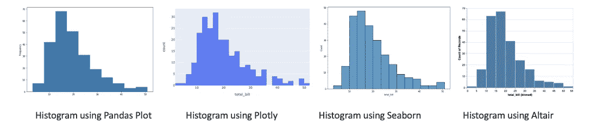

```
# using pandas plot
tips.total_bill.plot(kind='hist') # using plotly
px.histogram(tips, x="total_bill") # using seaborn
sns.histplot(data=tips, x="total_bill") # using altair
alt.Chart(tips).mark_bar().encode(alt.X('total_bill:Q', bin=True),y='count()')
```

*   *概率图*是一种直观比较来自不同分布的数据的方式。它有两种类型——PP 图或 qq 图
*   *pp 图(概率对概率)*是两种分布(经验和理论)的累积分布函数(CDFs)相互比较的可视化方法。
*   *qq 图(分位数对分位数)*用于比较两个分布的分位数。分位数可以定义为具有相等概率的连续区间，或者以类似的方式划分样本。分布可以是理论分布或来自过程的样本分布等。
*   正态概率图是 qq 图的一个例子。这是了解数据集是否正态分布的一种方式

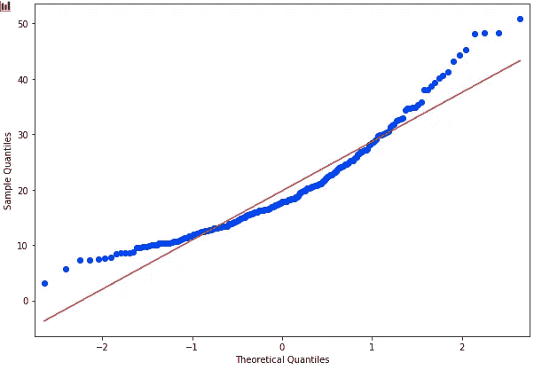

```
# using statsmodels
import statsmodels.graphics.gofplots as sm 
import numpy as np
sm.ProbPlot(np.array(tips.total_bill)).ppplot(line='s') 
sm.ProbPlot(np.array(tips.total_bill)).qqplot(line='s')
```

*   *散点图*显示两个数值变量之间的关系。

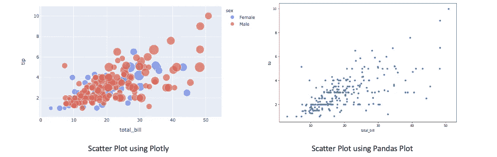

```
# using plotly
px.scatter(tips, x='total_bill', y='tip', color='sex', size='size', hover_data=['day']) # using pandas plot
tips.plot(x='total_bill', y='tip', kind='scatter')
```

*   *Reg plot* 创建两个参数之间的回归线，并帮助可视化它们的线性关系

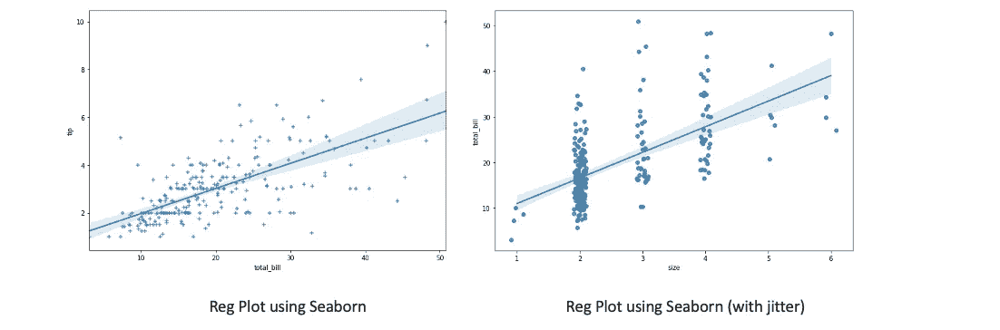

```
# using seaborn
sns.regplot(x="total_bill", y="tip", data=tips, marker='+') # for categorical variables we can add jitter to see overlapping points
sns.regplot(x="size", y="total_bill", data=tips, x_jitter=.1)
```

*   *线状图*用于可视化某事物随时间的价值

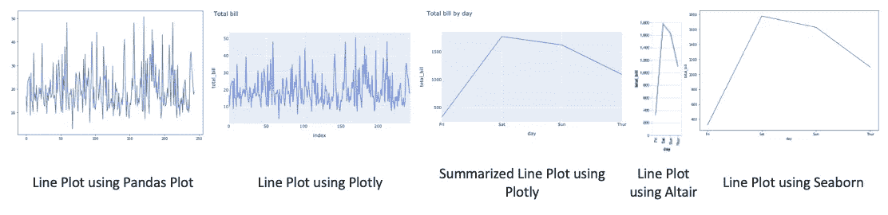

```
# using pandas plot
tips['total_bill'].plot(kind='line') # using plotly
px.line(tips, y='total_bill', title='Total bill') t = tips.groupby('day').sum()[['total_bill']].reset_index()
px.line(t, x='day',y='total_bill', title='Total bill by day')# using altair
alt.Chart(t).mark_line().encode(x='day', y='total_bill') # using seaborn
sns.lineplot(data=t, x='day', y='total_bill')
```

*   *面积图*在图表上绘制数据值以及使用线段连接数据值方面类似于折线图。但是，在面积图中，线段和 x 轴之间的区域用颜色填充。

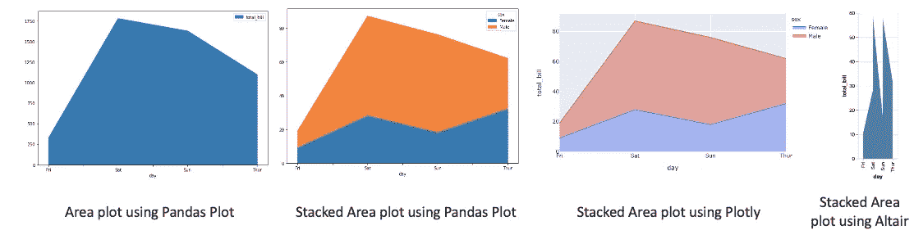

```
# using pandas plot
tips.groupby('day').sum()[['total_bill']].plot(kind='area') # stacked area can be done using pandas.plot as well
t = tips.groupby(['day','sex']).count()[['total_bill']].reset_index()
t_pivoted = t.pivot(index='day', columns='sex', values='total_bill')
t_pivoted.plot.area() # using plotly
px.area(t, x='day', y='total_bill', color='sex',line_group='sex') # using altair
alt.Chart(t).mark_area().encode(x='day', y='total_bill')
```

*   *饼状图*是一个圆形的统计图形，分成若干个切片来说明数字比例。在饼图中，每个切片的弧长与它所代表的数量成比例。

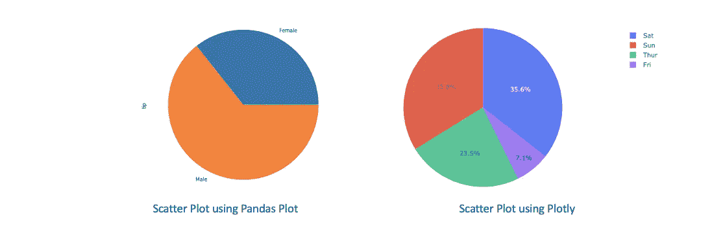

```
# using pandas plot
tips.groupby('sex').count()['tip'].plot(kind='pie') # using plotly
px.pie(tips, values='tip', names='day')
```

*   *旭日图*非常适合显示分层数据。层次结构的每个级别都由一个环或圆表示，最里面的圆作为层次结构的顶部。

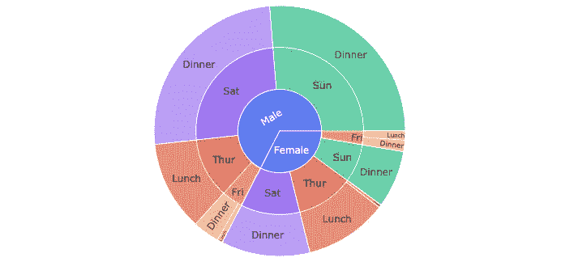

```
px.sunburst(tips, path=['sex', 'day', 'time'], values='total_bill', color='day')
```

*   *雷达图*是一种以二维图表的形式显示多元数据的图形方法，该图表由三个或三个以上的量化变量组成，这些变量在从同一点开始的轴上表示。

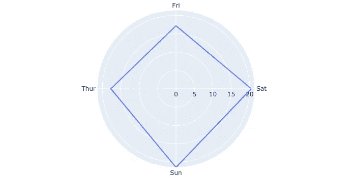

```
# using plotly
t = tips.groupby('day').mean()[['total_bill']].reset_index()
px.line_polar(t, r='total_bill', theta='day', line_close=True)
```

提高可视化的最好方法是通过实践。我发现有用的是参加一个叫做 [TidyTuesday](https://github.com/rfordatascience/tidytuesday) 的每周可视化挑战！

欢迎评论！