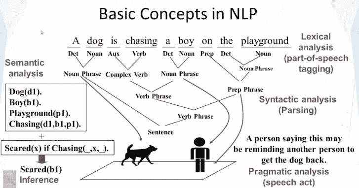
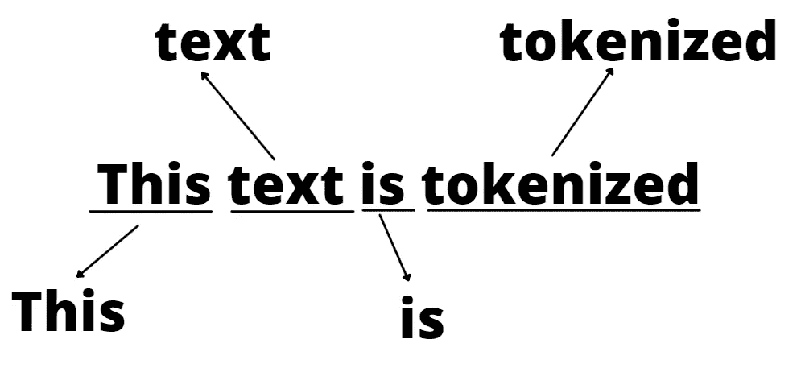
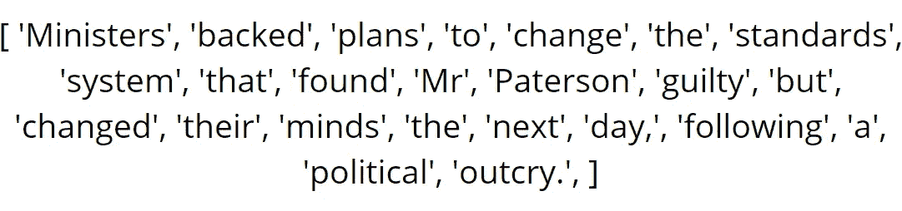
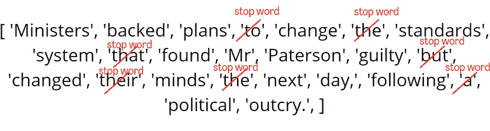
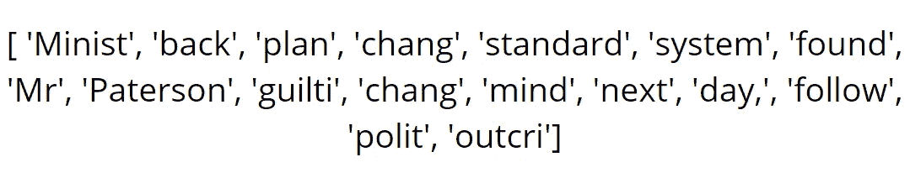
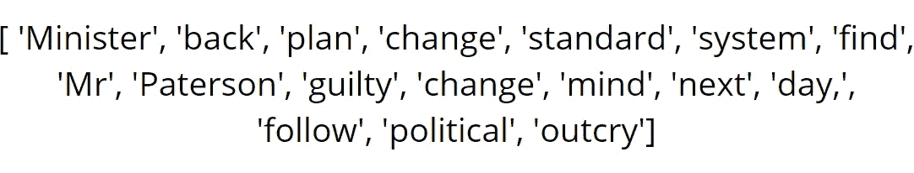

# 词干化与词汇化

> 原文：<https://medium.com/analytics-vidhya/stemming-vs-lemmatizing-f875553e4c39?source=collection_archive---------10----------------------->

在任何 NLP(自然语言处理)工作中，您需要遵循一些共同的步骤，这些步骤在不同的任务之间没有太大的不同。其中一个步骤是对从博客帖子、网页、科学论文、新闻等中检索到的文本进行表示。但是文本的表达不是唯一的。每段文本都有多层表示，每层表示都有自己的分析。它们是词汇分析、句法分析、语义分析和语用分析。对于文本的每次分析，都有一个共同的步骤，即*标记化*。

本图摘自 Coursera 讲座[《文本挖掘与分析》翟](https://www.coursera.org/learn/text-mining)

# 什么是记号化？

你可以说，标记化是简单地将任何文本逐字拆分的过程。当然，这不仅仅是文本的分割，还需要其他过程，以便对文本进行分析。

标记化不足以直接使用标记进行分析。令牌还需要另一个预处理。如果你考虑到有一些方法使用一些指标，如频率，这些令牌可能会误导方法不成功的结果。例如，在这种方法中，单词“follow”和另一个单词“following”是完全不同的，它们没有关系。但是作为人类，我们可以看到这两个词之间有联系。因为‘following’这个词是‘follow’这个词的连续形式。另一方面，它可能用在“我现在在 Instagram 上关注你”或“你能大声朗读下面的句子吗？”。在这两个句子中，follow 这个词的意思是不同的。这是任何 *NLP* 相关研究的另一个挑战。但是在本文中，我忽略了这个挑战。

让我们回到前面的例子*跟随*和*跟随。正如我上面提到的，看到这两个词之间的关系对我一个人来说并不难，但对计算机来说却很难。因此，人们创造了不同的方法来解决这个问题，使区分词尾和词根成为可能。我的意思是，由于这些方法，从词根 follow 中去掉“-ing”部分是可能的。*

# 词干化和词汇化

词干化和词汇化的方法实际上非常相似。这两种方法都侧重于通过移除文本标记的附加部分来从该标记中提取词根。大多数时候使用这些方法中的一种就足够了。但是当然它们也有不同的地方。让我们先看一些象征性的例子。

假设我们有一个文本，我们将这个文本解析成它的标记。现在我们有了一个属于输入文本的标记列表。

在使用词干化或词汇化之前，让我们应用另一个步骤“删除停用词”。这些停用词是一些对文本没有太大影响的词。停用词有 a，the，but，and，that 等..

现在想象我们在这些令牌列表上应用词干。(在此步骤之前，应用移除停止字。)

如你所见，有一些不合适的输出词，如 chang、心虚、polit 和 outcri。这些单词没有意义，但是经过词干处理后，这些就是输出。现在我们来看看引理化的结果。

词汇化的结果除了“有罪”这个词之外，几乎完全没有问题。因为我们希望这个词的词根是“内疚”。但结果还是比炮泥好很多。

# 有什么区别？

这两种方法的主要区别在于词干化可以返回没有意义的结果，而词干化则没有意义。因为词汇化是扫描 WordNet 语料库上的相关单词，但是词干化有时并不产生实际的单词。在语料库上扫描一个单词使得词汇化比词干化慢，但是在结果上更准确。因此，虽然词干化提供了速度，但词汇化提供了准确性。

# 什么是 WordNet 语料库？

WordNet 语料库是一个英语词汇数据库。它是由普林斯顿创造的。它用于查找单词、同义词、反义词等的含义。更多信息，使用 [后面的**链接**](https://pythonprogramming.net/wordnet-nltk-tutorial/)；)