# 在 windows 笔记本电脑上使用 TensorFlow 设置 GPU 的分步指南。

> 原文：<https://medium.com/analytics-vidhya/step-by-step-guide-to-setup-gpu-with-tensorflow-on-windows-laptop-c84634f59857?source=collection_archive---------0----------------------->

gpu，tensorflow，Nvidia GeForce GTX 1650 带 Max-Q，cuDNN 7.6，cuda 10.1，windows 10，tensorflow 2.3。

## **第 1 部分:检查笔记本电脑上的 GPU 卡？**

第一步也是最重要的一步是检查你的笔记本电脑使用的 GPU 卡，根据 GPU 卡你需要选择正确版本的 CUDA，cuDNN，MSVC，Tensorflow 等。要检查 windows 10 笔记本电脑上的 GPU 卡，请遵循以下简单步骤:

*   右击你的桌面
*   打开 Nvidia 控制面板
*   转到帮助->系统信息

在这里您可以检查您的图形卡的全名。

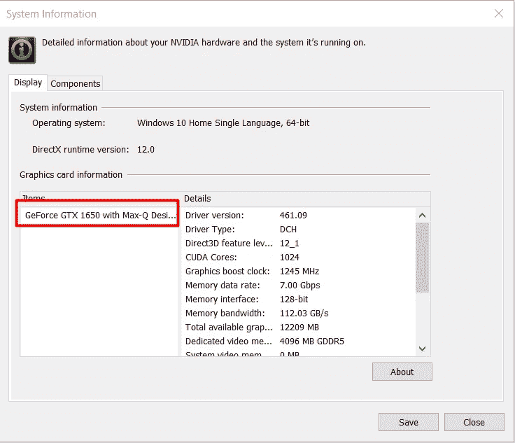

一旦你知道你的机器使用的图形卡的名称，去英伟达网站[这里](https://developer.nvidia.com/cuda-gpus)并检查你的图形卡的计算兼容性(cuDNN)。如果你在 Nvidia 网站上找不到你的显卡，你可以参考[这个维基页面。](https://en.wikipedia.org/wiki/CUDA)

> **注意**在我的情况下，Geforce GTX 1650 没有在 Nvidia 网站上列出，所以我在维基页面上查看了一下[。](https://en.wikipedia.org/wiki/CUDA)

根据维基页面，Geforce GTX 1650 的计算兼容性为 7.5，但没有支持 cuDNN 7.5 的 TensorFlow 版本，因此，我升级了我的图形驱动程序，并使用了与 TensorFlow 2.3.0 完美配合的 cuDNN 7.6。

## 第 2 部分:安装微软 Visual C++ ( **MSVC** )、CUDA、cuDNN 的正确版本

基于您的显卡支持的 cuDNN 版本，在此检查 MSVC、CUDA 和 Tensorflow [的兼容版本。](https://www.tensorflow.org/install/source_windows#tested_build_configurations)

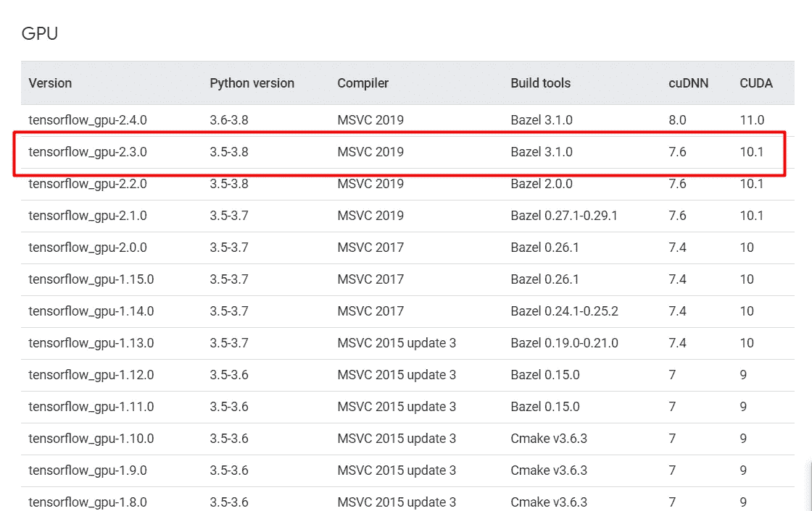

*   **安装 MSVC:** 现在从[这里](https://visualstudio.microsoft.com/vs/features/cplusplus/)下载 MSVC 社区 2019 并安装在你的 windows 笔记本电脑上。安装 Visual studio installer 后，打开它，在 installer 选项卡下修改 Visual Studio Community 2019。

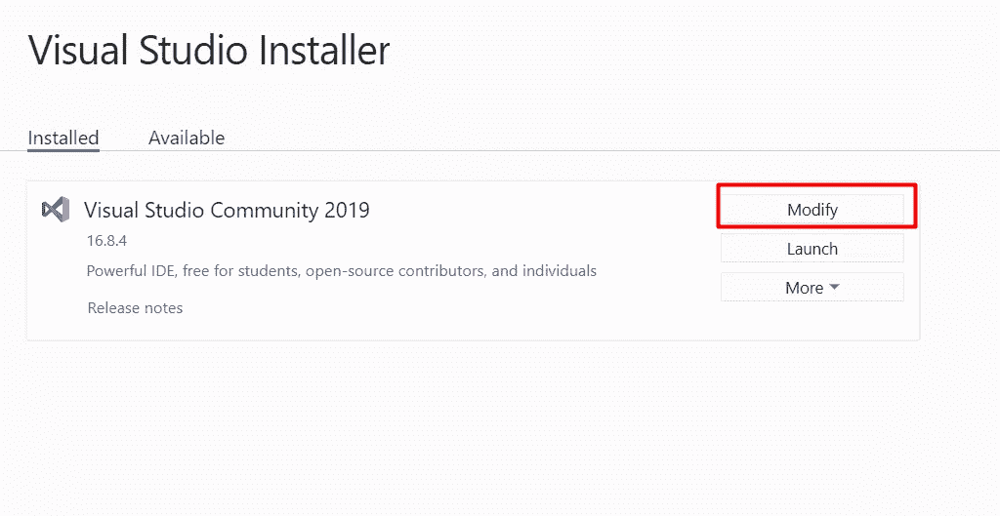

当您修改您的 visual studio 时，将在它下面打开另一个窗口选择单个组件= >搜索 MSVC 2019 = >安装在下图中选择的组件。

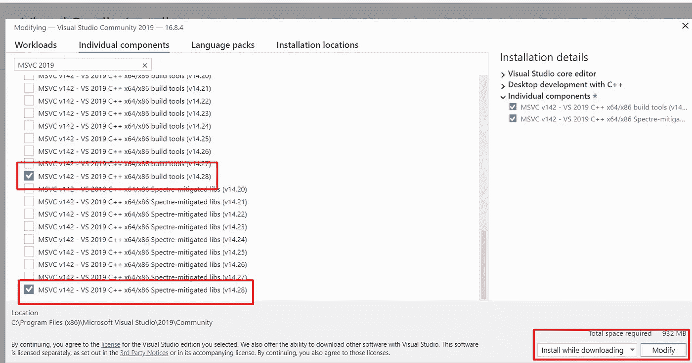

*   **Cuda 安装:**下一步是安装 CUDA 版本，下载与你的cuDNN、Tensorflow、显卡兼容的 CUDA 版本。在我的情况下，GeForce GTX 1650 由 cuDNN 7.6、Cuda 10.1 和 Tensorflow 2.3.0 支持。你可以从这里下载支持的 Cuda 版本[。](https://developer.nvidia.com/cuda-toolkit-ARCHIVE)

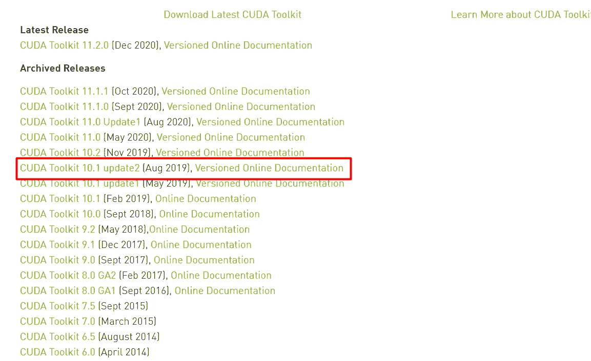

Nvidia 网站上有两种类型的 Cuda 安装程序，分别是网络安装程序和本地安装程序。我下载了本地版本，以避免在网络问题的情况下安装失败。

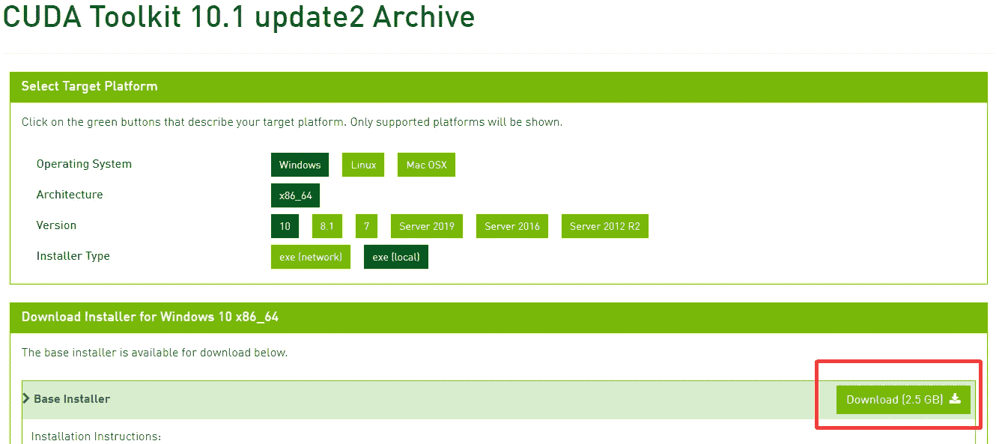

下载 Cuda 安装程序后，按照屏幕上的安装指南进行安装。说明很简单，但是如果您遇到任何问题，请在此处参考完整的[安装指南。](https://docs.nvidia.com/cuda/archive/10.1/cuda-installation-guide-microsoft-windows/index.html)

*   **cuDNN 安装:**这是最重要的一步，如果你安装了一个不正确的 cuDNN 版本，在用 GPU 运行你的代码时你会得到一个错误。对于 GeForce GTX 1650 = > Cuda 10.1、Tensorflow 2.3.0 和 cuDNN 7.6(计算兼容性)兼容。从这里下载 cud nn。*(请注意，您需要登录 Nvidia 网站才能下载 cuDNN)。*这是一个 zip 文件，您需要将文件复制到 Cuda 安装目录中。更多详情请参考 [cuDNN 文档](https://docs.nvidia.com/deeplearning/cudnn/install-guide/index.html#install-windows)。

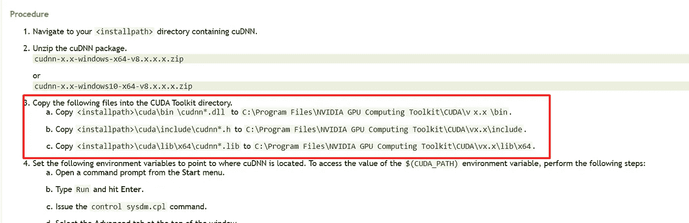

最后一步是为 Cuda 设置环境变量 path。将以下内容添加到路径变量中(根据您的要求更改 Cuda 版本)。

```
C:\Program Files\NVIDIA GPU Computing Toolkit\CUDA\v10.1\binC:\Program Files\NVIDIA GPU Computing Toolkit\CUDA\v10.1\libnvvp
```

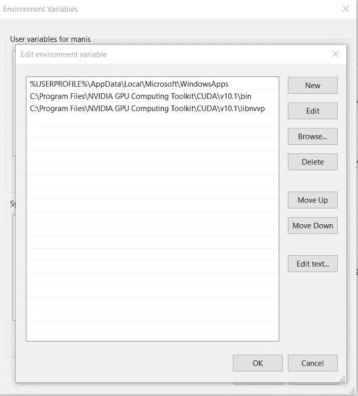

## 第 3 部分:Anaconda、Python 和 PycharmSetup

*   **Anaconda 安装:**从[这里](https://www.anaconda.com/products/individual)下载并安装您机器支持的 Anaconda 个人版本。我已经安装了最新版本的 anaconda [64 位图形安装程序(457 MB)](https://repo.anaconda.com/archive/Anaconda3-2020.11-Windows-x86_64.exe) 。
*   **Python 安装:**您可以根据 Tensoflow 和 Cuda 版本的要求安装 3.5-3.8 之间的 Python 版本。我从这里安装了 python 3.8.7 [。](https://www.python.org/downloads/release/python-387/)
*   **Pycharm 安装:**从[这里下载并安装最新的 Pycharm 社区版本。你可以使用 Jupyter Notebook 或者 Pycharm 来运行你的代码。我将使用 anaconda 提示符创建一个虚拟环境。此外，我将解释如何在我们将要创建的虚拟环境中使用 Jupyter Notebook 和 Pycharm 在 GPU 上运行代码。](https://www.jetbrains.com/pycharm/download/download-thanks.html?platform=windows&code=PCC)

## 第四部分:创建虚拟环境，建立张量流

至此，您已经具备了在 GPU 上运行代码所需的所有配置。在这一步中，我们将创建并设置一个虚拟环境，我们将在运行代码时使用它。

*   **创建和激活虚拟环境:**打开 anaconda 提示符，运行下面的命令创建一个虚拟环境。

```
 conda create -n gpuEnv python=3.8
```

一旦 gpuEnv 创建成功，使用下面的命令激活它。

```
conda activate gpuEnv
```

*   **设置 TensorFlow:** 现在虚拟环境已经准备好，让我们设置 TensorFlow 2.3.0(请注意，这是我的 Cuda 和 cuDNN 版本支持的 TensorFlow 版本)

```
pip3 install --upgrade tensorflow==2.3.0##after activating env run this code in activated env
```

## 第 5 部分:在 GPU 上运行代码

现在我们已经成功地创建了一个虚拟环境，让我们使用 Pycharm 或 Jupyter Notebook 运行我们的代码。我将使用以下代码进行数字识别，使用 TensorFlow 实现。

```
import numpy as np
import tensorflow as tf

# load MNIST Digit data
data = tf.keras.datasets.mnist

# here data is split into 70,30 by default
(X_train, Y_train), (X_test, Y_test) = data.load_data()

# normalizing data
X_train = tf.keras.utils.normalize(X_train)
X_test = tf.keras.utils.normalize(X_test)

# checking shape of data
print(X_train.shape)
print(X_test.shape)

# function to create and compile model
def createModel(input_shape, num_classes, optimizer, loss, metrics):

    model = tf.keras.models.Sequential()  ##a feed forward model , created stack of layer on top of it
    model.add(tf.keras.layers.Input(shape=input_shape))
    model.add(tf.keras.layers.Flatten())
    model.add(tf.keras.layers.Dense(64, activation='relu'))
    model.add(tf.keras.layers.Dense(128, activation='relu'))
    model.add(tf.keras.layers.Dense(128, activation='relu'))
    model.add(tf.keras.layers.Dense(num_classes, activation='softmax'))

    model.compile(optimizer=optimizer, loss=loss, metrics=[metrics])

    return model

# model
model = createModel(input_shape=(28, 28), num_classes=10, optimizer='adam',
                    loss='sparse_categorical_crossentropy',
                    metrics='accuracy')

model.summary()

print("Num GPUs Available: ", len(tf.config.experimental.list_physical_devices('GPU'))) #print no of GPU device

model.fit(X_train, Y_train, epochs=30, validation_split=0.1)
```

*   **使用 Pycharm 运行代码:**打开 pycharm 并新建一个项目。创建项目时，选择 base interpreter 作为您之前创建的虚拟环境。

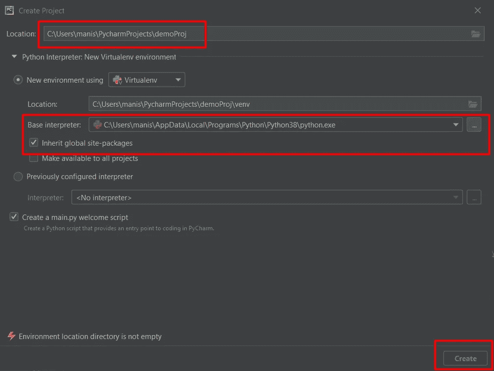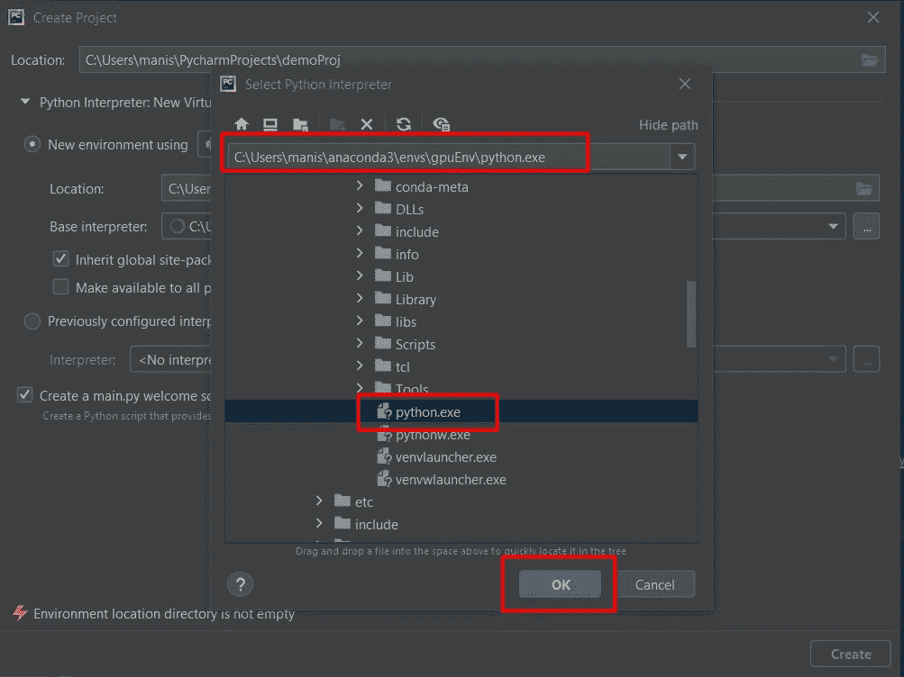

现在你的项目已经准备好创建一个. py (python)文件，复制上面的代码并运行它。要验证代码是否在 GPU 计算机上成功运行，请在 pycharm 控制台中检查以下几点。

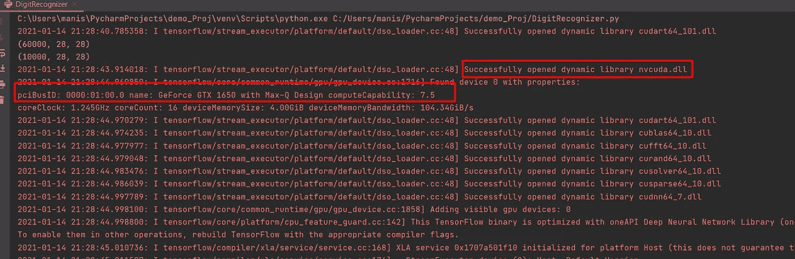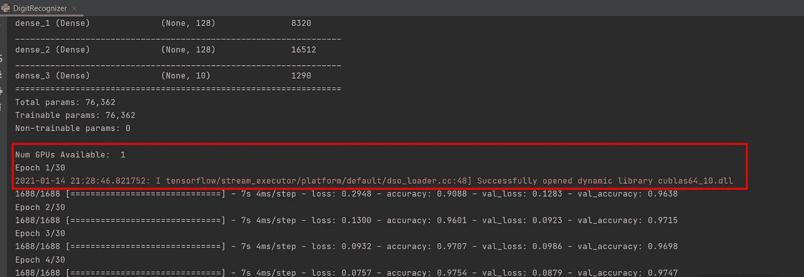

*   **使用 Jupyter notebook 运行代码:**要在创建的虚拟环境上运行代码，需要手动将其添加到 Jupyter Notebook 中。你需要安装 [ipykernel](https://github.com/ipython/ipykernel) ，这样你就可以给 Jupyter notebook 添加一个虚拟环境。按照以下步骤创建虚拟环境并将其添加到 Jupyter 笔记本电脑中。

1 .使用 anaconda 提示符创建一个虚拟环境，激活它，并安装 TensorFlow 2.3.0

```
conda create -n virEnv python=3.8conda activate virEnvpip3 install --upgrade tensorflow==2.3.0
```

2.使用下面的命令安装 ipykernel。(在同一个 anaconda 提示符中)

```
pip install --user ipykernel
```

3.接下来，使用下面的命令在 Jupyter 笔记本中添加虚拟环境。

```
python -m ipykernel install --user --name=virEnv
```

4.现在打开 Jupyter 笔记本，在 Files => New = >下选择你的虚拟环境。

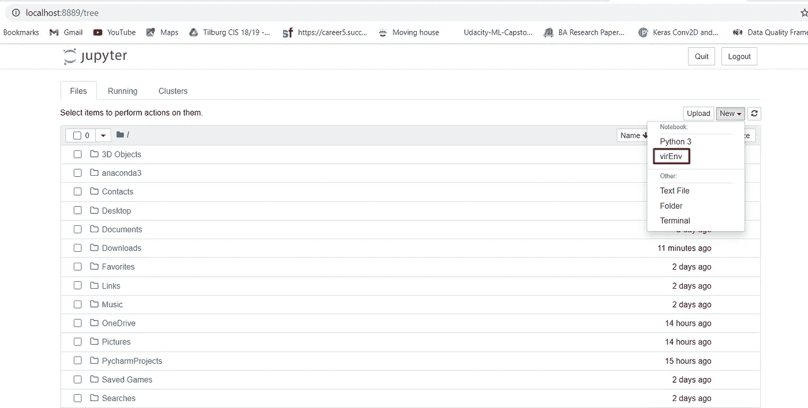

5.现在你可以复制上面的代码并运行它。您可以注意到笔记本右侧的虚拟环境。

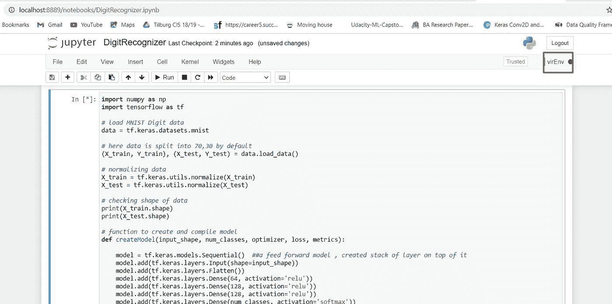

## 结论:

平均来说，使用 GPU 运行每个训练步骤需要大约 3 到 7 秒，然而，当我使用 CPU 运行相同的代码时，每个训练步骤需要大约 20 到 23 秒。我尝试了 Cuda (10，10.1，11)，cuDNN (7.5，7.6，8.0)，TensorFlow (1.15，2.3.0，2.4.0)的几种组合。在这些组合中，以下两个组合适用于我的 GeForce GTX 1650 显卡。

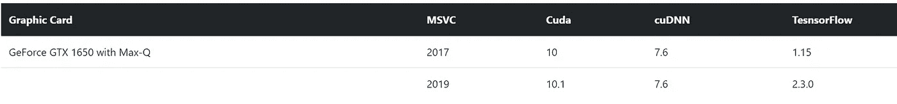

> 请注意，更新我的显卡驱动程序帮助我支持 cuDNN 版。如果您找不到支持您的 GPU 计算兼容性(cuDNN 7.6)的 TensorFlow 版本，那么这个技巧可能会帮助您在显卡上支持更高版本的 cuDNN。

## 感谢您的阅读…