# 逐步–在 Windows 上安装 VMware Workstation。

> 原文：<https://medium.com/analytics-vidhya/step-by-step-install-vmware-workstation-on-windows-1027abc3fadc?source=collection_archive---------0----------------------->

由 [Unsplash](https://unsplash.com?utm_source=medium&utm_medium=referral) 上的[窗口](https://unsplash.com/@windows?utm_source=medium&utm_medium=referral)拍摄

## **简介:**

VMware 开发虚拟化软件。虚拟化软件在计算机硬件上创建了一个抽象层，允许将单个计算机的硬件元素(处理器、内存、存储等)划分到多个虚拟计算机中，通常称为虚拟机(VM)。每个虚拟机都运行自己的操作系统(OS ),表现得像一台独立的计算机，即使它运行在实际底层计算机硬件的一部分上。虚拟机是物理计算机基于软件的表现形式。在虚拟机中运行的操作系统(OS)称为来宾操作系统。

## **让我们开始设置和安装:**

**1。**从以下链接安装 VMware Workstation。下载有两种选择，一种是 Windows，另一种是 Linux。我的基本操作系统是 Windows8，所以我选择 VMware for Windows。如果您的基本操作系统是 Linux，请转到并选择 VMware for Linux 链接。

[***https://www . VMware . com/in/products/workstation-pro/workstation-pro-evaluation . html***](https://www.vmware.com/in/products/workstation-pro/workstation-pro-evaluation.html)

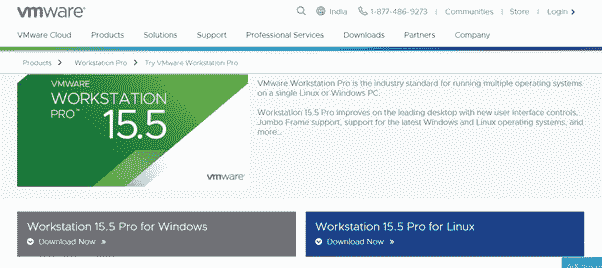

图片来源:[https://medium.com/@ankitgupta_974](/@ankitgupta_974)

**2** 。检查您的 VMware 属性。

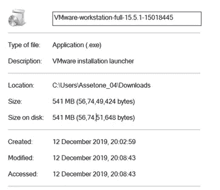

图片来源:[https://medium.com/@ankitgupta_974](/@ankitgupta_974)

**3。前往下载文件夹。**

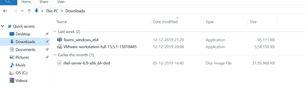

图片来源:[https://medium.com/@ankitgupta_974](/@ankitgupta_974)

**4。**点击 VMware 下载文件并安装。

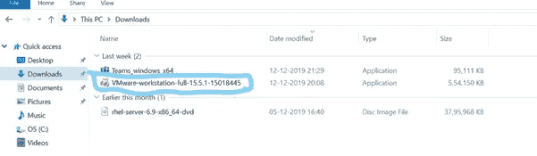

图片来源:[https://medium.com/@ankitgupta_974](/@ankitgupta_974)

**5。**单击 VMware 软件，然后单击并选择“**固定到任务栏”。**

**6。**单击 VMware 软件，然后单击安装向导旁边的。

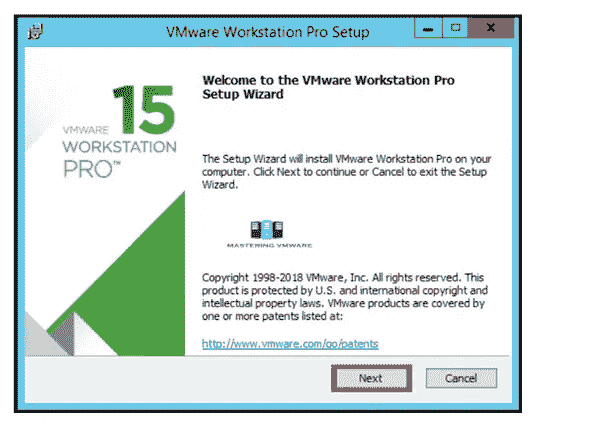

图片来源:[https://medium.com/@ankitgupta_974](/@ankitgupta_974)

**7。**阅读并接受 VMware 最终用户许可协议。

单击下一步继续。

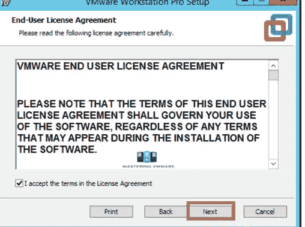

图片来源:[https://medium.com/@ankitgupta_974](/@ankitgupta_974)

**8。**指定安装目录。您也可以在这里启用增强键盘驱动程序。

单击下一步继续。

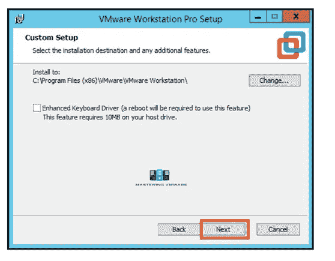

图片来源:[https://medium.com/@ankitgupta_974](/@ankitgupta_974)

**9。**您可以在此启动产品并加入 VMware 客户体验改善计划。

单击下一步继续。

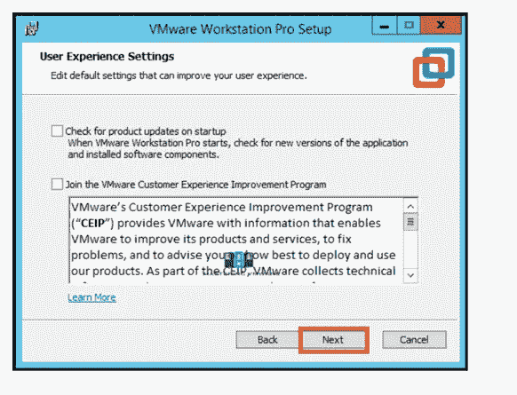

图片来源:【https://medium.com/@ankitgupta_974 

10。选择您想要创建的快捷方式，以便轻松访问 VMware Workstation。

单击下一步继续。

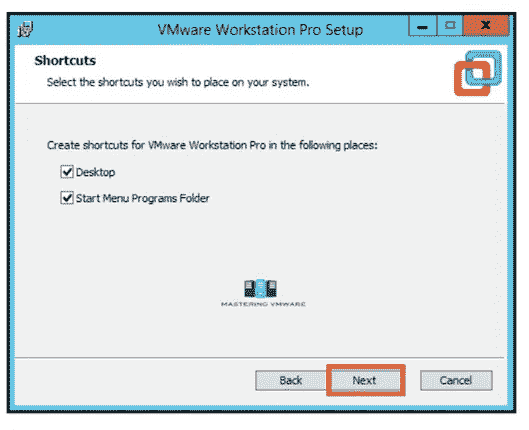

图片来源:[https://medium.com/@ankitgupta_974](/@ankitgupta_974)

**11。**点击安装按钮开始安装。

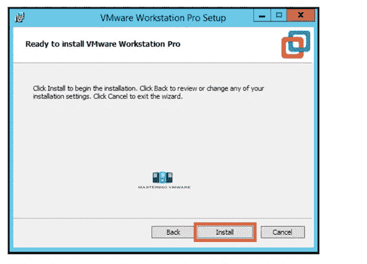

图片来源:[https://medium.com/@ankitgupta_974](/@ankitgupta_974)

**12。**安装只需几秒钟即可完成。

如果您有许可证密钥，则单击许可证进入许可证，或者您也可以单击完成退出安装程序。

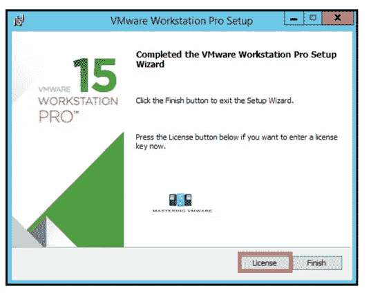

图片来源:[https://medium.com/@ankitgupta_974](/@ankitgupta_974)

**13。**提供 VMware Workstation Pro 的许可证密钥。

按回车键继续。

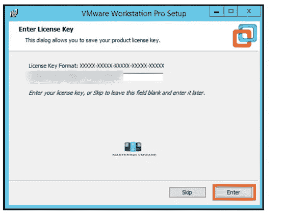

图片来源:[https://medium.com/@ankitgupta_974](/@ankitgupta_974)

(建议:如果您没有许可证密钥，请在互联网上搜索或询问谁已经在他们的系统中安装了许可证密钥。他们肯定有许可证密钥。)

14。点击完成退出向导。

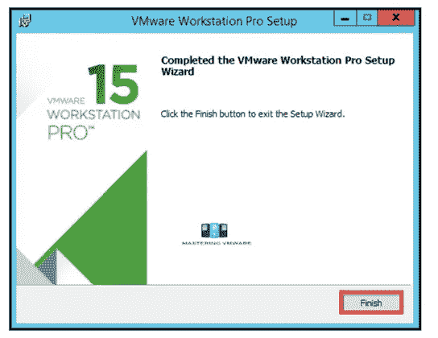

图片来源:[https://medium.com/@ankitgupta_974](/@ankitgupta_974)

15。好了，我们已经成功安装了 VMware Workstation Pro。

现在，您可以通过单击桌面上的快捷方式来启动 VMware Workstation Pro。

下面是 VMware Workstation pro 的主屏幕，每次启动 Workstation 时都会看到。

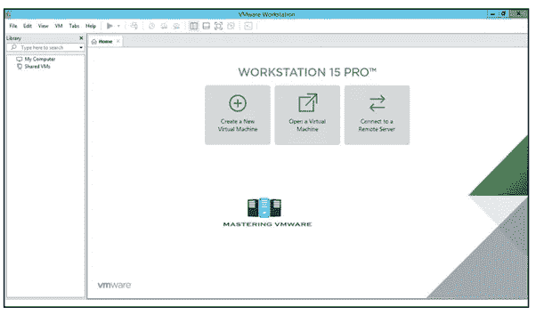

图片来源:[https://medium.com/@ankitgupta_974](/@ankitgupta_974)

**VMware 成功设置并安装了**。

**参考:**

[https://www . VMware . com/in/products/workstation-pro/workstation-pro-evaluation . html](https://www.vmware.com/in/products/workstation-pro/workstation-pro-evaluation.html)

**作者领英:**

[https://www.linkedin.com/in/ankit-gupta2/](https://www.linkedin.com/in/ankit-gupta2/)

 [## 从 JSON 文件中提取有用数据用于机器学习

### 如何从一个 JSON 文件中提取数据用于 Python 中的机器学习模型

medium.com](/analytics-vidhya/extract-the-useful-data-from-jason-file-for-data-sceince-34ed5ae0b350)  [## 安装 OPENCV 的 5 个简单步骤

### 在这个有趣的教程中，我们将学习在 Ubuntu 系统中设置 OpenCV-Python。以下步骤针对 Ubuntu 16.04 进行了测试…

medium.com](/analytics-vidhya/installation-of-opencv-in-simple-and-easy-way-15556edca7a4) 

感谢您的阅读，如果您喜欢，请点击“鼓掌”按钮。

**关注我们了解更多内容。**

**更多内容尽在**[**AnalyticsVidhya**](https://medium.com/analytics-vidhya)**。**