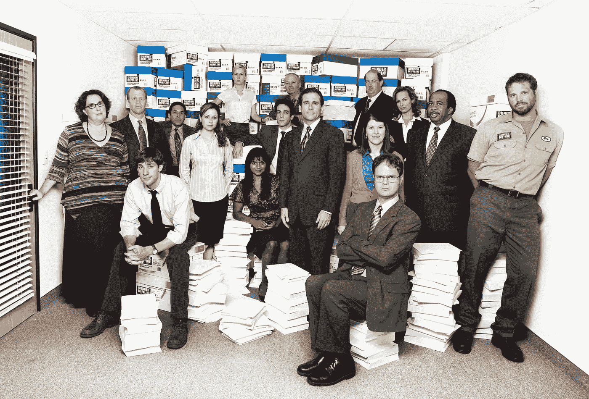

# 循序渐进:用 Python 从“办公室”中抓取每一行

> 原文：<https://medium.com/analytics-vidhya/step-by-step-web-scraping-every-line-from-the-office-in-python-3b28768c56f4?source=collection_archive---------5----------------------->

网络抓取有助于自动提取网站上的数据。虽然通过 API 收集数据是首选，但当 API 不可用时，web 抓取可能是一种可能的解决方案。

下面，我们将演练使用 Python 从热播电视剧《办公室》中抓取每一行的步骤。如果这篇文章对你有帮助，如果你有问题，或者有错误，请在下面的评论区告诉我！

图片来自:[https://www . Gannett-cdn . com/presto/2020/03/23/USAT/4d 323821-630 c-4a F2-81aa-6 daab 94 a 1213-Ryan _ then . JPEG](https://www.gannett-cdn.com/presto/2020/03/23/USAT/4d323821-630c-4af2-81aa-6daab94a1213-Ryan_then.jpeg)

# 第一步:浏览网站

首先，让我们回顾一下我们要刮的网站:【https://www.officequotes.net/[。在网站的左边，你会看到一个专栏，里面有第 1-9 季的每一集。](https://www.officequotes.net/)

接下来，让我们点击[第一集:先导](https://www.officequotes.net/no1-01.php)。然后回去点开[第二集:多样性日](https://www.officequotes.net/no1-02.php)。**注意网址如何从**[**officequotes.net/**](https://www.officequotes.net/)[**no1-01.php**](https://www.officequotes.net/no1-01.php)**到**[**officequotes.net/**](https://www.officequotes.net/)[**no1-02.php**](https://www.officequotes.net/no1-02.php)**。我把它加粗是因为它很重要。注意相似和不同之处。现在回到第一集。在这一页的中间，你会看到我们正在寻找的数据:第一集的每一行以及哪个角色说的。**

现在我们可以物理地*看到*数据，让我们看看网站如何使用开发者工具(Dev Tools)呈现数据！

在[第 1 集:Pilot](https://www.officequotes.net/no1-01.php) 中，如果你在 Windows 上键入:Ctrl + Shift + J。如果你在 Mac 上键入:Cmd+Shift+c。Up 应该弹出开发工具。为了确保我们在同一个地方，让我们点击“元素”选项卡(这显示了网站上的 HTML 和 JavaScript)。现在，单击光标所在的方块，并找到一些引号所在的 HTML div/class。

如果你迷失了这些指示，你可以跟随这个 gif:

当我们使用 Dev 工具进一步查看页面时，**您会看到每一行的演讲者都是加粗的(HTML 中有<b>Character _ Name</b>),然后每个引用都有纯文本。这是我们要收集的数据。**

# 第二步:清理办公室的第一至第四季

对于这个例子，我们将去掉办公室的前四个季节(当然，如果你愿意的话，包含所有九个季节会相对容易些)。

首先，我会解释每一行的目的，然后向您展示完整的程序。

**get _ all _ lines _ from _ the _ office . py:**

*   `line 1–5`我们导入 [shebang](https://stackoverflow.com/questions/6908143/should-i-put-shebang-in-python-scripts-and-what-form-should-it-take) 和我们的库: [requests](https://docs.python-requests.org/en/master/) 、 [BeautifulSoup](https://www.crummy.com/software/BeautifulSoup/bs4/doc/) 和 [Pandas](https://pandas.pydata.org/docs/user_guide/index.html) 。
*   `line 7–41`实际抓取数据并以列表形式返回。特别注意我们是如何根据季节和剧集制作 base_url、half_of_url 和 full_url 的。我们还包括了一些错误检查来忽略任何 404 错误消息。最后，您会注意到我们使用 BeautifulSoup 来查找每个“b”标签，并使用一个临时字典来存储角色、台词、季节和剧集编号。
*   `line 43–46`简单地把数据列表改成熊猫数据框，以便于清理。
*   `line 48–70`尝试清除每一行和任何拼写错误的字符。
*   `line 72–79`实际上运行所有的功能并打印出我们清理过的熊猫数据帧，包括《办公室》第一季到第四季的每一行(包括删除的场景)！

# 轮到您探索更多了！

*   你最喜欢的电视节目或电影是什么？我相信你可以找到一个网站，让你合法地刮每一行
*   刮干净办公室的所有 9 个季节，进行更深层次的清洁
*   这些数据对于数据分析和 NLP 项目非常有用
*   将这些数据放在一个 SQL 表中，并从那里查询结果

感谢阅读！欢迎评论，如果你想要 YouTube 教程，请告诉我。你可以在 GitHub repo 上了解这个项目的更多信息。

想保持联系吗？在 [LinkedIn](https://www.linkedin.com/in/dan-blevins/) 上和我联系！