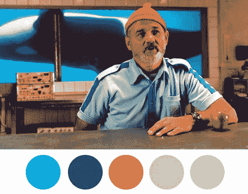
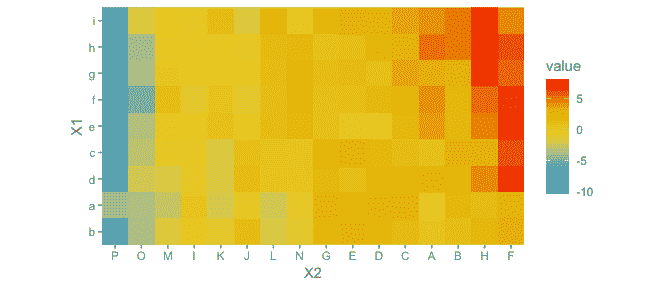

# 🖍·斯泰尔斯你的图表就像 r 里的韦斯·安德森

> 原文：<https://medium.com/analytics-vidhya/stile-your-charts-like-wes-anderson-in-r-64321620709c?source=collection_archive---------7----------------------->

2021 年会比 2020 年更好的原因之一是法国的派遣会发布(准确的说是 10 月 22 日)。对于非影迷来说，法国派遣是韦斯·安德森的最新作品，他是最受赞赏的导演之一。如果你没有看过他的任何一部电影，你必须抓住《月亮升起的王国》或史蒂夫·塞苏的《水生生物》，然后你才能完成这篇文章。

像许多其他人一样，我相信我喜欢他的电影的原因之一是他对摄影和调色板的不可思议的使用，这可以构建童话般的情节。

使用这些调色板来设计 R studio 中的情节不是很棒吗？感谢韦斯·安德森的软件包，当你使用 ggplot 时，你可以为你的数据图使用这些伟大的调色板。

要安装它并将其加载到您的项目中，请在您的项目顶部输入`install.packages("wesanderson")`，然后输入`library("wesanderson")`。之后，您可以创建一个`ggplot2`图形对象，选择您想要使用的韦斯·安德森配色方案，创建一个调色板对象，添加图形对象和调色板对象，看看您漂亮的数据。

具体来说，`wes_palette()`功能要求:

`wes_palette(name, n, type = c("discrete", "continuous"))`

*   `name`:所需调色板的名称。你可以在这里找到可用的列表。
*   `Type`:可以是“连续的”，也可以是“离散的”。
*   `n`:所需的颜色数量，取决于您的图表

因此，让我们说我定义了热图我的图形和调色板 pal

***感谢以下来源***

*   [https://github.com/karthik/wesanderson](https://github.com/karthik/wesanderson)
*   [https://rforpoliticalscience . com/2020/07/26/make-wes-Anderson-themed-graphs-with-wes Anderson-package-in-r/](https://rforpoliticalscience.com/2020/07/26/make-wes-anderson-themed-graphs-with-wesanderson-package-in-r/)
*   [https://wesandersonpalettes.tumblr.com/](https://wesandersonpalettes.tumblr.com/)