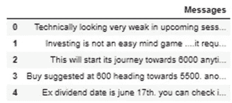

# 仍然遵循传统的图表技术来预测股票价格……？

> 原文：<https://medium.com/analytics-vidhya/still-following-the-traditional-charting-technique-to-predict-stock-prices-b563dedea84a?source=collection_archive---------35----------------------->

Tata Elxsi 是目前每个投资者都关注的 IT 股票之一。股票在一年内从 2020 年 6 月的每股 829 卢比涨到了 3575 卢比。

投资者长期以来一直根据图表和比率从技术和基本面上预测股票价格。但随着最近散户投资者的激增，我们最近观察到的情况是，股价受到情绪的影响很大。

那么，为什么不根据投资者的情绪或对特定股票的预期来预测股票价格和走势呢？

下面是从 moneycontrol.com 塔塔埃尔克西论坛摘录的塔塔埃尔克西股票最近几天的评论。

**论坛评论摘录**

Jupyter 笔记本截图

除去所有标点符号和词干后，评论中最常用的 10 个词是:

[('买'，23)，

(《股息》，第 22 页)，

(《长》，15)，

(‘好’，12)，

(‘更正’，12)，

(“日期”，11)，

(《时代》，11)，

(‘去’，11)，

(《弹跳》，11)，

(“新”，11)]

所以像买入、做多、好、反弹这样的词被使用的次数最多。

第二个讨论最多的话题是股息，在最近的评论中被提到了 22 次。

而修正这个词在最新的评论中只用了 12 次。

除此之外，从 3600 到 6000 的数字在评论中被使用了 45 次，这暗示着在未来更高的目标被期待。

此外，单词云的图示显示，像“长”、“购买”和“股息”这样的单词在评论中被高度评价。

***字云塔塔 Elxsi 点评来自*金钱控**

使用 Python 的词云

因此，我们对投资者、交易者和专家在不久的将来对 Tata Elxsi 股票的预期有一个大致的了解。

更多此类文章请关注我在[https://manishbansal3003.blogspot.com/](https://manishbansal3003.blogspot.com/)

**免责声明:本博客上的信息仅供参考。它不构成对任何人进行任何交易或采取任何对冲、交易或投资策略的任何要约、建议或邀约，也不构成对利率或价格未来可能变动的任何预测。**