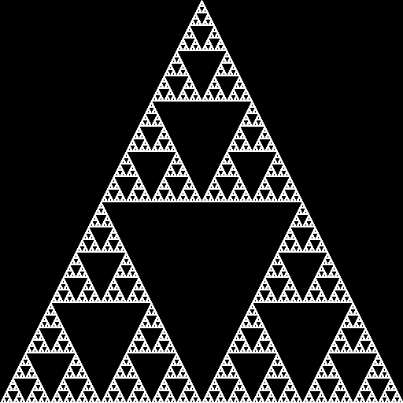
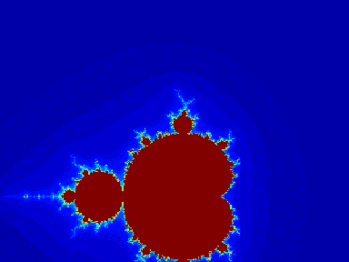
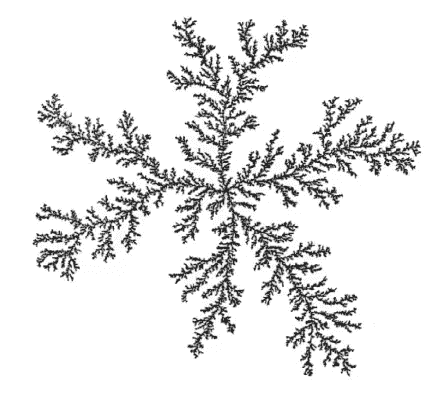

# 随机分形搜索算法

> 原文：<https://medium.com/analytics-vidhya/stochastic-fratral-search-algorithm-a54ea41f0858?source=collection_archive---------10----------------------->

进化算法是许多科学问题中使用的自然启发的近似优化算法，主要用于在使用传统的穷举蛮力搜索技术进行空间探索时，当精确的解决方案需要不合理的时间量时，提供似乎合理的近似解决方案。

这篇文章深入探讨了一种成功的元启发式算法，叫做随机分形搜索，最初是由哈米德·萨利米博士在他的文章《T2》中介绍的。

顾名思义，随机分形搜索(SFS)使用一种称为分形的概念，以随机的形式搜索某个搜索空间。

如果你学过计算机图形学，你应该会对那些令人印象深刻的被称为分形图像的递归模式赞叹不已。

(左):Sierpinski 三角形，(右):Mandelbrot 集

如上面这些迷人的 gif 所示，左边是 Sierpinski 三角形的动画，它是通过使用三条线递归地将一个三角形划分为四个三角形而创建的，而右边是非常著名的 Mandelbrot 集合，它基于递归复杂函数，以越来越大的放大倍数揭示越来越精细的递归细节。

**不要被 gif 图**误导，但是那些形状**不能被计算机内存**完全表现出来，因为它们实际上是无限的，如此相似以至于是你实际能想到的最大的数字！毫无疑问，任何可以想象的记忆中都不存在这样的数字！

因此，形式上，随机分形搜索是一种元启发式优化算法，它使用分形的思想来满足优化算法所需的**强化** **【利用】**特性，以及保证搜索空间的**多样化(探索)**的随机性特征。

如果你对算法的发展感兴趣，你可以查看原始的工作，因为 SFS 只是一个更简单的叫做**分形搜索**的算法的改进。

# 算法步骤:

SFS 主要有两个步骤:
1。扩散过程**(利用)** :
基于上面提到的分形概念，该算法通过采取随机行走步骤后产生新点来应用所谓的扩散过程。

使用扩散限制聚集的分形生长(原始文章中的图 1)

2.更新过程**(探索)** :
是通过与其他解随机混合产生新解的过程，这是通过两个更新步骤来完成的，第一步涉及到逐元素更新，而第二步更新只是群体中多个向量的加权和。

关于数学的更多细节可以在[原始文章](https://www.sciencedirect.com/science/article/abs/pii/S0950705114002822)和我的[报告调查](https://arxiv.org/abs/2102.01503)中找到(包括从计算机视觉到 PID 控制器参数调整的一些精选应用)

# **演示:**

使用 SFS 优化 Styblinski Tang 函数:

[演示]红色球体是搜索算法群体中的候选解

# 代码:

SFS 的最初创建者已经通过 [MATLAB 中央文件交换](https://www.mathworks.com/matlabcentral/fileexchange/47565-stochastic-fractal-search-sfs)发布了该算法的 Matlab 代码。
我还有一个在 GPL-3.0 许可下分享在 github 上的算法的 [python 再实现](https://github.com/mohammed-elkomy/stochastic-fractal-search-python)，随意查看投稿:)

今天就到这里:)

我使用 gifski 开源工具来生成高质量的 gif🎊🎊

资源:
原文章[https://www . science direct . com/science/article/ABS/pii/s 0950705114002822](https://www.sciencedirect.com/science/article/abs/pii/S0950705114002822)
原 Matlab 实现[https://www . mathworks . com/Matlab central/file exchange/47565-random-fractal-search-SFS](https://www.mathworks.com/matlabcentral/fileexchange/47565-stochastic-fractal-search-sfs)
我的 python 实现[https://github . com/Mohammed-elkomy](https://github.com/mohammed-elkomy/stochastic-fractal-search-python)