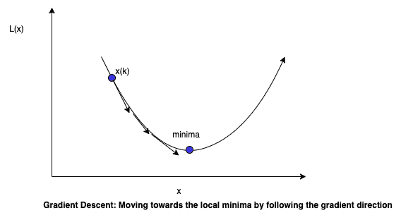
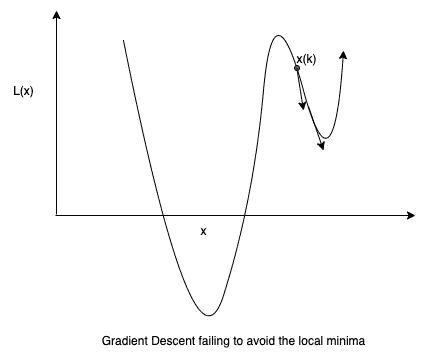
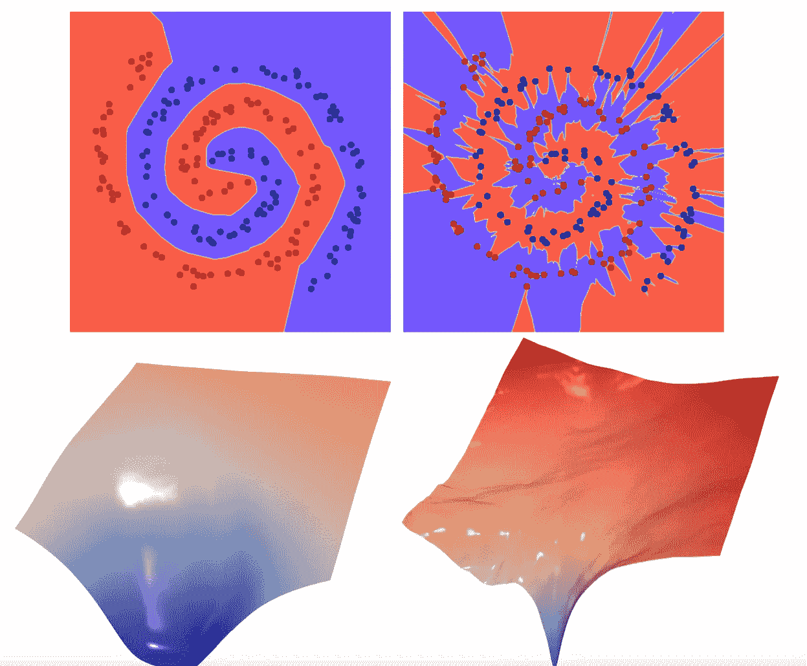

# 深度学习中的随机梯度下降

> 原文：<https://medium.com/analytics-vidhya/stochastic-gradient-descent-in-deep-learning-b19c038ec025?source=collection_archive---------8----------------------->

神经网络通常由数百万个权重组成，我们需要找到这些权重的正确值。使用可用数据优化该网络需要仔细考虑要选择的优化器。在这篇文章中，我将讨论梯度下降和随机梯度下降(SGD ),以及为什么 SGD 在深度学习中是首选



```
for k in [1, number_iterations]:
    X(k+1) = X(k) - α ▽L(X(k))
```

这对于适当选择凸函数的α很有效。但是，深度神经网络最理想的特性之一是它们是通用逼近器。这意味着它们也应该能够覆盖非凸函数。非凸函数的问题是，您的初始猜测可能不在全局最小值附近，梯度下降可能会收敛到局部最小值。考虑以下情况:



## ***但是等等，真的是在寻找深度学习的全局极小值吗？***

我们正在优化损失或成本函数，该函数大部分时间代表实际产出和预测之间的一些距离。我们希望最小化损失函数，但同时我们不希望它太接近于零，因为这通常会导致过拟合。我们希望它能很好地处理看不见的数据，因此需要推广。**我们在这里寻找的是平整度。**

***好的局部极小值对坏的局部极小值*** 我们不是期望全局极小值，而是寻找“好的局部极小值”而不是“坏的局部极小值”。好的局部极小值通常是指更平坦的极小值。

***你是怎么定义平坦度的？*** 嗯，光看曲线就能非常直观的理解 2D 或者 3D。一般来说，平坦度与函数的 Hessian 的较小特征值有关。特征值越大，曲率越大，临界点成为尖锐极小值的几率越大。

***随机梯度下降:*** 随机梯度下降(SGD)通过抽取随机样本并计算每次迭代的损失，取代了计算整个数据集平均损失的高成本操作。与梯度下降相比，这又改变了收敛行为。

```
for k in [1, number_iterations]:
    pick a random datapoint di;
    calculate loss Li
    X(k+1) = X(k) - α ▽Li(X(k))
```

在之前的工作中，Hinton & Van Camp(1993)，Hochreiter & Schmidhuber 提出了一个论点，即平极小需要更少的信息来描述，因此应该比锐极小更好地概括。

尖锐的极小值在训练数据上几乎没有不正确的预测。然而，网络参数的微小变化会使输出发生很大变化。对于分类任务，这意味着边界非常接近这些点。相比之下，在平坦最小值中，边界与点之间的距离是安全的，网络参数的微小变化不会导致精度下降，从而使其成为我们试图逼近的实际函数的更好概括。看看下面这张纸上的形象化:[](https://arxiv.org/abs/1906.03291)

****

**左:平坦极小值上的分类器边界；右图:尖锐极小值上的分类器边界**

**在我们进入 SGD 收敛到平坦最小值之前，让我们理解下面的全局优化技术。**

*****模拟退火*** 这是一种全局优化技术。模拟退火通常采取与梯度方向不匹配的步骤。采取这些不正常的步骤依赖于一种叫做能量的东西。开始时有更大的能量，使它采取不正常的步骤。这些异常的步骤是非常必要的，因为它们可以很好地走出局部极小值，并探索全局极小值的前景。能量随着迭代次数而减少，并且算法趋向于采取较少的异常步骤，并且最终收敛到最小值。与梯度下降法相比，这种方法陷入局部极小值的可能性很小。**

**为了从混乱的实现中抽象出来(因为实际的实现更详细)，假设一架直升机被分配了寻找并降落在山脉最深的山谷的任务，并且被给予了有限的燃料。直升机一开始肯定会随意探索山脉，但随着时间的推移，它会尽量避免随意探索，并会尽量深入山谷，这是因为考虑到了燃料限制。最初的任意探索使直升机有可能走出局部极小值，并探索超出此范围的下降。**

**尽管 SGD 寻找平坦的最小值而不是全局最小值，但是 SGD 和模拟退火之间有一些相似之处，这使得它们可以避开局部最小值。**

*****为什么 SGD 达到一个平坦的极小值？*** 在初始迭代处，SGD 携带大量噪声(类似于模拟退火)，并且梯度在每次迭代时可以变化很大。这种行为让 SGD 算法像模拟退火一样。在初始步骤中非常随机的损失携带能量以很好地脱离局部最小值。平坦的极小值有更大的区域可以探索。**想象一下直升机试图在巨大的山脉中寻找一个降落点。很明显，面积较大的山谷(因此平坦程度较高)有更好的机会容纳一个停靠点。****

**使用 SGD 还有其他一些优点:**

*   **当例子相似时，SGD 收敛很快。如果有重复或相似的数据点，SGD 可以收敛得更快，因为过一段时间后，它会优化它已经看到的点。**
*   **SGD 可以在飞行中训练。如果您的数据不容易获得和流入，可以使用 SGD。**
*   **SGD 的一个重要好处是每次迭代只处理一个数据点。当大型数据集无法将所有数据保存到 RAM **(** 我没有使用过这样的数据集时，这真的很有帮助。可能我还没有处理过足够大的数据集 **)** 。**

*****参考文献:*****

1.  **黄、、戈德布拉姆、福尔、特里、黄和戈德斯坦。通过可视化理解概括。2019**
2.  **辛顿&范·坎普(1993)**
3.  **施密特·胡伯。平极小 1997**