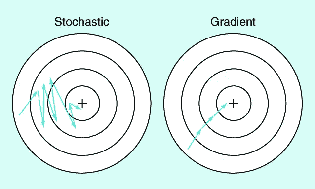

# 随机梯度下降

> 原文：<https://medium.com/analytics-vidhya/stochastic-gradient-descent-sgd-881d7a0ea137?source=collection_archive---------21----------------------->

梯度下降，用于学习分类器权重的一阶优化。然而，这种梯度下降的实现在计算上很慢，难以达到全局最小值。如果你想阅读和理解梯度下降，请阅读我以前的文章“[理解梯度下降](/analytics-vidhya/understanding-gradient-descent-106ad1142ff4)”。

**随机梯度下降(SGD)** 是对标准梯度下降的简单修改，其中权重矩阵 W 为较小批量的数据集更新，而不是在每个时期结束时更新。



# 小批量 SGD

回顾梯度下降算法，很明显该方法在大型数据集上运行非常慢。这种缓慢的原因是因为梯度下降的每次迭代需要我们在被允许更新我们的权重矩阵之前为我们的训练数据中的每个训练点计算预测。对于 ImageNet 等图像数据集，我们有超过 120 万个训练图像，这种计算可能需要很长时间。这也证明了在沿着我们的权重矩阵前进一步之前计算每个训练点的预测在计算上是浪费的，并且对我们的模型覆盖没有什么帮助。相反，我们应该做的是批量更新。

```
#Pseudocode
while True:
   batch = next_training_batch(data, 256)#256 batch-size
   Wgradient = evaluate_gradient(loss, batch, W)
   W += -alpha * Wgradient
```

梯度下降和 SGD 的唯一区别是下一批训练。正如我们所观察到的，如果我们有 512 个数据点，权重矩阵(W)将每 256 个样本(256 个批量)更新一次。批次大小将始终大于 1。首先，批量大小> 1 有助于减少参数更新中的差异，从而导致更稳定的收敛。

# 履行

```
import the necessary packages
from sklearn.model_selection import train_test_split
from sklearn.metrics import classification_report
from sklearn.datasets import make_blobs
import matplotlib.pyplot as plt
import numpy as np
import argparsedef sigmoid_activation(x): # compute the sigmoid activation value for a given input
     return 1.0 / (1 + np.exp(-x))def sigmoid_deriv(x):
     # compute the derivative of the sigmoid function ASSUMING
     # that the input `x` has already been passed through 
     # the sigmoid activation function
      return x * (1 - x)def predict(X, W):
    # take the dot product between our features and weight matrix
    preds = sigmoid_activation(X.dot(W))
    # apply a step function to threshold the outputs to binary
    # class labels
    preds[preds <= 0.5] = 0
    preds[preds > 0] = 1
    # return the predictions
    return predsdef next_batch(X, y, batchSize):
    # loop over our dataset `X` in mini-batches, yielding a tuple of
    # the current batched data and labels
    for i in np.arange(0, X.shape[0], batchSize):
        yield (X[i:i + batchSize], y[i:i + batchSize])# construct the argument parse and parse the arguments
ap = argparse.ArgumentParser()
ap.add_argument("-e", "--epochs", type=float, default=100,
help="# of epochs")
ap.add_argument("-a", "--alpha", type=float, default=0.01,
help="learning rate")
ap.add_argument("-b", "--batch-size", type=int, default=32,
help="size of SGD mini-batches")
args = vars(ap.parse_args())# generate a 2-class classification problem with 1,000 data points,
# where each data point is a 2D feature vector
(X, y) = make_blobs(n_samples=1000, n_features=2, centers=2,   cluster_std=1.5, random_state=1)
y = y.reshape((y.shape[0], 1))# insert a column of 1's as the last entry in the feature
# matrix -- this little trick allows us to treat the bias
# as a trainable parameter within the weight matrix
X = np.c_[X, np.ones((X.shape[0]))]
# partition the data into training and testing splits using 50% of
# the data for training and the remaining 50% for testing
(trainX, testX, trainY, testY) = train_test_split(X, y,
test_size=0.5, random_state=42)# initialize our weight matrix and list of losses
print("[INFO] training...")
W = np.random.randn(X.shape[1], 1)
losses = []# loop over the desired number of epochs
for epoch in np.arange(0, args["epochs"]):
   # initialize the total loss for the epoch
   epochLoss = []
   # loop over our data in batches
   for (batchX, batchY) in next_batch(trainX, 
                       trainY,   args["batch_size"]):
       # take the dot product between our current batch of features
       # and the weight matrix, then pass this value through our
       # activation function 
       preds = sigmoid_activation(batchX.dot(W))
       # now that we have our predictions, we need to determine th
       # `error`, which is the difference between our predictions
       # and the true values
       error = preds - batchY
       epochLoss.append(np.sum(error ** 2))
       # the gradient descent update is the dot product between our
       # (1) current batch and (2) the error of the sigmoid
       # derivative of our predictions # update our loss history by taking the average loss 
       # across all
       # batches 
       loss = np.average(epochLoss)  
       losses.append(loss)
       # check to see if an update should be displayed
       if epoch == 0 or (epoch + 1) % 5 == 0:
         print("[INFO] epoch={}, loss={:.7f}".format(int(
                                        epoch + 1),   loss))# evaluate our mode
print("[INFO] evaluating...")
preds = predict(testX, W)
print(classification_report(testY, preds))# plot the (testing) classification data
plt.style.use("ggplot")
plt.figure()
plt.title("Data")
plt.scatter(testX[:, 0], testX[:, 1], marker="o", c=testY[:, 0], s=30)
# construct a figure that plots the loss over time
plt.style.use("ggplot")
plt.figure()
plt.plot(np.arange(0, args["epochs"]), losses)
plt.title("Training Loss")
plt.xlabel("Epoch #")
plt.ylabel("Loss")
plt.show()
```

快乐学习！！！