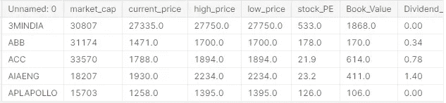
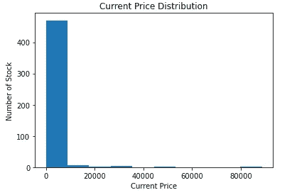
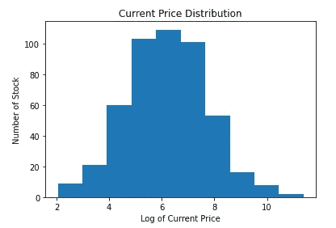
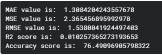
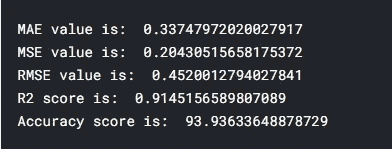
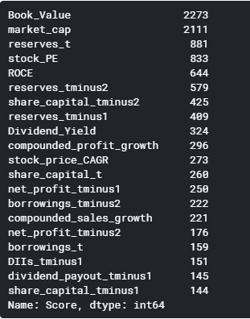
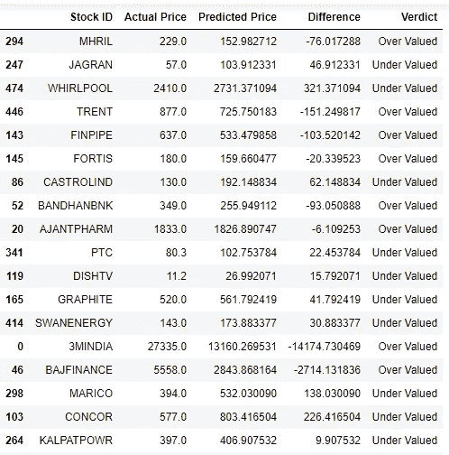
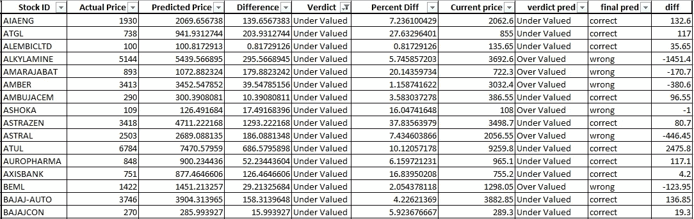
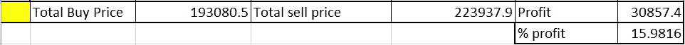

# 股票价格预测

> 原文：<https://medium.com/analytics-vidhya/stock-price-prediction-ade10ac8ce08?source=collection_archive---------7----------------------->

马克西姆·霍普曼在 [Unsplash](https://unsplash.com?utm_source=medium&utm_medium=referral) 上的照片

## 基于公司基本面而非技术指标预测股价的机器学习。

# 介绍

股票市场是一个疯狂的地方，一千可以变成一百万，几百万可以化为乌有。没有人能预测明天市场会怎样。社交媒体兴起后，这种情况尤其不稳定。最近的一个例子是 Gamestop 股票，这只*【meme】*股票在 15 天内上涨超过 1600%。另一个例子是一家名为*的公司股价暴涨 1100%，标志着股价上涨*。当埃隆·马斯克(Elon Musk)在 twitter 上敦促他的追随者*“使用消息应用软件 Signal”时，散户投资者开始购买一家不相关的 Signal Advance 的股票。没有人对公司的利润、股本回报率或股息支付感兴趣(有些人甚至不关心公司做什么)。现在，一切都是关于行情、技术指标和社交媒体趋势。*

> *当你在投机的时候，千万不要自欺欺人地认为你是在投资- 本杰明·格拉哈姆*

*我见过很多机器学习模型做同样的事情，推测。推测市场是在上涨，还是在下一刻下跌。在这篇文章中，我们将讨论一个基于公司基本面，使用 XGBoost 算法预测股票价格的模型。因此，根据预测，我们可以决定股票是被低估还是被高估。*

# *数据如何？*

*我们将使用的数据是 Nifty 500 的基本面，即在 NSE 交易的前 500 家公司。我使用 web scrapping 收集了这些数据，其范围不在本博客中。我可能会写一个单独的帖子。你可以点击[这里](https://www.kaggle.com/sawantvishwajeet729/nifty-500-stock-fundamentals)从 Kaggle 下载数据。*

*该数据有 482 行(482 个不同的公司)和 70 列(70 个特征)。我知道我说的是 Nifty500，但是我还是设法收集了 482 的数据(不错！).数据中的特征包括市场资本、ROE、ROCE、季度结果、利润/损失、股票价格 CAGR、资产负债表(过去 3 年)等。有些功能具有过去 3 个时间间隔收集的数据，如季度结果。过去 3 个季度的结果收集在此数据集中。如下图所示。*

**

*数据集的片段*

*也可以点击[这里](https://www.kaggle.com/sawantvishwajeet729/stock-price-prediction)看代码。通过这种方式，您可以看到本博客中描述的代码。*

# *数据清理和特征工程*

*收集的数据是干净的(除了 18 家公司，这就是为什么数据有 482 个唯一的行)。数据集中没有缺失值。我们要预测的目标变量是股票的当前价格。如下图所示，目标变量高度倾斜。*

**

*当前股价分布*

*虽然我们使用基于树的 XGBoost 算法来训练模型，但我们将转换目标变量，使其均匀分布。我对两个数据集都进行了尝试，结果表明，对于均匀分布的数据集，该模型提供了更好的准确性。记录目标变量的日志就可以了，正如你在下面看到的，它确实起作用了。*

**

*当前价格分布(对数变换后)*

*由于所有的特征都是连续的，我们将查看相关图，以移除彼此高度相关的特征。因为它是一个 70X70 的桌子，我没有在这里展示，但是你可以通过点击[这里](https://www.kaggle.com/sawantvishwajeet729/stock-price-prediction)在 kaggle 上看到完整的桌子。我还从数据集中删除了 52 周的高价和低价，因为它与目标变量高度相关，预测将偏向于这些特征，而不是从其他基本面中学习。这就是我们需要的所有数据清理和特征工程，尽管如果它能提高准确性，您还可以探索更多。*

# *基线预测*

*我们将需要一个基线预测来衡量我们的模型的性能。通常，平均值或中值用作基线预测。但是我们有一个更好的选择，我们将使用股票的账面价值作为基线预测。股票的账面价值是指如果公司出售所有资产并偿还所有债务，投资者将得到的金额。因此，如果股东决定清算公司，账面价值大致等于他们将得到的金额。*

*在将原始数据集划分为训练数据集和测试数据集之后，我们将计算测试数据集相对于基线预测的平均绝对误差。结果见下图。我们的目标是提高这些分数。MAE 也是我们将用于训练模型的指标。*

**

*基线预测的度量分数*

# *XGBoost 模型训练*

*我们将使用 XGBoost 算法，因为它是 kaggle 上任何数据科学家的首选。现在我已经调好了 XGBoost 的 hyper 参数，它给了我最好的结果。但是如果你想的话，你可以自己试一试。*

*在训练之后，该模型在 1285 轮助推时在测试数据集上具有大约 0.337 的平均绝对误差。这与我们在基线预测中达到的 1.31 相比是一个显著的进步。完整的结果可以在下面看到。*

**

*XGBoost 模型预测的度量分数*

*我们可以检查这些特征的分数，看看哪些特征在决定股票价格方面贡献更大。可见，账面价值和市值在决定股价时是非常重要的。fscore 的结果非常直观，这可以作为选择投资股票(而不是投机)的决定因素。*

**

*前 20 大功能的 Fscores*

*我们还可以将预测结果与实际股价进行比较，找出哪些股票被高估或低估。但这也意味着我们应该有所有股票正确估值的完美数据(这从来都不是真的)。股票市场是不稳定的，几乎不可能预测，这个博客只是试图抓住表面。*

*让我们在测试数据集上看看模型的一些预测。*

**

*预测与实际股价*

# *放弃*

*我希望你喜欢读这篇文章。炒股有风险。写这篇博客只是为了提供信息，我建议不要在实际的股票交易中使用这段代码的结果。*

**

*马库斯·温克勒在 [Unsplash](https://unsplash.com?utm_source=medium&utm_medium=referral) 上的照片*

# *更新于 2021 年 7 月 19 日*

*你好。我在 2021 年 3 月 16 日发表了这篇博客。本财年的第一季度已经结束，所以让我们检查一下我们的模型工作得有多好。我们将只考虑股票有上涨潜力的机会，即目前股票被低估。我提取了 Nifty 500 指数中所有股票的当前价格，并与我们的预测进行了比较。*

**

*当前股价与预测值的比较。*

*如果我买了所有我的模型显示股价被低估的股票，会发生什么？假设在 2021 年 3 月 16 日，我买入了模型显示买入信号的所有公司的 1 股股票，然后我在 2021 年 7 月 19 日卖出了同样的股票。我已经把数据填入了 Excel 表格，你可以从[这里](https://www.kaggle.com/sawantvishwajeet729/predictions-on-1972021/download)下载。*

**

*购买、销售和利润率*

*综上所述，所需资本总额为 ***193080.5 印度卢比*** 。我将不得不购买 excel 文件中显示的 212 家公司的 212 股股票。在 2021 年 7 月 19 日，我会以**223937.9 印度卢比的价格卖掉它们。** 我早就获得了 ***30857.4 印度卢比*** 的利润，几乎是*16%的收益！太棒了，不是吗？**