# 基于 FacebookProphet 和神经网络的股票价格预测器

> 原文：<https://medium.com/analytics-vidhya/stock-price-predictor-using-fbprophet-and-neural-network-762307ec02f?source=collection_archive---------19----------------------->

准确预测股票走势可能是一项艰巨的任务。市场是高度随机的，我们(试图)用混乱的数据做出准确的预测。

在现实世界中，股票价格取决于金融界内外的许多因素，如前几天的价格、政治因素、新闻报道、工厂相关问题，如事故或罢工、自然/环境因素等。例如，最近我们看到了埃隆·马斯克的推文对 GameStop 和比特币股价的影响。不幸的是，我们没有如此详细和信息丰富的数据集可供分析，所以我们的模型没有考虑这些因素。话虽如此，我们可以很容易地在线获得前几天股票价格的数据集。这就是我们将在算法中用到的。

在继续之前，我认为简单解释一下我们将要使用的技术是有用的，时间序列预测和 FbProphet。

## 时间数列预测法

这是一种利用过去的数据或经验来估计未来的方法。它只根据历史模式进行预测。

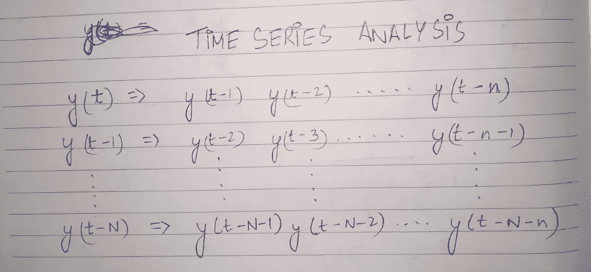

时间序列预测浅释

简而言之，在时间序列分析中，假设我们想要预测某个日期 t 的“y”值。然后使用 y(t-1)来预测 y(t)，即前一天的“y”值，y(t-1)(“y”值前一天)等等，直到给定的时间范围 n

## FaceBook 先知

另一方面，Fb Prophet 是一个由脸书开发的用于单变量时间序列预测的开源库。它使时间序列预测的工作变得非常简单和完全自动化。更多详情，点击[此处](https://machinelearningmastery.com/time-series-forecasting-with-prophet-in-python/#:~:text=Prophet%2C%20or%20%E2%80%9CFacebook%20Prophet%2C,trends%2C%20seasonality%2C%20and%20holidays.&text=%E2%80%94%20Package%20'prophet'%2C%202019.)。

# 回到我们的代码

我们的数据集有 6 列，即:日期、开盘、收盘、盘高、盘低、调整收盘。

在我们的案例中，数据是从 2016 年 3 月 9 日到 2021 年 3 月 8 日(即 5 年)。它有 1234 行或实例和 7 列，即 7 个特征，其中一个是我们的 y(输出)变量。

然后我们做一些基础的数据分析和探索。我们也清理我们的数据，以防它有不需要的值(NaN)。

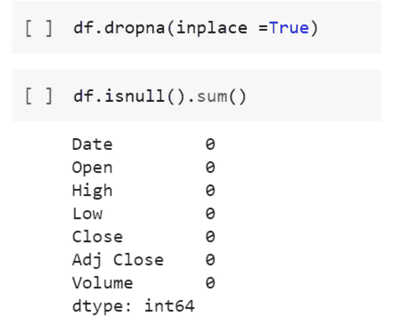

这里我们简单地删除了所有可能妨碍代码正常运行的 NaN 值。

还执行了其他方法，可以在代码中看到，其链接在底部提供。

# 先知代码

其中，对于 FbProphet，我们只需要日期列和结束列。原因在于先知本身的工作。Prophet 只需要两列来运行，即“ds”和“y”(名称不能更改！).ds 表示日期，y 表示我们要预测的变量。

其核心是，Prophet 程序是一个附加回归模型，有四个主要组成部分:

‣呈分段线性或逻辑增长曲线趋势。Prophet 通过从数据中选择变化点来自动检测趋势的变化。

‣是用傅立叶级数模拟的一个年度季节性分量。

‣是使用虚拟变量的每周季节性成分。

‣用户提供的重要节日列表

创建并拟合模型后，我们将看到如下结果

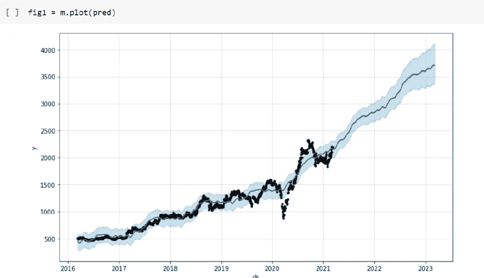

即使用户只输入预测数据，prophet 也会自动给我们提供预测值、实际值以及误差范围。

在这里，黑色的虚线是实际的数据点，或者我们知道的实际股价。深蓝线是我们的模型预测的股票价格。浅蓝色阴影区域给出了误差范围。

prophet 的另一个优点是它还提供了每周、每月、每年的趋势。内容如下:

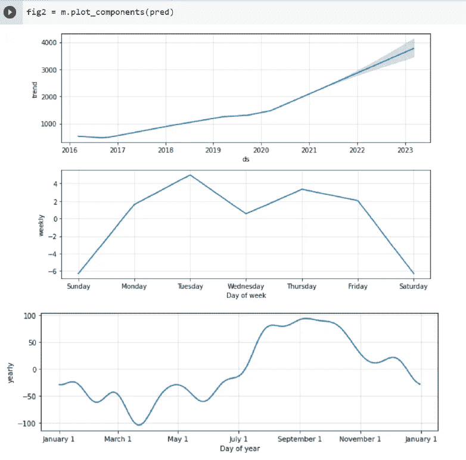

例如，根据该模型，在周二购买 reliance 的股票可能不是最好的主意，因为其价格往往在周二最高。此外，从月度趋势来看，我们观察到在 4 月份购买 reliance 股票可能是有益的，因为该月的价格往往是最低的。

## 表演

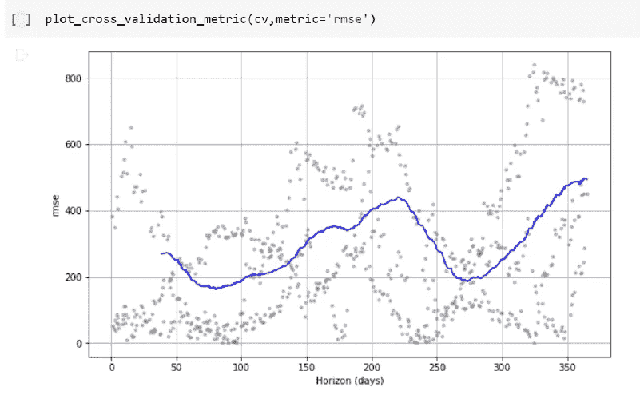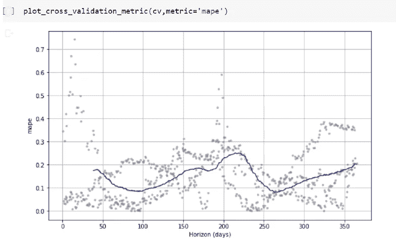

这里的点显示 cv 中每个预测的绝对百分比误差，而蓝线显示 RMSE/MAPE(任一图表)，其中平均值取自点的 10%(默认)的滚动窗口。

我们看到，预测未来一个月的 RMSE 约为 290，未来一年为 450，在未来 220 天左右急剧增加到 410–420。

类似地，对于未来一个月的预测，MAPE 约为 18%,对于一年后的预测，约为 20%。

# 人工神经网络代码

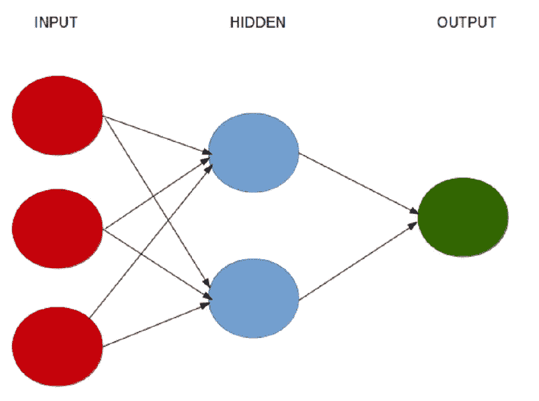

神经网络工作的基本思想

神经网络是一系列模拟人脑操作的算法，用来识别大量数据之间的关系。它们可以适应不断变化的输入，因此网络可以生成尽可能好的结果，而无需重新设计输出标准。神经网络在检测输入数据中的模式，然后产生无噪声的输出方面非常有效。其输出层收集隐藏层中所做的预测，并产生最终结果。

对于这个算法，我们将使用 Keras，这是一个深度学习库，因为它在创建和部署模型时简单易用。

数据和数据探索过程保持不变，在模型拟合过程之前，我们必须**标准化**我们的数据。为什么？这是因为当我们遇到具有量值变化很大的特征的数据时，这是机器学习中的常见经验。因此，如果我们选择不对数据进行标准化或规范化，那么它们对我们模型的影响将与它们的大小成相同的比例分布。这是不可取的，因为它会导致有缺陷的模型。

训练神经网络时，最重要的考虑因素之一是选择输入层和隐藏层中包含的神经元数量。由于输出层给出了结果，默认情况下它只包含 1 个神经元。根据研究，我知道输入层的神经元数量等于所考虑的特征数量+ 1，而隐藏层的神经元数量应该等于:

输入层的神经元数量:

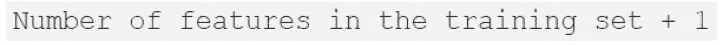

隐藏层数:

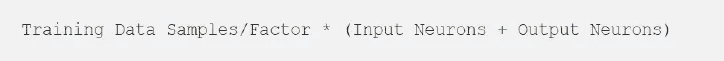

根据拟合模型进行预测后，我们得到的结果如下:

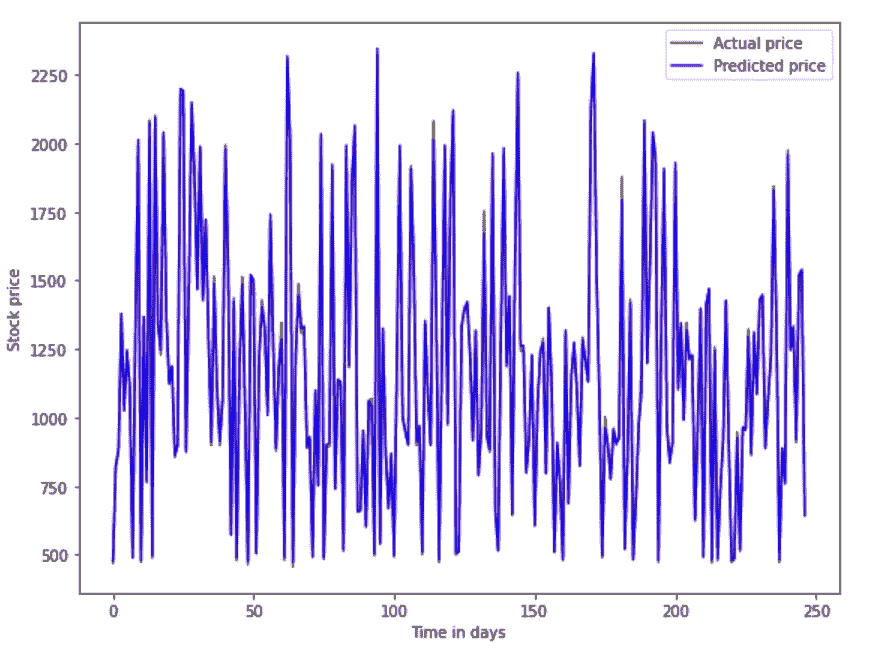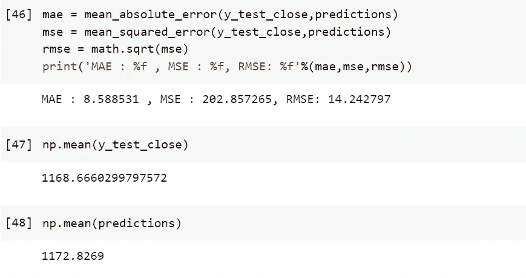

# 结论

脸书先知和神经网络领域的庞大课题。在这个项目中，我只使用了 NN 和 FbProphet 的介绍性/基本概念。还有更先进的技术和模型可以部署。神经网络是非常计算密集型的，需要高效的计算机器和大型数据集。目前，围绕神经网络正在进行许多令人兴奋的研究。

代码的链接是[这里是](https://github.com/OjasPandey99/Stock-Price-Predictor-.git)。

谢谢你。