# 股票买入/卖出/持有预测(多类分类)

> 原文：<https://medium.com/analytics-vidhya/stocks-market-prediction-multi-class-classification-f23fc3286136?source=collection_archive---------1----------------------->

机器学习案例研究…

大家好，对我个人来说，这是一个非常有趣的案例研究，我对股票非常感兴趣，我喜欢机器学习，所以我试图将这两者结合起来，

在这个案例中，我们关注动量交易，它不同于基本面分析和技术分析。

尼克·崇在 [Unsplash](https://unsplash.com?utm_source=medium&utm_medium=referral) 上的照片

让我给你举个例子…

假设你想从 A 地到 B 地，你可以在公共汽车站选择两辆公共汽车。第一辆巴士是豪华巴士，有很多空间，他们也会给你食物，但唯一的问题是“你不知道巴士什么时候走”。

有另一辆公共汽车，这辆公共汽车挤满了人，给你的空间很小，一点也不豪华，但唯一的好处是“你知道公共汽车就要离开了”，这里没有等待。

所以不同的人可能会选择不同的巴士，第二巴士是动量交易。这里我们不使用

“低买高卖”

我们使用，

“高买高卖”。

在这种交易中，没有股票的基本面分析，不管管理层是什么，也不管年度报告是什么，唯一重要的是动力。

现在问题来了，我们怎么知道什么股票会涨，因为有一些规则，这些规则可能有 1000 条，你需要知道什么对你有效。

这只是动量交易的一个小的概述，如果你想了解更多，请跟随 ALOK JAIN 先生，他很棒。

现在我们跳到机器学习公式，可以用机器学习预测股市吗？

这是个大问题…

# 商业目标

过去几年投资股票的人激增，特别是当人们可以用自己的智能手机投资时，他们开始理解投资的重要性，无论是股票、房地产还是金属。

许多人不太了解股票的表现，也不知道他们应该在什么时候买入/卖出特定的股票。考虑到所涉及的风险，推荐模型可以帮助他们选择正确的股票。

一个可以实时向用户推荐买什么或卖什么的模型是我们的业务目标。

**约束**

1.低延迟(在几纳秒的时间内，模型应该能够根据市场对股票进行分类)

2.错误可能代价高昂，人们可能因为一个错误的预测而损失金钱，尽管模型不可能 100%准确。

3.可解释性很重要。

4.需要特定股票属于每个类别的概率。

**机器学习公式**

这种推荐模型应该对特定的股票进行分类，无论它是“强买”“强卖”“买”“卖”“持有”。

这个分类问题的主要挑战是类别标签的不均衡性质，大多数情况下用户必须持有股票，很少有强烈的买入和卖出信号。

**数据**

从 Yahoo Finance 网站收集了 64 家美国公司的数据，最初数据有 41k 行和 67 个特征，推荐列已作为目标类添加到数据中，该推荐列是使用股票市场的领域知识(来自一些基于规则的系统)以及人工观察计算的。

**绩效指标**

这是一个简单的多类分类问题，我们可以使用多类日志丢失来检查性能。

除此之外，我们将使用准确性(在检查数据是否平衡之后)，这里重要的是我们同样关心精确度和召回率，因为我们同样关心假阳性和假阴性。

**例 1**

假设我们有这样一个案例，当时股票实际上“不是强卖”,而模型预测它是“强卖”,此时用户将卖出股票，一段时间后股票价格上涨，用户不会对模型满意，他/她可能以后不会使用它。这是一个假阳性的例子。

**例 2**

假设我们有一个案例，实际上股票是一个“强卖”的时刻，模型预测它是“不是一个强卖”，现在在这种情况下，用户可以失去钱，因为趋势可能会改变一段时间后，股票价格将下降，用户肯定不会使用该模型。这就是假阴性的情况。

因此，最佳性能度量将是 F1 得分，因为 F1 得分是精确度和召回率之间的调和平均值，并且当精确度和召回率都高时，F1 得分也高。

我们开始吧

首要任务是生成数据…

## **来自雅虎财经的数据抓取**

我用 yfinance python 模块和美汤库抓取了不同股票的信息，我已经抓取了 64 家公司 2 年的数据。

我有一个关于美丽汤库的详细博客，有兴趣的可以看看。

 [## 数据科学和网络搜集

### 我使用 BeautifulSoup Library 从不同的新闻网站上搜集某个特定主题的新闻。

medium.com](/analytics-vidhya/web-scraping-2559f72c6c80) 

YouTube 上有很多从雅虎财经网站上盗取的视频，如果你想看的话，可以看看。

# 探索性数据分析

1.  我们将在这里探索数据，看看数据告诉我们关于股票的什么故事。
2.  我们将检查空值并尝试估算它们。
3.  我们将检查每一个功能，看看它是否对我们有用。
4.  我们将绘制各种图来了解不同特征之间的关系。
5.  我们将做单变量和双变量分析。
6.  我们将检查数据之间是否存在相关性。我们将检查异常值

从基于规则的系统中，我们添加了一个建议列(这是我们的目标变量)，我们在目标变量中有 3 个类

1.  购买
2.  出售
3.  强力买入
4.  强势销售

我们增加了另一个名为“持有”的类别标签，你只需持有股票。

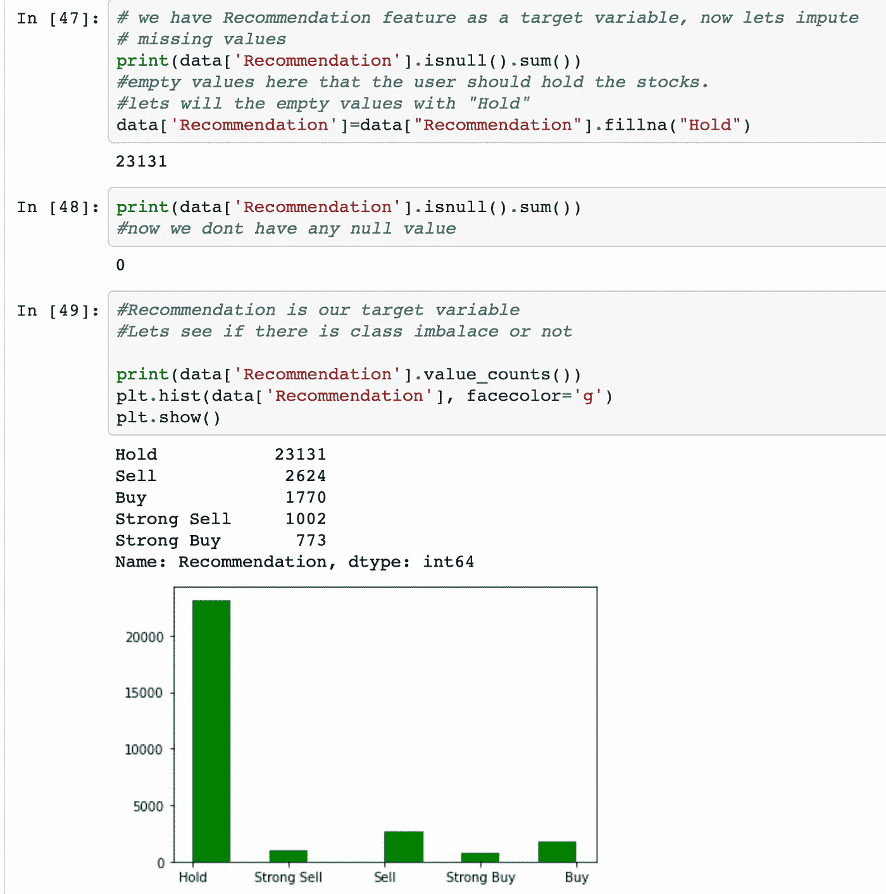

这种阶层失衡是意料之中的，大多数时候你只需要持有股票，而不是买卖。

让我们看看我们有什么栏目

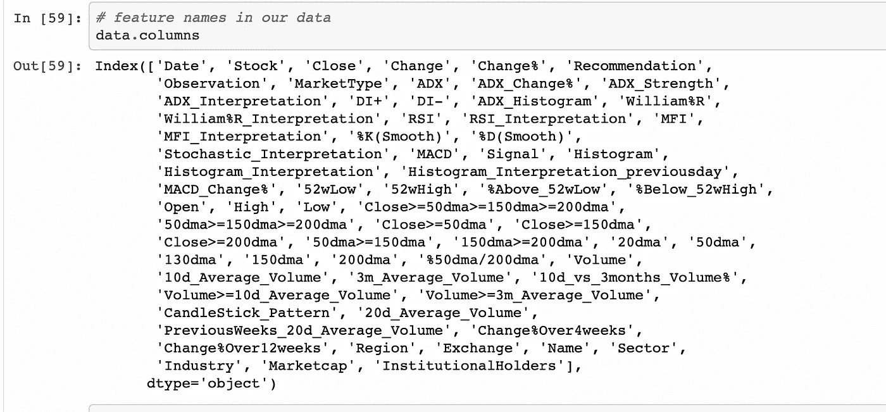

让我们看看数据中有哪些公司

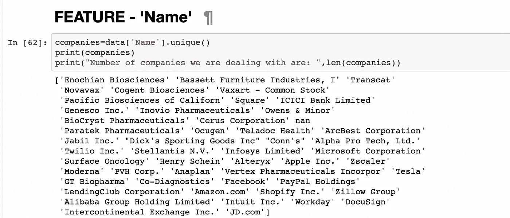

这些都是美国公司。

我们知道班级是不平衡的，让我们看看百分比分布

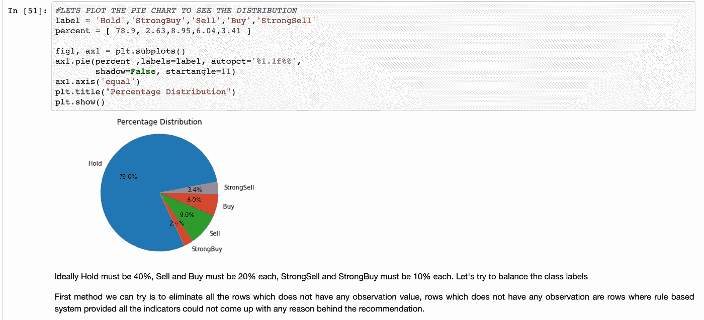

## 单变量和双变量分析

很难把所有的东西都放在一个博客里，这需要很多博客来覆盖，所以我不会在这个博客里添加详细的数据分析。

请参考我的 github 个人资料，我把一切都详细。

 [## 股票-预测-项目/股票 _ 进场 _ 出场 _ 预测 _ ipynb(AAIC _ 项目)。ipynb 在主…

### 这个项目是关于基于动量交易的股票预测。…

github.com](https://github.com/Nishesh2115/Stock-Prediction-Project/blob/main/STOCK_ENTRY_EXIT_PREDICTION_ipynb%28AAIC_PROJECT%29.ipynb) 

# 降维

降维是在低维中可视化数据的一种非常好的技术。

在这个项目中，我主要会用到两种技术

PCA(代表主成分分析)这个想法很简单，我们想找到方向 f '使得 xi 在 f '上的投影方差最大，这里 xi 的是数据点。

T-sne 是一个复杂的想法，但直觉上它试图将高维点嵌入到低维中，这样就很容易将它们可视化。TSNE 代表 t 分布随机邻域嵌入。

## Tsne

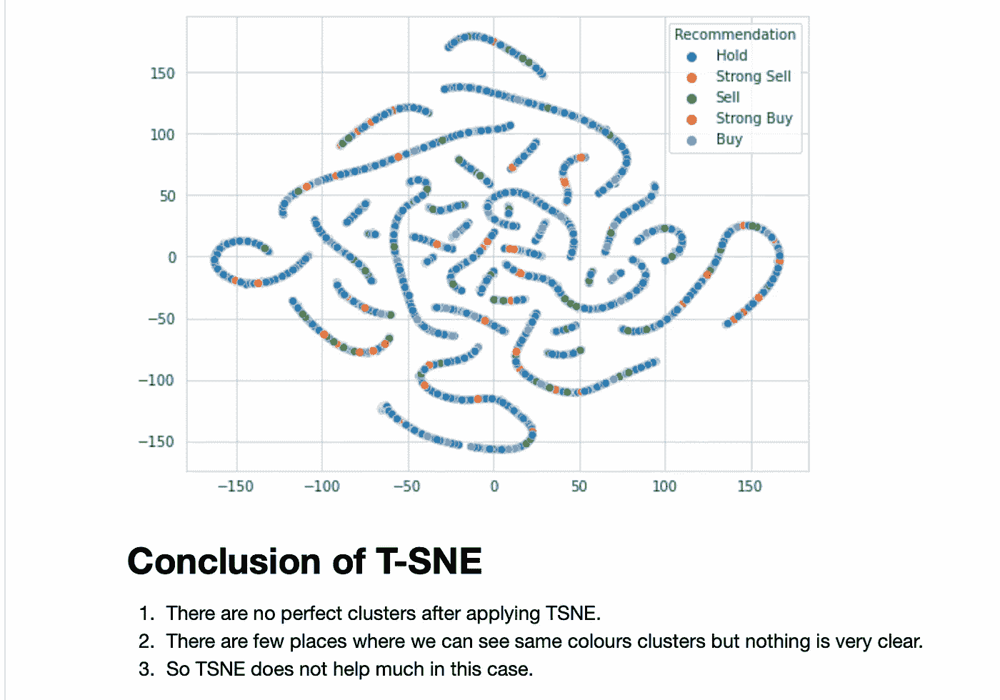

## 主成分分析

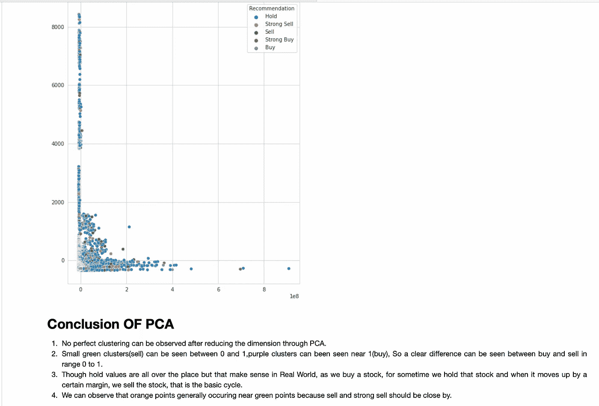

根据数据分析和基于规则的系统的领域知识，在所有功能中，我们只选择了 19 个功能

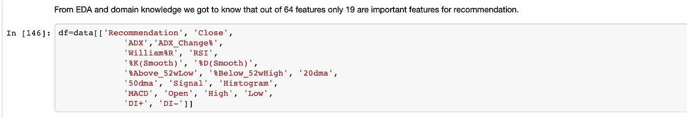

现在问题在于处理不平衡数据。

为了处理不平衡数据，我尝试了 SMOTE 技术，SMOTE 内部使用最近邻算法来综合产生带有目标变量的数据点，在我们的情况下，我们有大约 70%的持有值，9%的销售值，等等，但理想情况下，我们需要 40%的持有值，20%的销售值，20%的销售值。

应用 smote 后，我们得到

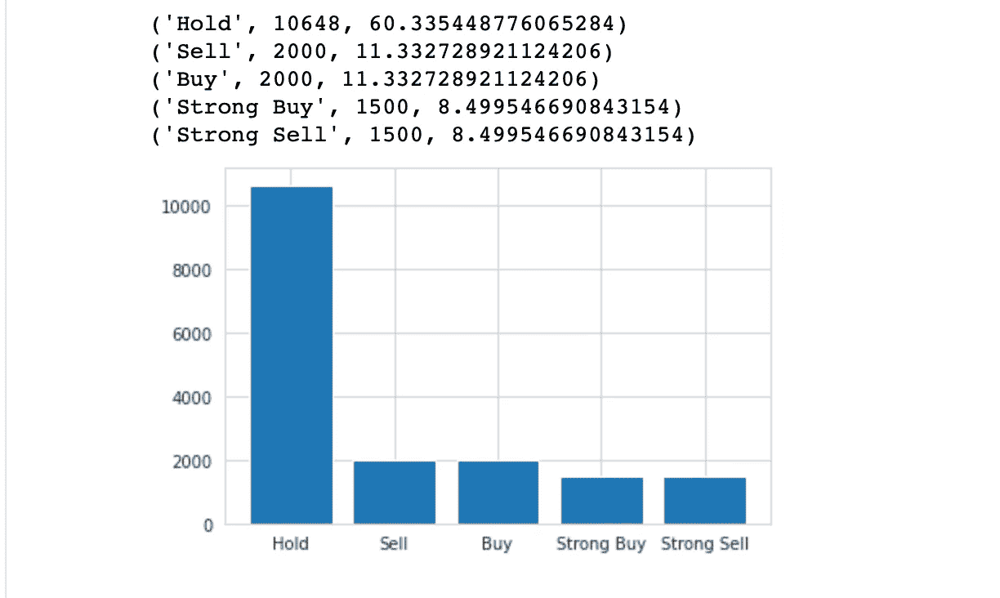

## 建模/评估

我们试过了

1.  有 smote 和无 smote 的逻辑回归。
2.  有和没有重击的随机森林。
3.  GBDT 有和没有击打。

建模，hyper 参数调优，评测，一切都做得很详细，贴在 github 上，请看一下。

不管有没有 smote，我们都从 GBDT 获得了不错的 f1 分数

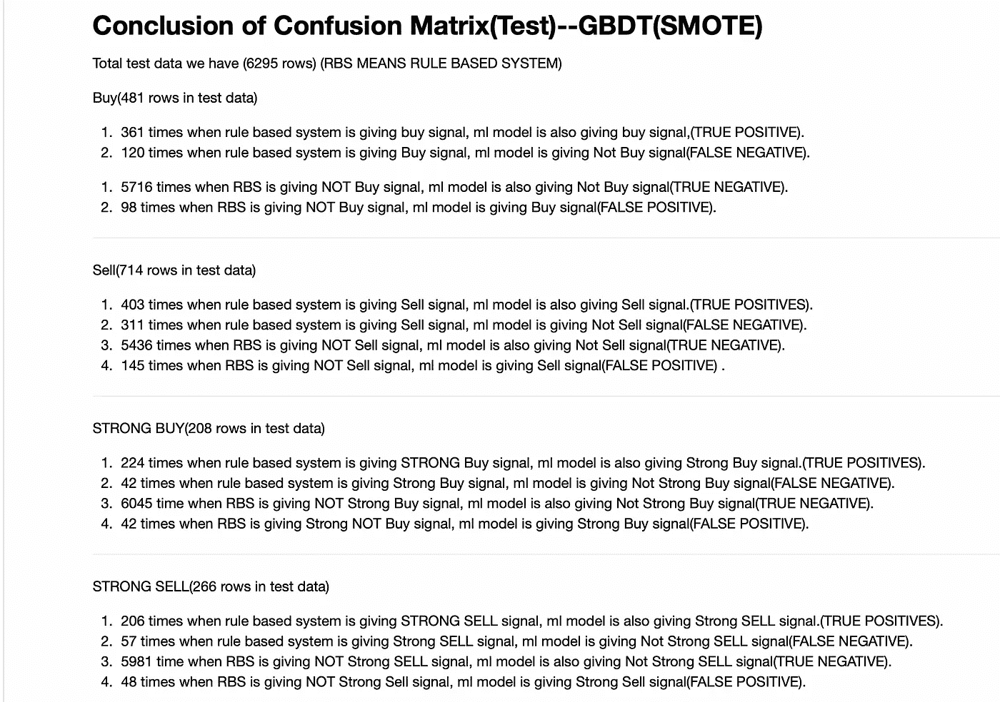

GBDT(SMOTE)

让我们看看困惑。不带 smote 的 gbdt 矩阵

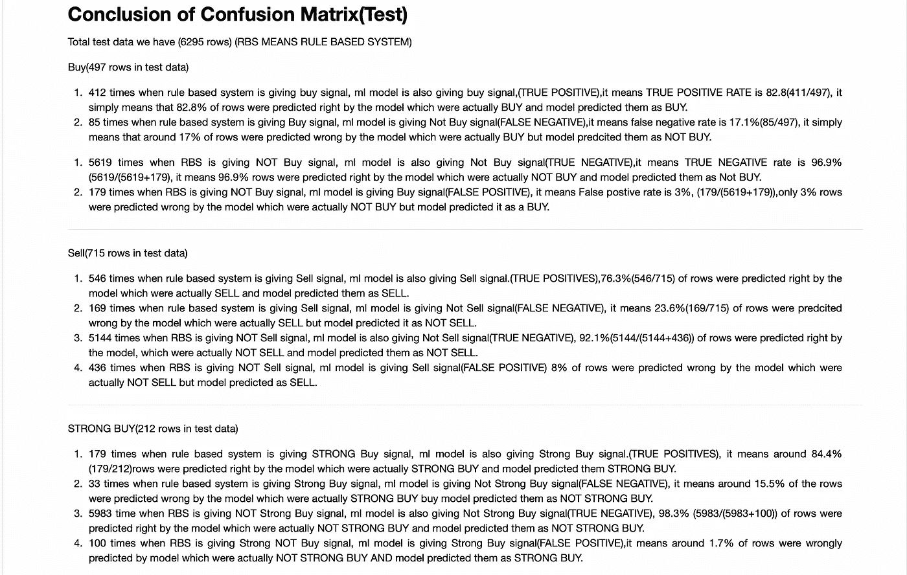

GBDT 没有被打败

没有经过 smote 的 GBDT 看起来更有说服力。

我们使用 F1 _SCORE 宏作为评估指标，因为它对少数民族班级的惩罚最大。

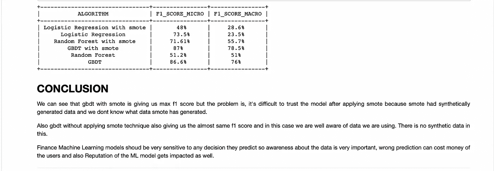

## 可解释 AI/ML

这是一个非常新的研究领域，每次我们使用机器学习来预测一些事情，了解特定预测背后的推理非常重要，特别是在涉及高风险的医疗和金融行业。

特定预测背后的推理让我们了解机器学习模型如何以及为什么预测特定的结果。

有两种著名的算法可以很好地完成这项任务:

1.  石灰
2.  Shap

这些算法最好的部分是，它们不关心你正在使用的 Ml 模型，你可以给出任何 ML 模型，这些技术将解释特定预测背后的推理。

我们将在这个项目中使用石灰。

对于 Sell，Lime 显示的内容是这样的…

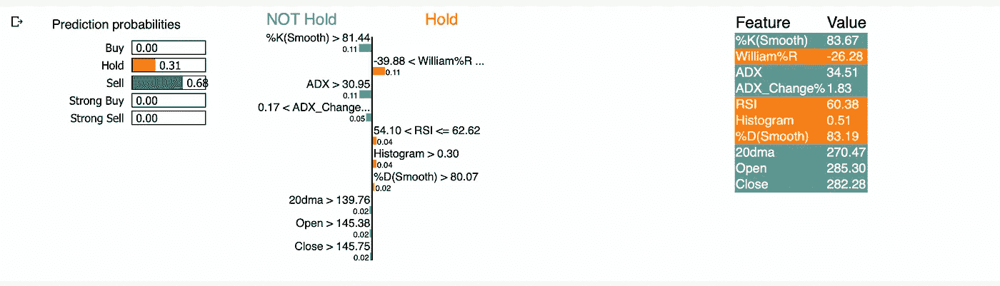

它给出了 GBDT 预测某一行“卖出”的明确理由

用于购买

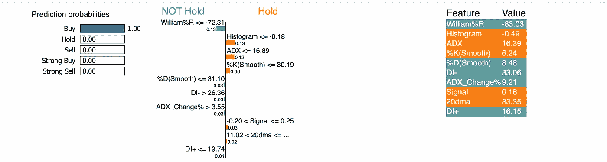

本案例研究到此结束，希望您喜欢。

# 模型的再训练

1.  根据再培训的结果，我们可以每月或每三个月进行再培训。
2.  假设我们提取了截至(2021 年 8 月 1 日)的数据，并在此基础上建立了一个模型，那么在 2021 年 9 月 1 日，我们将再次获得一个月的数据，我们将提取这些数据，并对整个数据进行再培训(直至 2021 年 9 月 1 日)。我们可以根据这些数据重新训练随机森林、逻辑回归、GBDT，看看结果与上次训练的结果有何不同。
3.  在重新训练时，我们需要遵循我们在训练模型时使用的相同过程，但是如果使用一些特征变换可以改善结果，那么这总是一个好主意。

# 确认

1.  模型的验证可以通过观察基于规则的系统来完成。
2.  F1 分数、多标签混淆矩阵等评估指标也有助于验证模型。
3.  像 Lime 和 Shap 这样的技术可以帮助我们解释模型的结果。

# 尼舍什·戈吉亚

*   ***如果你喜欢这个，*** [***跟我来这里***](/@nishesh.kumar) ***了解更多***
*   ***有兴趣合作吗？下面我们连线上***[***insta gram***](https://www.instagram.com/nishesh_gogia/)