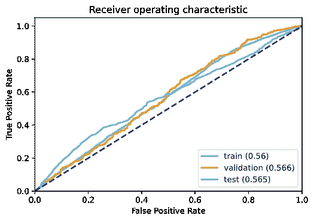
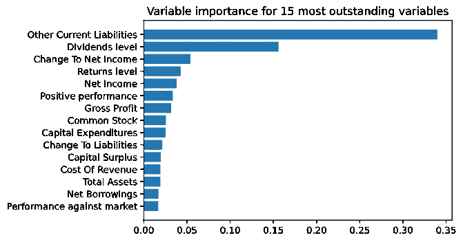
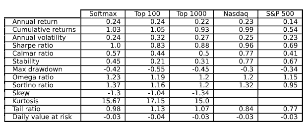
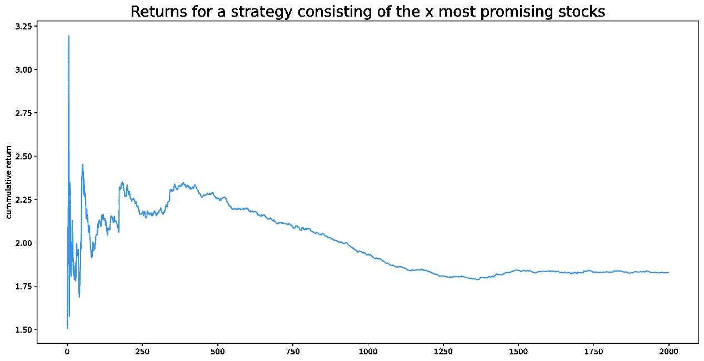
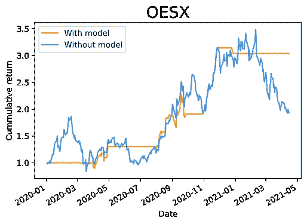
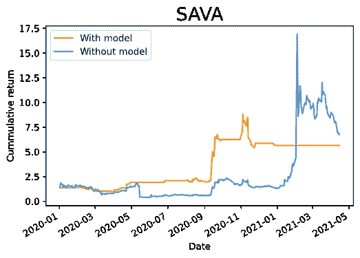

# 从财务报表分析预测股票收益

> 原文：<https://medium.com/analytics-vidhya/stocks-returns-prediction-from-financial-statements-analysis-d8ca903ac984?source=collection_archive---------6----------------------->

克里斯·利维拉尼在 [Unsplash](https://unsplash.com?utm_source=medium&utm_medium=referral) 上的照片

# 介绍

股票市场通常被认为是不可预测的。但大多数人都有一个共同的直觉:公司的业绩和股价应该是相关的。如果一家公司表现良好，投资者会购买其股票，价格应该上涨，反之亦然。

此外，一家公司的业绩应该由其财务报表来体现。这意味着，从理论上讲，有了基础公司的报表，就有可能了解特定股票的回报。

对我们来说幸运的是，美国上市公司的价格和财务报表都在网上公开，还有最先进的机器学习模型。有了所有这些，应该可以实现一种方法来测试和确认这些直觉。

因此，我们在这篇文章中的目标是建立一个股票回报预测器，然后我们可以将其纳入旨在跑赢市场的投资策略中。用于执行该分析的所有代码均可在 [Github](https://github.com/ArnaudBu/stock-returns-prediction) 上获得。

 [## ArnaudBu/股票收益预测

### 这个项目使用 tabnet 来试图预测，基于雅虎财经上检索的财务报表，如果一个…

github.com](https://github.com/ArnaudBu/stock-returns-prediction) 

# 数据检索和处理

数据来自雅虎财经(python 库 [yfinance](https://pypi.org/project/yfinance/) 和 [yahoofinancials](https://pypi.org/project/yahoofinancials/) 分别用于价格和报表)。

这种方法依赖于几个强有力的假设。首先，描述过去一年的财务报表应该能够预测相当遥远的未来的市场表现。

由于我们希望能够在任何时候比较股票之间的回报，所以预测应该涵盖直到下一个财务报表发布的期间，也就是一年。这迫使人们假设，回报率可能依赖于过去一年的信息，而且市场具有长期记忆。

此外，由于公司不会在同一天发布年度报表，该模型将不得不比较不一定代表同一时期的值。这意味着外部事件和与经济环境的相关性在观察中是不可比的，并且在建模中会引入不可测量的偏差。

检索在纽约证券交易所和纳斯达克上市的所有 tickers(约 6000 只股票)自 2017 年以来的声明和价格。这产生了大约 18，000 个条目的数据集。

我们从合并财务报表和价格开始。使用报表的发布日期作为枢纽，该日期的价格(也是前一年和后一年的价格)与前一年支付的股息结合在一起。由于价格不是每天都报的(例如周末)，如果没有匹配的日期，则使用最接近的前一个价格日期。

然后创建新变量，将价格相关信息添加到模型中，并创建目标变量。

*   根据报表的发布日期返回上一年和下一年的数据。对于最近的观察，我们无法获得未来一年的价格，我们使用最新的值，并从中推断出年度回报。
*   两个布尔值:一个指示回报是否为正，另一个指示回报是否超过市场回报。选择纳斯达克指数(^IXIC)作为参考。

基于两个标准选择用于预测的相关变量。第一个标准是跨观测值的可用性(至少 80%的非空值)。然后，由于财务报表的值可以从同一个报表中的其他值计算出来，我们必须根据相关性选择变量，去掉那些依赖于其他变量的变量。

最后一步是数据规范化。为了能够比较不同公司和不同时间的变量，价值除以股票在发布日的总市值。

# 建模

按照数据准备步骤，我们现在可以实现一个分类模型，其目的是根据从股票以前的财务报表和价格历史中提取的 33 个变量，预测股票下一年的回报是否会超过纳斯达克指数。

对于这项任务， [Google 的 TabNet](https://research.google/pubs/pub49698/) 模型，一种非常有前途的用于表格数据建模的深度学习方法被使用。这个模型是如何工作的在这篇文章中不会讨论，但是感兴趣的读者将能够在[这篇文章](https://towardsdatascience.com/modelling-tabular-data-with-googles-tabnet-ba7315897bfb)和 [dreamquark-ai 的 pytorch 实现](https://github.com/dreamquark-ai/tabnet)中找到非常好的材料，在这个案例中使用了这些材料。

2019/01/01 之前的观察值用于训练集，2020/06/01 之后的观察值用于测试集。所有其他观察构成了验证集，用于控制和停止训练阶段。

正如所料(但仍然令人失望)，无论使用何种超参数，该模型似乎都表现不佳，在 100%的情况下预测为负值(阈值为 0.5)。似乎不能使用天真的预测方法。

看一下 ROC 曲线(图 1 ),它代表了当我们提高预测阈值时，真阳性率相对于假阳性率的演变，两个推论出现了。

1.  曲线下面积(AUC:完美模型为 1，随机模型为 0.5)为 0.56，稳定在随机线以上，这可能表明该模型可以提供未来股票价格演变的线索。
2.  训练集、验证集和测试集的 AUC 大致相同。这意味着该模型的预测能力可以毫无损失地移植到后验观测中(不管怎样，因为它并没有预测太多，所以这是值得的，^^).

图 1-ROC 曲线

让我们也看看 15 个最突出的变量的重要性(图 2)。即使其他流动负债的金额作为最重要的变量出现，这是不直观的，我们仍然可以看到股息的水平，以前的回报和业绩，净收入变化和毛利排名很高。这些变量是传统和直观的性能指标，它们的存在有助于支持模型不仅仅是随机预测器的观点。

图 2 —使用 TabNet 模型的可变重要性

# 回溯测试和策略分析

现在我们确信(至少我是这样认为的)这个模型可以帮助选择一个有效的投资策略，问题是:应该如何使用它？

已经确定，由于其缺乏性能，它不能用作简单的预测器。因此，我们将使用它来对股票进行排名，并据此进行投资。

来自纳斯达克和纽约证券交易所(6000 只股票)的一组报价器将成为投资宇宙。该战略将从 2018/01/01 开始实施，以便与财务报表有一些关联。

每次发布新报表时，该模型都会根据最多一年前发布的报表进行重新校准，并应用于每只股票的最新报表。输出是宇宙中每只股票跑赢市场的概率，它随着每一个新声明的发布而更新。

然后，我们根据概率实施三种分配策略。

*   100 只(或 1000 只)最有可能跑赢市场的股票在下一次模型运行前以同样的比例买入。
*   金钱投资于宇宙中的所有股票，权重由应用于概率的 softmax 函数给出。

这些策略依赖于一个假设，即没有交易费，投资组合可以立即完全改变，没有任何成本。几年前，这可能被认为是一个强有力的假设，但现在，随着新的经纪人(如 RobinHood)提供免费交易，这一假设似乎更加合理。

这些策略的累积回报(以及纳斯达克和标准普尔 500 指数作为参考)如图 3 所示，它们的主要财务比率见表 1。

图 3 —不同策略的回溯测试

表 1 —不同战略的财务比率比较

所有策略似乎都与纳斯达克相当，尽管我们可以观察到(除了 softmax 策略)更高的波动性，特别是前 100 名策略可能会在短期内受到少数股票的巨大影响。这一策略似乎放大了市场趋势。

有趣的是，100 强策略比 1000 强策略有更好的表现。图 4 显示了从 1 到 2000 只股票的所有策略的最终累积回报，超过 300 只股票后，回报稳步下降。这往往证实了投资组合中股票较少时可以观察到的重要波动性。

图 4 —基于所选股票数量的策略回报比较

让我们最后来看看这个策略是如何在股票上起作用的。图 5 比较了自 2020 年以来 100 强策略中的两只股票在有或没有该模型的情况下的累积回报。使用这种策略是一把双刃剑:它可以在价格下跌时充当安全网，但也可以防止从大幅上涨中受益。

图 5 —两只股票的回报比较

# 结论

考虑到本文中提出的要素，就使用机器学习根据财务报表预测股票回报的可能性得出明确的结论似乎是不可能的。

一方面，我们能够建立一个模型，即使表现不是很好，但似乎能够提供一些线索，说明一只股票表现良好的可能性，并可以用于跑赢市场的策略。

另一方面，观察到的高波动性促使我们在使用该模型时保持谨慎，并提醒我们准确性与股票回报分析不相容。尽管我确实相信机器学习可以给投资管理带来新的附加值，但我还不会拿自己的钱去冒险。