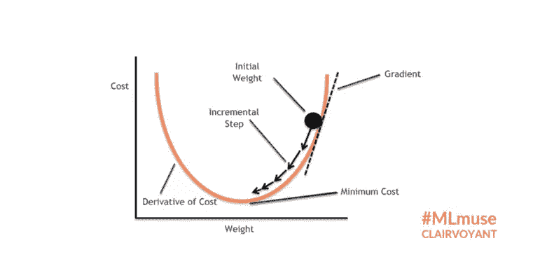

# 停止仅仅使用机器学习，学习如何构建它。线性回归和梯度下降

> 原文：<https://medium.com/analytics-vidhya/stop-just-using-machine-learning-and-learn-how-to-build-it-linear-regression-and-gradient-descent-3653de24c6d5?source=collection_archive---------5----------------------->


派拉蒙电影公司

今天对我们来说，训练和使用机器学习模型真的很容易。许多编程语言中的许多库为我们实现了机器学习模型，我们只需调用一个函数，瞧，我们正在使用复杂的机器学习模型。

但是我们知道这些模型是如何工作的吗？他们的目标是什么？如果特定模型的库实现不符合我们的需求，我们知道如何修改它吗？

想着这些问题，我有了写这些系列文章的动机。

在这篇文章中，你将学到:

1.  **什么是线性回归？**
2.  **什么是梯度下降？**
3.  **如何使用 NumPy 实现线性回归？**

# 介绍

从最简单的机器学习模型(如一元线性回归)到复杂的深度神经网络，所有机器学习模型都有相同的目标，即找到可以回答特定问题的方程。

因此，作为这一系列文章的开始，我将向您展示如何仅使用 Python Numpy 从头开始构建线性回归模型。

# 线性回归

在线性回归中，我们希望使用一些“Xs”值作为输入来预测连续值。

简单的线性回归公式是

Y = aX + b

“Y”是因变量，“X”是解释变量，“b”是直线的斜率，“a”是截距变量，即“X”为零时“Y”的值。在线性回归中，我们希望找到使预测误差最小化的“a”和“b”的值。

# 我如何知道我可以使用线性回归？

判断线性回归是否是一个好的模型的最简单的方法之一是建立一个数据散点图。散点图是一个简单的图形，它使用笛卡尔坐标来绘制(X，Y)点。

如果该图显示了因变量和解释变量之间的线性关系，如下图所示，您可以尝试拟合线性模型。


散点图的例子点，我们可以使用线性回归，我们可以看到一个线性回归模式与一些离群点。

在此图中，我们可以看到因变量和解释变量之间的正线性关联，下图的情况并非如此。我们无法画出一条简单的线来很好地拟合这些数据。


线性回归不是最佳模型的散点图示例。

但是我们怎么知道我们的线性回归是正确的呢？因为知道我们需要计算**成本函数**。

# 价值函数

直观地说，要找出线性回归函数的误差，我们只需要得到预测的 y 值(ÿ)和实际点(y)之间所有差异的总和，然后我们可以用这个值除以点的数量(n)来得到平均值。


但是如果我们的'ÿ'值小于 y 值，误差就会减小，这不是我们想要的结果。因此，为了避免这种行为，我们可以得到方程的绝对值或方程的平方。

因为我们要对这个函数求导，稍后，平方函数的导数更容易求解，我们将对方程求平方。


这个公式叫做均方差(MSE)。


该图以蓝色显示线性回归模型，以紫色显示基础真值点，以红色显示误差

但是我们如何改进我们的线性回归，降低成本函数的值呢？使用一种叫做**梯度下降**的技术。

# 梯度下降

梯度下降是一种用于寻找函数最小值的技术。在线性回归中，我们将使用梯度下降来找到使成本函数最小化的“a”和“b”的值。

下图描述了梯度下降。我们首先从随机的“a”和“b”值开始，初始误差是球的位置。



梯度下降的例子

在那之后，我们想要向这条曲线的底部前进。但我们不想迈出大步，因为那样做我们会花太长时间到达底部，甚至更糟的是永远达不到底部。


当步长太大时会发生什么

此外，我们不希望小步前进，否则会花太长时间达到底部。所以，我们需要一个大小合适的台阶。这个步长由一个称为学习速率(L)的因子来调整。通常，L 是一些小值，如 0.0001。

为了优化成本函数，我们需要通过下面的步骤得到它的导数。

1-替换 ax + b 的ÿ


2-计算关于“a”的偏导数


3-计算 b 的偏导数


4-在每次迭代中更新“a”和“b”的值


最后，重复这个过程 m 次或直到误差小于某个公差。

# 在 Python 中实现

导入所需的库。

```
import numpy as np
import pandas as pd
import matplotlib.pyplot as plt
from warnings import warn
```

函数来实现线性回归


线性回归的实现

为了实现线性回归，我们

1.  首先将“a”和“b”设置为零，然后得到点数“n”。
2.  获得预测
3.  得到关于 a 和 b 的导数
4.  更新“a”和“b”系数
5.  得到错误
6.  重复这个过程，直到 I 小于 epoch 或误差小于公差
7.  返回更新后的“a”和“b”


检查梯度下降是否发散的代码

这段代码检查梯度下降是否发散。

为了测试这段代码是否如预期的那样工作，我使用了第二次世界大战 Kaggle 数据集中的[天气条件，看看我是否可以拟合线性回归来解释 MinTemp 和 MaxTemp 之间的关系。](https://www.kaggle.com/smid80/weatherww2/data)


最小温度与最大温度图，蓝色为点，红色为线性回归结果

你可以在这个 [Colab 笔记本](https://colab.research.google.com/drive/15SoZ2cqa3LwHn_qjEXDx17v_kC2oLuA1?usp=sharing)里查看写这篇文章用的代码。如果你对我的 [Linkedin](https://www.linkedin.com/in/jair-guedes-ferreira-neto/) 账户有任何意见，请随时联系我，感谢你阅读这篇文章。

如果你喜欢你所读的，一定要👏下面，分享给你的朋友，关注我，不要错过这一系列的帖子。

# 参考

[https://towards data science . com/linear-regression-using-gradient-descent-97a6c 8700931](https://towardsdatascience.com/linear-regression-using-gradient-descent-97a6c8700931)