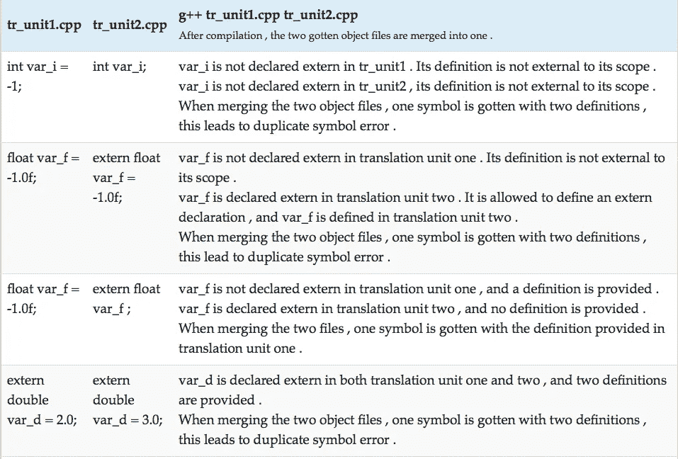

# C++中的存储类教程

> 原文：<https://medium.com/analytics-vidhya/storage-classes-in-c-a-tutorial-bbb51ece11dc?source=collection_archive---------11----------------------->

C++中的 ***存储类有*** : `auto`、`static`、 `extern`、 `mutable`、 `register`、`thread_local`。它们在声明中用于指定定义是如何发生的。

***定义*** 对于一个变量，是分配它的存储，对于一个函数，是写下它将要执行的指令，对于类类型:`class` 、`struct` 和`union` ，是它们的方法和数据成员的声明。

```
extern int var_i;
/*Declaration of a variable .*/float var_f; 
/*Declaration , and definition of
  an object .*/int fctFoo(int a , int b);
/*Declaration of a function .*/int fctFoo(int a , int b){
/*Definition of a function .*/
  return a + b ;}class classFoo;
/*Declaration of a class .*/class classFoo{
/*Definition of the classFoo .*/
public :
  int a;
  void addTo(int b ); };
```

# 汽车

`auto` ***的意思是一个*** 的定义自动归入它的范围。当进入对象的包含块时，对象被自动创建，当退出包含块时，对象被销毁。

当一个[局部](https://twiserandom.com/cpp/scope-in-cpp-a-tutorial/#The_local_scope)变量被声明时，如果没有指定存储类，它 ***有一个自动*** 存储。在[局部范围](https://twiserandom.com/cpp/scope-in-cpp-a-tutorial/#The_local_scope)中声明了一个局部变量。

```
int trivial(int arg_i , float arg_f ){
  double var_d = 1 ; 
  return arg_i + arg_f + var_d ;}
/*arg_i , arg_f and var_d are local 
  variables , they are created 
  on the local scope entry and 
  destroyed on its exit .*/
```

在 C++11 中,`auto`存储类被删除，而从 C++11 开始,`auto`关键字有了另一层含义。

# 走读生

`extern` ***表示*** 定义在[范围](https://twiserandom.com/cpp/scope-in-cpp-a-tutorial/)之外。

extern 关键字 ***不能在* a [类范围](https://twiserandom.com/cpp/scope-in-cpp-a-tutorial/#The_class_scope)中使用** *，因此不能与类、结构或联合的成员一起使用。它也不能与函数的参数或类类型的声明一起使用。*

***extern 在局部作用域*** 的用法举例:

```
#include<iostream>int var_i  = 1 ;
/*var_i , is not declared extern , 
  as such its definition is not 
  external to its scope .*/float var_f = 5.0f ;void fctTrivial(){
  extern int var_i;
  /*var_i is declared ,
    in the local scope .
    The definition of 
    var_i is external to 
    the local scope .*/
  std::cout << var_i << std::endl;
  /*Output:
    1 .*/
  std::cout <<var_f << std::endl;
  /*var_f is not declared ,
    in the local scope , it
    is accessible from
    the global scope .
    Output :
    5  .*/ }int main(void ){
  fctTrivial(); }
```

在全局范围中使用 *extern 的例子:*



在名称空间 中使用`extern` ***的例子。***

```
#include<iostream>
namespace nmspc {
  extern int var_i = -1; }namespace nmspc {
  extern int var_i ;
  /*extern int var_i  = -1;
    This will cause an error
    of var_i being redefined .*/ }int main(void ){
  std::cout << nmspc::var_i << std::endl;
  /*Output :
    -1 .*/}
```

# 静电

`static` ***意味着*** 的定义是静态的，换句话说，固定到它的[范围](https://twiserandom.com/cpp/scope-in-cpp-a-tutorial/)中。

静态存储类 ***只能应用于*** 变量、函数和匿名联合，当它们在文件范围、名称空间范围、类范围和局部范围中被声明时。

***静态在局部范围*** 的用法举例:

```
#include<iostream>int iterator(){
  static int var_i = -1;
  /*Definition of var_i is to
    be static to its scope . 
    var_i is not to be created
    every time the local block
    is entered , nor is it to be
    destroyed every time the local 
    block is exited  .*/
  return ++var_i; }int main(void ){
  std::cout << iterator() << std::endl ;
  std::cout << iterator() << std::endl ;
  /*Output :
    0
    1 .*/}
```

***静态在全局范围*** 的用法举例:


```
/*File tr_unit1.cpp */static int id = 0 ;int generateId(){
  return id++; }void resetId(){
  id = 0; }/*File tr_unit2.cpp */#include<iostream>extern int generateId();
extern int resetId();int main(void ){
  std::cout << generateId() << std::endl ;
  std::cout << generateId() << std::endl ;
  resetId();
  std::cout << generateId() << std::endl ; }/*
$ g++ tr_unit1.cpp tr_unit2.cpp
$ ./a.out
0
1
0
*/
```

***静态在类作用域*** 中的用法示例:

```
#include<iostream>class Trivial{
public :
  static int var_i;
  static int foo_f(); };int Trivial::var_i = 0;int Trivial::foo_f(){
  return Trivial::var_i++; }int main(void ){
  std::cout << Trivial::var_i << std::endl;
  /*Output : 
    0 */
  std::cout << Trivial::foo_f() << std::endl;
  /*Output : 
    0 */
  std::cout << Trivial::foo_f() << std::endl;
  /*Output : 
    1 */
  std::cout << Trivial::var_i << std::endl; 
  /*Output : 
    2 */ }
```

# 易变的

`mutable` ***表示*** 定义对其[范围](https://twiserandom.com/cpp/scope-in-cpp-a-tutorial/)是可变的。

`mutable` 、**、*只适用于*、**非静态类的数据成员。

```
#include<iostream>class Trivial{
public:
  int var_i;
  mutable float var_fm;
  void foo_f() const; 
  /*foo_f is a constant member 
    function .*/ };void Trivial::foo_f() const {
  /*Provide a definition for foo_f .*/
  var_fm /= 2; }int main(void ){
  const Trivial trivial = {1 , 1.0f };
  /*define a trivial object .*//*trivial.var_i = 3 ;
    This statement is illegal , because
    the trivial object has been declared 
    const .*/trivial.var_fm = -1.0f;
  /*var_fm can be assigned a value ,
    since its storage class is mutable .*/std::cout << trivial.var_fm << std::endl ;
  /*Output :
    -1 .*/trivial.foo_f();
  /*a function declared const , is not
    allowed to changed an object data
    member , unless this data member
    is declared mutable .*/std::cout << trivial.var_fm << std::endl ;
  /*
    Output :
    0.5 .*/ }
```

# 注册

`register` ***意味着一个*** 定义被注册。这不是必须的，编译器可以忽略`register`存储类。

`register` 做 ***是为了更快的访问*** 。该定义可以注册在高速缓存或 cpu 寄存器中。

`register` ***只适用于*** 局部变量。

寄存器存储类在 C++11 标准 ***中被弃用，在 c++17 标准*** 中被移除。

```
#include<iostream>int fly(register int a , register int v ){
  while(v > 0 ){
    a *= a;
    v--; }
  return a; }int main(void ){
  std::cout << fly(2 , 4 ) << std::endl; 
  /*Output : 
    65536 .*/ }
```

# 线程 _ 本地

`thread_local` ***是指*** 的定义是对其[线程](https://twiserandom.com/cpp/scope-in-cpp-a-tutorial/)的局部定义。

这个存储类 ***只能应用*** 到局部作用域中声明的变量，或者全局命名空间之类的命名空间，或者静态数据成员。

`thread_local`表示一个变量对于它的线程是局部的，该变量在其线程被创建时被创建，在其线程被销毁时被销毁。

`thread_local`存储类、 ***可以与*** 一起使用，静态和外部存储类，它是在 C++11 中引入的。

*原载于 2021 年 1 月 9 日*[](https://twiserandom.com/cpp/storage-classes-in-c-a-tutorial/)**。**