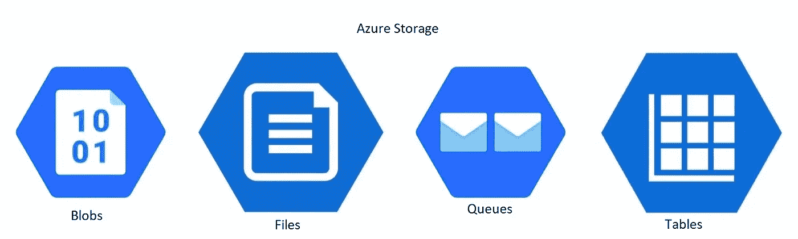

# Microsoft Azure 上的存储解决方案

> 原文：<https://medium.com/analytics-vidhya/storage-solutions-on-microsoft-azure-a956bd432c2b?source=collection_archive---------13----------------------->

## 存储是每个数据平台的核心。本文介绍了如何选择和设计存储策略，以确保您的数据始终可用、有弹性且有用。

你可能知道的每个 Azure 服务都在幕后使用 Azure 存储。它允许无限扩展并拥有…