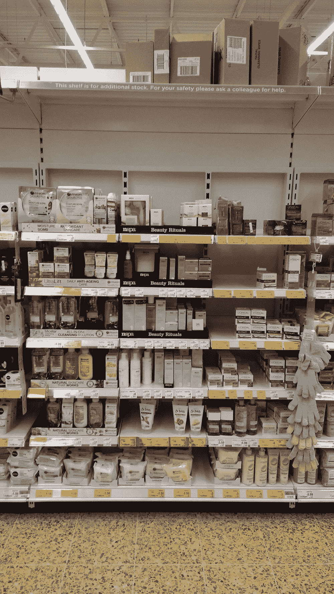
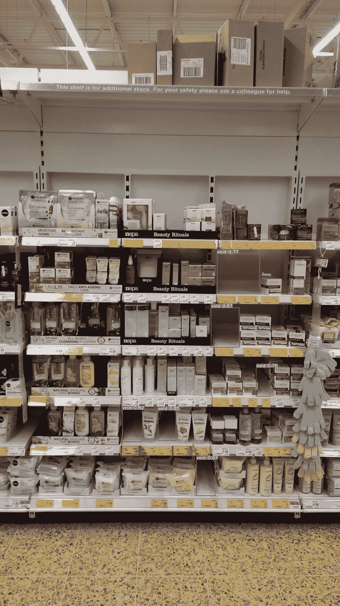
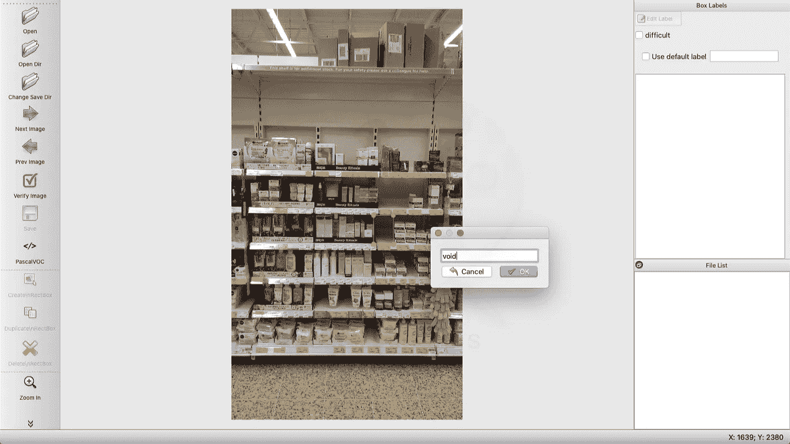

# 使用 YOLOv5 的杂货店空库存检测器

> 原文：<https://medium.com/analytics-vidhya/store-empty-inventory-detector-using-yolov5-57292614231?source=collection_archive---------5----------------------->

如今，深度学习解决复杂问题的成功对任何人来说都是显而易见的。深度学习正在帮助各行各业的问题自动化。在这篇文章中，我介绍了 YOLOv5 的应用，这是一种基于深度学习的算法，用于检测杂货店中的空库存。

通常，当我们去杂货店，我们看到货架上没有我们需要的产品，然后许多顾客会离开，没有问店员他们是否有那件商品。即使商店的仓库里有那件商品。这可能会导致商店失去潜在的销售，只要库存仍然是空的。我用 YOLOv5 设计的系统可以帮助商店快速补充库存，这样他们就不会失去客户和销售。



# 要求

对于这个项目，我们需要:

1.  格伦·乔彻的杰作《约洛夫 5》，在[https://github.com/ultralytics/yolov5](https://github.com/ultralytics/yolov5)展出
2.  SKU 数据集，目前在[https://retail vision workshop . github . io/detection _ challenge _ 2020/](https://retailvisionworkshop.github.io/detection_challenge_2020/)
3.  如果你有一个商店的数据集，那就更好了。
4.  LabelImg，一个伟大且简单易用的注释工具，在 https://github.com/tzutalin/labelImg[展示](https://github.com/tzutalin/labelImg)
5.  边界框增强工具，(如果你想增强已经注释的图像，而不是注释更多的图像)，出现在
    [https://github.com/mukopikmin/bounding-box-augmentation](https://github.com/mukopikmin/bounding-box-augmentation)

# 过程

首先，我们将使用 SKU 数据集。SKU 数据集专门用于检测杂货店货架和冰箱中的商品。SKU 有货架上每件商品的所有图片和注释。但是对于我们的应用程序，我们不需要货架上商品的注释。我们想要的恰恰相反。因为对于货架上的任何产品，我们将只使用那些库存为空的图像。

**标注**

对于注释，我们使用 **LabelImg** 工具，注释我们应用程序的任何图像中的空白，如下所示:



**增强**

如果你没有足够的图像样本，那么使用上面需求中提到的增强代码，它增加了不同种类的增强，也增加了图像中标注的边界框。

对于增强，一旦你使用上面的 LabelImg 工具注释完图像，把所有的图像和它们的注释(。xml)文件存储在上述下载的边界框增强储存库的“输入”文件夹中。然后运行以下命令:

```
pipenv run python augment.py
```

默认情况下，这会将“输入”文件夹中的每个图像及其注释放大 10 倍。为了增加这一点，可以在存储库中的 augment.py 文件中更改 AUGMENT_SIZE。

# 培养

为了训练 void detector 模型，我使用了 YOLOv5，并在 12 GB 的 NVIDIA GeForce RTX2080 GPU 上对 yolov5m 模型进行了 300 个历元的训练。我使用的数据包括一些杂货店货架上的图片和来自 SKU 数据集的大约 100 张图片，我自己做了注释，并放大了 10 倍。我总共有 1254 张照片。图@0.5 分出来是 0.82。

# 结果

货架空检测的推断结果如下:


开发人员也可以在数据库中存储空洞的坐标，并与新数据进行比较，比如说，2 小时后，找出以前的空洞是否持续存在。如果这些问题持续存在，那么应该优先处理这些空白，并让商店知道哪些物品需要紧急关注，哪些物品已经很长时间没有补充了。对于这个任务，只需要计算新的和先前的空盒的 IoU(联合上的交集),如果它大于 0.5，那么这意味着空是持续的，并且已经存在了一段时间。希望这有意义。

# 结论

深度学习尽管取得了巨大的成功，但仍有许多未知的领域有待征服。在本文中，我介绍了一个这样的应用程序，它可以让商店知道他们在哪里缺货。该系统实施后，可以帮助商店实现更高的销售额，否则他们会因库存补充延迟而失去销售额。如果你喜欢这篇文章，请鼓掌表示赞赏，这样我就有更多的动力来分享我的作品。

# 特别感谢

特别感谢给我指定这个任务的人和 YOLOv5 的开发者 Glenn Jocher 先生。